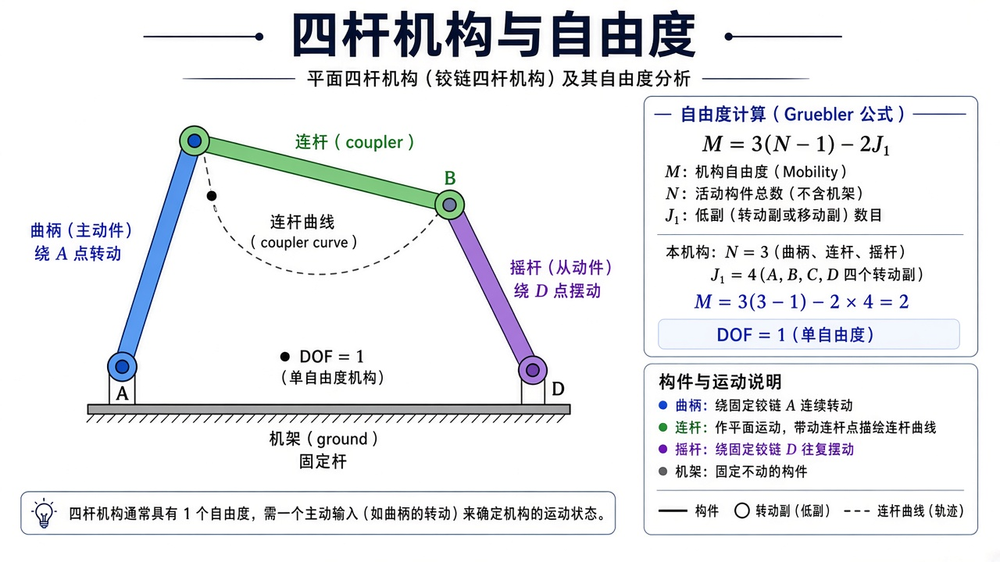
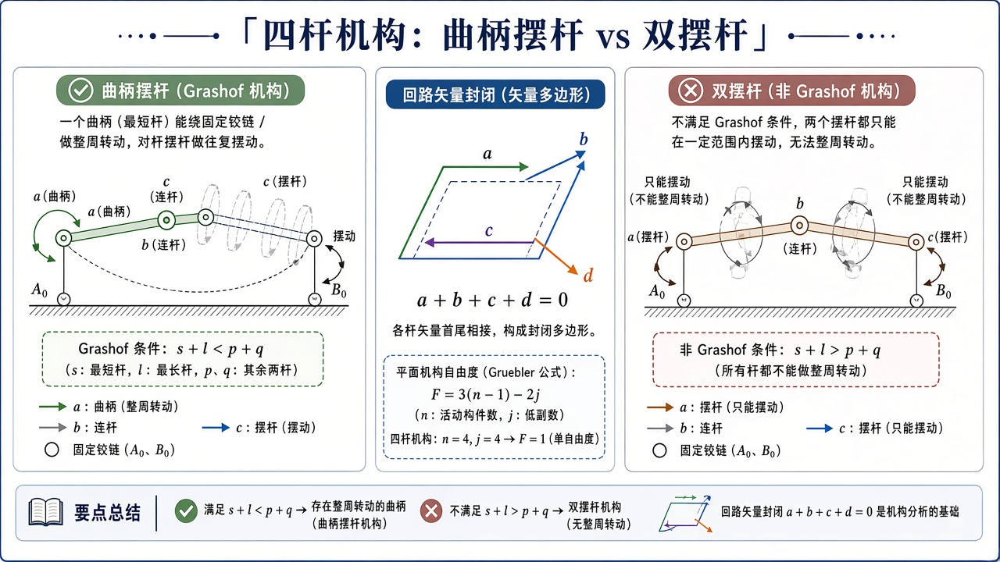
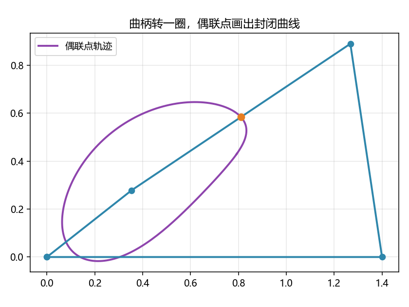

# 机构学：杆件怎么连、有几个自由度

> [!WARNING]
> 🧪 Beta公测版本提示：教程主体已完成，正在优化细节，欢迎大家提Issue反馈问题或建议。

> 前面几章默认「开链手臂」：一端钉死，另一端自由。机构学问更老的机械问题：若干杆用铰链连成**闭链**之后，还能动几下？最经典的答案是平面铰链四杆——自由度 $1$，曲柄转一圈，连杆上一点画出封闭曲线。开链几何仍见 [运动学](/robotics/kinematics/)。导论里的 $M$ 在这里变成可计算的公式。

---

## 一、通俗理解：闭链少了自由，多了「必须闭得上」

开链 2R：两个电机，手在平面里差不多能去圆环里任意点（姿态另说）。  
若再加一根杆把手当成铰链钉回地面，手不能再随便走，整圈机构往往只剩**一个**独立转动——摇一摇曲柄，所有杆的姿态都被代数钉死。

这就是闭链：约束方程个数增加，自由度下降，但结构更刚、力传递可以更直接（冲压机、雨刮、仿生腿里的平行四杆）。代价是位置分析要解「环闭合」，不是 FK 连乘那么顺。

> **图解说明**：机架 $AD$，曲柄（蓝）绕 $A$ 整周转，连杆（绿）带偶联点曲线，摇杆（紫）绕 $D$ 摆。四个铰链。自由度 $1$，一个主动输入决定整机。

<video controls muted loop playsinline preload="metadata" style="width:100%;max-width:960px;border-radius:8px;background:#f7fafc;margin:0.6rem 0;">
  <source src="./images/fourbar.mp4" type="video/mp4">
</video>

> **动画说明**：曲柄整周转一圈，摇杆只摆；橙色偶联点扫出封闭曲线。$M=3(N-1)-2J_1=1$。

---

## 二、Gruebler：保姆级数自由度

平面刚体每个有 $3$ 个自由度（$x,y,\theta$）。$N$ 个构件（**含机架**）用 $J_1$ 个单自由度低副（铰链或滑块）连起来：

$$
M = 3(N-1) - 2 J_1.
$$

为什么是 $N-1$：机架已经钉死，先扣掉 $3$ 个自由度。每个铰链再扣 $2$ 个（只留相对转动这 $1$ 个）。

**四杆**：$N=4,\;J_1=4$，于是 $M=3\cdot 3-8=1$。  
有的教材令 $N$ 只计**活动**构件（此时 $N=3$），写成 $M=3N-2J_1$，数字一样。demo 与练习用第一种。

再练两个：

| 机构 | $N$（含机架） | $J_1$ | $M$ |
|------|----------------|-------|-----|
| 开链 2R（基座+两杆） | 3 | 2 | $3\cdot2-4=2$ |
| 铰链四杆 | 4 | 4 | $1$ |
| 滑块曲柄（三个转动 + 一个移动，都是低副） | 4 | 4 | $1$ |
| 平面五杆（两输入） | 5 | 5 | $2$ |

$M=1$ 的含义：指定曲柄角 $\theta$，其余姿态（在某一装配模式下）被钉死。$M=0$ 是桁架，不能动。$M<0$ 是静不定，多装了杆。Gruebler 是**必要但不充分**：特殊杆长可能出现「局部自由度」或「虚约束」（平行四边形多一个约束实际相关），公式会骗人，还要看几何。

::: details 逐步推导：Gruebler $M=3(N-1)-2J_1$ 每项的含义（点击展开）

平面每个自由刚体 $3$ 个自由度。$N$ 个构件里有一个是机架，已经钉死，剩下 $N-1$ 个活动件，先给 $3(N-1)$ 个「如果互不连接」的自由度。

每个低副（转动副或移动副）只允许 $1$ 种相对运动，等于把相对的 $3$ 个自由度扣掉 $2$ 个。$J_1$ 个低副共扣 $2J_1$。于是

$$
M=3(N-1)-2J_1.
$$

四杆：$N=4,J_1=4$，$M=9-8=1$。开链 2R：基座+两杆 $N=3$，两个铰链 $J_1=2$，$M=6-4=2$，与导论一致。

高副（凸轮、齿轮接触）只扣 $1$ 个自由度，完整公式还有 $-J_2$ 项。本课四杆全是低副。虚约束：几何上两个约束描述的是同一件事（平行四边形对边平行），公式多扣了一次，算出的 $M$ 偏小——这时要靠几何而不是盲目信公式。

:::

---

## 三、Grashof：谁能转整圈

四杆杆长 $s\le l$ 为最短、最长，另两根 $p,q$。**Grashof**：$s+l \le p+q$ 时至少有一根能相对另一根整周转。

- 最短杆为机架的邻边（曲柄）：**曲柄摇杆**——一侧转圈，一侧摆。demo 就是这种。
- 最短杆为机架：**双曲柄**。
- 最短杆为连杆：摇杆-摇杆（双摇杆），没有整周转。
- 不满足 Grashof：双摇杆，更「僵」。

demo 机架 / 曲柄 / 连杆 / 摇杆 $=1.4,\;0.45,\;1.1,\;0.9$。最短 $0.45$ + 最长 $1.4$ $=1.85$，$1.1+0.9=2.0\ge 1.85$，且最短是曲柄，故曲柄摇杆。

> **图解说明**：左：满足 $s+\ell\le p+q$ 的曲柄摇杆，曲柄整周转、摇杆只摆。右：不满足时双摇杆。中：环闭合向量和为零。

::: details 逐步推导：位置分析为什么是「两圆相交」（点击展开）

机架两端 $A_\text{铰}$（曲柄轴）与 $D$（摇杆轴）固定。曲柄长 $L_1$，角 $\theta$ 已知，则曲柄末端 $A$ 为

$$
A = A_\text{铰} + L_1(\cos\theta,\sin\theta).
$$

连杆长 $L_2$，摇杆长 $L_3$。未知点 $B$（摇杆与连杆的铰）必须同时落在：以 $A$ 为心半径 $L_2$ 的圆，以及以 $D$ 为心半径 $L_3$ 的圆。两圆交点公式：先连心线 $D-A$，长度 $d$；若 $|L_2-L_3|\le d\le L_2+L_3$ 才有实交点。沿连心线走到 $h$ 处再沿法向走 $\pm h_\perp$，两个符号就是开式 / 交叉装配。

这与 [运动学](/robotics/kinematics/) 逆解「两圆交肘」是同一幅图，只是这里两圆心都随曲柄在动，而且必须闭成四边形。

死点：曲柄与连杆共线时，两圆心距走到极限 $L_2\pm L_1$ 一类配置，交点重合，传动角为 $0$，切向速度无法从曲柄传到摇杆。

:::

---

## 四、位置分析：两圆相交（逐步）

已知曲柄角，曲柄端 $A$ 的位置由 $\theta$ 直接写出。求连杆另一端 $B$，使

$$
|B-A|=L_2,\quad |B-D|=L_3
$$

——分别以 $A$、$D$ 为圆心的两圆交点。一般**两个**交点，对应开式 / 交叉两种装配。代码取叉积为正的那一支（法向 $n$ 由 $D-A$ 逆时针转 $90^\circ$）。交点不存在：这一步的死点或杆长不可达（曲柄转过了极限）。

**死点**：曲柄与连杆共线，驱动力沿杆走，对摇杆瞬时力臂为 0，打滑或卡死。冲压机有时故意过死点「锁紧」。

偶联点可取连杆上任意固连点；demo 用中点 $P=(A+B)/2$，扫 $\theta\in[0,2\pi)$ 得到封闭曲线。改变 $P$ 在连杆上的位置，曲线可以从香蕉变成 8 字——这是机构综合的入口，本课只展示一条。

---

## 五、和开链章节的关系

四杆的「位置分析」就是带约束的运动学。若把摇杆拆掉，剩下开链，[正运动学](/robotics/kinematics/) 立刻多一个自由关节。把瞬时速度写成旋量，见 [旋量](/robotics/screw/)。真实机器人里平行四杆、差动、五杆并联都是机构学的后代；[ROS 2](/ros2/overview/) 的 URDF 闭链要用 `mimic` 或单独运动学插件，不会自动解环。

---

## 六、常见疑问

**Q：为什么我算的 $M$ 和直觉不符？**  
查是否把机架算进 $N$；是否把滚动、凸轮等高副当成了低副（高副只扣 $1$ 个自由度，公式要改）。平行四边形有虚约束。

**Q：装配模式能不能中途切换？**  
连续运动一般不能从开式跳到交叉，除非经过不可达或拆开再装。轨迹规划必须锁死装配支。

**Q：传动角是什么？**  
连杆与摇杆夹角离 $90^\circ$ 越近，传力越好；太小则费力、易卡。设计四杆时常设最小传动角下限。

---

## 七、代码在做什么

`demo.py` 先打印 Gruebler 应为 $1$，再扫一圈曲柄，画偶联点轨迹，并在 $\theta\approx 0.7$ 处叠一幅连杆快照 `fourbar.png`。

---

## 八、小结

| 概念 | 一句话 |
|------|--------|
| Gruebler | 平面 $M=3(N-1)-2J_1$；四杆 $=1$ |
| Grashof | 谁能整周转；曲柄摇杆 vs 双摇杆 |
| 环闭合 | 两圆相交定 $B$；两支装配 |
| 死点 | 共线，瞬时传力臂为 0 |
| 偶联曲线 | 连杆固连点扫出的轨迹 |
| 下游 | 并联机构、仿生腿、传动设计 |

> 下一章 [旋量](/robotics/screw/)：瞬时运动不再逐点写速度，而写成「绕某轴转并沿轴挪」。李群上的有限转动见 [SO(3)](/robotics/lie-groups/)。

## 📥 Code

| File | View | Download |
|------|------|----------|
| demo.py | [Open](./code-demo) | <a href="/notebook/code/robotics/mechanisms/demo.py" target="_blank" download>Download</a> |
| exercise.py | [Open](./code-exercise) | <a href="/notebook/code/robotics/mechanisms/exercise.py" target="_blank" download>Download</a> |

## 参考

1. Norton, *Design of Machinery*（四杆、Grashof、传动角）
2. McCarthy, *Geometric Design of Linkages*
