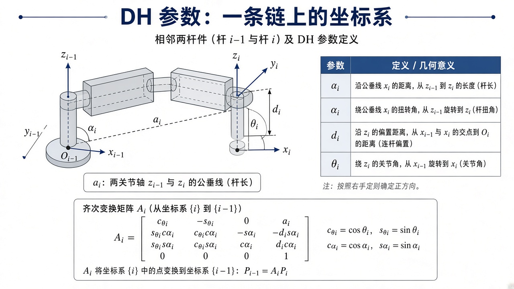
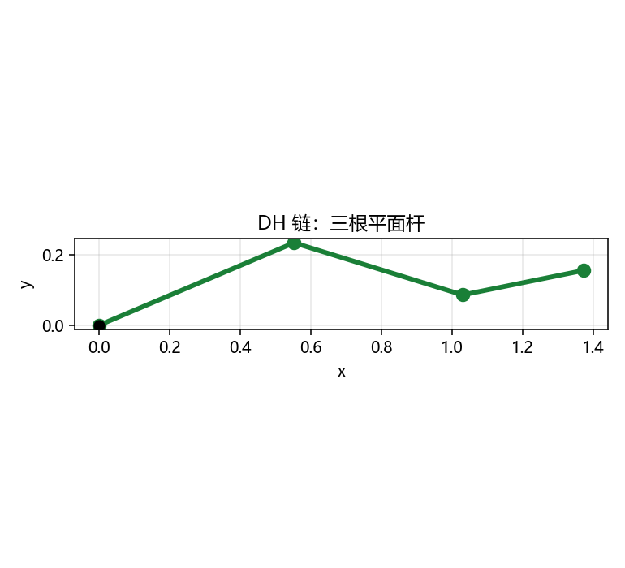

# 机器人建模方法：DH 把杆件收成矩阵链

> [!WARNING]
> 🧪 Beta公测版本提示：教程主体已完成，正在优化细节，欢迎大家提Issue反馈问题或建议。

> [2R 三角公式](/robotics/kinematics/) 写两根杆刚刚好。六轴再手写 $\cos(\theta_1+\theta_2+\cdots)$ 会疯。**Denavit–Hartenberg（DH）** 给每一关节四个几何数，齐次矩阵连乘就得到基座到末端。本章把「为什么是四个参数、一帧矩阵怎么乘、和 2R 公式如何对上」写清楚。旋转矩阵为什么必须 $\det=1$ 见 [李群](/robotics/lie-groups/)。

---

## 一、通俗理解：相邻两根杆之间要说清四件事

空间里一个刚体相对另一个，一般要 $6$ 个数（三平移 + 三旋转）。为什么 DH 只用 $4$ 个？因为我们**规定了坐标系怎么贴在关节上**：

- 每个转动关节的 $z$ 轴沿着那根转轴；
- $x$ 轴沿着两根 $z$ 的公垂线。

贴完之后，相邻系之间只剩下：沿公垂线走多远（杆长 $a$）、绕公垂线扭多少（扭角 $\alpha$）、沿自己的 $z$ 滑多远（偏置 $d$）、绕 $z$ 转多少（关节角 $\theta$）。四个标量，不多不少。

换一套贴法（modified DH / Craig 约定）数字会变，但「四个标量 + 齐次阵连乘」这件事不变。本章与 demo 用**经典顺序**：

> 绕 $z$ 转 $\theta$ → 沿 $z$ 移 $d$ → 沿 $x$ 移 $a$ → 绕 $x$ 转 $\alpha$。

读任何 DH 表，先看教材用的是哪一套，**不要混抄矩阵**。以代码 `dh()` 的乘法顺序为准。

> **图解说明**：相邻系 $\{i-1\}$ 与 $\{i\}$ 之间，$a$ 杆长，$\alpha$ 扭角，$d$ 偏置，$\theta$ 关节角。右手定则。

<video controls muted loop playsinline preload="metadata" style="width:100%;max-width:960px;border-radius:8px;background:#f7fafc;margin:0.6rem 0;">
  <source src="./images/dh_3r.mp4" type="video/mp4">
</video>

> **动画说明**：平面 3R，每节坐标系贴在关节上。$\theta$ 变了，齐次阵连乘，末端跟着走。杆长与 demo 相同。

---

## 二、一帧齐次变换：把四步写成一个 $4\times 4$

每一步都是一个简单 $4\times 4$。乘在一起（与 `dh()` 一致）：

$$
A_i=
\begin{pmatrix}
c_\theta & -s_\theta c_\alpha & s_\theta s_\alpha & a c_\theta \\
s_\theta & c_\theta c_\alpha & -c_\theta s_\alpha & a s_\theta \\
0 & s_\alpha & c_\alpha & d \\
0 & 0 & 0 & 1
\end{pmatrix}.
$$

保姆级读矩阵：

- **右上 $3\times 1$**：下一坐标系原点写在当前系里。平面臂 $\alpha=d=0$ 时就是 $(a\cos\theta,a\sin\theta,0)$——「转完再沿杆走 $a$」，与运动学章 $T(\theta,a)$ 相同。
- **左上 $3\times 3$**：下一系的姿态。$\alpha=0$ 时就是平面旋转 $\theta$。
- **第三行**：$\alpha\neq 0$ 才真正用上，表示 $z$ 轴扭出了纸面。平面臂第三行是 $[0,0,1,0]$。

整条链：

$$
T_n^{0} = A_1 A_2 \cdots A_n.
$$

左乘还是右乘？**从基座往外乘**：`T = T @ A_i`（Python 右乘下一帧）。这与「点的坐标先在末端表示，再一帧帧送回基座」一致。

---

## 三、和 2R 公式对上（数字级验算）

平面转动关节：$\alpha=0,\;d=0,\;a=\ell,\;\theta$ 为变量。两帧：

$$
A_1 A_2
=
\begin{pmatrix}
\cos(\theta_1+\theta_2) & -\sin(\theta_1+\theta_2) & 0 & \ell_1\cos\theta_1+\ell_2\cos(\theta_1+\theta_2)\\
\sin(\theta_1+\theta_2) & \cos(\theta_1+\theta_2) & 0 & \ell_1\sin\theta_1+\ell_2\sin(\theta_1+\theta_2)\\
0&0&1&0\\
0&0&0&1
\end{pmatrix}.
$$

右上两维**正好是** [运动学](/robotics/kinematics/) 的 $x,y$。姿态块是 $\theta_1+\theta_2$，即末端朝向。DH 不是另一种物理，是同一套几何的表格化。

---

## 四、平面 3R 在做什么

三根杆 $a=(0.6,0.5,0.35)$，把每个 $A_i$ 累乘，记下每一帧原点，就得到折线。没有逆解、没有雅可比——本章只证明「DH 链能画出一只手臂」。空间臂 $\alpha\neq 0$ 时 $z$ 轴不再全平行，矩阵第三行才真正用上。

给真实六轴填 DH 表的口诀（标准 DH）：

1. 给每个关节轴画 $z_i$；
2. 作 $z_{i-1}$ 与 $z_i$ 的公垂线，作为 $x_i$，交点定原点；
3. 读 $a_i$（公垂线长）、$\alpha_i$（两 $z$ 夹角）、$d_i$、$theta_i$；
4. 平行轴时公垂线不唯一，选方便测量的那条，$a$ 仍是垂直距离。

[ROS 2](/ros2/overview/) 的 URDF 用「xyz + rpy」而不是 DH 表，但正运动学仍然是齐次变换连乘；读 URDF 时可把每条 `<joint>` 想成一帧 $A_i$。

---

## 五、常见疑问

**Q：标准 DH 和 modified DH 差在哪？**  
坐标系贴在连杆「前关节」还是「后关节」，以及乘法顺序（先 $a,\alpha$ 还是先 $d,\theta$）。**矩阵不能混用。** 本仓库只实现标准 DH。

**Q：为什么我的末端差一个符号？**  
最常见：$\theta$ 的零位与图纸不一致；或 $A_i$ 乘反了（`A @ T` vs `T @ A`）。用 2R 特例对照三角公式最快。

**Q：偏置 $d$ 什么时候非零？**  
相邻关节轴异面（不共面也不平行）时，公垂线之外还要沿 $z$ 走一截。SCARA 的竖直轴、许多工业臂的后三轴都有 $d$。

**Q：标定是在标 DH 吗？**  
工厂出厂有一套名义 DH；测量后微调 $a,\alpha,d$ 以及 $\theta$ 的零偏，叫运动学标定。思想仍是同一条链。

---

## 六、代码在做什么

`demo.py` 对 $\theta=(0.4,-0.7,0.5)$ 调用 `fk_chain`，打印末端 $xy$ 与旋转块 $R$，并画出三杆折线 `dh_3r.png`。

---

## 七、小结

| 概念 | 一句话 |
|------|--------|
| 四个参数 | 关节轴贴法把 6 个相对位姿减成 4 个 |
| $A_i$ | 一帧 $4\times 4$；平面臂大量零 |
| 连乘 | $T=A_1\cdots A_n$；Python 右乘下一帧 |
| 与 2R | 三角是 $n=2$、$\alpha=d=0$ 的展开 |
| 下游 | 标定、URDF、李群上的姿态、[旋量 / PoE](/robotics/screw/) |

> 下一章 [李群](/robotics/lie-groups/)：$R$ 不能当 $\mathbb{R}^9$ 随便加，指数映射才是「小转动」的正确加法。机构怎么连成闭链见 [机构学](/robotics/mechanisms/)。

## 📥 Code

| File | View | Download |
|------|------|----------|
| demo.py | [Open](./code-demo) | <a href="/notebook/code/robotics/modeling/demo.py" target="_blank" download>Download</a> |
| exercise.py | [Open](./code-exercise) | <a href="/notebook/code/robotics/modeling/exercise.py" target="_blank" download>Download</a> |

## 参考

1. Denavit & Hartenberg, “A Kinematic Notation…” (1955)
2. Craig, *Introduction to Robotics*（标准 DH 表与画法）
3. 对照 [运动学](/robotics/kinematics/) 的 2R 公式验算 $A_1A_2$
