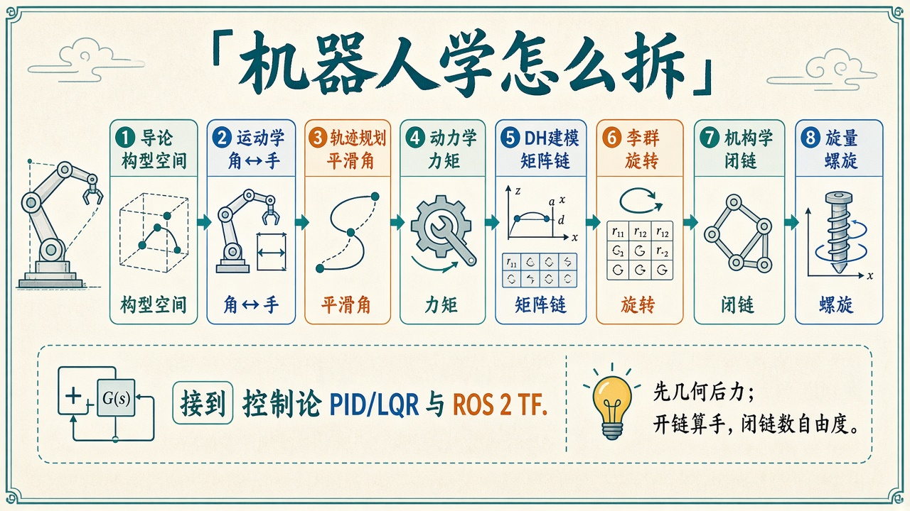
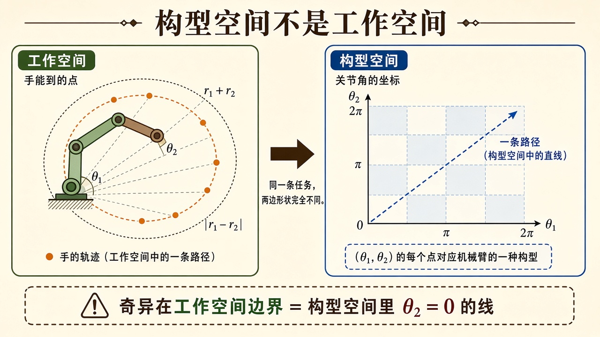
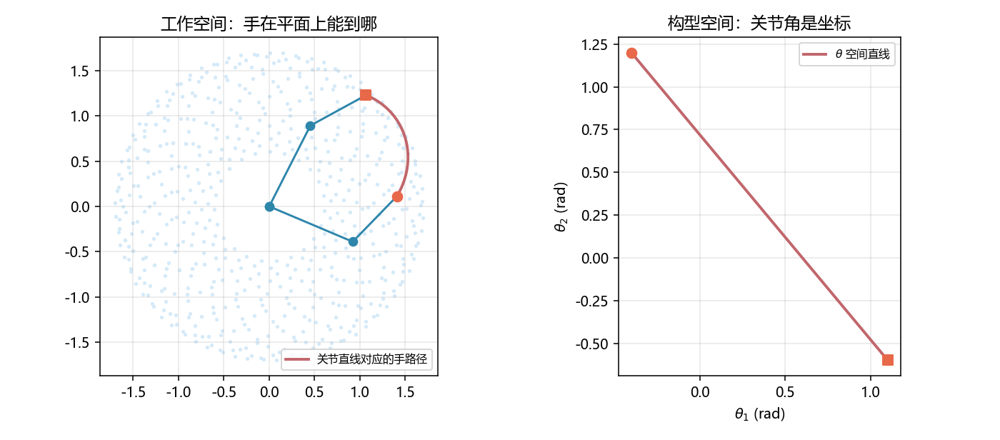

# 机器人学导论：先分清「手在哪」和「角是哪」

> [!WARNING]
> 🧪 Beta公测版本提示：教程主体已完成，正在优化细节，欢迎大家提Issue反馈问题或建议。

> 机器人学不是「把电机手册背完」。它先问三个几何问题：**这个机构还能动几下（自由度）？手能扫到哪些点（工作空间）？描述姿态用几个数、这些数构成什么形状（构型空间）？** 后面每一章都在给其中某一个问题配公式。控制回路见 [控制论导论](/control/overview/)；真机坐标系见 [ROS 2](/ros2/overview/)。领域地图：[机器人学](/robotics/)。

---

## 一、通俗理解：机器人是带约束的刚体串

把每根杆当成不会弯的尺子（刚体），关节当成「只允许某一种相对运动」的铰链：

- **转动关节（revolute，R）**：只能绕一根轴转，像肘。
- **移动关节（prismatic，P）**：只能沿一根轴滑，像抽屉。

**开链**（串联臂）：一端钉在基座，另一端是手。从基座数到手指，中间没有环。工业六轴臂、本笔记的平面 2R，都是开链。开链的好处是正运动学几乎就是「从根往叶把变换乘起来」；坏处是末端精度会把每一级误差累加。

**闭链**（四杆、并联平台）：杆连成环。自由度变少，刚度往往变好，但位置分析要解环闭合方程。[机构学](/robotics/mechanisms/) 专门干这个。

> **图解说明**：本领域八章的顺序。先几何后力；开链算手，闭链数自由度。底栏接到控制与 ROS 2。

---

## 二、自由度：先数，再建模

平面一个未约束刚体有 $3$ 个自由度：$x,y$ 加上转角 $\theta$。空间刚体有 $6$ 个：三个平动 + 三个转动。每个关节再锁掉一些。

平面开链 $n$ 个转动关节、基座钉死：自由度就是 $n$。所以 **2R 手臂有 $2$ 个自由度**——两根杆、两个角，手在平面上的 $(x,y)$ 一般也能对上（局部），但姿态（末端朝向）不能任意指定，因为还缺一个角。**3R 平面臂**才能同时管位置和朝向。

空间开链六轴工业臂：$6$ 个自由度，刚好对着刚体的 $6$ 个。七轴冗余臂自由度 $>6$，同一位姿可以有一整族构型，用来躲奇异、躲障碍。

闭链用 Gruebler 公式，见机构学章。导论只要求你养成习惯：**先问 $M$ 等于几，再决定用几个广义坐标 $q$。** $q$ 选关节角，是因为电机装在关节上，传感器读的也是关节。

---

## 三、工作空间 ≠ 构型空间（最容易混的两个词）

**工作空间（workspace）**：末端（手）在笛卡尔平面/空间里能到的点集。平面 2R 是圆环带

$$
|\ell_1-\ell_2| \le \sqrt{x^2+y^2} \le \ell_1+\ell_2.
$$

外圆：两杆伸直；内圆：两杆尽量折叠。$\ell_1=\ell_2$ 时内圆缩成原点，手可以摸到基座。

**构型空间（configuration space, C-space）**：用关节角当坐标的空间。2R 的 $(\theta_1,\theta_2)$ 是一个矩形（若角不限则是环面 $S^1\times S^1$，因为 $2\pi$ 和 $0$ 是同一个角）。**在构型空间里画直线，映射到工作空间一般是弯的。** 这就是下一章轨迹规划必须先声明「在哪一组坐标里插值」的原因。

> **图解说明**：左是手能到的圆环；右是 $\theta_1$-$\theta_2$ 平面。同一条任务，两边形状完全不同。奇异落在工作空间边界，对应 $\theta_2=0$ 或 $\pm\pi$。

<video controls muted loop playsinline preload="metadata" style="width:100%;max-width:960px;border-radius:8px;background:#f7fafc;margin:0.6rem 0;">
  <source src="./images/cspace.mp4" type="video/mp4">
</video>

> **动画说明**：右图 $\theta$ 走直线，左图手在圆环带里走出香蕉弯。参数与 demo 相同：$\ell_1=1$，$\ell_2=0.7$。

**任务空间**：你真正关心的输出，常常是手的位姿，有时还加「避开人」。任务空间里的直线，通常要在构型空间里解逆运动学才能跟踪。

demo 把 2R 的可达点采样成云，再在构型空间画一条 $\theta$ 直线，把对应的手路径叠在圆环上——你会看见香蕉弯。

---

## 四、后面每一章各管一块

| 你卡住的句子 | 去哪一章 |
|--------------|----------|
| 给定角，手在哪？给定点，角怎么弯？速度怎么映射？ | [运动学](/robotics/kinematics/) |
| 关节角如何随时间光滑地从 A 到 B？ | [轨迹规划](/robotics/trajectory/) |
| 要这么加速，电机力矩多大？重力会不会把臂拽下去？ | [动力学](/robotics/dynamics/) |
| 六轴不能再手写两行余弦，坐标系怎么贴？ | [DH 建模](/robotics/modeling/) |
| 旋转矩阵九个数为什么不能当向量加？万向节死锁？ | [李群](/robotics/lie-groups/) |
| 四根杆连成圈还能动吗？曲柄转一圈另一边只是摆？ | [机构学](/robotics/mechanisms/) |
| 刚体瞬时运动怎样写成「绕轴转并沿轴挪」？ | [旋量](/robotics/screw/) |

数学上，正运动学是 $f:q\mapsto x$；雅可比是 $J=\partial f/\partial q$；动力学是第二套映射 $\tau \leftrightarrow \ddot q$。先把 $f$ 和 $J$ 搞熟，再谈力。

---

## 五、常见疑问

**Q：机器人和机械臂是一回事吗？**  
本笔记默认「刚体 + 关节」的操作臂与机构。轮式底盘的差速运动学、视觉伺服、抓取规划都是后续专题，不塞进这八章。

**Q：为什么一上来是平面 2R，不是 UR5？**  
2R 已经有正逆解两支、工作空间圆环、雅可比奇异、拉格朗日 $2\times 2$。六轴只是把矩阵变大、逆解变成数值迭代。思想在 2R 上一次讲透，DH 再负责「怎么往 6 轴扩」。

**Q：角用度还是弧度？**  
公式和 NumPy 的 `sin`/`cos` **只用弧度**。打印、看图再用 `rad2deg`。混用是运动学第一大笔误。

**Q：和 ROS 2 什么关系？**  
URDF 描述的是开链（或 `mimic` 的假闭链）；`robot_state_publisher` 做的就是正运动学连乘；TF 树就是一串齐次变换。本领域把公式算明白，ROS 课才不是在背命令。

---

## 六、代码在做什么

`overview_cspace.png`：左圆环云 + 两个姿态的手臂折线 + 关节直线对应的手路径；右 $\theta$ 平面里那条直线。终端打印半径理论区间 $[0.3,1.7]$（$\ell_1=1,\ell_2=0.7$）。

---

## 七、小结

| 概念 | 一句话 |
|------|--------|
| 开链 / 闭链 | 树还是环；正运动学难易差一档 |
| 自由度 $M$ | 独立广义坐标个数 |
| 工作空间 | 手能到的笛卡尔点集 |
| 构型空间 | 关节角自己的坐标系 |
| 下游 | 先 [运动学](/robotics/kinematics/)，再 [轨迹](/robotics/trajectory/) |

> 下一章 [运动学](/robotics/kinematics/)：把「角 → 点」写成公式，并问反过来有几解。

## 📥 Code

| File | View | Download |
|------|------|----------|
| demo.py | [Open](./code-demo) | <a href="/notebook/code/robotics/overview/demo.py" target="_blank" download>Download</a> |
| exercise.py | [Open](./code-exercise) | <a href="/notebook/code/robotics/overview/exercise.py" target="_blank" download>Download</a> |

## 参考

1. Craig, *Introduction to Robotics*（开篇：位姿、自由度）
2. Lynch & Park, *Modern Robotics*（构型空间叙事）
3. Siciliano et al., *Robotics: Modelling, Planning and Control*
