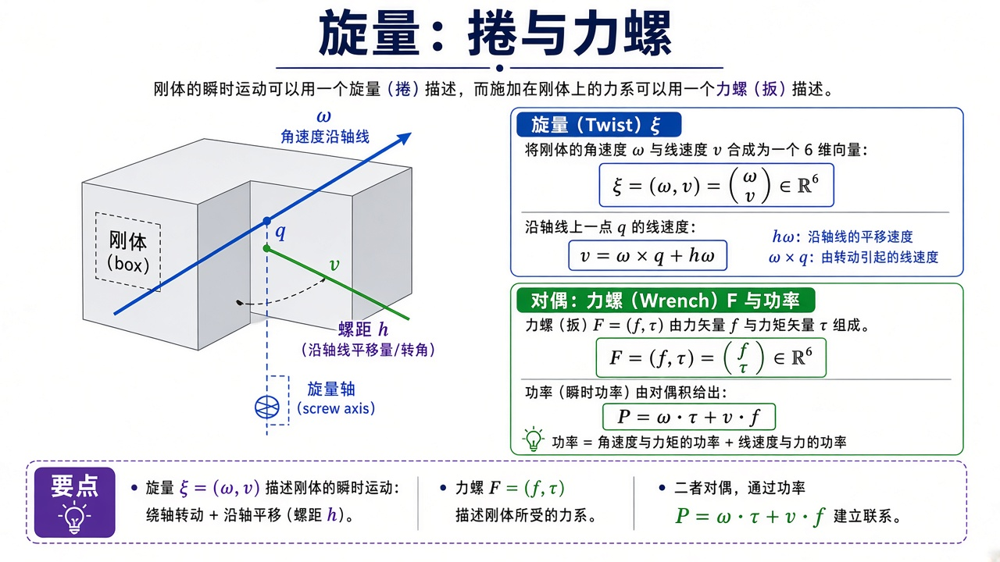
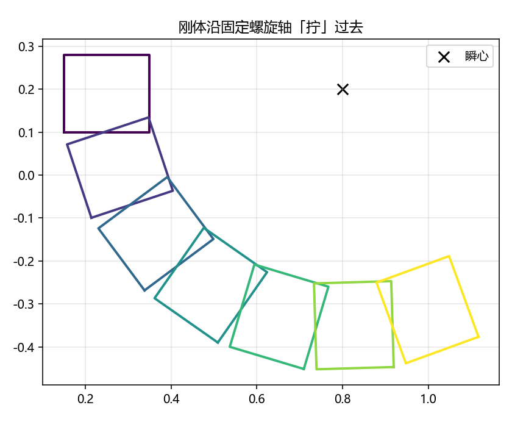

# 旋量代数：刚体怎样「拧」过去

> [!WARNING]
> 🧪 Beta公测版本提示：教程主体已完成，正在优化细节，欢迎大家提Issue反馈问题或建议。

> Chasles 定理：刚体任意有限位移等价于绕某轴旋转并沿该轴平移——一条**螺旋**。[李群 $\mathrm{SO}(3)$](/robotics/lie-groups/) 只覆盖转动；加上平移后是 $\mathrm{SE}(3)$，李代数 $\mathfrak{se}(3)$ 里的元素叫 **twist（捻）**。对偶的力和力矩叫 **wrench（力螺）**。本章把「六维是什么意思、平面指数映射每项从哪来、和 DH / 雅可比怎么对上」写清楚。**demo 降到平面 $\mathrm{SE}(2)$**，用指数映射让一块小矩形绕固定瞬心转过去。

---

## 一、通俗理解：刚体不会「一边转一边随便挪」

你把杯子从桌子左边放到右边并拧一下盖子：看起来又转又移。Chasles 说，一定存在一根轴，使这个位移 = **绕那根轴转 + 沿那根轴滑**。没有「纯乱扭」。瞬时来看也一样：刚体的速度场由一根瞬时螺旋轴完全决定——轴上的点只沿轴走（或不动），别处的速度像转木马加上沿轴漂移。

空间刚体瞬时运动用六元组

$$
\xi=\begin{pmatrix}\omega\\ v\end{pmatrix}\in\mathbb{R}^6.
$$

$\omega$ 是角速度（轴方向），$v$ 是与**参考原点**有关的线速度，不是「质心速度」那么朴素。轴上一点 $q$ 处

$$
v_{\text{点}}=\omega\times (p-q) + h\omega,
$$

螺距 $h$ 描述「转一弧度沿轴走多远」。$h=0$ 纯转动（有限位移是绕轴转），$h\to\infty$ 纯平移。

力螺 $F=(f,\tau)$ 与捻通过瞬时功率配对：

$$
P=\omega\cdot\tau + v\cdot f.
$$

功率为零则力螺做不了功（约束力）。这就是虚功原理的旋量版。

> **图解说明**：刚体上一条螺旋轴；$\omega$ 沿轴，$v$ 含沿轴平移与因转动引起的线速度。右栏捻、力螺与功率。平面 demo 只保留 $\omega$ 的一个标量和 $v_x,v_y$。

<video controls muted loop playsinline preload="metadata" style="width:100%;max-width:960px;border-radius:8px;background:#f7fafc;margin:0.6rem 0;">
  <source src="./images/se2_screw.mp4" type="video/mp4">
</video>

> **动画说明**：平面刚体绕固定瞬心拧过去，$T(t)=\exp(t\hat\xi)$。灰框是中间姿态残影。对应 demo 的 SE(2) 指数映射。

这套语言把 [运动学](/robotics/kinematics/) 的雅可比列写成「各关节旋量」，把 [动力学](/robotics/dynamics/) 的力写成力螺；Murray–Li–Sastry / *Modern Robotics* 用它统一开链。

---

## 二、平面 $\mathfrak{se}(2)$ 指数映射（逐步）

平面刚体 $3$ 自由度：转角 + 平移。李代数元素 $\xi=(\omega,v_x,v_y)$。齐次表示

$$
\hat\xi
=
\begin{pmatrix}
0 & -\omega & v_x \\
\omega & 0 & v_y \\
0 & 0 & 0
\end{pmatrix}.
$$

$\omega=0$ 时 $\exp(t\hat\xi)$ 就是沿 $(v_x,v_y)$ 平移 $t$。$\omega\neq 0$ 时，转角 $\phi=\omega t$，平移由

$$
\begin{pmatrix}x\\ y\end{pmatrix}
=
\frac{1}{\omega}
\begin{pmatrix}
\sin\phi & -(1-\cos\phi)\\
1-\cos\phi & \sin\phi
\end{pmatrix}
\begin{pmatrix}v_x\\ v_y\end{pmatrix}
$$

给出（与 `se2_exp` 一致）。这和 $\mathrm{SO}(3)$ Rodrigues 是亲戚：$\sin,\ 1-\cos$ 再次出现。

**纯转动绕瞬心 $q$：** 线速度应满足「绕 $q$ 转」，平面里

$$
v=\omega(q_y,-q_x)
$$

（与三维 $\omega\times r$ 差一个二维定向约定，练习会钉死）。于是矩形绕黑叉瞬心转，而不是绕原点转——这正是「旋量比原点速度直观」的地方：你先选轴，再写 $v$。

---

## 三、和 DH、雅可比、四杆的关系

DH 给的是**有限**相邻位姿；旋量给的是**瞬时**生成元。指数映射把「关节速度 $\dot\theta$ 乘关节旋量」积成有限 $T(\theta)$——**指数积公式（PoE）**：

$$
T(\theta)=\mathrm{e}^{\hat\xi_1\theta_1}\cdots\mathrm{e}^{\hat\xi_n\theta_n}T(0).
$$

平面 2R 的两个 $\xi$ 就是「绕基座转」「绕肘转」；对 $\theta$ 求导，这两列正是雅可比。PoE 不需要每杆贴 DH 坐标系，零位时把关节轴在空间里量出来即可。本课 demo 只做一帧 $\mathrm{SE}(2)$ $\exp$，思想已经是 PoE 的一块积木。

四杆每根杆的瞬时运动也是某个 twist；闭链意味着若干旋量线性相关（与 Gruebler 的 $M$ 一致）。

[世界模型](/world-models/intro/) 若要在 SE(2)/SE(3) 上预测下一帧位姿，增量也应走 $\exp$，而不是把 yaw 当普通实数加到 $2\pi$ 外面。

---

## 四、常见疑问

**Q：$v$ 到底是哪一点的速度？**  
是参考系原点处「刚体上与原点重合的那一点」的速度（点可能只是空间里的一个标记）。换原点，$v$ 要变，$\omega$ 不变。这就是为什么裸写 $(v_x,v_y)$ 必须同时声明原点。

**Q：力和力矩为什么合成力螺？**  
换原点时力和力矩会混在一起（力臂）。力螺把这对量变成与 twist 配对的协变对象，功率与原点无关。

**Q：为什么 demo 不用 6 维？**  
6 维 $\exp$ 是 Rodrigues 的块矩阵版，公式长一倍。平面已经能看见「绕瞬心转」和 $\sin,1-\cos$。空间情形见 MLS / Lynch。

**Q：和齐次变换 $T$ 什么关系？**  
$T\in\mathrm{SE}(3)$ 是群上的点（有限位姿）；$\xi\in\mathfrak{se}(3)$ 是切向量（瞬时）。$\exp$ 把它们连起来，完全平行于 SO(3)。

---

## 五、代码在做什么

`demo.py` 指定 $\omega=1.2$、瞬心 $q=(0.8,0.2)$，构造纯转动 $v$，对一块矩形在 $t=0\ldots 1.6$ 取 $7$ 帧，颜色沿 viridis 变化，得到 `screw_se2.png`。

---

## 六、小结

| 概念 | 一句话 |
|------|--------|
| 螺旋 / Chasles | 刚体位移 = 绕轴转 + 沿轴移 |
| twist $\xi$ | 瞬时运动；$(\omega,v)$；原点要声明 |
| wrench | 力与力矩；与 twist 功率对偶 |
| $\mathrm{SE}(2)$ $\exp$ | 平面刚体有限位移；$\sin,1-\cos$ |
| PoE | 关节旋量指数连乘 = 正运动学 |
| 下游 | 力控制、位姿积分、与 DH 对照 |

> 机器人学到此收束。建议回到 [导论](/robotics/overview/) 把构型空间再看一眼，或用 [ROS 2](/ros2/overview/) 看真机 TF。控制侧从 [PID](/control/classical/pid/) 接到关节伺服。

## 📥 Code

| File | View | Download |
|------|------|----------|
| demo.py | [Open](./code-demo) | <a href="/notebook/code/robotics/screw/demo.py" target="_blank" download>Download</a> |
| exercise.py | [Open](./code-exercise) | <a href="/notebook/code/robotics/screw/exercise.py" target="_blank" download>Download</a> |

## 参考

1. Murray, Li, Sastry, *A Mathematical Introduction to Robotic Manipulation*
2. Lynch & Park, *Modern Robotics*（PoE 全书主线）
3. 对照 [运动学](/robotics/kinematics/) 雅可比列 = 平面关节旋量
