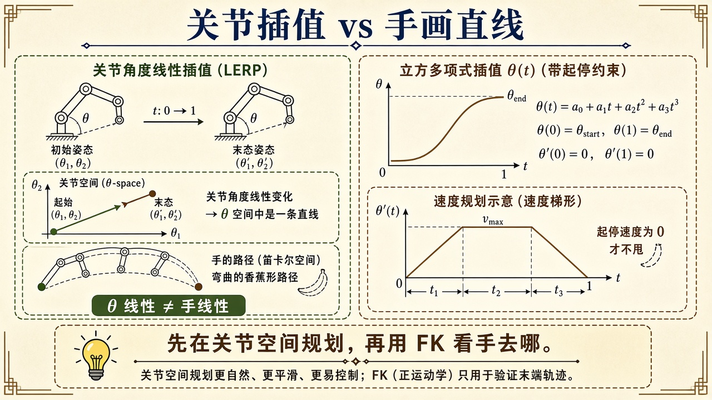
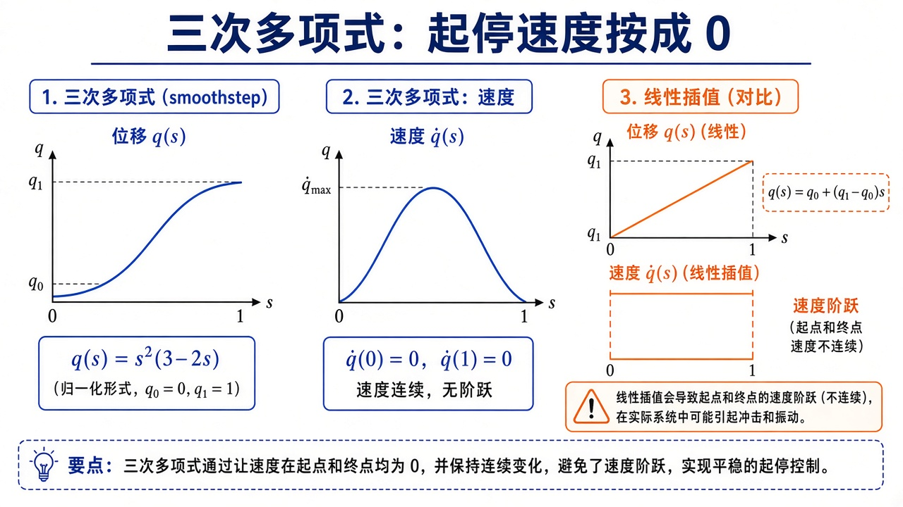
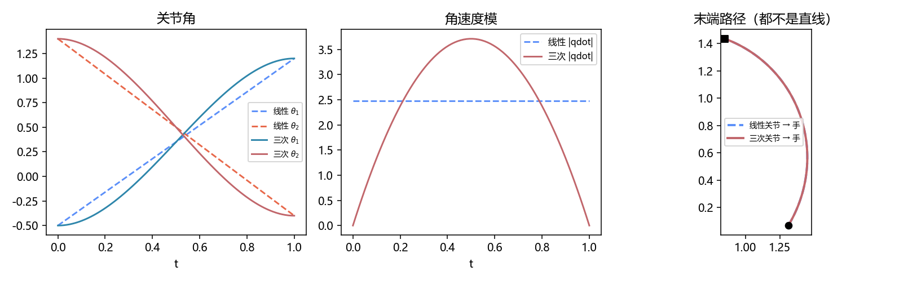

# 轨迹规划：角怎样随时间走，手才会不甩

> [!WARNING]
> 🧪 Beta公测版本提示：教程主体已完成，正在优化细节，欢迎大家提Issue反馈问题或建议。

> [运动学](/robotics/kinematics/) 告诉你起点、终点各自对应哪组关节角。轨迹规划问的是**中间每一时刻** $\theta(t)$ 怎么走：太陡电机跟不上，两端速度不为零会「甩一下」，在关节空间走直线手却走出香蕉弯。本章只做关节空间的线性插值与**起停速度为 0 的三次多项式**，并用 FK 看见手路径。笛卡尔直线、障碍、时间最优是下一层（工业里的 MoveIt / TOPP），本课先把「在哪一组坐标里插值」钉死。前置：[导论](/robotics/overview/) 的构型空间。

公式先看结论；多项式四个系数怎么定、为什么 smoothstep 两端导数为 0，点开推导。

---

## 一、通俗理解：路径是形状，轨迹是形状 + 时刻表

- **路径（path）**：一串构型，不管快慢。像地图上的线。
- **轨迹（trajectory）**：路径加上时间，$q(t)$。像「几点开到哪、速度多少」。

电机真正执行的是轨迹：每个控制周期要一个 $q,\dot q$（有时还要 $\ddot q$ 做前馈，见 [动力学](/robotics/dynamics/) 的逆动力学）。

两套坐标系，两条完全不同的「直线」：

| 在哪插值 | 直线的含义 | 手看起来 |
|----------|------------|----------|
| **关节空间** $q(t)$ | 每个关节匀速或按多项式转 | 末端一般是**曲线** |
| **笛卡尔空间** $x(t)$ | 手走直线 / 圆弧 | 关节角往往要连续求 IK，还可能跳支、过奇异 |

工业里「直线指令」是笛卡尔的；关节 PTP（point-to-point）是构型空间的。demo 只做 PTP：给定 $q_0,q_1$，在关节空间插值，再用 FK 看手。



> **图解说明**：左：$\theta$ 线性，手走弯路。右：三次多项式两端速度为 0，中间才加速。底栏：先在关节空间规划，再用 FK 看手去哪。

<video controls muted loop playsinline preload="metadata" style="width:100%;max-width:960px;border-radius:8px;background:#f7fafc;margin:0.6rem 0;">
  <source src="./images/joint_traj.mp4" type="video/mp4">
</video>

> **动画说明**：灰虚线是整条手路径（左右相同）。红/蓝实线跟着走。底部速度曲线同步画出：线性 $|q̇|$ 是常数（起停像悬崖），三次两端为 0、中间更快。此例线性末端 $|v|$ 几乎不变，是雅可比碰巧变化小，不是笛卡尔匀速。

---

## 二、最差的方案：关节线性插值

时间 $t\in[0,T]$，

$$
q(t)=q_0+\frac{t}{T}(q_1-q_0).
$$

角速度恒为 $(q_1-q_0)/T$。问题：

1. **$t=0$ 和 $t=T$ 速度阶跃**。真实电机不能瞬间达到额定速度，跟踪误差会在起停处炸。
2. 手路径由非线性 FK 决定，**不是**两点连线。导论那根香蕉弯就是它。
3. 若某关节跨越 $\pm\pi$ 不先做角度展开（unwrap），可能绕远路。

线性插值只适合「看一眼几何」，不适合上伺服。

**保姆级：阶跃有多糟。** 假设某关节要从 $0$ 转到 $1\,\mathrm{rad}$，$T=1\,\mathrm{s}$。线性方案角速度恒为 $1\,\mathrm{rad/s}$。但 $t=0^-$ 时机器人是静止的，控制器在第一个周期突然看见参考速度从 $0$ 跳到 $1$。跟踪误差在起停处出现尖峰，末端「点头」。这不是 PID 没调好，是参考轨迹本身不合法。

---

## 三、三次多项式：把两端速度按成 0

四个边界条件：$q(0)=q_0$、$q(T)=q_1$、$\dot q(0)=0$、$\dot q(T)=0$。四个条件定三次多项式。写成归一化时间 $s=t/T\in[0,1]$，每个关节独立地

$$
q(s)=q_0+\underbrace{s^2(3-2s)}_{\text{smoothstep}}(q_1-q_0).
$$

$s^2(3-2s)$ 在 $0$ 和 $1$ 处值为 $0,1$，导数为 $0$。中间最陡：这就是「起步慢、中间快、到站再慢」。角速度模 $|q̇|$ 在两端为 0，峰值约为线性情形的 $1.5$ 倍（demo 会打印）。

若还要求起停加速度为 0，要用五次多项式；若要加速度有界、匀速巡航，用**梯形速度**（加速—匀速—减速）。思想相同：先规定 $\dot q$ 的形状，再积分得到 $q$。本章三次已经能看见「为什么不能线性」。

对每个关节**分别**套同一条 $s(t)$，叫同步插值：大家同一时刻到站。若某轴行程特别大，会拖着别的轴一起放慢——PTP 的常规做法。



> **图解说明**：左：$q(s)$ 是 S 形 smoothstep。中：$\dot q$ 两端为 0、中间鼓包。右：线性插值的速度是带悬崖的矩形。

::: details 逐步推导：四个边界条件怎样定出 $s^2(3-2s)$（点击展开）

每个关节独立，下面把 $q$ 当成标量。设

$$
q(t)=a_0+a_1 t+a_2 t^2+a_3 t^3,\qquad t\in[0,T].
$$

四个条件：

1. $q(0)=q_0$ $\Rightarrow$ $a_0=q_0$。
2. $\dot q(0)=0$ $\Rightarrow$ $a_1=0$（一次项必须没有，否则 $t=0$ 处速度不是 0）。
3. $q(T)=q_1$ $\Rightarrow$ $q_0+a_2 T^2+a_3 T^3=q_1$。
4. $\dot q(T)=0$ $\Rightarrow$ $2a_2 T+3a_3 T^2=0$，即 $a_3=-\dfrac{2}{3T}a_2$。

把 4 代入 3：

$$
a_2 T^2-\frac{2}{3}a_2 T^2=q_1-q_0 \Rightarrow \frac{1}{3}a_2 T^2=\Delta q \Rightarrow a_2=\frac{3\Delta q}{T^2},\quad a_3=-\frac{2\Delta q}{T^3},
$$

其中 $\Delta q=q_1-q_0$。于是

$$
q(t)=q_0+3\Delta q\Bigl(\frac{t}{T}\Bigr)^2-2\Delta q\Bigl(\frac{t}{T}\Bigr)^3.
$$

令 $s=t/T$，就是

$$
q(s)=q_0+s^2(3-2s)\Delta q.
$$

验证导数：$\frac{\mathrm{d}}{\mathrm{d}s}[s^2(3-2s)]=6s-6s^2=6s(1-s)$，在 $s=0,1$ 处为 $0$，在 $s=1/2$ 处最大。$\dot q=\frac{\mathrm{d}q}{\mathrm{d}s}\cdot\frac{1}{T}$，所以峰值角速度是线性情形（$\Delta q/T$）的 $1.5$ 倍：中间更快，用来补上两端的「慢」。

五次多项式再加 $\ddot q(0)=\ddot q(T)=0$，系数表更长，思想相同：边界条件个数 = 多项式次数 + 1。

:::

---

## 四、数字直觉

取 $q_0=(-0.5,1.4)$，$q_1=(1.2,-0.4)$，$T=1\,\mathrm{s}$（demo 默认）：

- 线性：$|q̇|$ 常数，两端像悬崖。
- 三次：两端 $|q̇|=0$，中间鼓包。
- 两条手路径都是弯的，而且是**同一条弯**：关节空间走同一条线段，FK 的像就是同一条曲线。时间分配只改变沿这条弯路的快慢（以及 $|v|=|J\dot q|$），不改变形状。只有笛卡尔规划才能强迫手走直线。

---

## 五、常见疑问

**Q：为什么不在 $(x,y)$ 里直接 lerp 再 IK？**  
可以，那叫笛卡尔直线。必须每步 IK，还要选肘上/肘下保持连续，靠近工作空间边界会奇异。本课先把关节 PTP 讲透，避免两套规划搅在一起。

**Q：三次会不会超关节限？**  
两端在限位内，smoothstep 单调，$q(s)$ 是 $q_0$ 与 $q_1$ 的凸组合，**不会超出两端角的区间**。这是三次相对高次振荡的优点。

**Q：和 PID 什么关系？**  
轨迹生成参考 $q_d(t),\dot q_d(t)$；[PID](/control/classical/pid/) 或计算力矩让真 $q$ 去追 $q_d$。没有光滑 $q_d$，控制器再好也在追一个跳跃。

**Q：时间 $T$ 怎么选？**  
看电机额定速度 / 加速度：三次峰值 $\dot q$ 与 $\ddot q$ 不能超限。超了就加大 $T$，或改梯形速度去「削峰」。

---

## 六、代码在做什么

`traj_joint.png` 三张：关节角、角速度模、FK 末端路径。虚线线性，实线三次。C++ 本课不另写：插值是标量多项式，Python 更合适。运动学章的 `fk2r.hpp` 可用来核对手坐标。



```bash
cd docs/robotics/trajectory/code
python demo.py
```

---

## 七、小结

| 概念 | 一句话 |
|------|--------|
| 路径 / 轨迹 | 形状 vs 形状+时刻表 |
| 关节 PTP | 在 $q$ 里插值；手一般走弯 |
| 线性插值 | 简单，起停速度跳 |
| smoothstep | $s^2(3-2s)$；两端速度 0 |
| 下游 | 逆动力学前馈、笛卡尔直线、[ROS 2](/ros2/overview/) 的 joint trajectory |

> 下一章 [动力学](/robotics/dynamics/)：有了 $q(t)$，要产生 $\ddot q$ 该用多大 $\tau$。

## 📥 Code

| File | View | Download |
|------|------|----------|
| demo.py | [Open](./code-demo) | <a href="/notebook/code/robotics/trajectory/demo.py" target="_blank" download>Download</a> |
| exercise.py | [Open](./code-exercise) | <a href="/notebook/code/robotics/trajectory/exercise.py" target="_blank" download>Download</a> |

## 参考

1. Craig, *Introduction to Robotics*（关节空间三次 / 五次）
2. Biagiotti & Melchiorri, *Trajectory Planning for Automatic Machines and Robots*
