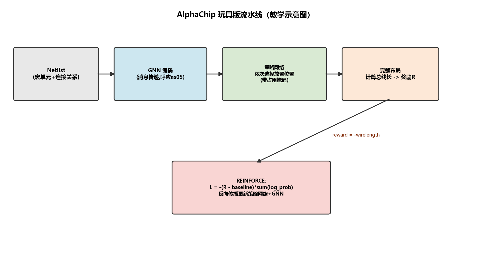
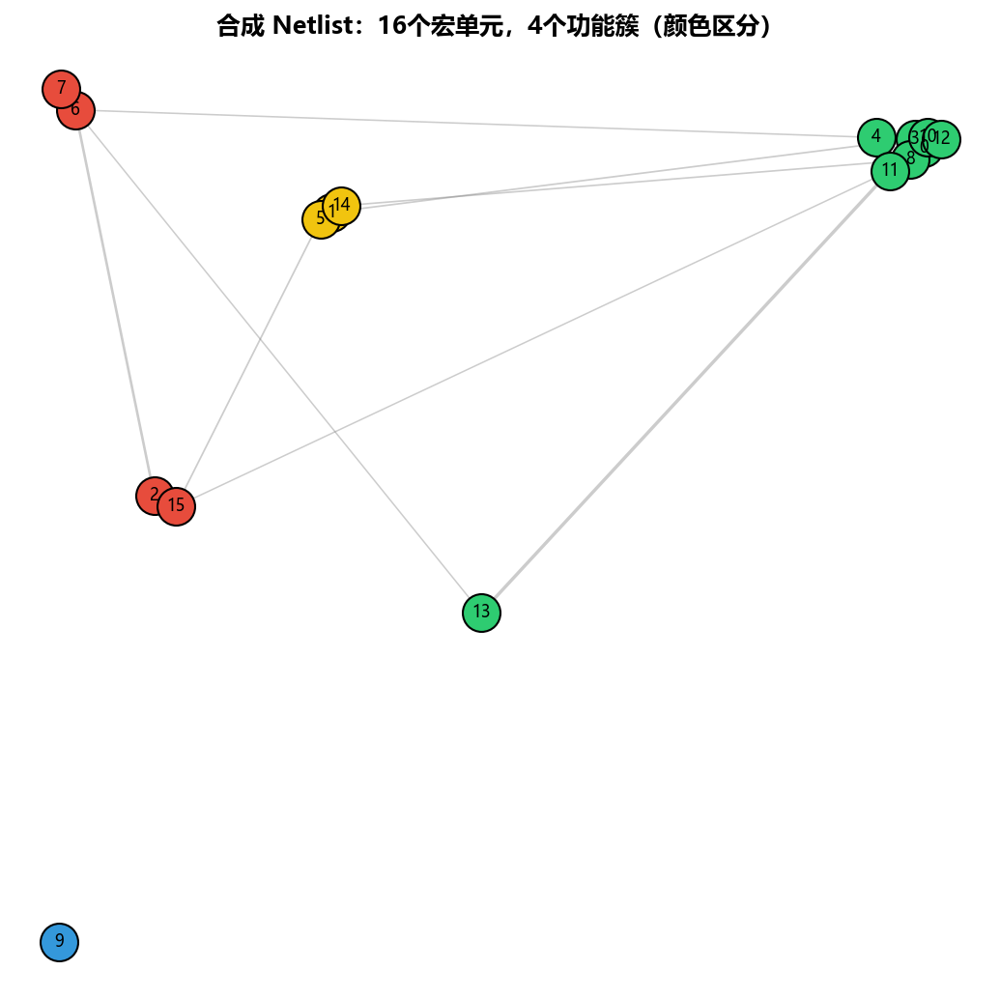
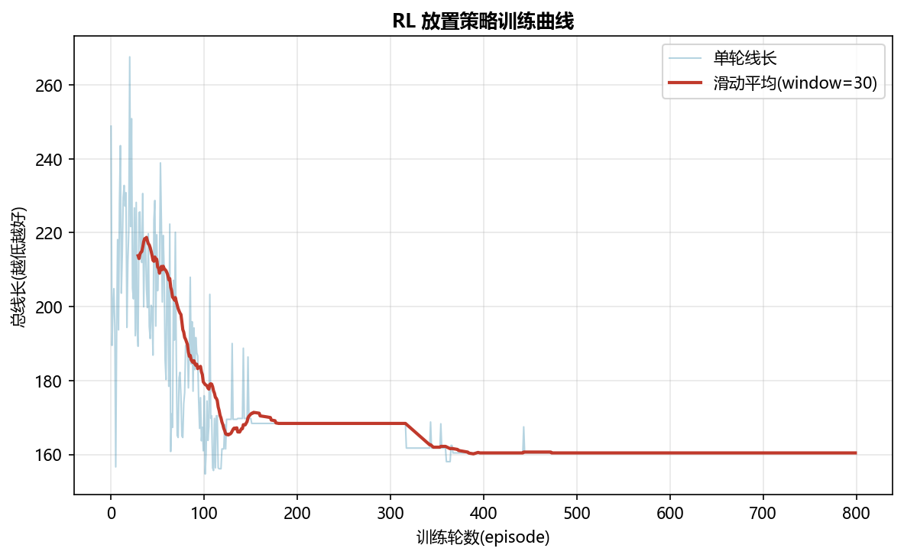
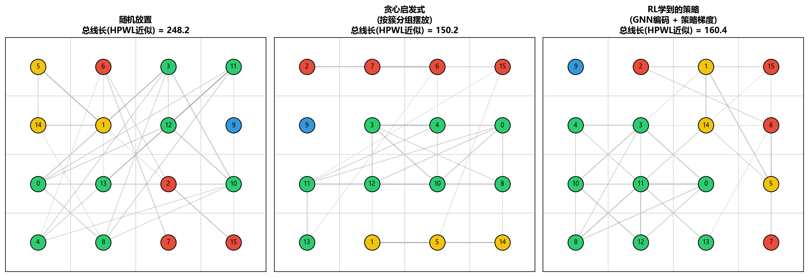

# as07 AlphaChip：用强化学习设计芯片

> [!WARNING]
> 🧪 Beta公测版本提示：教程主体已完成，正在优化细节，欢迎大家提Issue反馈问题或建议。

> 前几节我们处理的都是"预测"类问题（PDE 的解、蛋白质结构）。这一节转向一类不同的问题——**设计/决策类问题**：给定约束，主动构造出一个尽可能好的方案。

## 1. 芯片布局：一个经典的组合优化难题

现代芯片包含数十到数百个功能模块（**宏单元, macro**：CPU 核心、缓存、IO 控制器等），这些模块之间通过导线（**net**）连接传输信号。**芯片布局规划（floorplanning/placement）** 要解决的问题是：把每个宏单元摆放到芯片版图上的具体位置，使总体指标（连线长度、功耗、拥塞、时序收敛难度等，统称 PPA：Power-Performance-Area）尽可能优化。

这是一个典型的**组合优化问题**：$N$ 个模块摆放到 $M$ 个可能位置，可能的布局方案数量是阶乘级的 $M!/(M-N)!$，随模块数量指数增长。人类专家利用经验和 EDA（电子设计自动化）工具中的启发式算法，往往需要数周时间才能完成一次高质量的布局迭代。

## 2. AlphaChip 的核心想法：把布局问题变成序贯决策

**AlphaChip**（脱胎自 Mirhoseini et al. 2021《A graph placement methodology for fast chip design》，被谷歌用于其多代 TPU 芯片设计）把布局问题重新表述为一个**序贯决策过程（sequential decision-making）**，这样就可以套用强化学习框架：

$$
\underbrace{\text{netlist} \xrightarrow{\text{GNN 编码}} \{\text{宏单元表征}\}}_{\text{状态表示}} \xrightarrow{\ \pi_\theta\ } \underbrace{a_t = \text{下一个位置}}_{\text{动作}} \xrightarrow{\ } \underbrace{r_T = -\text{wirelength(完整布局)}}_{\text{奖励（仅在放完所有模块后给出）}}
$$

三个关键设计选择，分别对应强化学习的三大要素：

1. **状态表示**：用图神经网络（呼应 as05 的消息传递机制）编码 netlist 的连接结构——每个宏单元的表征不仅包含它自身的属性（尺寸、类型），还通过消息传递融合了"它与哪些模块相连、连接有多密集"这类结构信息
2. **动作空间**：每一步，智能体为**一个**宏单元选择一个网格位置（已被占用的位置会被显式屏蔽，保证不会出现重叠）
3. **奖励信号**：只有当全部宏单元都放置完毕后，才能计算出完整的总线长，进而得到奖励——这是一个典型的**稀疏/延迟奖励**问题，需要策略梯度类方法从"最终结果好不好"反推"每一步动作贡献了多少"

## 3. 为什么用 GNN 编码 netlist？

netlist 本质上就是一个图（宏单元 = 节点，连线 = 边），这正是 as05 讨论的图神经网络的天然应用场景。用 GNN（而不是把 netlist "拍平"成一个固定长度的向量）编码状态有两个关键优势：

- **不依赖模块编号顺序**：置换不变性（as05 第 5 节）意味着，即使把宏单元重新编号，GNN 编码出的表征在结构上是一致的
- **泛化到不同规模的 netlist**：一个训练好的 GNN+策略网络理论上可以处理宏单元数量、连接模式都不同的新芯片设计（真实 AlphaChip 论文的一个重要贡献就是展示了这种跨芯片的迁移能力），而如果用固定长度向量表示状态，模块数量一变，整个网络结构都要重新设计

## 4. 用 REINFORCE 训练放置策略

本章 demo 用最基础的策略梯度算法——**REINFORCE**（配合滑动平均基线降低方差）训练放置策略：

$$
\nabla_\theta J(\theta) \approx (R - b)\sum_{t=1}^{T}\nabla_\theta \log \pi_\theta(a_t \mid s_t), \qquad R = -\text{wirelength}(\text{最终布局})
$$

其中 $b$ 是奖励的滑动平均基线——用当前奖励与历史平均水平的差值（**优势, advantage**）而不是原始奖励来加权梯度，是降低策略梯度方差、加速收敛的标准技巧。直觉理解：如果这一轮的线长比"最近平均水平"更短（优势为正），就增大这一轮所有放置动作的概率；反之则减小。

> **图解说明**：Netlist 经 GNN 编码为状态 → 策略逐步放置宏单元（带占用掩码）→ 全部放完才给出线长奖励（延迟奖励）→ REINFORCE 用「实际奖励 − 滑动平均基线」回传，端到端更新策略与 GNN。这与 PINN「约束进损失」不同：这里约束体现在动作掩码与可模拟奖励里。

## 5. 实验结果：RL 策略 vs 随机 vs 贪心启发式

本章 demo 合成了一个带**簇状结构**的 netlist（16 个宏单元、4 个功能簇，模拟真实芯片中"同一功能模块内部连接密集，跨模块连接稀疏"的现象），对比三种放置方案：

> **图解说明**：不同颜色代表不同功能簇，簇内连线（灰线粗细代表权重）明显比簇间连线密集——这模拟了真实芯片设计中"CPU 核心内部信号密集，与外部 IO 模块的通信相对稀疏"这类常见结构。

> **图解说明**：训练初期（随机初始化的策略）线长波动很大且平均值较高；随着训练进行，滑动平均线长稳步下降——策略逐渐学会把连接密集的宏单元摆放得更靠近。

> **图解说明**：随机放置完全不考虑连接关系，线长最高；贪心启发式（按簇分组，同簇模块摆在相邻格子）利用了"簇内连接密集"这一先验知识，效果明显更好；RL 学到的策略通过与"计算线长"这个简单模拟器反复试错，学到了不需要人工指定"按簇分组"这条规则、但效果相当甚至更优的放置方案——**关键在于 RL 策略并未被直接告知"簇"的概念，它完全是从 GNN 编码的连接结构和线长反馈中自己发现了"应该把连接密集的模块放在一起"这条规律**。

## 6. 从玩具版到真实 AlphaChip 的差距

必须诚实地指出，本章 demo 是一个高度简化的教学版本，与真实 AlphaChip/EDA 系统存在数量级的差距：

| 维度 | 本章玩具版 | 真实 AlphaChip |
|------|-----------|----------------|
| 规模 | 16 个宏单元 | 数百到数千个宏单元、数百万个标准单元 |
| 目标函数 | 仅线长（HPWL 近似） | 线长 + 拥塞 + 密度 + 时序收敛难度的多目标加权 |
| 网格 | 简单离散网格，一格一模块 | 连续坐标空间，模块有真实的矩形尺寸，需要处理重叠约束 |
| 训练方式 | 单个 netlist 上的 REINFORCE | 在大量历史芯片设计上预训练，再对新 netlist 做少量微调，实现跨设计迁移 |
| 下游验证 | 无 | 需要完整走通布线（routing）、时序分析（STA）等后续 EDA 流程才能验证真实 PPA |

尽管如此，"用图神经网络编码结构化状态 + 强化学习做序贯决策"这个核心范式是相通的——这也是为什么这个案例值得作为 AI4S/AI for Engineering 的代表性例子放在本系列中。

## 7. 本章小结

1. **问题转化**：把组合优化问题（芯片布局）转化为序贯决策问题，从而可以用强化学习框架求解。
2. **状态表示**：用 GNN 编码 netlist 图结构，天然处理不规则连接模式、具备置换不变性。
3. **训练算法**：REINFORCE + 滑动平均基线，用最终线长的负值作为（延迟）奖励信号。
4. **核心价值**：用"从试错中学习的策略"替代"人工设计的启发式规则"，且理论上具备跨设计规模、跨连接模式泛化的潜力。

> 下一节 [as08 AI4S 综合与前沿](/science/frontier/) 将回顾整个"进阶一：AI for Science"系列，把 PINN、FNO/PINO、GNN、AlphaFold、AlphaChip 放在同一张地图上做最终总结，并展望这个领域的前沿方向。

## 📥 Code

| File | View | Download |
|------|------|----------|
| demo.py | [Open](./code-demo) | <a href="/notebook/code/science/alphachip/demo.py" target="_blank" download>Download</a> |
| exercise.py | [Open](./code-exercise) | <a href="/notebook/code/science/alphachip/exercise.py" target="_blank" download>Download</a> |

## 参考

1. Mirhoseini, A., Goldie, A., Yazgan, M., et al. (2021). A graph placement methodology for fast chip design. *Nature*. [[doi:10.1038/s41586-021-03544-w](https://doi.org/10.1038/s41586-021-03544-w)]
2. Goldie, A., & Mirhoseini, A. (2020). Placement Optimization with Deep Reinforcement Learning. *ISPD 2020*. [[arXiv:2003.08445](https://arxiv.org/abs/2003.08445)]
3. Williams, R. J. (1992). Simple statistical gradient-following algorithms for connectionist reinforcement learning. *Machine Learning*. (REINFORCE)
4. Cheng, R., et al. (2023). Assessment of reinforcement learning for macro placement. *ISPD 2023*.（对 AlphaChip 方法的独立复现与讨论）[[arXiv:2302.11014](https://arxiv.org/abs/2302.11014)]
