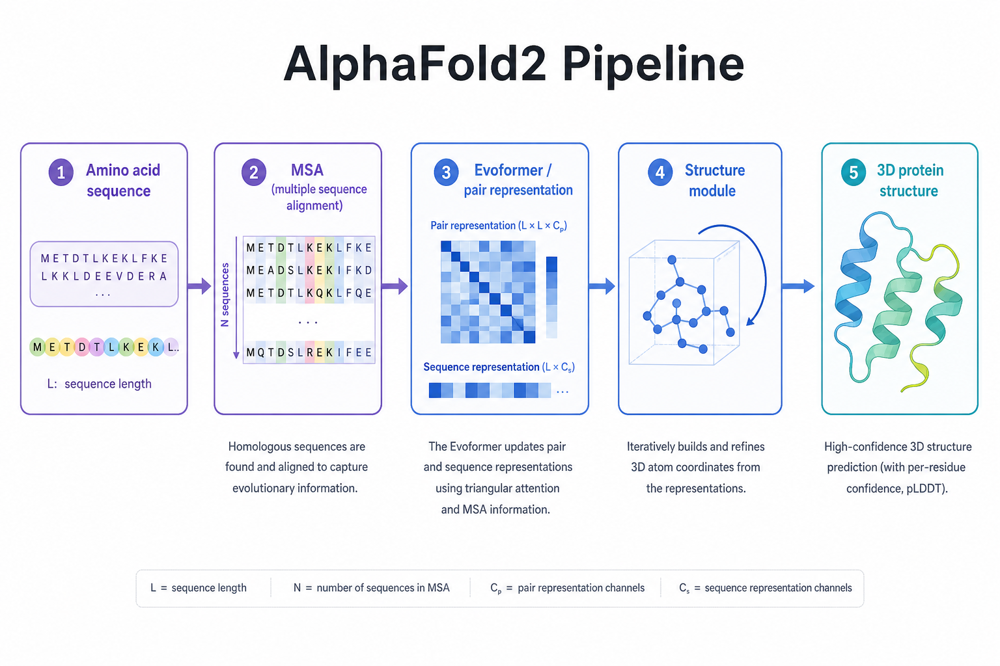

# as06 蛋白质结构预测与 AlphaFold

> [!WARNING]
> 🧪 Beta公测版本提示：教程主体已完成，正在优化细节，欢迎大家提Issue反馈问题或建议。

> 从"一维序列"到"三维结构"——生物学 50 年的悬案，AI 撬开的一道缝

---

## 一、蛋白质折叠问题：为什么这是个"大问题"

蛋白质是由氨基酸残基组成的一维序列（比如 `MKTAYIAKQRQISFVK...`），但它在细胞里真正起作用时，会自发折叠成一个特定的三维结构。这个三维结构决定了蛋白质的功能：酶的活性口袋、抗体的识别位点、通道蛋白的孔道形状，几乎所有生物学功能都建立在结构之上。

**蛋白质折叠问题**：给定氨基酸序列，能否预测它折叠后的三维结构？

这个问题难在哪里？1969 年，Cyrus Levinthal 提出了一个著名的思想实验——**Levinthal 悖论**：

> 一个中等长度的蛋白质（约 100 个残基），如果每个残基的构象有 3 种可能，穷举所有构象组合数量级是 $3^{100} \approx 10^{47}$。即使每秒尝试 $10^{13}$ 次（远超物理上可能的分子振动速度），穷举也需要比宇宙年龄还长的时间。

但现实中，蛋白质在几毫秒到几秒内就能折叠到正确的结构。这说明折叠**不是随机搜索**，而是沿着某种"能量地貌"上的漏斗状路径快速下降到全局最优（或局部最优）构象。问题是：我们并不知道这个能量地貌的精确解析形式，也难以用第一性原理（量子力学/分子力学）在合理时间内模拟出大蛋白的折叠过程。

> 折叠问题传统上被拆成两个子问题：(1) 折叠**动力学**——蛋白质如何、以多快的速度折叠；(2) 折叠**结构预测**——不管过程如何，最终结构是什么。AlphaFold 解决的是**第二个**问题，而且是在"已知大量同源结构"的统计学习意义上解决的，并不直接回答折叠动力学。

### 1.1 实验解析结构 vs 计算预测结构

在 AlphaFold 出现之前，获得蛋白质结构主要依赖实验方法：

| 方法 | 原理 | 局限 |
|------|------|------|
| X 射线晶体学 | 蛋白结晶后用 X 射线衍射反推电子密度 | 需要能结晶，膜蛋白等很难结晶 |
| 核磁共振 (NMR) | 测原子核在磁场中的共振信号 | 只适合小蛋白（通常 < 300 残基）|
| 冷冻电镜 (Cryo-EM) | 电子显微镜 + 低温冷冻切片重建 | 通量较低，仪器昂贵 |

截至 AlphaFold 出现前，PDB（蛋白质结构数据库）里约有 **17 万条**已解析结构，而已知的蛋白序列有**超过 2 亿条**——结构数据的稀缺程度可见一斑。这正是"能否用计算方法从序列预测结构"变得如此重要的原因：实验解析一个结构可能需要数月到数年，而计算预测理论上可以在几分钟到几小时内完成。

---

## 二、CASP：结构预测的"奥运会"

**CASP（Critical Assessment of protein Structure Prediction）** 是从 1994 年开始每两年举办一次的结构预测竞赛。规则很简单也很公平：组织者选取一批**即将被实验解析、但尚未公开**的蛋白序列，全世界的团队提交预测结构，等实验结构公开后用统一指标打分。这种"盲测"机制杜绝了过拟合已知答案的可能。

**核心评价指标：GDT-TS (Global Distance Test - Total Score)**

$$
\text{GDT-TS} = \frac{1}{4}\left(P_1 + P_2 + P_4 + P_8\right)
$$

其中 $P_d$ 表示预测结构中，有多少比例的残基（经过最优刚性叠合后）与真实结构的偏差小于 $d$ Å。GDT-TS 越接近 100，预测越准。

| CASP 届次 | 年份 | 里程碑 |
|-----------|------|--------|
| CASP1-12 | 1994-2016 | 传统方法（同源建模、Rosetta 等物理/统计混合方法）缓慢进步，中位 GDT 长期在 30-40 分徘徊在"较难靶点"上 |
| CASP13 | 2018 | DeepMind 首次参赛，AlphaFold（第一版）夺冠，开始显著超越传统方法 |
| **CASP14** | **2020** | **AlphaFold2** 横空出世，中位 GDT-TS **超过 90 分**，在多数靶点上达到实验精度水平，被称为"结构生物学的地震" |
| CASP15 | 2022 | AlphaFold2 衍生方法继续统治榜单，社区开始关注复合物结构（蛋白-蛋白/蛋白-配体） |

> "达到实验精度"是个了不起的说法，但也要谨慎理解：它指的是在 CASP 评测的**单链结构**上，多数靶点的预测误差已经小到接近实验方法本身的误差范围。这并不等于所有蛋白、所有场景下都完美——柔性区域、多结构态蛋白、复合物精细相互作用等仍然是难点（我们在第六节详细讨论局限性）。

---

## 三、从 AlphaFold 到 AlphaFold2：架构的飞跃

### 3.1 AlphaFold 1（2018，CASP13）

第一版 AlphaFold 的思路相对"传统"：用深度残差网络（类似图像分割中的 ResNet）从 MSA 特征预测残基对之间的**距离分布**（而不是单一距离值），再把这个距离分布转换成一个可微的**势能函数**，通过梯度下降优化一组 3D 坐标，让坐标满足预测的距离约束——这与本节演示代码中"简化结构模块"的思路是同源的（只是 AlphaFold1 用深度网络代替我们演示中的共进化统计量来预测距离约束）。

AlphaFold1 在 CASP13 上大幅领先第二名，但距离图 → 坐标的转换是"两阶段"的，且优化过程较慢，也没有充分利用多序列比对里的深层信息。

### 3.2 AlphaFold2（2020，CASP14）：端到端的范式转变

AlphaFold2 把整个流程改造成一个**端到端可训练**的神经网络，核心是两个新模块：**Evoformer** 和 **Structure Module**。整体流水线如下图：

> **图解说明**：MSA/模板 → Evoformer 交替更新序列与配对表征 → Structure Module 输出 3D 坐标。端到端可训，核心是把「共进化统计 + 几何约束」塞进一个可微流水线，而不是先预测距离再手工优化。

#### 3.2.1 输入：MSA 与模板检索

给定查询序列后，第一步是在海量已知序列数据库（如 UniRef、BFD、MGnify 等）中搜索**同源序列**，构建**多序列比对（MSA, Multiple Sequence Alignment）**——把与查询序列相似的序列对齐排列成一个矩阵，每一行是一条同源序列，每一列对应查询序列的一个残基位置。

**为什么 MSA 有用？共进化信号的直觉**：如果两个残基在三维结构上互相接触（比如形成盐桥或氢键），那么演化压力会让它们的突变"配对"发生——一个位点变了，另一个位点往往要跟着补偿性突变，否则结构被破坏、个体被自然选择淘汰。这种统计相关性叫**共进化（co-evolution）**，经典方法如 **DCA（Direct Coupling Analysis）** 早在深度学习兴起前就利用它来预测接触图。AlphaFold2 的 Evoformer 用注意力机制学习了一种更强大的方式来提取和利用这个信号。

同时系统还会检索结构数据库中的**同源模板**（如果存在已知结构的近似同源蛋白），作为额外的结构先验信息输入。

#### 3.2.2 Evoformer：MSA 表示与 Pair 表示的双轨对话

Evoformer 是 AlphaFold2 的核心创新，维护两种表示并让它们反复"对话"：

- **MSA 表示**：形状类似 (序列数, 残基数, 特征维度)，编码了整个多序列比对的信息。用**行注意力**（在同一条序列的不同位置间做注意力，捕捉序列内部关系）和**列注意力**（在同一位置的不同序列间做注意力，捕捉共进化统计）交替更新。
- **Pair 表示**：形状为 (残基数, 残基数, 特征维度)，编码每一对残基之间的关系（可以理解为"广义的接触图/距离图"的深度特征版）。用**三角形式的注意力**更新——用几何直觉来说，如果知道残基 $i,k$ 的关系和 $k,j$ 的关系，可以约束 $i,j$ 的关系（类似三角不等式），这让 Pair 表示能建模全局一致的几何结构，而不只是局部关系。

两条轨道之间通过 **Outer Product Mean**（从 MSA 表示算出残基对的外积统计量，注入到 Pair 表示）和**三角乘法更新**（把 Pair 表示的几何约束传播回 MSA 表示）持续交换信息。这个过程会重复 48 个 block，让表示逐渐精细化。

> 本节演示代码用 NumPy 实现了一个极简的"Outer Product Mean"版本——对合成 MSA 的每一列做 one-hot 编码，计算列与列之间外积的均值偏离独立假设的程度，作为共进化耦合强度的代理指标。这只是真实 Outer Product Mean（一个带学习参数的线性投影+外积+线性变换操作）的统计学直觉近似，但足以说明"为什么 MSA 里能读出结构信息"。

#### 3.2.3 Structure Module：从表示到坐标

Evoformer 输出精细化的 Pair 表示后，**Structure Module** 负责把这些抽象特征转换成具体的 3D 坐标。它的核心组件是 **Invariant Point Attention（IPA）**——一种在注意力机制中显式考虑三维几何不变性（旋转、平移等价）的设计：每个残基维护一个局部坐标系（用其骨架原子定义），IPA 在做注意力聚合时会把邻居残基的信息变换到当前残基的局部坐标系下再聚合，这样整个网络对"整体蛋白摆放在空间中的哪个位置、朝哪个方向"是不敏感的（这正是结构预测任务本应具备的对称性）。

Structure Module 直接输出每个残基的骨架原子坐标（以及侧链的扭转角），而不是像 AlphaFold1 那样先预测距离图再做后处理优化——这是"两阶段"到"端到端"的关键转变。

#### 3.2.4 Recycling：迭代精细化

AlphaFold2 还引入了**循环（Recycling）**机制：把 Structure Module 输出的粗略结构反馈回 Evoformer 的输入，再跑一轮（通常 3-4 轮），让模型有机会根据"初步猜测的结构"修正 Pair 表示中的错误——这类似人类专家"先画草图，再反复修正细节"的过程。

#### 3.2.5 置信度输出：pLDDT 与 PAE

AlphaFold2 的一个重要特点是它会**同时输出对自己预测的置信度评估**，而不是只给出坐标：

- **pLDDT（predicted Local Distance Difference Test）**：每个残基一个 0-100 的分数，衡量该残基局部结构的预测置信度。通常 pLDDT > 90 代表高置信度，pLDDT < 50 往往对应天然无序区域（这些区域本身可能就没有固定结构，模型给低分反而是"诚实"的表现）。
- **PAE（Predicted Aligned Error）**：残基对之间的相对位置误差估计，尤其对多结构域蛋白很重要——同一个结构域内部 pLDDT 可能都很高，但两个结构域之间的相对朝向仍然可能不确定。

> 置信度分数是 AlphaFold2 被广泛信任的关键原因之一：它让使用者知道"哪些部分可信，哪些部分不能太当真"，而不是给出一个看似精确但可能完全错误的结构。这也提醒我们：**读 AlphaFold 的结果时一定要同时看置信度图，不要只看那张漂亮的结构图**。

---

## 四、AlphaFold3（2024）：扩展到复合物与生物分子相互作用

2024 年发表于 *Nature* 的 **AlphaFold3** 在 AlphaFold2 的基础上做了几个重要扩展：

1. **统一架构处理更多分子类型**：不再局限于蛋白质单链，可以联合建模蛋白质、DNA/RNA、小分子配体、离子等多种生物分子的**复合物结构**，这对药物设计（预测药物小分子与蛋白靶点的结合模式）意义重大。
2. **用扩散模型替代 Structure Module**：AlphaFold3 用一个类似 Stable Diffusion 的**扩散生成模块**替代了 IPA-based 的 Structure Module，直接在原子坐标空间中做去噪生成，架构更简洁统一，也更容易扩展到不同类型的分子。
3. **简化 Evoformer**：论文中把 Evoformer 简化为"Pairformer"，减少了对 MSA 行注意力的依赖，某种程度上降低了对多序列比对质量的敏感性。

AlphaFold3 在蛋白-配体复合物预测上相较之前的专用工具（如分子对接软件）有显著提升，但对全新化学骨架配体、罕见相互作用类型仍有明显局限，且模型权重与推理代码最初并未完全开源，一度引发学术界关于"可复现性"的讨论。

---

## 五、这不是在说"生物学被解决了"

AlphaFold 是深度学习在自然科学中最成功的应用案例之一，但必须清楚地说明它**没有解决什么**：

| 常见误解 | 实际情况 |
|----------|----------|
| "蛋白质折叠问题已经被完全解决" | AlphaFold 解决的是"给定序列预测**一个**代表性静态结构"，折叠**动力学**（怎样折叠、折叠路径、折叠速率）仍是开放问题 |
| "AlphaFold 预测的结构总是对的" | 预测质量高度依赖 MSA 深度（同源序列越多越准）；孤儿蛋白（无同源序列）、天然无序蛋白区域、多结构态蛋白的预测可信度显著下降——务必配合 pLDDT/PAE 判读 |
| "有了 AlphaFold 就不需要做实验了" | AlphaFold 极大加速了**假设生成**（比如"这个结构域大概长这样，可以设计这样的实验来验证"），但功能验证、动态过程观测、药物结合动力学等仍然依赖实验 |
| "AlphaFold 能预测蛋白质复合物的所有相互作用细节" | 复合物预测（尤其是弱相互作用、诱导契合、多个可能结合模式）依然是当前的活跃研究前沿，AlphaFold3 有改进但远未完美 |
| "结构预测 = 功能预测" | 知道结构不等于知道功能机制，很多蛋白结构相似但功能迥异，反之亦然 |

> 一个更准确的说法是：AlphaFold 把"结构生物学中最耗时的一步（从序列到粗略结构）"的成本从"数月实验"降到了"几分钟计算"，极大地改变了结构生物学的工作流程和研究范式，但这只是通向"理解生命"这个大问题中的一步，而不是终点。

---

## 六、本节小结

| 概念 | 一句话 |
|------|--------|
| 蛋白质折叠问题 | 给定序列预测折叠后的三维结构；Levinthal 悖论说明这不可能是随机搜索 |
| CASP | 两年一届的盲测竞赛，用 GDT-TS 等指标评估结构预测方法 |
| MSA / 共进化 | 同源序列比对中，结构接触的残基对往往发生配对突变，是重要的结构信息来源 |
| Evoformer | AlphaFold2 核心模块：MSA 表示与 Pair 表示通过注意力+外积均值反复交流 |
| Structure Module / IPA | 用旋转平移不变的注意力机制，把抽象特征端到端转换为 3D 坐标 |
| Recycling | 把粗略结构反馈回输入，迭代精细化预测 |
| pLDDT / PAE | AlphaFold2 自带的置信度估计，是判读结果可信度的关键 |
| AlphaFold3 | 用扩散模型扩展到蛋白-核酸-配体复合物结构预测 |
| 核心边界 | 解决静态结构预测，不等于解决折叠动力学、功能预测或复合物全部细节 |

> 下一节 [as07 AlphaChip 与电路设计中的神经网络](/science/alphachip/) 将展示 DeepMind 如何用强化学习解决另一个完全不同领域的"结构布局"问题——芯片布局布线，你会发现"用学习到的策略替代人类专家的启发式规则"这条思路是相通的。

## 📥 Code

| File | View | Download |
|------|------|----------|
| demo.py | [Open](./code-demo) | <a href="/notebook/code/science/alphafold/demo.py" target="_blank" download>Download</a> |
| exercise.py | [Open](./code-exercise) | <a href="/notebook/code/science/alphafold/exercise.py" target="_blank" download>Download</a> |

## 参考

1. Jumper, J., et al. (2021). Highly accurate protein structure prediction with AlphaFold. *Nature*. [[doi:10.1038/s41586-021-03819-2](https://doi.org/10.1038/s41586-021-03819-2)]
2. Senior, A. W., et al. (2020). Improved protein structure prediction using potentials from deep learning. *Nature*. (AlphaFold1) [[doi:10.1038/s41586-019-1923-7](https://doi.org/10.1038/s41586-019-1923-7)]
3. Abramson, J., et al. (2024). Accurate structure prediction of biomolecular interactions with AlphaFold3. *Nature*. [[doi:10.1038/s41586-024-07487-w](https://doi.org/10.1038/s41586-024-07487-w)]
4. Morcos, F., et al. (2011). Direct-coupling analysis of residue coevolution captures native contacts across many protein families. *PNAS*. (DCA) [[doi:10.1073/pnas.1111471108](https://doi.org/10.1073/pnas.1111471108)]
5. Kryshtafovych, A., et al. (2021). Critical assessment of methods of protein structure prediction (CASP)—Round XIV. *Proteins*. [[doi:10.1002/prot.26237](https://doi.org/10.1002/prot.26237)]
