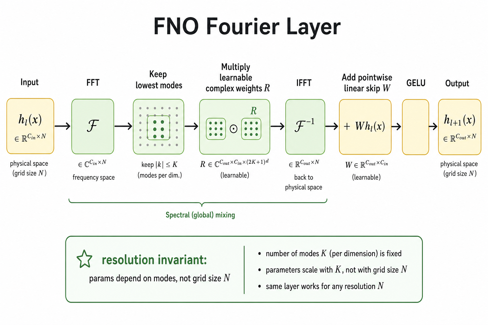
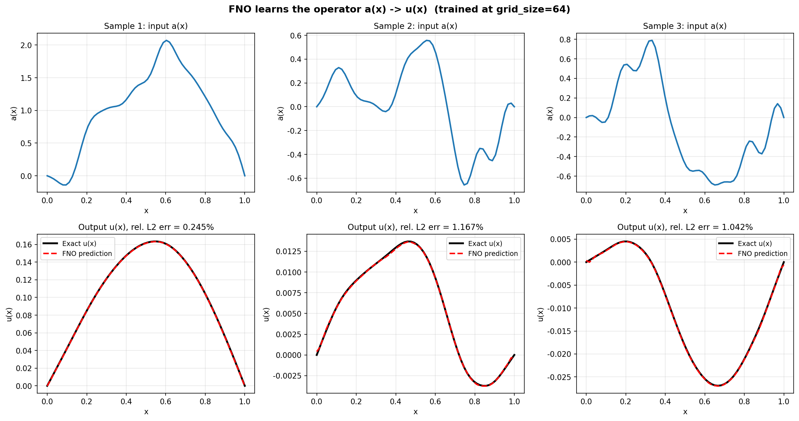
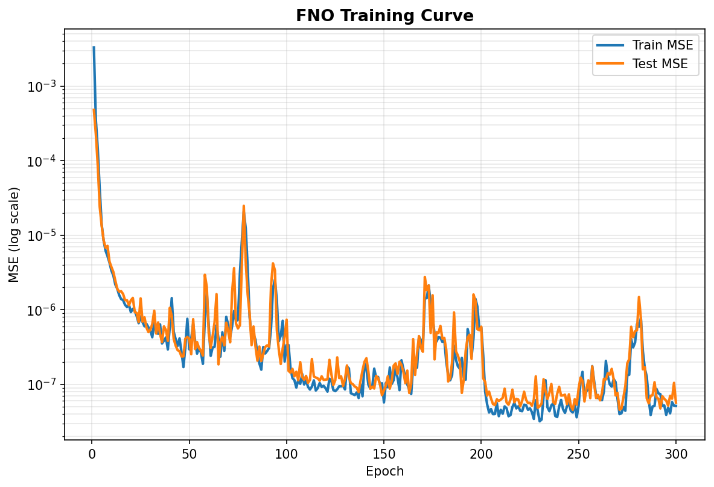
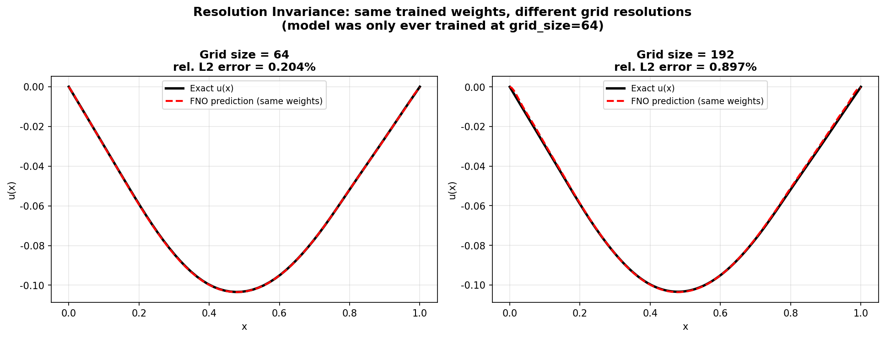

# Neural Operator 与 FNO：学习函数到函数的映射

> [!WARNING]
> 🧪 Beta公测版本提示：教程主体已完成，正在优化细节，欢迎大家提Issue反馈问题或建议。

## 1. 从"学一个解"到"学一类映射"

as02 的 PINN 用神经网络逼近**某一个具体 PDE 问题**的解：固定源项 $f$、固定边界条件，训练一次得到一个 $u_\theta(x)$。换一个新的源项，就要重新训练——这在工程优化、不确定性量化、天气预报等需要"成千上万次求解"的场景下代价很高。

本章介绍的 **Neural Operator（神经算子）**，特别是其中最知名的 **Fourier Neural Operator (FNO)**，换了一个更宏大的目标：

$$
\text{学习算子}\quad \mathcal{G}: a(x) \longmapsto u(x)
$$

这里 $a(x)$ 和 $u(x)$ **都是函数**（无限维函数空间中的元素），$\mathcal{G}$ 是把"输入函数"映射到"输出函数"的算子。训练完成后，给定任意新的源项 $a_{\text{new}}(x)$，只需一次前向传播就能得到对应的解 $u_{\text{new}}(x)$——**不需要重新训练**。

这正是 as01 全景图中"FNO / PINO"相对于"PINN"的核心差异：PINN 学单个解，FNO 学一整族问题的求解规则。

## 2. 函数空间中的算子学习

### 2.1 什么是算子？

在数学上，**算子（operator）** 是"函数到函数"的映射。例如，微分算子 $\dfrac{d}{dx}$ 把函数 $u(x)$ 映射到它的导数 $u'(x)$；本章关注的 Poisson 求解算子：

$$
\mathcal{G}_{\text{Poisson}}: a(x) \longmapsto u(x) \quad\text{其中}\quad -u''(x)=a(x),\ u(0)=u(1)=0
$$

把任意合法的源项函数 $a$ 映射到对应的解函数 $u$。

### 2.2 数据是"函数对"，不是"数字对"

普通监督学习的数据是 $(x_i, y_i)$ 数字对；算子学习的数据是 $(a^{(i)}, u^{(i)})$ **函数对**——每个样本本身就是一整条曲线（或一张场）。实践中我们把函数离散到网格上：

$$
a^{(i)} = \big(a(x_1), a(x_2), \ldots, a(x_N)\big) \in \mathbb{R}^N
$$

但关键在于：我们希望学到的映射 $\mathcal{G}_\theta$ **不依赖特定的网格分辨率 $N$**——这就是下一节的"分辨率不变性"。

### 2.3 本章的玩具问题

仍然用一维 Poisson 方程，但这次我们要学习**一族**源项对应的求解规则：

$$
-u''(x) = a(x),\quad x\in(0,1),\quad u(0)=u(1)=0
$$

数据集用正弦基函数**解析构造**（不需要数值 PDE 求解器）：若

$$
a(x) = \sum_{k=1}^{K} c_k \sin(k\pi x)
$$

则解析解为

$$
u(x) = \sum_{k=1}^{K} \frac{c_k}{(k\pi)^2}\sin(k\pi x)
$$

因为 $\sin(k\pi x)$ 恰好是 $-\dfrac{d^2}{dx^2}$（配合 Dirichlet 边界）的特征函数，特征值是 $(k\pi)^2$。有趣的是：**FNO 在频域做的"逐模式权重相乘"，本质上和"除以 $(k\pi)^2$"是同一类操作**——这也是为什么 FNO 特别适合学习线性（及弱非线性）微分算子。

## 3. FNO 的核心：Fourier Layer

### 3.1 整体架构

FNO 的完整结构可以概括为三步：

1. **Lift（提升）**：把输入通道（通常是 $[a(x_i), x_i]$，坐标也拼进去以提供位置信息）用一个线性层映射到更高维的特征空间，宽度为 `width`
2. **堆叠若干 Fourier Layer**：每一层在频域做全局卷积，再加一个逐点线性旁路，最后过非线性激活
3. **Project（投影）**：把高维特征映射回标量输出 $u(x)$

> **图解说明**：上半部分展示单个 Fourier Layer 的内部数据流——输入 $h_l(x)$ 经 FFT 进入频域，截断保留最低的 `modes` 个频率分量，与可学习的复数权重 $R$ 逐模式相乘，再经 IFFT 回到空域；同时有一条 1×1 卷积旁路 $W$ 保留局部逐点信息；两者相加后过 GELU 激活得到 $h_{l+1}(x)$。下半部分展示完整 FNO：Lift → 多层 Fourier Layer → Project。

### 3.2 谱卷积：在频域做全局卷积

Fourier Layer 的核心是**谱卷积（Spectral Convolution）**。根据卷积定理：

$$
\mathcal{F}(k * v) = \mathcal{F}(k) \cdot \mathcal{F}(v)
$$

时域的卷积等价于频域的逐点相乘。FNO 直接在频域参数化这个卷积核：

1. 对输入做实数快速傅立叶变换（`rfft`）
2. **只保留最低的 `modes` 个频率分量**（截断高频——这既是一种低通滤波，也是一种隐式正则化：真实物理场的能量往往集中在低频）
3. 用一组**可学习的复数权重** $R$ 对每个保留的频率做线性变换
4. 做逆变换（`irfft`）回到空间域

形式上，第 $l$ 层 Fourier Layer 的更新为：

$$
h_{l+1}(x) = \sigma\Big(\underbrace{\mathcal{F}^{-1}\big(R \cdot \mathcal{F}(h_l)\big)(x)}_{\text{谱卷积（全局）}} + \underbrace{W h_l(x)}_{\text{逐点线性旁路（局部）}}\Big)
$$

其中 $\sigma$ 是激活函数（通常用 GELU），$W$ 是 1×1 卷积（即共享权重的逐点线性变换）。

**为什么需要旁路 $W$**：谱卷积擅长建模全局的频域交互，但丢掉了高频细节；1×1 卷积旁路保留了局部的逐点信息通道，两者结合让 FNO 兼具全局感受野和局部灵活性。

### 3.3 分辨率不变性：参数量与网格大小无关

这是 FNO 最迷人的性质。谱卷积的可学习参数是复数权重 $R$，其形状为 `(in_channels, out_channels, modes)`——**只与通道数和保留的模式数有关，与输入网格点数 $N$ 完全无关**！

因此：

- 训练时用 $N=64$ 的网格
- 推理时可以直接喂 $N=192$（甚至 $N=512$）的网格
- **同一套权重，无需重新训练，无需插值**

传统的 CNN 卷积核大小固定在像素空间，换分辨率往往需要重新训练或仔细调整；FNO 的参数定义在频率空间，天然对分辨率无关。本章 demo 会专门演示这一点。

## 4. 与 PINN 的对比

| 维度 | PINN (as02) | FNO (as03) |
|------|-------------|------------|
| 学习目标 | 单个解 $u_\theta(x)$ | 算子 $\mathcal{G}_\theta: a\mapsto u$ |
| 训练数据 | **不需要**标注解，只用 PDE 残差 + BC | 需要大量 $(a^{(i)}, u^{(i)})$ 函数对 |
| 换源项/参数 | 原则上要重新训练 | 一次前向传播即可 |
| 分辨率 | 配点可任意采样（无网格） | 训练分辨率可与推理分辨率不同 |
| 物理约束 | 显式写入损失（$\mathcal{L}_{\text{PDE}}$） | 纯数据驱动（PINO 会再加物理损失） |
| 适用场景 | 单个高精度正/反问题 | 需要反复求解同族方程的场景 |

两者并非对立：下一章 as04 的 **PINO（Physics-Informed Neural Operator）** 正是把 PINN 的物理残差损失嫁接到神经算子上，兼顾物理一致性与算子泛化能力。

## 5. Demo 结果解读

本章 demo 训练一个小型一维 FNO（约 3–4 层 Fourier Layer），在解析构造的 Poisson 算子数据集上学习 $a\mapsto u$：

> **图解说明**：上排是三个测试样本的输入源项 $a(x)$（训练时从未见过这些具体的 $a$），下排是对应的真解 $u(x)$（黑实线）与 FNO 预测（红虚线）。可以看到，换了不同形状的源项，同一个训练好的 FNO 都能给出接近真解的预测——这就是"算子泛化"。

> **图解说明**：训练/测试 MSE 随 epoch 下降（对数坐标）。测试损失与训练损失同步下降，说明模型没有过拟合到训练集的特定函数，而是学到了更一般的映射规则。

> **图解说明**：同一个只在 `grid_size=64` 上训练过的模型，直接在 `grid_size=192` 的网格上做预测，误差仍然保持在较低水平。这验证了谱卷积"参数与网格大小无关"带来的分辨率不变性——传统网格法或普通 CNN 很难做到这一点。

## 6. 局限与后续

FNO 并非万能：

- **需要数据**：与 PINN 不同，FNO 需要预先准备大量仿真/实验得到的 $(a, u)$ 对，数据生成本身可能很贵
- **几何与边界**：标准 FNO 假设规则网格（或可做 FFT 的域）；不规则几何、复杂边界通常需要配合 GNN、坐标变换或几何神经算子等扩展
- **强非线性 / 激波**：高频能量不可忽略时，低频截断可能不够，需要更大的 `modes` 或混合架构

下一章 as04 会介绍 **PINO**：在神经算子的训练目标中加入 PDE 残差损失，用更少的数据学到更物理一致的算子。as05 则转向 GNN——处理分子、蛋白质、气象网格等不规则图结构数据。

## 7. 本章小结

1. **算子学习**：目标是学习 $\mathcal{G}: a\mapsto u$（函数→函数），而不是单个解 $u(x)$。
2. **Fourier Layer**：FFT → 截断低频模式 → 可学习复数权重相乘 → IFFT，再加逐点线性旁路与激活。
3. **分辨率不变性**：参数量只依赖 `modes` 与通道数，与网格点数 $N$ 无关，训练分辨率可与推理分辨率不同。
4. **与 PINN 互补**：PINN 无标注数据但换参数要重训；FNO 需要数据但对新输入零样本泛化。
5. **承接后续**：PINO 把物理损失加回算子学习；GNN 处理不规则科学数据结构。

---

## 📥 Code

| File | View | Download |
|------|------|----------|
| demo.py | [Open](./code-demo) | <a href="/notebook/code/science/fno/demo.py" target="_blank" download>Download</a> |
| exercise.py | [Open](./code-exercise) | <a href="/notebook/code/science/fno/exercise.py" target="_blank" download>Download</a> |

## 参考

1. Li, Z., Kovachki, N., Azizzadenesheli, K., Liu, B., Bhattacharya, K., Stuart, A., & Anandkumar, A. (2021). Fourier Neural Operator for Parametric Partial Differential Equations. *ICLR 2021*. [[arXiv:2010.08895](https://arxiv.org/abs/2010.08895)]
2. Kovachki, N., Li, Z., Liu, B., Azizzadenesheli, K., Bhattacharya, K., Stuart, A., & Anandkumar, A. (2023). Neural Operator: Learning Maps Between Function Spaces With Applications to PDEs. *JMLR*. [[arXiv:2108.08481](https://arxiv.org/abs/2108.08481)]
3. Li, Z., Zheng, H., Kovachki, N., et al. (2024). Physics-Informed Neural Operator for Learning Partial Differential Equations. *ACM / JMLR*. (PINO) [[arXiv:2111.03794](https://arxiv.org/abs/2111.03794)]
4. Lu, L., Jin, P., Pang, G., Zhang, Z., & Karniadakis, G. E. (2021). Learning nonlinear operators via DeepONet based on the universal approximation theorem of operators. *Nature Machine Intelligence*. [[arXiv:1910.03193](https://arxiv.org/abs/1910.03193)]
