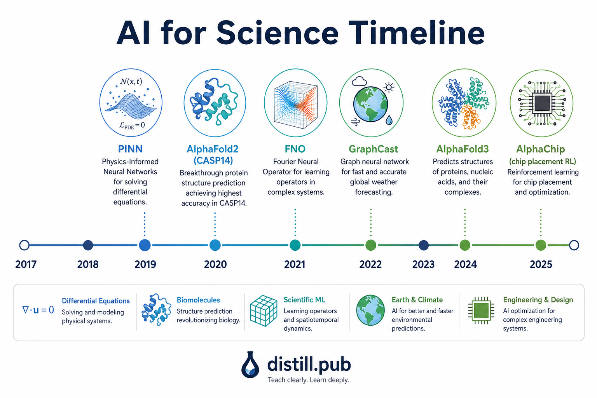
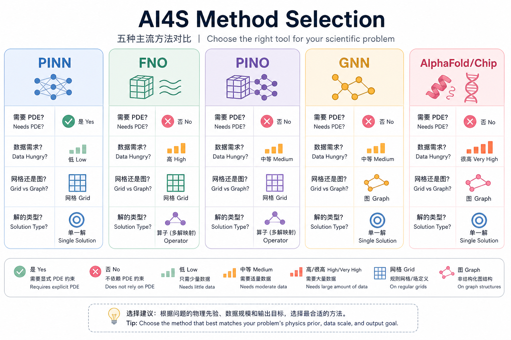
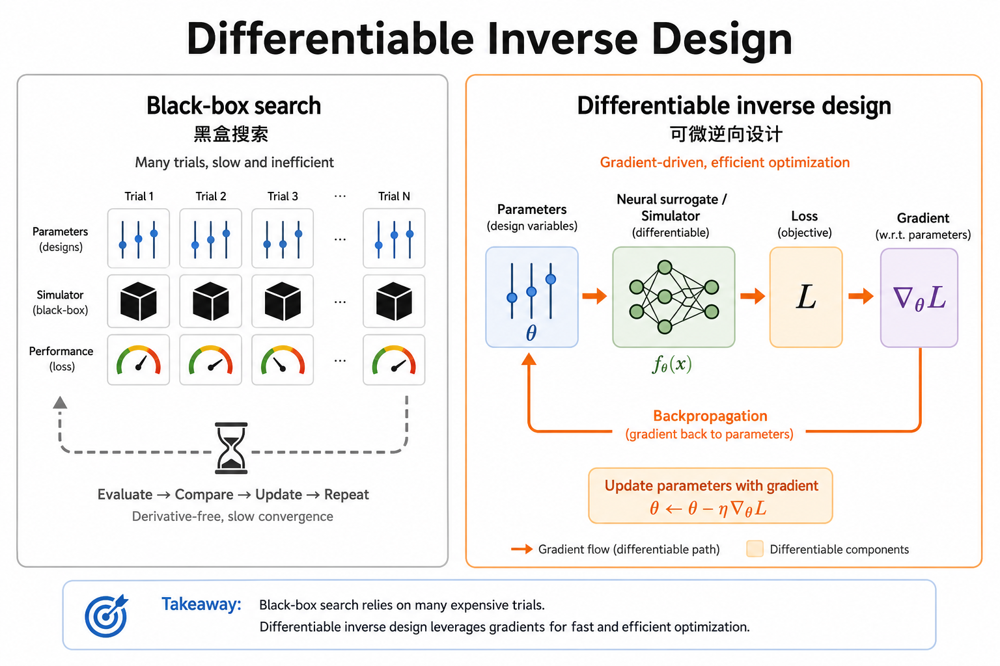

# as08 AI4S 综合与前沿

> [!WARNING]
> 🧪 Beta公测版本提示：教程主体已完成，正在优化细节，欢迎大家提Issue反馈问题或建议。

> 这是"进阶一：AI for Science"系列的最后一章。我们回顾整条主线，并把目光投向这个领域正在发生的前沿变化。

## 1. 回顾：一条主线串起七种方法

从 as01 到 as07，我们始终在追问同一个问题的不同侧面：**如何把一个科学/工程问题重新表述为"学习一个映射"，并决定这个映射应该在多大程度上依赖已知的物理规律 vs 依赖数据本身？**

> **图解说明**：时间线上的节点大致遵循一条脉络——2018-2019 年，PINN 和 AlphaFold1 分别探索"用神经网络逼近单个解"和"用深度网络预测距离约束+几何优化"；2020-2021 年，AlphaFold2、AlphaChip 前身、FNO 相继出现，标志着"端到端可训练的大规模架构"和"算子学习"两条路线成熟；2021 年之后，PINO 把两条路线（物理约束 + 算子学习）结合；2022 年 GraphCast 展示了 GNN 算子学习在超大规模科学模拟中的威力；2024 年 AlphaFold3 用扩散模型进一步统一了架构，同时"AI4S 基础模型"的探索开始加速。

## 2. 五类方法的统一视角

| 方法 | 学习目标 | 输入 → 输出 | 需要已知方程？ | 需要标注数据？ |
|------|---------|------------|:---:|:---:|
| PINN (as02) | 单个 PDE 解 $u_\theta(x)$ | 坐标 → 解的值 | 是 | 否 |
| FNO/PINO (as03-04) | 算子 $\mathcal{G}: a \to u$ | 输入函数 → 输出函数 | PINO需要，FNO不需要 | FNO需要大量，PINO需要少量 |
| GNN (as05) | 图上的局部/全局函数 | 图 → 节点/图级别输出 | 通常不需要 | 需要（监督学习图属性） |
| AlphaFold式 (as06) | 序列→结构的几何算子 | 序列(+MSA) → 3D坐标 | 隐式利用统计物理先验 | 需要海量已知结构 |
| AlphaChip式 (as07) | 序贯决策策略 $\pi_\theta$ | 图状态 → 放置动作 | 不需要(奖励函数即模拟器) | 不需要标注，需要可模拟的环境 |

**一条统一的技术脉络**：五类方法的核心差异在于"用什么方式获得训练信号"——PINN 用 PDE 残差（不需要标签，但每次换问题都要重训）；FNO 用大量标注数据（不需要知道方程，但依赖数据获取成本）；PINO 把两者结合；GNN 提供了处理不规则拓扑数据的通用计算原语；AlphaFold/AlphaChip 则展示了"把领域先验（几何等变性/图结构状态）与端到端学习结合"这一更大范式在真实复杂系统中的落地方式。

> **图解说明**：这张图把本系列涉及的五类方法放在同一套主观定性维度上对比（1-5分，非严格评测）。没有一种方法全面占优——PINN 在物理一致性上最强但数据需求也最大（每问题都要"喂"方程本身）；FNO/PINO 推理速度快、能泛化到新参数；GNN 处理不规则结构，但通用性依赖具体图设计；AlphaFold/AlphaChip式方法代表了"端到端复杂系统"的可解释性和数据效率往往需要与推理速度做权衡。

## 3. 前沿方向一：可微科学计算（differentiable scientific computing）

本章 demo 实操展示了当前 AI4S 最重要的前沿理念之一：**一旦你有了一个可微的代理模型（无论是 FNO、PINO，还是任何神经网络代理），设计优化问题就从"黑盒搜索"变成了"梯度下降"**。

$$
\text{传统做法：} \quad a^* = \arg\min_a \|\text{simulator}(a) - u_{\text{target}}\|^2 \quad (\text{黑盒，只能采样评估，不能求导})
$$

$$
\text{可微代理做法：} \quad a^* = \arg\min_a \|\mathcal{G}_\theta(a) - u_{\text{target}}\|^2 \quad (\text{可以直接对 } a \text{ 求梯度，用 Adam/SGD 优化})
$$

> **图解说明**：左侧黑盒搜索只能反复「试参数 → 跑模拟」；右侧可微代理把模拟器换成神经网络后，损失可对设计参数反传，用梯度下降直接优化。维度越高，相对黑盒网格搜索的优势越明显（呼应 as01 的维度灾难）。

**注意边界**：梯度方法的可靠性上限取决于代理模型本身的准确性和泛化范围——如果目标落在代理模型训练分布之外（外推），梯度下降可能会收敛到一个"代理模型认为很好、但真实物理模拟器验证后其实很差"的参数（这被称为**代理模型的对抗性/分布外脆弱性**）。真实的可微设计流程通常需要配合主动学习/在线数据补充来缓解这个问题。

## 4. 前沿方向二：科学基础模型（scientific foundation models）

类比 LLM 领域"预训练大模型 + 微调/提示"的范式，AI4S 领域也在探索**科学基础模型**：在大规模、多样化的科学数据（分子、材料、气象、基因组序列等）上预训练一个通用表征模型，再迁移到具体的下游任务（性质预测、结构生成、逆向设计）。这类工作试图解决单个任务数据稀缺的问题——通过在海量相关数据上预训练，学到一个"通用的科学表征空间"，再用少量任务特定数据微调。

## 5. 前沿方向三：LLM + 工具做科研助理

大语言模型（s18、s23 已涉及）与 AI4S 工具结合，正在催生"AI 科研助理"这一新方向：LLM 负责理解科学文献、提出假设、编排实验/仿真流程，具体的计算/预测任务调用本系列介绍的专用模型（PINN/FNO/GNN/AlphaFold 等）作为"工具"。这类系统的核心挑战包括：如何让 LLM 可靠地判断"什么时候该调用哪个工具"、如何处理科学结论的不确定性和可验证性、以及如何设计"假设生成 → 实验设计 → 结果分析 → 假设修正"的闭环。

## 6. 前沿方向四：不确定性量化与主动实验设计

真实科学发现流程往往是"计算预测 → 实验验证 → 修正模型"的闭环，而不是一次性的预测。这要求 AI4S 模型不仅要给出预测，还要给出**可靠的不确定性估计**（如 AlphaFold 的 pLDDT/PAE），并据此设计**下一步最有信息量的实验**（主动学习, active learning）——用最少的实验/仿真成本获得最大的模型改进。这是把"被动预测模型"升级为"主动科学发现闭环"的关键一环，也是当前学界和工业界（如自动化实验室、"自驾驶实验室"self-driving labs）投入重兵的方向。

## 7. 系列总回顾

| 章节 | 核心方法 | 一句话总结 |
|------|---------|-----------|
| as01 | 全景导览 | PDE 残差是理解整条主线的地基概念 |
| as02 | PINN | 用自动微分把 PDE 残差变成损失函数，无标注训练 |
| as03 | FNO | 学习函数到函数的算子，分辨率无关，零样本泛化 |
| as04 | PINO | 物理残差 + 少量数据，弥补纯数据驱动算子的标注需求 |
| as05 | GNN | 消息传递处理不规则拓扑数据，层数=感受野跳数 |
| as06 | AlphaFold | 几何深度学习 + Evoformer，端到端预测蛋白质结构 |
| as07 | AlphaChip | GNN状态表示 + 强化学习，把布局问题变成序贯决策 |
| as08 | 综合与前沿 | 可微设计、科学基础模型、LLM科研助理、主动实验设计 |

## 8. 写在最后

AI for Science 不是要"替代"传统科学计算和实验科学，而是在提供一套新的工具箱：当传统方法遭遇维度灾难、重复求解开销、数据稀缺等瓶颈时，神经网络方法往往能提供一条效率更高的路径——但代价是需要更谨慎地验证物理一致性、外推可靠性和不确定性。**把"已知的物理/结构先验"与"数据驱动的高效推理能力"恰当结合，正是本系列反复出现的核心方法论**，也会是这个领域在可预见的未来持续演进的主线。

> 感谢阅读完整个"进阶一：AI for Science"系列！如果这个系列对你有帮助，欢迎在 GitHub 上给项目提 Issue 或 Star。下一段旅程，欢迎继续阅读"进阶二：世界模型"（wm01-wm08），探索另一个同样激动人心的方向——让智能体学会"在脑海中模拟世界"。

## 📥 Code

| File | View | Download |
|------|------|----------|
| demo.py | [Open](./code-demo) | <a href="/notebook/code/science/frontier/demo.py" target="_blank" download>Download</a> |
| exercise.py | [Open](./code-exercise) | <a href="/notebook/code/science/frontier/exercise.py" target="_blank" download>Download</a> |

## 参考

1. Thuerey, N., Holzschuh, B., et al. (2021). Physics-based Deep Learning (开放电子书，覆盖可微仿真). [[链接](https://physicsbaseddeeplearning.org/)]
2. Bran, A. M., Cox, S., et al. (2023). ChemCrow: Augmenting large-language models with chemistry tools. [[arXiv:2304.05376](https://arxiv.org/abs/2304.05376)]（LLM+工具做化学科研助理）
3. Settles, B. (2009). Active Learning Literature Survey. *University of Wisconsin-Madison*.（主动学习综述）
4. Zhang, Y., et al. (2023). Uncertainty quantification in scientific machine learning. *review article*.
5. 本系列 as01-as07 各章参考文献（详见各章末尾）。
