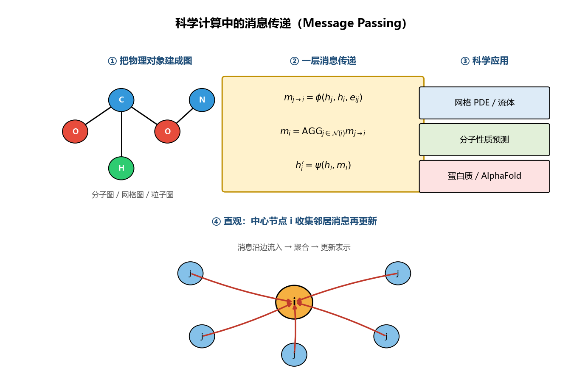
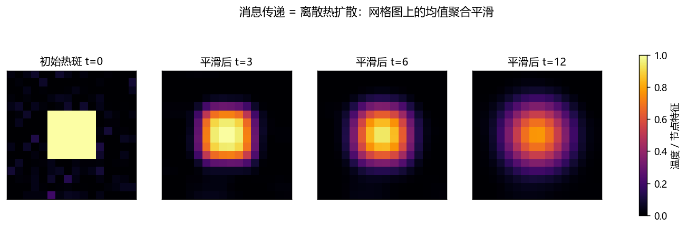
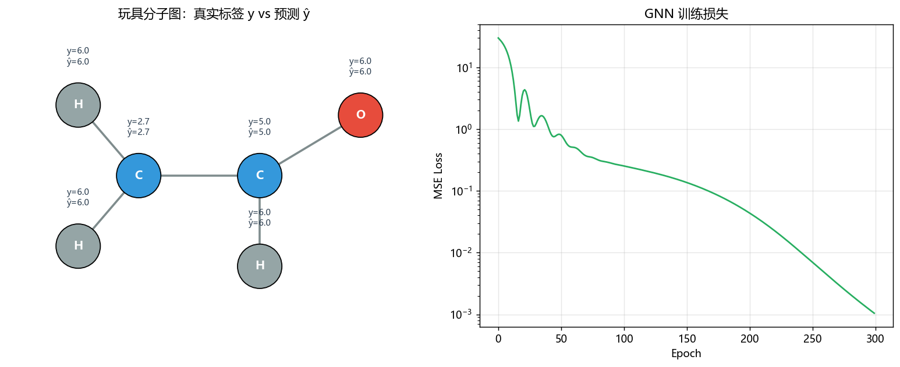
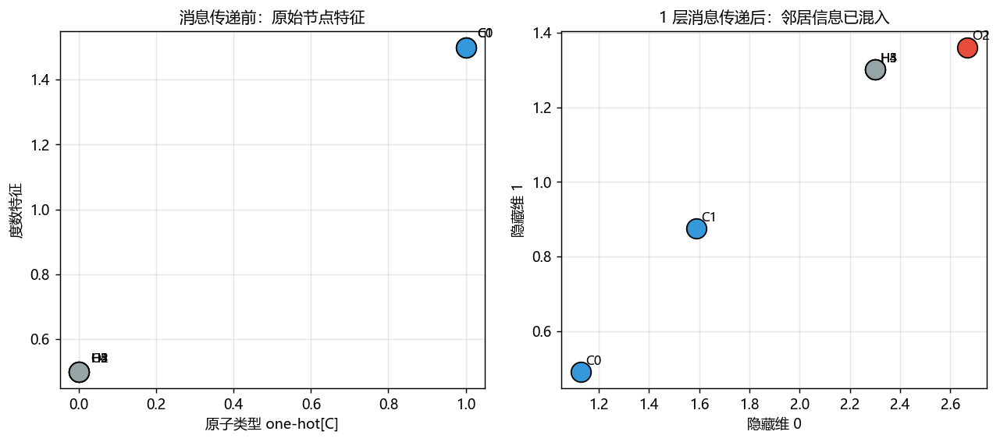

# as05 科学计算中的 GNN：消息传递

> [!WARNING]
> 🧪 Beta公测版本提示：教程主体已完成，正在优化细节，欢迎大家提Issue反馈问题或建议。

前面几章的 AI4S 工具箱里，PINN / FNO / PINO 都默认输入输出定义在**规则网格**或连续坐标上。但真实科学对象经常是：

- **分子**：原子 + 化学键（不规则图）
- **有限元网格**：节点 + 单元邻接（非结构网格）
- **粒子系统**：近邻相互作用（动态图）
- **蛋白质**：残基接触图 → AlphaFold 的图推理

把它们统一起来的语言，就是 **图神经网络（GNN）** 与 **消息传递（Message Passing）**。

---

## 1. 核心直觉：消息沿边流动

给定图 $\mathcal{G}=(\mathcal{V},\mathcal{E})$，每个节点 $i$ 有特征 $h_i$。一层消息传递做三件事：

$$
\begin{aligned}
m_{j\to i} &= \phi\!\left(h_j, h_i, e_{ij}\right)
&&\text{（算消息）}\\
m_i &= \mathrm{AGG}_{j\in\mathcal{N}(i)}\, m_{j\to i}
&&\text{（聚合邻居）}\\
h_i' &= \psi\!\left(h_i, m_i\right)
&&\text{（更新自己）}
\end{aligned}
$$

> **图解说明**：一层消息传递 = 沿边算消息 → 聚合邻居 → 更新自身。分子、网格、粒子系统都可落成同一套「图上的局部更新」。

不同 GNN 变体（GCN、GraphSAGE、GAT、MPNN…）的差别，主要就在 $\phi$、$\mathrm{AGG}$、$\psi$ 的具体选择。

---

## 2. 桥梁一：网格上的消息传递 = 离散 PDE

在规则网格上，若取

$$
h_i' = (1-\alpha)\,h_i + \alpha\cdot\mathrm{mean}_{j\in\mathcal{N}(i)} h_j
$$

这正是**离散热扩散 / 拉普拉斯平滑**的一步。有限差分、有限元组装刚度矩阵、图上的随机游走——在局部更新视角下，都和消息传递同构。

因此：

> 学 GNN，不是在学一个「和数值方法无关的黑盒」；很多时候你是在学一个**可学习的、局部守恒/扩散型数值格式**。

MeshGraphNets、GraphCast 等科学模型，本质上都是「把 PDE 求解器的 stencil 换成可学习消息传递」。

---

## 3. 桥梁二：分子图 → 蛋白质图

把原子当节点、化学键当边，节点特征可以是原子序数 / one-hot 类型 / 度数，边特征可以是键长、键级。堆叠若干层消息传递后：

- **节点级**任务：局部电荷、化学位移、原子受力
- **图级**任务：分子能量、溶解度、毒性（对节点表示做 readout / pooling）

再往上：

- 残基接触图 → 蛋白质结构模块（AlphaFold 系列）
- 材料晶胞图 → 形成能、带隙预测
- 粒子近邻图 → 流体 / N-body

本章 demo 用一个 6 原子玩具分子，训练两层可学习消息传递，预测每个原子的「邻居原子序数均值」这类局部环境标签：

你会看到：传递一层之后，原本相似的同类型原子，会因为邻居环境不同而在特征空间里分开——**这就是 GNN 相对「忽略图结构的 MLP」的增益来源**。

---

## 4. 可学习消息传递层（本章实现）

demo 中的一层实现为：

$$
\begin{aligned}
m_{j\to i} &= W_{\mathrm{msg}} h_j \\
m_i &= \mathrm{mean}_{j\in\mathcal{N}(i)} m_{j\to i} \\
h_i' &= \mathrm{ReLU}\!\left(W_{\mathrm{self}} h_i + m_i\right)
\end{aligned}
$$

用 `index_add_` 按目标节点聚合，不依赖 PyG / DGL，方便在 CPU 上从零理解。两层堆叠后接一个线性读出头，做节点回归。

---

## 5. 和 CNN / Transformer 的关系（帮你定位）

| 结构 | 归纳偏置 | 典型定义域 |
|------|----------|------------|
| CNN | 平移等变、局部卷积核 | 规则网格图像 |
| Transformer | 全局注意力、排列等变 | 序列 / 集合 |
| **GNN** | 局部邻域、图同构等变 | **任意拓扑图** |

规则网格是图的特例（CNN ≈ 特殊 GNN）；自注意力可看成「全连接图上的消息传递」。科学计算常落在「稀疏、有物理邻接」的中间地带，因此 GNN 特别合适。

---

## 6. 实践注意点

1. **过平滑（over-smoothing）**：层数太深时，节点表示趋同，方差塌缩——网格平滑 demo 已经展示了这个趋势；
2. **边的定义**：分子用化学键，网格用单元邻接，粒子用半径近邻——**图怎么建，往往比网络多深一层更重要**；
3. **物理约束**：可把能量守恒、力为势能负梯度等写进损失或架构（等价于「图上的 PINO」）；
4. **下一站**：as06 AlphaFold 会把「残基图 + 注意力 / 三角更新」推到原子坐标级结构预测。

---

## 本章总结

- 科学对象优先问：**节点是什么？边表示什么相互作用？**
- 消息传递提供统一更新规则；网格上它像数值扩散，分子上它像化学环境聚合；
- 从这里可以走向 MeshGraphNets、材料 GNN，以及蛋白质结构预测。

---

## 📥 Code

| File | View | Download |
|------|------|----------|
| demo.py | [Open](./code-demo) | <a href="/notebook/code/science/gnn/demo.py" target="_blank" download>Download</a> |
| exercise.py | [Open](./code-exercise) | <a href="/notebook/code/science/gnn/exercise.py" target="_blank" download>Download</a> |

## 参考

1. Gilmer, J., et al. (2017). Neural Message Passing for Quantum Chemistry. *ICML*. [[arXiv:1704.01212](https://arxiv.org/abs/1704.01212)]
2. Pfaff, T., et al. (2021). Learning Mesh-Based Simulation with Graph Networks. *ICLR*. (MeshGraphNets) [[arXiv:2010.03409](https://arxiv.org/abs/2010.03409)]
3. Jumper, J., et al. (2021). Highly accurate protein structure prediction with AlphaFold. *Nature*. [[doi:10.1038/s41586-021-03819-2](https://doi.org/10.1038/s41586-021-03819-2)]
4. Bronstein, M. M., et al. (2021). Geometric Deep Learning: Grids, Groups, Graphs, Geodesics, and Gauges. [[arXiv:2104.13478](https://arxiv.org/abs/2104.13478)]
