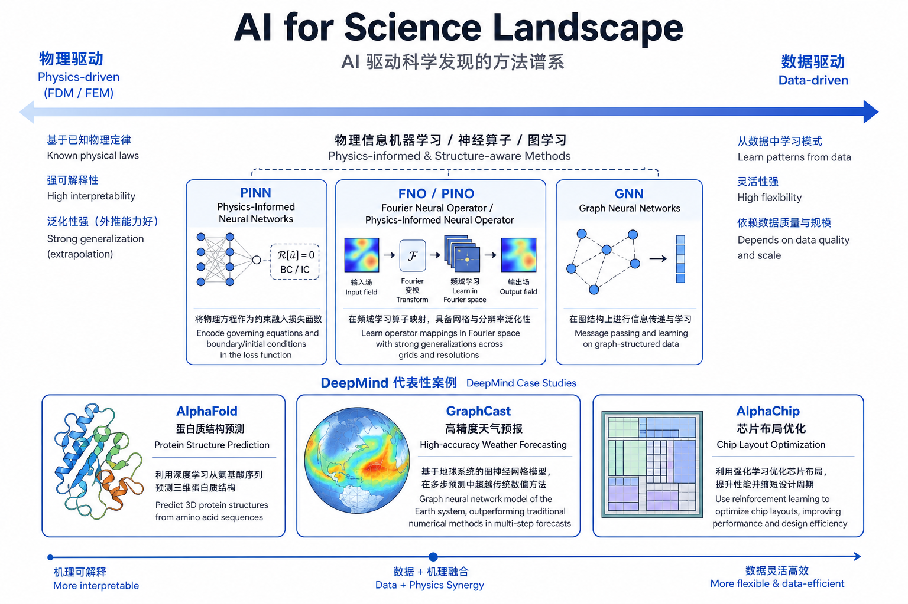
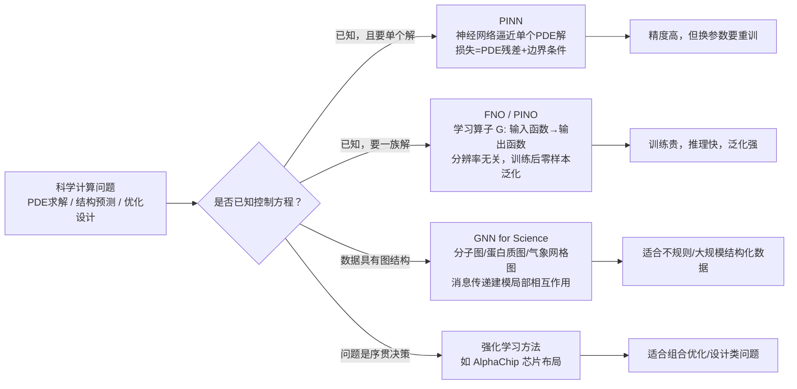
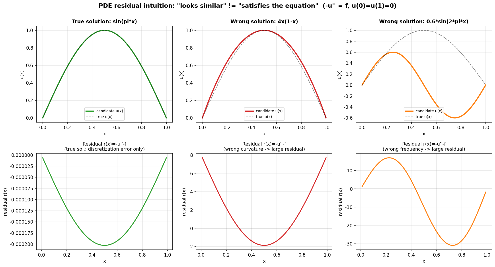
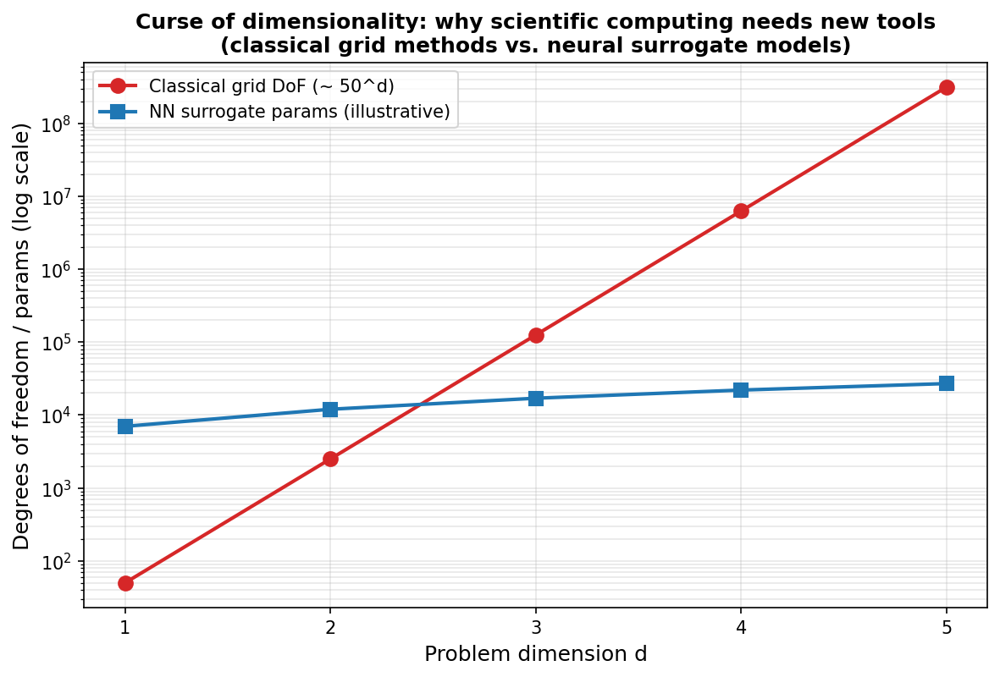

# AI for Science 全景：当 AI 遇见科学计算

> [!WARNING]
> 🧪 Beta公测版本提示：教程主体已完成，正在优化细节，欢迎大家提Issue反馈问题或建议。

## 1. 为什么需要"AI for Science"？

从阶段一到阶段七，我们学习的 AI 主要面向"感知与生成"类任务：识别图像、理解语言、生成文本或图片。但 AI 还有另一个正在快速崛起的应用方向——**科学计算与科学发现（AI for Science，简称 AI4S）**：用神经网络去求解物理方程、预测蛋白质结构、模拟气候系统、设计芯片布局……

这一章开始的"进阶一：AI for Science"系列（as01–as08），将带你系统了解这个方向的核心方法论。本章作为全景导览，先建立整体地图，后续章节再逐一深入：

- **as02 PINN**：用神经网络直接逼近偏微分方程（PDE）的解
- **as03 Neural Operator / FNO**：学习"函数到函数"的映射，一次训练泛化到任意输入
- **as04–as08**：PINO、科学计算中的 GNN、AlphaFold、AlphaChip 等前沿案例

## 2. 科学计算的核心痛点

传统科学计算（数值模拟、优化设计、结构预测）依赖精心设计的数值算法——有限差分法（FDM）、有限元法（FEM）、分子动力学模拟、蒙特卡洛方法等。这些方法几十年来支撑着航空航天、气象预报、药物设计、芯片制造等几乎所有工业和科研领域。但它们面临几个根本性的痛点：

### 2.1 计算成本随维度/精度爆炸式增长

以有限差分法求解偏微分方程为例，如果每个维度用 $N$ 个网格点离散化，$d$ 维问题就需要约 $N^d$ 个自由度。这就是**维度灾难（curse of dimensionality）**：三维流体模拟已经需要数百万甚至数十亿网格点，六维的玻尔兹曼方程（速度空间 3 维 + 物理空间 3 维）在传统网格法下几乎无法承受。

$$
\text{自由度（DoF）} \sim N^d \quad (\text{$N$: 每维网格点数，$d$: 维度})
$$

### 2.2 网格生成与几何复杂度

有限元法需要为复杂几何体（飞机机翼、心脏瓣膜、芯片版图）生成高质量网格，这个过程本身就是一个专业且耗时的子领域——网格质量差会直接导致数值不稳定或结果失真。

### 2.3 重复求解的高昂开销

工程优化、不确定性量化、逆问题往往需要对**同一类方程、不同参数**重复求解成千上万次（例如：改变材料属性后重新做结构分析）。传统方法每换一组参数就要重新离散化、重新迭代求解，无法"复用"之前解过的经验。

### 2.4 反问题与高维参数空间

许多科学问题的本质是**反问题（inverse problem）**：已知观测数据，反推控制方程的参数或初始条件（如从地震波形反推地下结构、从有限观测点反推整个流场）。反问题往往是欠定的、病态的，传统方法处理起来极为困难。

> **图解说明**：图 as01-01 展示了 AI4S 方法在"物理驱动 → 数据驱动"光谱上的位置——最左侧是显式离散化物理方程的经典数值方法（FDM/FEM），依次经过 PINN（用神经网络逼近单个解，同时利用 PDE 残差作为损失）、FNO/PINO（学习函数空间到函数空间的算子映射），最右侧是 GNN 类方法（天然适配分子、蛋白质、气象网格等图结构数据）。下方展示了 DeepMind 三个代表性成果——AlphaFold、GraphCast、AlphaChip——它们分别对应了不同的问题结构，但共享同一个核心思想：把科学问题重新表述为"学习一个映射"。

## 3. 数据驱动 vs 物理驱动：一个统一的视角

理解 AI4S 领域最重要的一把钥匙，是把所有方法放在**"物理驱动 ↔ 数据驱动"**这条光谱上理解：

| 维度 | 物理驱动（传统数值方法） | 数据驱动（纯监督学习） |
|------|------------------------|----------------------|
| 建模依据 | 已知的物理方程（PDE/ODE） | 观测数据中的统计规律 |
| 泛化能力 | 严格满足方程，理论保证强 | 依赖训练数据分布，外推能力弱 |
| 求解速度 | 每次新参数都要重新计算（慢） | 训练完成后推理极快（快） |
| 数据需求 | 不需要标注数据，只需要方程 | 需要大量标注/仿真数据 |
| 典型代表 | FDM, FEM, 分子动力学 | 纯 CNN/Transformer 拟合黑箱映射 |

AI4S 中最有趣的方法几乎都是**混合方法**：既利用已知的物理规律（作为约束或损失函数），又利用数据驱动模型的高效推理能力。这催生了几条并行发展的技术路线：

## 4. 算子学习地图：PINN、FNO、PINO、GNN 的关系

这四类方法常常被放在一起讨论，因为它们都是"用神经网络处理带有物理结构的科学问题"，但**它们的学习目标本质不同**：

### 4.1 PINN：逼近"单个解"

**PINN（Physics-Informed Neural Network，as02 详解）** 训练一个神经网络 $u_\theta(x, t)$，直接把它当作 PDE 的解。训练目标是让 $u_\theta$ 同时满足：

- **PDE 残差损失**：利用自动微分算出 $u_\theta$ 的各阶导数，代入方程算残差
- **边界/初始条件损失**：让 $u_\theta$ 在边界和初始时刻匹配给定条件

$$
\mathcal{L}_{\text{PINN}} = \mathcal{L}_{\text{PDE}} + \lambda_{\text{bc}} \mathcal{L}_{\text{BC}} + \lambda_{\text{ic}} \mathcal{L}_{\text{IC}}
$$

**关键限制**：一个训练好的 PINN 只对应一组特定的方程参数、边界条件。如果源项 $f$ 或边界条件变了，原则上需要重新训练。

### 4.2 FNO / PINO：学习"算子"（函数到函数的映射）

**神经算子（Neural Operator，as03 详解）** 换了一个更宏大的学习目标：不是学一个解，而是学习一个**映射规则** $\mathcal{G}$，它把"输入函数"（如源项 $f$、初始条件、材料系数场）映射到"输出函数"（对应的解 $u$）：

$$
\mathcal{G}: a(x) \longmapsto u(x), \qquad \text{其中 } a, u \text{ 均为函数（在无限维函数空间中）}
$$

**FNO（Fourier Neural Operator）** 是实现算子学习的一种高效架构：在傅立叶域中做卷积（等价于全局卷积），并且这个操作对网格分辨率是不变的——训练时用 $64\times 64$ 网格，推理时可以直接用在 $256\times 256$ 网格上，不需要重新训练。**PINO（Physics-Informed Neural Operator）** 则进一步把 PDE 残差损失加入到算子学习的训练目标中，弥补纯数据驱动算子在物理一致性上的不足。

### 4.3 GNN：处理不规则的科学数据结构

许多科学对象天然是**图结构**：分子是原子和化学键构成的图，蛋白质是氨基酸残基之间空间关系构成的图，大气/海洋模拟可以表示为不规则网格图。**图神经网络（GNN）** 通过消息传递机制建模这类局部相互作用，天然适配这些不规则数据结构，是 AlphaFold、GraphCast 等系统的核心组件之一。

### 4.4 一张表总结

| 方法 | 学习目标 | 输入/输出 | 换参数是否要重训 | 代表应用 |
|------|---------|-----------|----------------|---------|
| PINN | 单个 PDE 解 $u_\theta(x)$ | 坐标 → 解的值 | 需要 | 正/反问题、小规模高精度模拟 |
| FNO/PINO | 算子 $\mathcal{G}: a \to u$ | 输入函数(离散网格) → 输出函数 | 不需要（同族问题内） | 天气预报、材料模拟、流体力学代理模型 |
| GNN | 图上的局部/全局函数 | 图（节点+边特征） → 节点/图级别输出 | 不需要 | 分子性质预测、蛋白质结构、气象图预测 |
| RL | 序贯决策策略 $\pi_\theta$ | 状态 → 动作 | 不需要 | 芯片布局(AlphaChip)、实验设计 |

## 5. Google DeepMind 的 AI4S 代表性成果

DeepMind 在过去几年发布的一系列 AI4S 成果，几乎完整地展示了上述方法论如何在真实科学问题中落地：

### 5.1 AlphaFold：蛋白质结构预测

蛋白质的功能由其三维空间结构决定，而"从氨基酸序列预测三维结构"（**蛋白质折叠问题**）曾被认为是生物学中最难的开放问题之一——传统方法（X 射线晶体学、冷冻电镜）耗时且昂贵。

**AlphaFold2/3** 将这一问题重新表述为一个"序列 → 结构"的算子学习问题：结合进化信息（多序列比对提取的共进化信号）、几何深度学习（在 3D 坐标空间上保持旋转/平移等变性）与 Transformer 架构（Evoformer 模块建模序列内、序列间的注意力关系），直接从氨基酸序列预测原子级三维坐标。AlphaFold2 在 CASP14 竞赛中达到了媲美实验精度的结构预测能力，被认为是 AI4S 领域最具标志性的突破之一。这正是我们在 as06 章节会深入的话题。

### 5.2 GraphCast：图神经网络驱动的中期天气预报

传统数值天气预报（NWP）需要在超级计算机上求解大气动力学方程组，计算成本极高，单次预报动辄消耗数小时的超算时间。

**GraphCast** 把地球表面用一个多分辨率图（graph）表示，每个节点携带气压、温度、风速等物理量，用图神经网络学习"当前大气状态 → 未来 6 小时状态"的算子映射，通过自回归的方式滚动预测未来 10 天的天气。GraphCast 在多项指标上超过了传统数值预报系统 HRES 的精度，而单次预测只需数十秒——这是**算子学习思想在超大规模科学模拟中的典范应用**。

### 5.3 AlphaChip：用强化学习设计芯片

芯片设计中的**布局规划（floorplanning / placement）**——决定芯片上数百上千个功能模块（宏单元）的物理摆放位置——直接影响芯片的功耗、性能和面积（PPA 指标）。这是一个典型的组合优化问题，搜索空间随模块数量呈指数增长，人类专家往往需要数周时间才能完成一次高质量布局。

**AlphaChip**（脱胎自 2020 年的芯片布局强化学习工作）把布局问题表述为一个序贯决策过程：智能体（agent）依次为每个模块选择摆放位置，用图神经网络编码芯片的网络连接结构（netlist）作为状态表示，用强化学习训练策略网络最小化最终布局的总线长和拥塞代价。谷歌宣称已经将该方法用于其最新几代 TPU 芯片的实际布局设计中。

## 6. 一个最小例子：PDE 残差是什么？

在深入 PINN 和 FNO 之前，我们需要先建立一个贯穿整个系列的核心概念——**PDE 残差（PDE residual）**。它是判断"一个候选函数是否满足某个物理方程"的量化标尺，也是 PINN 损失函数的核心组成部分。

考虑最简单的一维 Poisson 方程边值问题：

$$
-u''(x) = f(x), \quad x \in (0, 1), \qquad u(0) = u(1) = 0
$$

给定候选函数 $\hat{u}(x)$（可以是任意函数，不管是猜的、拟合出来的，还是神经网络的输出），我们定义它的 **PDE 残差**为：

$$
r(x) = -\hat{u}''(x) - f(x)
$$

- 如果 $\hat{u}(x)$ **恰好是真解**，那么 $r(x) \equiv 0$（在数值计算中，只会有离散化或浮点误差导致的极小非零值）。
- 如果 $\hat{u}(x)$ **不满足方程**（即使它的形状"看起来还行"，甚至满足边界条件），$r(x)$ 会显著偏离 0。

我们用"制造解方法"（method of manufactured solutions）来构造一个可以精确验证的例子：取真解 $u_{\text{true}}(x) = \sin(\pi x)$（自动满足边界条件），反推源项：

$$
f(x) = -u_{\text{true}}''(x) = \pi^2 \sin(\pi x)
$$

下面的 demo 会构造两个"看起来形状还行，但不满足方程"的候选解——$4x(1-x)$（曲率是常数，与真解的曲率变化不符）和 $0.6\sin(2\pi x)$（频率不对）——用有限差分计算它们的 PDE 残差，和真解的残差对比。

> **图解说明**：上排三张图分别展示真解 $\sin(\pi x)$（绿）与两个候选错解（红、橙），虚线是真解作为参考。下排对应展示各自的 PDE 残差 $r(x) = -u''-f$：真解的残差始终贴着 0（仅有约 $10^{-4}$ 量级的离散化误差），而两个错解的残差明显偏离 0（量级在 2~30 之间），即使它们的函数图像"看起来也差不到哪里去"。这正是 PINN 训练时优化的核心信号——**残差越小，越接近真解**。

这里的核心洞察是：**"形状相似"和"满足物理方程"是两件完全不同的事**。神经网络仅从"形状匹配数据"这一目标学习，得到的函数很可能在物理上是错误的（例如违反能量守恒、违反已知的边界条件）。PINN 正是通过把 PDE 残差直接纳入损失函数，强制神经网络的输出既拟合数据、又满足物理约束。

## 7. 传统方法为什么在高维问题上会"力不从心"

除了残差直觉，我们再直观感受一下"维度灾难"——这是数据驱动/算子学习方法能够发挥优势的关键动机之一：

> **图解说明**：横轴是问题的维度 $d$，纵轴（对数坐标）对比了经典网格法所需的自由度（假设每维 50 个网格点，自由度 $\sim 50^d$，红线）与一个神经网络代理模型的参数量（示意性设定的温和增长曲线，蓝线）。可以看到，当维度超过约 3 时，经典网格法的成本呈指数爆炸，而神经网络的参数量增长远比它温和——这也是为什么在高维 PDE（如金融领域的高维期权定价方程、多体量子力学）中，神经网络方法正在成为传统网格法之外的重要补充方案。（注意：这是一个帮助建立直觉的示意图，并非严格的复杂度证明——具体到某个问题，神经网络方法是否真的更省算力，取决于问题结构、精度需求和训练成本。）

## 8. 本章小结与后续路线图

本章建立了理解 AI4S 领域的整体框架：

1. **痛点**：传统数值方法面临维度灾难、网格生成复杂度、重复求解开销、反问题病态性四大挑战。
2. **光谱**：所有 AI4S 方法都可以放在"物理驱动 ↔ 数据驱动"这条光谱上定位——纯数值方法在最左端，纯数据拟合在最右端，PINN、FNO/PINO、GNN 各自占据中间不同位置。
3. **核心工具——PDE 残差**：衡量候选函数满足物理方程程度的标尺，是 PINN 损失函数的核心组成部分，也是本章 demo 演示的重点。
4. **代表性成果**：AlphaFold（结构预测）、GraphCast（天气预报）、AlphaChip（芯片设计）分别展示了几何深度学习、图神经网络算子学习、强化学习在不同科学问题上的应用范式。

接下来的章节安排：

- **as02 PINN**：用 PyTorch 从零训练一个物理信息神经网络，求解本章介绍的一维 Poisson 方程，深入理解自动微分如何计算 PDE 残差
- **as03 Neural Operator / FNO**：学习傅立叶神经算子的架构原理，训练一个"分辨率无关"的算子模型
- **as04–as08**：PINO、科学计算中的 GNN、AlphaFold 的几何深度学习细节、AlphaChip 的强化学习设计流程，以及 AI4S 的综合与前沿展望

---

## 📥 Code

| File | View | Download |
|------|------|----------|
| demo.py | [Open](./code-demo) | <a href="/notebook/code/science/overview/demo.py" target="_blank" download>Download</a> |
| exercise.py | [Open](./code-exercise) | <a href="/notebook/code/science/overview/exercise.py" target="_blank" download>Download</a> |

## 参考

1. Raissi, M., Perdikaris, P., & Karniadakis, G. E. (2019). Physics-informed neural networks: A deep learning framework for solving forward and inverse problems involving nonlinear partial differential equations. *Journal of Computational Physics*. [[链接](https://www.sciencedirect.com/science/article/pii/S0021999118307125)]
2. Li, Z., Kovachki, N., Azizzadenesheli, K., et al. (2021). Fourier Neural Operator for Parametric Partial Differential Equations. *ICLR 2021*. [[arXiv:2010.08895](https://arxiv.org/abs/2010.08895)]
3. Jumper, J., Evans, R., Pritzel, A., et al. (2021). Highly accurate protein structure prediction with AlphaFold. *Nature*. (AlphaFold2) [[链接](https://www.nature.com/articles/s41586-021-03819-2)]
4. Lam, R., Sanchez-Gonzalez, A., Willson, M., et al. (2023). Learning skillful medium-range global weather forecasting. *Science*. (GraphCast) [[arXiv:2212.12794](https://arxiv.org/abs/2212.12794)]
5. Mirhoseini, A., Goldie, A., Yazgan, M., et al. (2021). A graph placement methodology for fast chip design. *Nature*. (AlphaChip 前身) [[链接](https://www.nature.com/articles/s41586-021-03544-w)]
6. Karniadakis, G. E., Kevrekidis, I. G., Lu, L., et al. (2021). Physics-informed machine learning. *Nature Reviews Physics*. [[链接](https://www.nature.com/articles/s42254-021-00314-5)]
