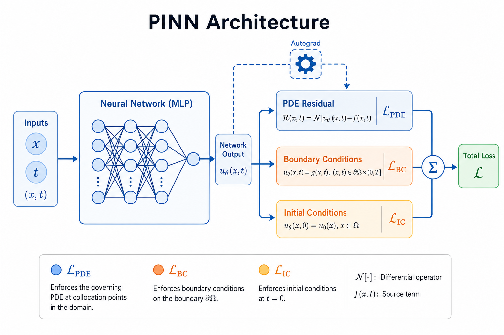
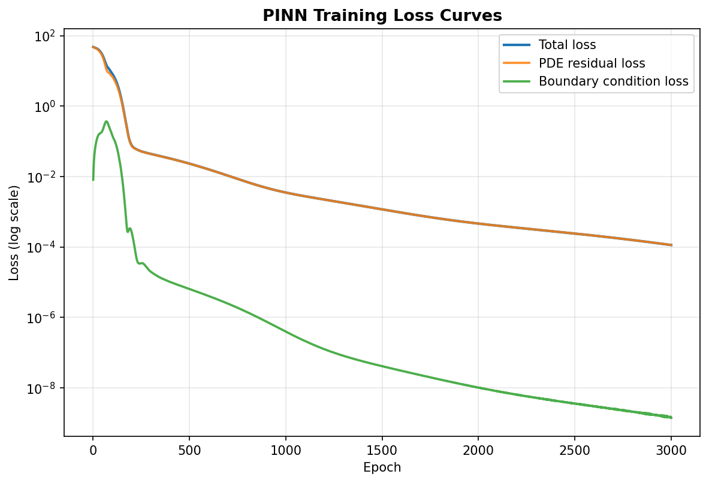
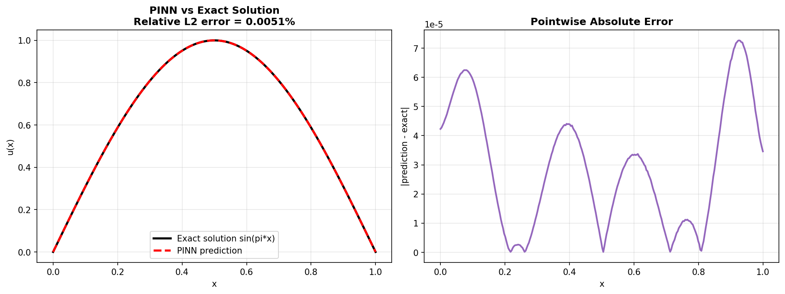

# as02 PINN：让神经网络自己"发现"物理方程的解

> [!WARNING]
> 🧪 Beta公测版本提示：教程主体已完成，正在优化细节，欢迎大家提Issue反馈问题或建议。

> 上一节 [as01 AI4S 全景](/science/overview/) 中，我们定义了"PDE 残差"这把标尺。这一节我们用它来真正训练一个神经网络求解方程。

## 1. 核心想法：把 PDE 残差变成损失函数

物理信息神经网络（**Physics-Informed Neural Network, PINN**，Raissi et al., 2019）的核心思想极其简单：

> 不给神经网络任何"标准答案"（$x \to u(x)$ 的标注数据对），而是让它在训练过程中自己利用**物理方程本身**作为监督信号。

回顾 as01 定义的一维 Poisson 边值问题：

$$
-u''(x) = f(x), \quad x \in (0, 1), \qquad u(0) = u(1) = 0, \qquad f(x) = \pi^2 \sin(\pi x)
$$

用一个神经网络 $u_\theta(x)$ 去逼近解 $u(x)$，PINN 的训练目标是让 $u_\theta$ 同时满足两类约束：

$$
\mathcal{L}(\theta) = \underbrace{\frac{1}{N_f}\sum_{i=1}^{N_f} r_\theta(x_f^{(i)})^2}_{\mathcal{L}_{\text{PDE}}\ (\text{方程残差})} \;+\; \lambda_{\text{bc}} \underbrace{\frac{1}{N_b}\sum_{j=1}^{N_b} \big(u_\theta(x_b^{(j)}) - u_b^{(j)}\big)^2}_{\mathcal{L}_{\text{BC}}\ (\text{边界条件})}
$$

其中 $r_\theta(x) = -u_\theta''(x) - f(x)$ 正是 as01 定义的 PDE 残差，$x_f^{(i)}$ 是在定义域内部随机/均匀采样的**配点（collocation points）**，$x_b^{(j)}$ 是边界点。这个损失函数里**没有任何来自"真解"的标注数据** —— 唯一的监督信号来自方程本身和边界条件。

## 2. 自动微分：PINN 相较传统数值方法的关键武器

as01 中我们用有限差分近似 $u''(x)$，误差量级是 $O(\Delta x^2)$，且必须先离散化网格。PINN 用**自动微分（automatic differentiation, autograd）**代替有限差分：

$$
u_\theta'(x) = \frac{\partial u_\theta}{\partial x} \quad (\text{解析精确，PyTorch 自动算出})
$$

关键实现技巧是 `torch.autograd.grad(..., create_graph=True)`：设置 `create_graph=True` 后，求导操作本身也会被记录进计算图，这样我们才能**对一阶导数再求一次导**（得到二阶导数），并且这个二阶导数依然可以继续反向传播去更新网络参数 $\theta$。

$$
\frac{\partial u_\theta}{\partial x} \xrightarrow{\ \text{再对 } x \text{ 求导（create\_graph=True）}\ } \frac{\partial^2 u_\theta}{\partial x^2}
$$

**这是 PINN 最重要的工程细节**：它意味着 PINN 完全**无网格（mesh-free）**——不需要像有限差分/有限元那样离散化定义域，配点可以在连续域内任意采样，导数是解析精确的（在浮点精度范围内），不存在离散化误差。

> **图解说明**：输入坐标 $x$（配点 + 边界点）经过一个 `tanh` 激活的多层感知机（MLP）得到 $\hat{u}(x)$。上分支对 $\hat{u}$ 自动微分两次得到 $u_\theta''$，组装出 PDE 残差 $r(x)=-u_\theta''-f$，贡献 $\mathcal{L}_{\text{pde}}$；下分支把边界点 $x=0,1$ 送入同一个网络，与真实边界值（此处均为 0）比较，贡献 $\mathcal{L}_{\text{bc}}$。两个损失加权求和后反向传播，同时更新网络的全部参数——两个分支共享同一套权重，这保证了学到的 $u_\theta$ 在整个定义域内是一个统一、光滑的函数，而不是两套独立拟合的结果。

## 3. 为什么用 tanh，不用 ReLU？

这是初学者容易忽略但对 PINN 至关重要的一个细节：**PINN 的网络必须选择处处二次可微（或更高阶可微）的激活函数**。

- **ReLU** 是分段线性函数，二阶导数几乎处处为 0（在非光滑点甚至未定义）。用 ReLU 网络计算 $u_\theta''$，会得到一个几乎恒为 0 的（无意义的）二阶导数，PDE 残差损失根本学不到东西。
- **tanh / sin / GELU** 等光滑激活函数处处无穷次可微，可以支持任意阶的自动微分求导，这正是本章 demo 选择 `tanh` 的原因。

$$
\text{ReLU}''(x) = 0 \ (\text{几乎处处}) \qquad \text{vs} \qquad \tanh''(x) = -2\tanh(x)\big(1-\tanh^2(x)\big) \ (\text{处处光滑非零})
$$

## 4. 边界条件权重 $\lambda_{\text{bc}}$ 的直觉

配点集合 $\{x_f^{(i)}\}$ 通常有几十到上千个点，而边界点集合 $\{x_b^{(j)}\}$ 在一维问题里往往只有 2 个点（$x=0, x=1$）。如果 $\lambda_{\text{bc}}=1$，边界条件损失在总损失中的"话语权"会被大量的内部配点损失稀释——网络可能学到一个在内部满足方程、但在边界处明显偏离 0 的解。

**实践经验**：$\lambda_{\text{bc}}$ 通常需要设为 $10 \sim 100$，把边界条件损失的权重人为放大，防止它被"多数投票"淹没。这是训练 PINN 时最常调的超参数之一（更系统的做法是自适应权重，如 NTK-based 权重、SoftAdapt 等，超出本章范围）。

## 5. 训练结果

本章 demo 用一个 `1 → 20 → 20 → 20 → 1`（tanh 激活）的全连接网络，在 $(0,1)$ 内均匀采样 50 个配点，训练 3000 轮 Adam 优化器（$\lambda_{\text{bc}}=10$）：

> **图解说明**：蓝色总损失、橙色 PDE 残差损失、绿色边界条件损失均在对数坐标下随训练单调下降，且边界条件损失下降得更快、更彻底——因为只有 2 个点，网络很容易"记住"它们；PDE 残差损失覆盖了整个定义域上的无穷多个点（每轮重新看到同样的 50 个配点），下降得更平缓，这是模型真正"学会方程结构"的过程。

> **图解说明**：左图对比 PINN 预测的 $\hat{u}(x)$（红色虚线）与解析真解 $\sin(\pi x)$（黑色实线），两者几乎完全重合，最终相对 $L_2$ 误差在 $10^{-3}$ 量级；右图展示逐点绝对误差，误差在整个区间内都很小且分布均匀——这说明网络学到的不是"记住几个点的值"，而是整个函数的光滑逼近。**关键在于：训练过程中网络从未见过任何一个 $u(x)$ 的真实取值，所有信息都来自 PDE 残差和边界条件。**

## 6. PINN 的优势与局限

| 维度 | 优势 | 局限 |
|------|------|------|
| 数据需求 | 不需要任何标注数据，只需要方程和边界条件 | 如果方程本身是错的/不完整的，PINN 也学不到正确答案 |
| 网格依赖 | 无网格，配点可以任意采样，适合不规则/高维域 | 配点采样策略对收敛速度和精度影响很大，需要调参 |
| 精度 | 导数解析精确，无离散化误差 | 训练是非凸优化，容易陷入局部最优（尤其是含多尺度/高频解的问题） |
| 复用性 | 可以直接用作反问题（已知观测数据反推方程参数）的框架 | **每次方程参数、边界条件、源项改变，都需要重新训练**——这是 PINN 最大的局限，也是下一章 FNO/PINO 要解决的问题 |
| 适用规模 | 特别适合小规模、高精度的正问题/反问题 | 大规模复杂几何、湍流等强非线性问题上训练稳定性和精度还是开放难题 |

**PINN 最大的局限**——一个训练好的 PINN 只对应一组特定的 $(f, \text{边界条件})$。如果源项从 $\pi^2\sin(\pi x)$ 换成别的函数，原则上必须重新训练整个网络。这正是引出下一章的关键动机：**能不能训练一个网络，一次性学会"给定任意源项 $f$，直接输出对应的解 $u$"这个映射本身？**——这就是神经算子（Neural Operator）要解决的问题。

## 7. 本章小结

1. **核心思想**：用 PDE 残差 + 边界条件误差构造损失函数，让神经网络在没有标注数据的情况下"发现"方程的解。
2. **关键工具**：自动微分（`create_graph=True`）计算任意阶精确导数，替代有限差分。
3. **关键细节**：激活函数必须光滑可微（tanh 而非 ReLU）；边界条件损失通常需要更大的权重 $\lambda_{\text{bc}}$。
4. **核心局限**：一个 PINN 只解一个特定问题，换参数需要重新训练——这是下一章 as03 Neural Operator / FNO 的出发点。

> 下一节 [as03 Neural Operator 与 FNO](/science/fno/) 将学习如何训练一个"一次训练，处处泛化"的算子模型，直接学习"源项函数 → 解函数"这个映射本身。

## 📥 Code

| File | View | Download |
|------|------|----------|
| demo.py | [Open](./code-demo) | <a href="/notebook/code/science/pinn/demo.py" target="_blank" download>Download</a> |
| exercise.py | [Open](./code-exercise) | <a href="/notebook/code/science/pinn/exercise.py" target="_blank" download>Download</a> |

## 参考

1. Raissi, M., Perdikaris, P., & Karniadakis, G. E. (2019). Physics-informed neural networks: A deep learning framework for solving forward and inverse problems involving nonlinear partial differential equations. *Journal of Computational Physics*. [[链接](https://www.sciencedirect.com/science/article/pii/S0021999118307125)]
2. Lu, L., Meng, X., Mao, Z., & Karniadakis, G. E. (2021). DeepXDE: A deep learning library for solving differential equations. *SIAM Review*. [[arXiv:1907.04502](https://arxiv.org/abs/1907.04502)]
3. Wang, S., Teng, Y., & Perdikaris, P. (2021). Understanding and mitigating gradient flow pathologies in physics-informed neural networks. *SIAM Journal on Scientific Computing*. (讨论边界条件权重自适应) [[链接](https://epubs.siam.org/doi/10.1137/20M1318043)]
4. Karniadakis, G. E., Kevrekidis, I. G., Lu, L., et al. (2021). Physics-informed machine learning. *Nature Reviews Physics*. [[链接](https://www.nature.com/articles/s42254-021-00314-5)]
