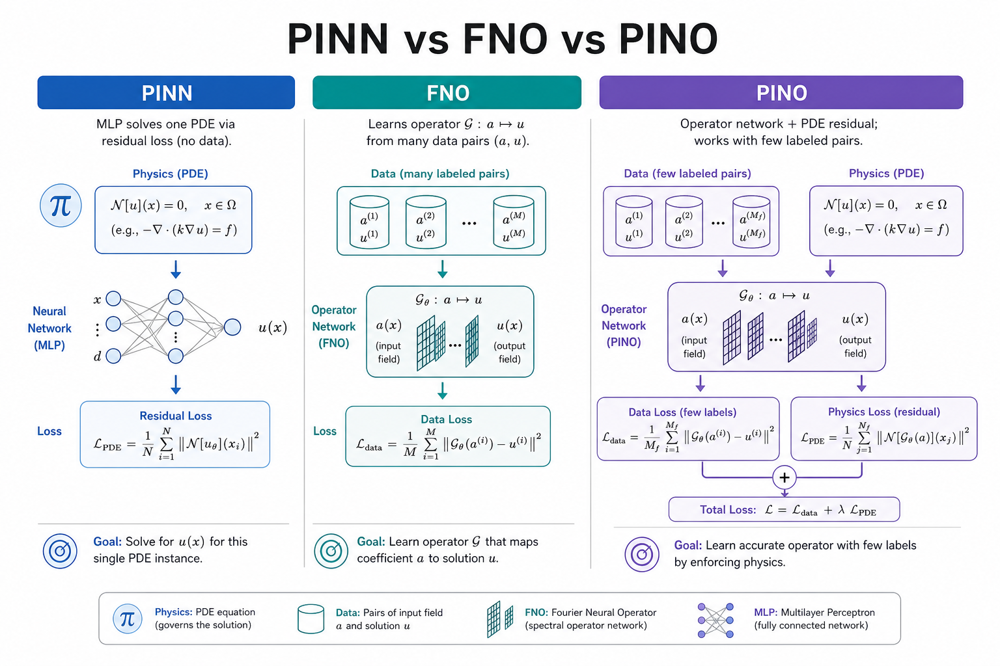
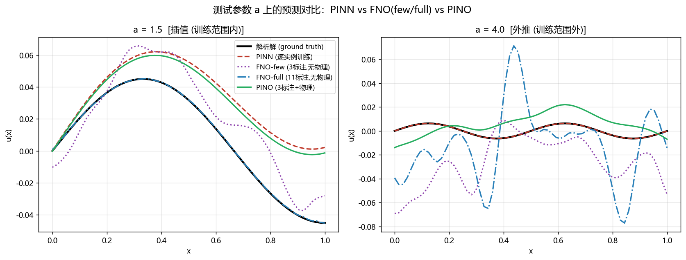
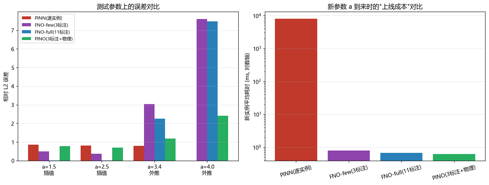
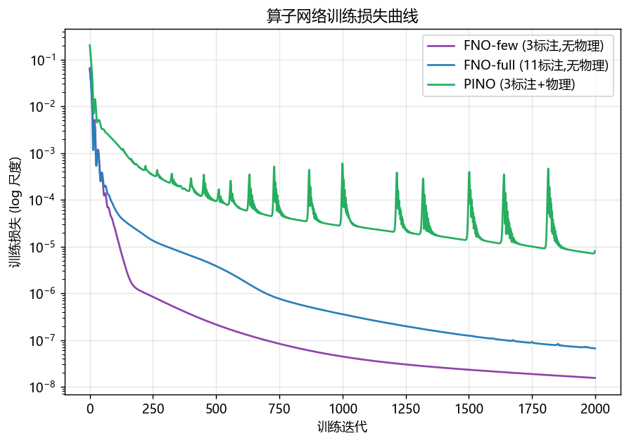

# as04 PINO：物理信息神经算子

> [!WARNING]
> 🧪 Beta公测版本提示：教程主体已完成，正在优化细节，欢迎大家提Issue反馈问题或建议。

上一章我们学了 **FNO（Fourier Neural Operator）**：一次训练、终身推理，把「系数场 / 源项 → 解」学成一个算子。再往前一章是 **PINN**：不需要标注数据，但每个新参数实例都要重新训练。

本章的主角 **PINO（Physics-Informed Neural Operator）** 回答的问题是：

> 能不能既像 FNO 一样「学一次用一生」，又像 PINN 一样把 PDE 残差写进损失函数，从而少用标注数据？

答案是可以——而且这正是科学机器学习里最实用的折中之一。

---

## 1. 三种范式：一张图看清差异

| 方法 | 学什么 | 需要标签？ | 新参数 $a$ 到来时 | 核心代价 |
|------|--------|-----------|-------------------|----------|
| **PINN** | 单个解 $u_a(x)$ | 否（用 PDE 残差） | **重新训练** | 上线慢 |
| **FNO** | 算子 $G_\theta: a \mapsto u_a$ | 是（大量 $(a,u_a)$） | **一次前向** | 标注贵 |
| **PINO** | 同一个算子 $G_\theta$ | 少量标签 + 大量无标签实例上的 PDE 残差 | **一次前向** | 实现稍复杂 |

> **图解说明**：PINN 只学单个解（换参数要重训）；FNO 学算子但依赖大量 $(a,u)$ 标签；PINO 在同一算子网络上叠加 PDE 残差，用少量标签 + 无标签物理约束降低标注成本，推理仍是一次前向。

直觉一句话：

- PINN = **物理老师**（没有标准答案，靠方程批改作业），但每个学生单独上课；
- FNO = **题海战术**（刷大量标准答案），训好后秒答新题，但没题就学不动；
- PINO = **题海 + 物理老师**：少量标准答案定锚，其余用方程批改——标注需求大幅下降。

---

## 2. 本章实验问题：一维变系数扩散（Darcy 风格）

我们采用 FNO / PINO 文献里常见的 **Darcy 流** 简化版——一维变系数扩散方程：

$$
-\frac{d}{dx}\!\left(k_a(x)\,\frac{du}{dx}\right) = f(x),
\quad x\in[0,1],\quad u(0)=u(1)=0
$$

其中扩散系数（「渗透率」）由标量参数 $a$ 控制：

$$
k_a(x) = 1 + a\sin(\pi x),\qquad f(x)=\sin(\pi x)
$$

**为什么选这个方程？**

1. $a$ 非线性地进入系数 $k$，而不是简单地缩放解——「参数 → 解」是真正的**非线性算子**；
2. 有标准的二阶有限体积离散，可与 PINO 的可微残差**完全对齐**；
3. 一维、小规模，CPU 上几分钟就能跑完对比实验。

ground truth $u_a$ 没有简单解析式，我们用有限体积组装三对角矩阵后直接线性求解，作为数值精确解。

---

## 3. PINO 的损失函数

设算子网络为 $G_\theta$，输入扩散系数场 $k_a$，输出预测解 $\hat{u}_a = G_\theta(k_a)$。PINO 的训练损失是两项之和：

$$
\mathcal{L}_{\mathrm{PINO}}
= \underbrace{\frac{1}{|\mathcal{A}_{\mathrm{lab}}|}\sum_{a\in\mathcal{A}_{\mathrm{lab}}}
\|\hat{u}_a - u_a\|^2}_{\text{数据损失（少量标注）}}
+ \lambda\,
\underbrace{\frac{1}{|\mathcal{A}|}\sum_{a\in\mathcal{A}}
\|R(\hat{u}_a; k_a, f)\|^2}_{\text{PDE 残差（全部实例，无需标签）}}
$$

其中残差算子 $R$ 就是离散形式的 PDE：

$$
R(\hat{u}; k, f)
= -\nabla\!\cdot(k\nabla \hat{u}) - f
$$

再加边界条件惩罚 $\hat{u}(0)^2 + \hat{u}(1)^2$。

**关键洞察**：对没有标签的参数 $a$，我们仍然知道 $k_a$ 和 $f$，因此仍能计算残差——物理先验把「无标签实例」变成了可用的训练信号。

---

## 4. 实验设计：四个对照

| 模型 | 标注 $a$ 数量 | 是否用 PDE 残差 | 期望行为 |
|------|---------------|-----------------|----------|
| PINN | 0（逐实例） | ✓ | 精度尚可，但每个新 $a$ 都要重训 |
| FNO-few | 3 | ✗ | 插值尚可，**外推崩** |
| FNO-full | 11 | ✗ | 数据充足时很强，但标注贵 |
| **PINO** | 3 | ✓ | 标注量同 FNO-few，外推逼近 FNO-full |

训练范围：$a\in[1,3]$（11 个等距点）。  
测试：$a=1.5,2.5$（插值）与 $a=3.4,4.0$（外推）。

---

## 5. 结果怎么读

运行 `python demo.py` 后会生成三张图：

你应该观察到：

1. **PINN** 每个测试 $a$ 都要单独训几千步——上线成本是秒～十秒级，而算子方法是毫秒级前向；
2. **FNO-few** 在训练范围内还行，一出范围（$a>3$）误差迅速增大；
3. **PINO** 用同样 3 个标注 + 物理残差，外推明显好于 FNO-few，接近甚至局部超过数据更多的 FNO-full；
4. 这不是说「永远不需要数据」——物理残差的离散格式、权重 $\lambda$、边界处理都会影响效果；PINO 的价值是：**在标注昂贵时，用已知 PDE 换数据**。

---

## 6. 和 PINN / FNO 的公式级对照

**PINN**（固定 $a$）：

$$
\min_\theta\;
\frac{1}{N}\sum_{i}\|R(u_\theta(x_i);k_a,f)\|^2
+\text{BC}
$$

**FNO**（数据驱动算子）：

$$
\min_\theta\;
\frac{1}{|\mathcal{A}_{\mathrm{lab}}|}\sum_{a}\|G_\theta(k_a)-u_a\|^2
$$

**PINO**（两者相加）：

$$
\min_\theta\;
\mathcal{L}_{\mathrm{data}} + \lambda\,\mathcal{L}_{\mathrm{PDE}}
$$

网络骨架可以继续用 FNO 的谱卷积层；PINO 改的是**损失**，不是必须换架构。这也是它落地成本低的原因：已有 FNO 代码库往往只需加一个可微残差模块。

---

## 7. 何时用 PINO？

| 场景 | 更合适的选择 |
|------|--------------|
| 只要求解**一个**固定 PDE 实例 | PINN / 传统数值方法 |
| 有海量高精度仿真数据、方程复杂难写残差 | 纯数据 FNO / DeepONet |
| 要覆盖一整个参数族，但标注仿真很贵 | **PINO** |
| 方程形式不完全可信（模型误差大） | 降低 $\lambda$，或改用弱形式 / 观测残差 |

工业界常见做法：用少量高保真仿真做数据锚点，再用 PDE（或低保真物理）在参数空间里「填缝」——这就是 PINO 思想的工程版。

---

## 本章总结

- PINO = **神经算子 + PDE 残差损失**，同时继承 FNO 的快速推理和 PINN 的物理先验；
- 核心收益是**降低标注需求、改善外推**，尤其在参数族求解场景；
- 实现要点：残差离散必须与 ground truth 求解器一致（本章用同一套有限体积格式），并仔细调节 $\lambda$。

下一章我们将进入另一条 AI4S 主干——**科学计算中的图神经网络（GNN）**：把分子、网格、粒子都看成图，用消息传递统一处理。

---

## 📥 Code

| File | View | Download |
|------|------|----------|
| demo.py | [Open](./code-demo) | <a href="/notebook/code/science/pino/demo.py" target="_blank" download>Download</a> |
| exercise.py | [Open](./code-exercise) | <a href="/notebook/code/science/pino/exercise.py" target="_blank" download>Download</a> |

## 参考

1. Li, Z., et al. (2021). Physics-Informed Neural Operator for Learning Partial Differential Equations. [[arXiv:2111.03794](https://arxiv.org/abs/2111.03794)]
2. Li, Z., et al. (2020). Fourier Neural Operator for Parametric Partial Differential Equations. *ICLR 2021*. [[arXiv:2010.08895](https://arxiv.org/abs/2010.08895)]
3. Raissi, M., Perdikaris, P., & Karniadakis, G. E. (2019). Physics-informed neural networks. *JCP*. [[doi:10.1016/j.jcp.2018.10.045](https://doi.org/10.1016/j.jcp.2018.10.045)]
