# Dreamer 家族：从 V1 到 V4

> [!WARNING]
> 🧪 Beta公测版本提示：教程主体已完成，正在优化细节，欢迎大家提Issue反馈问题或建议。

> [PlaNet](/world-models/abstract/rssm/) 已经能在潜空间用 CEM 规划。Dreamer 家族的共同决策是：**不要每一步在线搜动作，把「在模型里预演」变成可学习的 Actor-Critic**。下面按 V1 → V2 → V3 → V4 把每一跳的动机、公式和代价讲清楚。

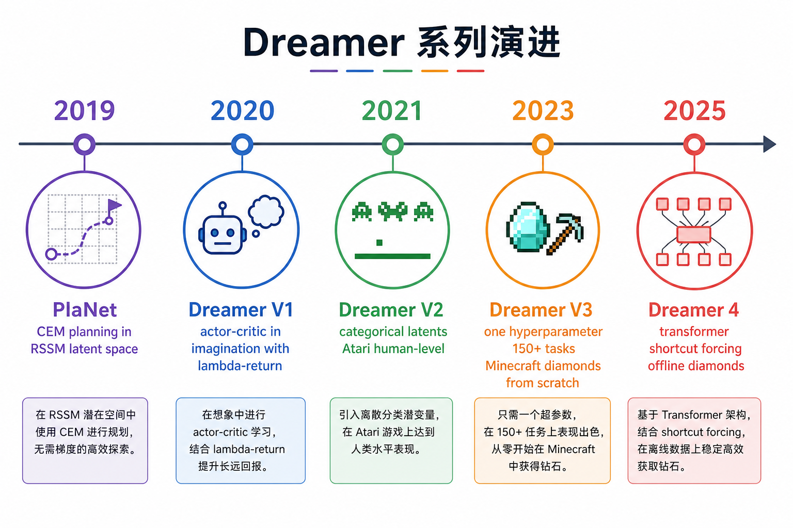

> **图解说明**：PlaNet 贡献 RSSM + 潜空间 CEM；V1 把规划换成想象中的策略梯度；V2 离散潜变量打 Atari；V3 一套超参打通 150+ 域；V4 换成可扩展 Transformer 动力学，支持纯离线想象训练。

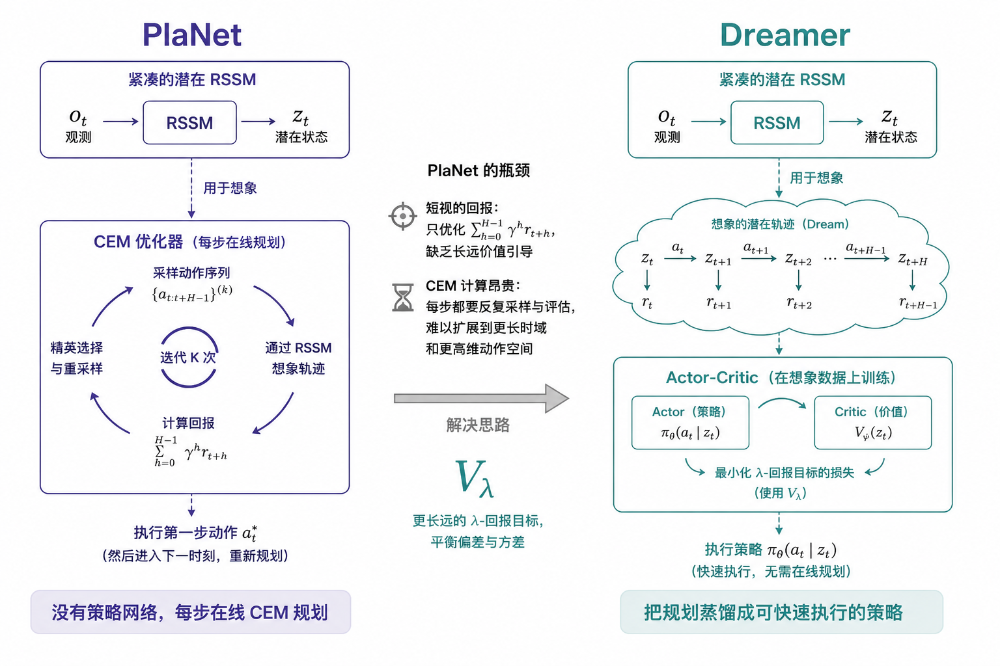

---

## 1. 共同骨架：三个网络、两种用法

所有 Dreamer 都拆成三块，同时从回放里学、同时与环境交互（V4 的离线设定除外）：

1. **世界模型**：把观测压成马尔可夫潜状态，预测下一状态、奖励、是否结束。训练时看图（后验），想象时不看图（先验）。
2. **Critic**：在潜状态上估计「从这儿按当前策略能拿到多少回报」。
3. **Actor**：在潜状态上输出动作。梯度来自**想象轨迹**，不是来自真实环境的逐步 TD（那是 model-free）。

真实环境的预算主要用来**把世界模型拟合准**；策略更新消耗的是 GPU 上的想象步。这是样本效率的来源。

---

## 2. Dreamer V1（2020）：Dream to Control

论文：[arXiv:1912.01603](https://arxiv.org/abs/1912.01603)。世界模型仍是 PlaNet 的 RSSM（高斯随机状态）。行为学习换成想象 MDP。

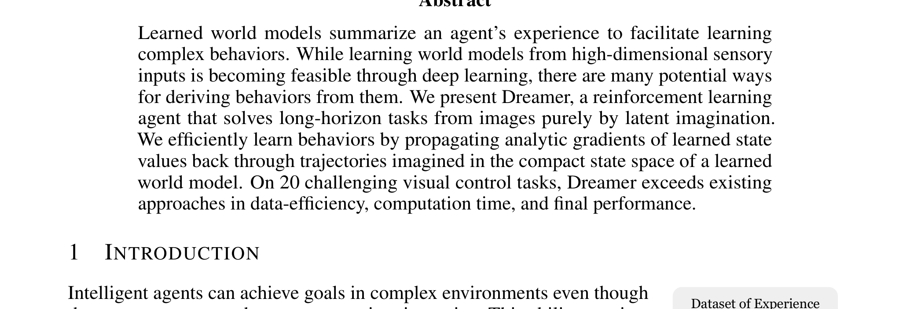

> 来源：Hafner et al., *Dream to Control*, Figure 1。经验拟合模型；价值沿想象轨迹反传，训练有远见的行为。

### 2.1 三个并行循环

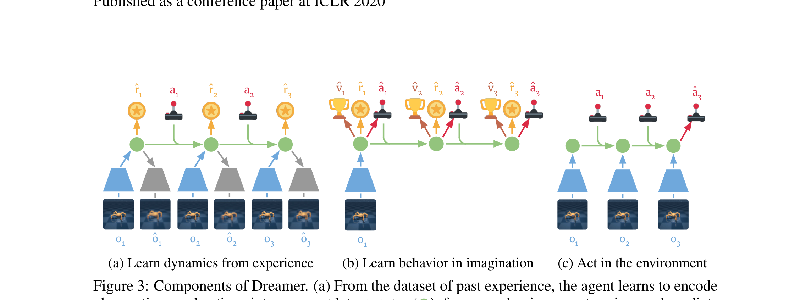

> 来源：同上, Figure 3。(a) 从真实序列学动力学与奖励；(b) 从当前后验状态出发，在潜空间滚 $H$ 步学 Actor/Critic；(c) 用 Actor 跟环境交互，写入回放。

记号（V1 原文 $p$/$q$ 与后文可能对调，抓住「后验看图、先验做梦」即可）：

$$
\begin{aligned}
\text{表示 } & p(s_t\mid s_{t-1},a_{t-1},o_t),\\
\text{转移 } & q(s_t\mid s_{t-1},a_{t-1}),\\
\text{奖励 } & q(r_t\mid s_t),\\
\text{策略 } & q_\phi(a_\tau\mid s_\tau),\qquad
\text{价值 } v_\psi(s_\tau).
\end{aligned}
$$

想象阶段**不解码图像**，所以可以在一张 GPU 上并行成千上万条短轨迹。

### 2.2 为什么需要 $V_\lambda$ 而不是把 $H$ 步奖励加完？

PlaNet 的 CEM 目标基本是 $\sum_{k=0}^{H-1} r_{t+k}$。视野外的事全盲。Dreamer 比较三种估计：

$$
\begin{aligned}
V_R &= \sum_{n=\tau}^{t+H} r_n && \text{加到视野终点为止，短视}\\
V_N^k &= \sum_{n=\tau}^{h-1}\gamma^{n-\tau} r_n + \gamma^{h-\tau} v_\psi(s_h) && k\text{-step + bootstrap}\\
V_\lambda &= (1-\lambda)\sum_{n=1}^{H-1}\lambda^{n-1} V_N^n + \lambda^{H-1} V_N^H && \text{混合不同步长}
\end{aligned}
$$

$V_\lambda$ 就是大家熟悉的 TD($\lambda$) 在想象轨迹上的版本：短 $n$ 偏差小、方差大；长 $n$ 能看远但更吃模型误差。$\lambda$ 做偏差-方差折中。

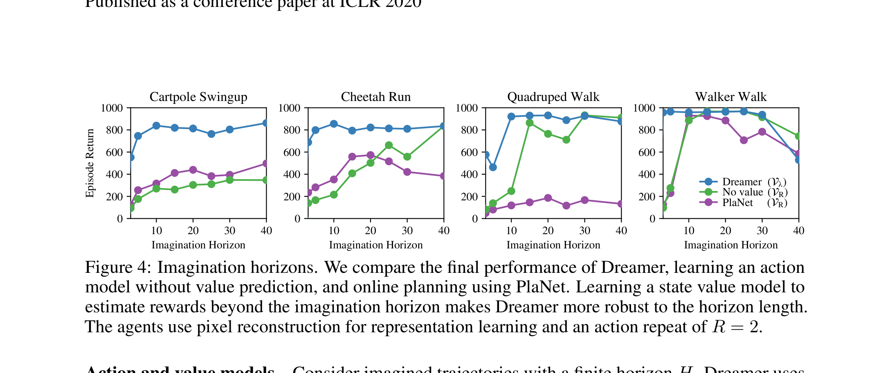

> 来源：Dreamer V1 Figure 4。有 Critic 的 Dreamer 对 $H$ 更鲁棒；只有 $V_R$ 或纯 PlaNet 规划在长视野任务上更脆。

行为目标：

$$
\max_\phi\ \mathbb{E}\Big[\sum_{\tau} V_\lambda(s_\tau)\Big],
\qquad
\min_\psi\ \mathbb{E}\Big[\tfrac12\|v_\psi(s_\tau)-\mathrm{sg}(V_\lambda)\|^2\Big].
$$

连续动作：动力学可微，把 $V_\lambda$ 的解析梯度反传到 $\phi$（reparameterized tanh-Gaussian）。**更新 Actor 时冻结世界模型**，避免策略梯度污染表示。

V1 仍然用像素重构当主表示信号。重构不是为了「生成好看的视频」，是为了逼迫 $s_t$ 含有控制需要的信息。

### 2.3 倒立摆上的最小想象循环

课上的 DreamerV3 笔记本用 RGB 倒立摆 + 完整 `dreamerv3-torch`，单卡也要跑很久。本章 `demo.py` 把同一套物理压成向量观测 $o=[\cos\theta,\sin\theta,\omega]$（θ=0 直立），世界模型是确定性 MLP，行为学习仍是 V1 那三步：

1. 与真实摆交互，写入 $(o,a,r,o')$；
2. 拟合潜动力学 $\hat z_{t+1}, \hat r_t$；
3. **冻结世界模型参数**，从当前 $z$ 想象 $H$ 步，用 $V_\lambda$ 更新 Actor / Critic。连续力矩走 tanh-Gaussian，梯度沿想象动力学回到 Actor（与论文「解析梯度穿过动力学、但不更新世界模型」一致）。

它不是 V3 的 150+ 域，也不是像素 RSSM；它负责让你看见「梦里的回报」怎样变成直立附近的力矩。PETS 在同一环境上每步做 CEM，LeWM 则在像素嵌入上做目标 CEM——三种决策、同一物理。

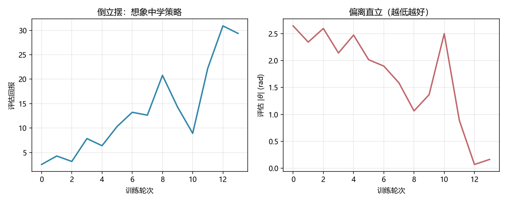

> 运行 `code/demo.py` 生成。左：想象训练过程中的评估回报（应上升）；右：评估偏离直立（应下降）。超参压到 CPU 数分钟，不必收到 0。

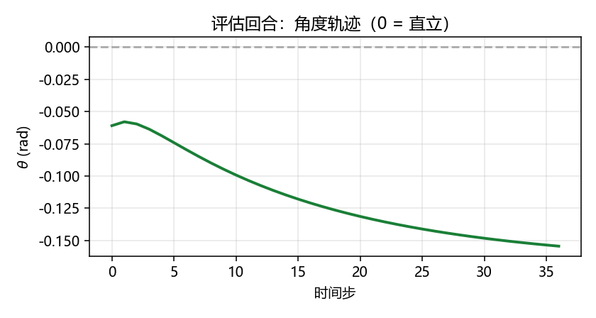

> 同一脚本生成。θ=0 为竖直向上；超参压到 CPU 数分钟，能稳住趋势即可。

---

## 3. Dreamer V2（2021）：离散潜变量打 Atari

论文：[arXiv:2010.02193](https://arxiv.org/abs/2010.02193)。命题：行为可以**完全在单独训练好的世界模型内部**学成，并在 55 个 Atari（sticky action）上达到人类水平，超过当时单卡 Rainbow / IQN。

### 3.1 Categorical latents

高斯潜变量对「对象出现/消失、屏幕突变」这类离散事件不友好。V2 把随机状态改成**多组 categorical**（例如 32 个 32 维 softmax），前向 one-hot 采样，反向 straight-through：

```text
sample = one_hot(draw(logits))     # 无梯度
probs  = softmax(logits)
sample = sample + probs - stop_grad(probs)
```

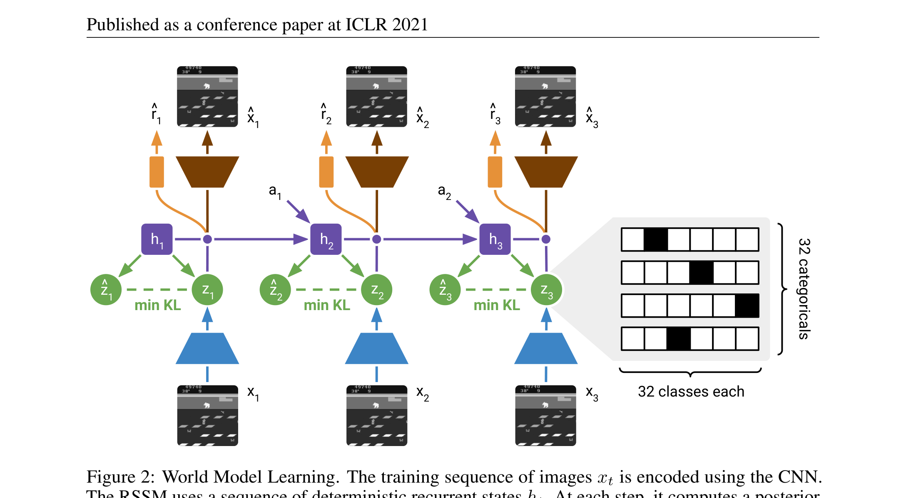

> 来源：DreamerV2 Figure 2。CNN 编码；$h_t$ 仍是 GRU；后验 $z_t$ 与先验 $\hat z_t$ 变为 categorical；KL 既训练先验也正则后验。

### 3.2 KL balancing

标准 $\mathrm{KL}(q\|p)$ 同时「拉先验去追后验」和「压后验去贴先验」。先验还很烂时，第二种会毁掉表示。V2 拆开停梯度：

$$
\mathcal{L}_{\mathrm{KL}}
=
\alpha\,\mathrm{KL}(\mathrm{sg}(q)\,\|\,p)
+
(1-\alpha)\,\mathrm{KL}(q\,\|\,\mathrm{sg}(p))
$$

$\alpha\approx 0.8$ 更偏向把先验学准，而不是把后验熵拉爆。这和 $\beta$-VAE 的全局系数不是一回事。

### 3.3 Actor：离散动作用 Reinforce

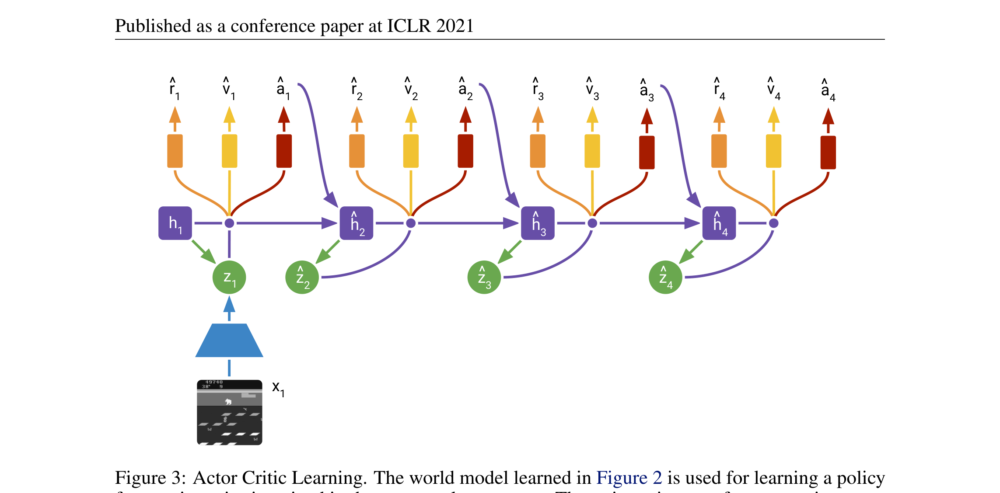

> 来源：DreamerV2 Figure 3。Atari 离散动作上 Reinforce 更稳；连续控制仍可用动力学直通梯度。另加熵正则。想象视野约 $H=15$。

「世界模型足够准，策略才敢完全在梦里练」——V2 用 Atari 把这句话做成了可复现的基准，而不是口号。

---

## 4. Dreamer V3（2023/24）：一套超参打通 150+ 任务

论文：[arXiv:2301.04104](https://arxiv.org/abs/2301.04104)。目标从「某个域刷分」变成「**同一套超参**覆盖机器人、Atari、ProcGen、DMLab、向量控制，以及无人类数据、无课程从零挖 Minecraft 钻石」。

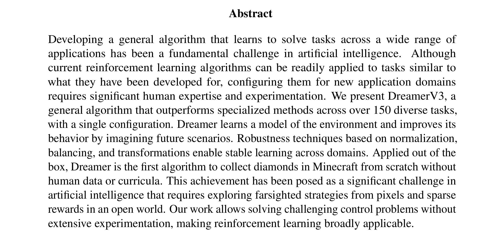

> 来源：DreamerV3 Figure 1。固定超参下的广域性能；Minecraft 钻石此前通常依赖人类示范或领域启发式。

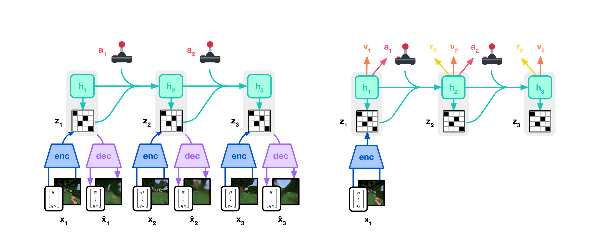

> 来源：DreamerV3 Figure 3。左：编码 / RSSM / 解码；右：在抽象表示上想象学习 Actor-Critic。

### 4.1 世界模型损失拆成三块 + free bits

$$
\mathcal{L}
=
\mathbb{E}_q\sum_t
\big(
\beta_{\mathrm{pred}}\mathcal{L}_{\mathrm{pred}}
+\beta_{\mathrm{dyn}}\mathcal{L}_{\mathrm{dyn}}
+\beta_{\mathrm{rep}}\mathcal{L}_{\mathrm{rep}}
\big)
$$

$$
\begin{aligned}
\mathcal{L}_{\mathrm{dyn}}
&=
\max\big(1,\ \mathrm{KL}[\mathrm{sg}(q(z_t\mid h_t,x_t))\,\|\,p(z_t\mid h_t)]\big)\\
\mathcal{L}_{\mathrm{rep}}
&=
\max\big(1,\ \mathrm{KL}[q(z_t\mid h_t,x_t)\,\|\,\mathrm{sg}(p(z_t\mid h_t))]\big)
\end{aligned}
$$

- $\mathcal{L}_{\mathrm{pred}}$：解码观测、预测奖励与 continue；
- $\mathcal{L}_{\mathrm{dyn}}$：序列模型去预测下一表示（梯度在先验）；
- $\mathcal{L}_{\mathrm{rep}}$：表示变得更好预测（梯度在后验，权重更小，如 $0.1$）；
- **Free bits**：KL 低于约 1 nat 时裁掉，避免过度正则把细节挤没。

这是 V2 KL balancing 的「工业版」：两个 KL 方向、两个停梯度、再加地板。

### 4.2 symlog 与 twohot：驯服未知量级

跨域时奖励可能差几个数量级。V3 用

$$
\mathrm{symlog}(x)=\mathrm{sign}(x)\ln(|x|+1)
$$

压缩大值且保号；价值头用 **symexp twohot**（指数分箱上的分类），让梯度尺度与目标量级解耦。Actor 侧按 batch 分位数做回报归一化（带下限），稀疏奖励仍敢探索。

经验观察：更大的世界模型不仅分更高，**达到同样分数所需交互更少**——模型容量变成了样本效率旋钮。

---

## 5. Dreamer 4（2025）：可扩展动力学 + 纯离线想象

论文：[arXiv:2509.24527](https://arxiv.org/abs/2509.24527)。RSSM+CNN 在窄域又快又准，但拟合开放世界（Minecraft 级交互）吃力；大视频扩散场面好，却常学不准「敲方块 / 合成」这种机制，且实时太贵。V4 的命题：

> 用**因果 tokenizer + shortcut forcing 的 Transformer 动力学**做又快又准的世界模型，并在模型内部做 RL；首次**仅用离线数据**在 Minecraft 取得钻石。

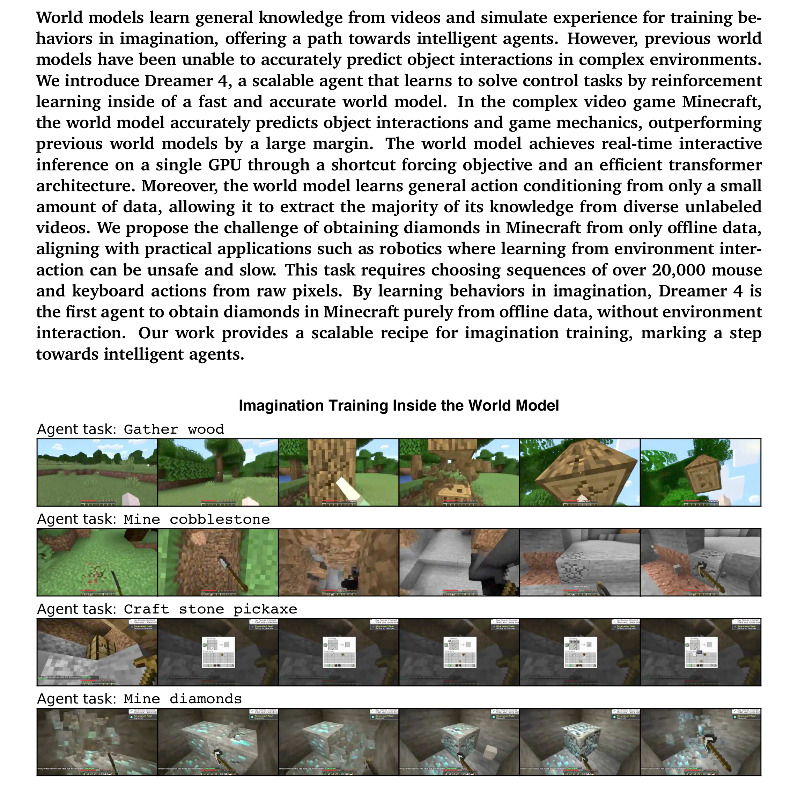

> 来源：Dreamer 4 Figure 1。解码只为可视化。模型需要学会破坏、使用工具、合成台等机制，而不是「看起来像游戏」。

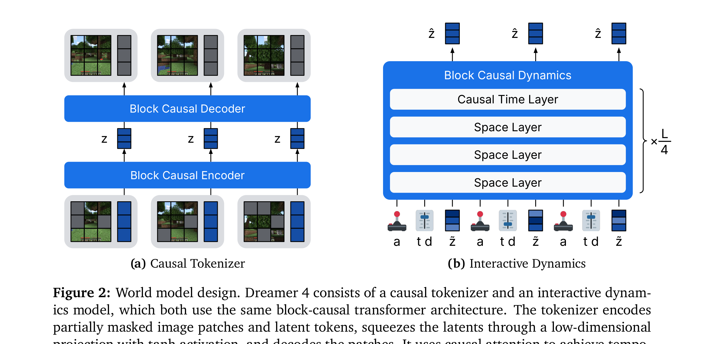

> 来源：Dreamer 4 Figure 2。Tokenizer 把帧压成低维连续表示（因果注意力，可逐帧解码）；Dynamics Transformer 在动作、shortcut 噪声水平与步长上做去噪；插入 task token 后预测动作 / 奖励 / 价值，再 imagination training。

### 5.1 Shortcut forcing（为什么能实时）

普通 flow matching / 扩散推理要几十上百步。Shortcut 模型除了信号水平 $\tau$，还条件于请求步长 $d$：最小 $d$ 用 flow 损失，更大 $d$ 用「两小步蒸馏成一大步」的 bootstrap 损失。推理时可直接要 2–4 步，单卡实时交互才有希望。

再叠 **diffusion forcing**：序列里每个时间步可以有不同噪声水平，训练时每一步既是去噪目标也是后面的上下文。

### 5.2 少量带动作视频 + 大量无标签视频

V4 强调动作条件可以从**少量**对齐数据里学，一般世界知识可以从多样无动作视频里来。这和路径一「纯视频生成」开始接壤，但目标仍是**给想象中的 RL 当引擎**，不是当电影机。

### 5.3 和 DayDreamer 的关系

[DayDreamer](https://arxiv.org/abs/2206.14176) 把 Dreamer 接到真机器人上：四条腿、机械臂、车上，用同一套「世界模型 + 想象 Actor-Critic」。它不是新的第 5 个数学版本，而是 V2/V3 思路的具身验证：样本效率足够，才敢在真实硬件上少摔几次。

---

## 6. 版本对照

| | 世界模型 | 行为 | 标志结果 |
|--|----------|------|----------|
| PlaNet | RSSM + 像素重构 | 每步 CEM-MPC | 像素连续控制，无策略网 |
| V1 | 高斯 RSSM | 想象 $V_\lambda$ + 可微动力学 | 潜空间学策略 |
| V2 | categorical RSSM + KL balancing | Reinforce / 直通混合 | Atari 人类水平、纯梦里练 |
| V3 | 同上 + 三损失 + symlog | 回报归一化、固定超参 | 150+ 域；Minecraft 钻石（在线） |
| V4 | 因果 tokenizer + shortcut Transformer | 离线想象 RL | Minecraft 钻石（纯离线） |

本章 `demo.py` 主实验是倒立摆上的 V1 想象循环；附录仍保留一维走廊，用来对照离散动作上「想象多练」相对 REINFORCE。把公式和论文图看懂，玩具只负责手感。

---

## 7. 小结

Dreamer = **可滚动的世界模型 + 在想象 MDP 里学 Actor-Critic**。版本演进是在回答四个工程问题：表示用连续还是离散、KL 怎么拆、损失尺度怎么跨域、动力学能不能既准又快到能做离线开放世界。

> 同属路径三：下一站可以是不重建像素的 [JEPA](/world-models/abstract/jepa/)，或为搜索服务的 [MuZero](/world-models/abstract/muzero/)。

## 📥 Code

| File | View | Download |
|------|------|----------|
| demo.py | [Open](./code-demo) | <a href="/notebook/code/world-models/abstract/dreamer/demo.py" target="_blank" download>Download</a> |
| exercise.py | [Open](./code-exercise) | <a href="/notebook/code/world-models/abstract/dreamer/exercise.py" target="_blank" download>Download</a> |

## 参考

1. Hafner, D., et al. (2020). Dream to Control: Learning Behaviors by Latent Imagination. *ICLR*. [[arXiv:1912.01603](https://arxiv.org/abs/1912.01603)]
2. Hafner, D., et al. (2021). Mastering Atari with Discrete World Models. *ICLR*. [[arXiv:2010.02193](https://arxiv.org/abs/2010.02193)]
3. Hafner, D., et al. (2024). Mastering Diverse Domains through World Models. [[arXiv:2301.04104](https://arxiv.org/abs/2301.04104)]
4. Hafner, D., Yan, W., & Lillicrap, T. (2025). Training Agents Inside of Scalable World Models. (Dreamer 4) [[arXiv:2509.24527](https://arxiv.org/abs/2509.24527)]
5. Wu, P., et al. (2022). DayDreamer: World Models for Physical Robot Learning. [[arXiv:2206.14176](https://arxiv.org/abs/2206.14176)]
