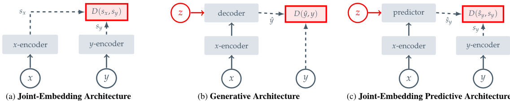
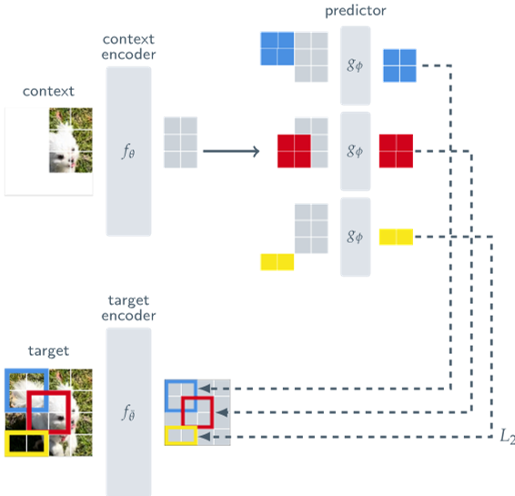
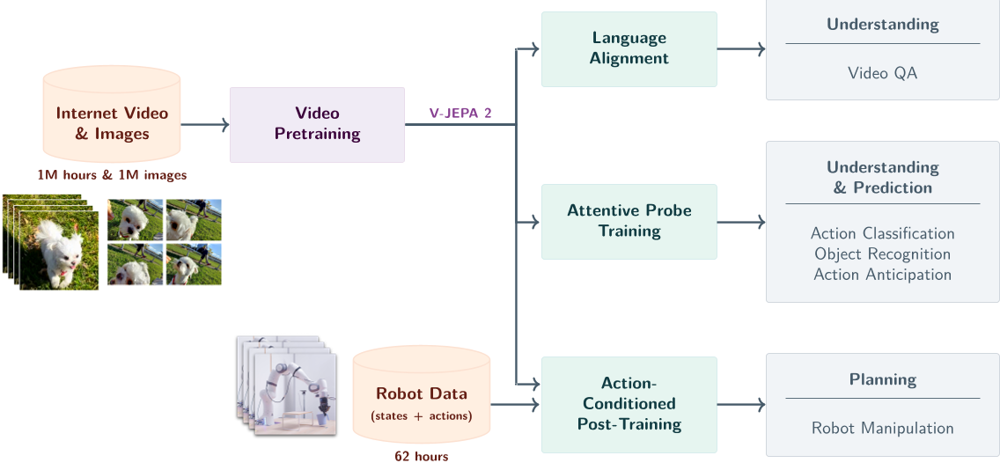
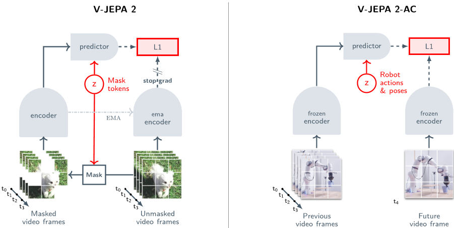
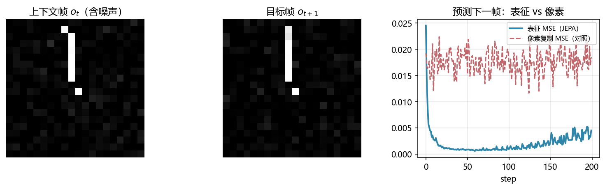

# JEPA / V-JEPA：预测表征，而不是预测像素

> [!WARNING]
> 🧪 Beta公测版本提示：教程主体已完成，正在优化细节，欢迎大家提Issue反馈问题或建议。

> 一个反直觉但深刻的想法：想让模型理解世界，不必让它学会"画画"

---

## 一、生成式世界模型的隐痛

前几节我们看到的世界模型——PlaNet/RSSM、Dreamer、甚至 MuZero 的隐式模型——大多要在某种程度上"重建"下一时刻的观测（像素、隐状态解码后的像素，或至少要能评估价值）。而 Sora 一类的视频生成模型，则是把"重建像素"这件事做到了极致。

但重建像素有一个根本性的代价：**像素里混杂着大量与"理解世界"无关的高频细节**——树叶的抖动纹理、噪点、光照的微小闪烁。一个被要求"逐像素重建"的模型，会被迫花费大量容量去拟合这些不可预测、也不重要的细节。

Yann LeCun 在提出 JEPA（Joint Embedding Predictive Architecture，联合嵌入预测架构）时正是针对这个问题：

> 我们真正想要的不是"生成看起来逼真的像素"，而是"预测世界在语义表征层面会如何变化"。

**核心思路的转变**：把预测任务从"像素空间"搬到"表征空间"。

$$
\text{生成式：} \quad \hat{x}_{\text{target}} = \text{Decoder}(\text{Encoder}(x_{\text{context}})) \approx x_{\text{target}}
$$

$$
\text{JEPA：} \quad \hat{z}_{\text{target}} = \text{Predictor}(\text{Encoder}_{\text{ctx}}(x_{\text{context}})) \approx \text{Encoder}_{\text{tgt}}(x_{\text{target}}) = z_{\text{target}}
$$

模型不再被要求还原出目标区域的每一个像素，只需要让预测的**表征** $\hat{z}_{\text{target}}$ 逼近目标编码器输出的表征 $z_{\text{target}}$。表征空间天然是"有损"且"语义化"的，编码器在训练中会自动学会丢弃不可预测的噪声、保留可预测的结构。

> **图解说明**：左路是生成式「解码回像素」；右路 JEPA 只让预测器在表征空间逼近目标编码器输出。丢弃不可预测的高频噪声，把容量留给可预测的结构——这是与 Sora 类像素生成路径的根本分野。教学示意；论文原图见下。

> 来源：Assran et al., *Self-Supervised Learning from Images with a Joint-Embedding Predictive Architecture*, CVPR 2023, [arXiv:2301.08243](https://arxiv.org/abs/2301.08243), Figure 2。(a) **联合嵌入（JEA）**：两路编码器，只在嵌入上比距离，没有「预测缺失信息」的 $z$；(b) **生成式**：解码回像素 $\hat y$，损失 $D(\hat y, y)$，被迫拟合不可预测细节；(c) **JEPA**：预测器输出 $\hat s_y$，损失 $D(\hat s_y, s_y)$ 在表征空间，潜变量 $z$ 用来吸收 $x$ 里没有的信息。

---

## 二、I-JEPA：图像上的联合嵌入预测

### 2.1 三个模块

I-JEPA（Image-based JEPA，2023）由三个核心模块组成：

| 模块 | 作用 | 训练方式 |
|------|------|----------|
| **上下文编码器** $E_{\theta}$ | 编码可见（未被遮挡）的图像 patch | 梯度下降，正常训练 |
| **目标编码器** $E_{\bar\theta}$ | 编码全图（包括被遮挡区域），提供回归目标 | **EMA**（指数滑动平均）跟随上下文编码器，不接收梯度 |
| **预测器** $P_{\phi}$ | 输入上下文表征 + 待预测位置的掩码 token，输出对目标表征的预测 | 梯度下降，正常训练 |

> 来源：同上, Figure 3。上支：可见上下文 → $f_\theta$ → 预测器 $g_\phi$ 按位置预测若干目标块的表征；下支：全图经目标编码器 $f_{\bar\theta}$（EMA）给出回归靶。损失是表征空间 $L_2$，不是像素重建。

### 2.2 掩码策略：多块（multi-block）掩码

I-JEPA 不是随机遮挡单个 patch（太容易通过局部纹理插值"抄近路"），而是遮挡若干个**大的连续矩形块**（通常占图像面积的 15%~70%），强迫预测器必须依赖对全局语义结构的理解，而非局部纹理外推。

### 2.3 损失函数

设可见（上下文）patch 索引集合为 $\mathcal{C}$，被遮挡（目标）patch 索引集合为 $\mathcal{T}$：

$$
\mathcal{L} = \frac{1}{|\mathcal{T}|}\sum_{i \in \mathcal{T}} \left\| P_{\phi}\big(E_{\theta}(x_{\mathcal{C}}),\, \text{pos}(i)\big) - \text{sg}\big[E_{\bar\theta}(x)_i\big] \right\|_2^2
$$

其中 $\text{sg}[\cdot]$ 表示 stop-gradient（停止梯度）——目标表征只作为回归目标，不参与反向传播。

### 2.4 为什么不会"表征坍缩"？

自监督学习的经典陷阱是**表征坍缩**（representational collapse）：模型发现"把所有输入都编码成同一个常数向量"也能让损失降到 0（预测器只需学会输出这个常数）。

I-JEPA 用两个设计避免坍缩：

1. **非对称结构**：上下文编码器和目标编码器不共享参数（只用 EMA 单向跟随），打破了"预测器和编码器合谋输出常数"的对称性
2. **停止梯度**：目标编码器完全不接收梯度，其参数只能通过 EMA 缓慢演化，为预测任务提供一个"移动但不塌陷"的目标

这与 BYOL、DINO 等自监督方法使用的 EMA + 停止梯度技巧是同源的。

---

## 三、V-JEPA：从图像到视频

### 3.1 时空联合掩码

V-JEPA（2024）把 I-JEPA 的思想扩展到视频：输入变成一段视频的时空 patch（每个 patch 既有空间维度又有时间维度），掩码策略变成**时空块掩码**——遮挡若干帧中的一大块连续区域，甚至可以遮挡整个未来帧。

$$
\hat{z}_{t_1:t_2}^{\text{masked}} = P_{\phi}\Big(E_{\theta}\big(v_{\text{visible}}\big)\Big) \approx \text{sg}\Big[E_{\bar\theta}\big(v_{t_1:t_2}\big)\Big]
$$

模型被迫从可见的时空上下文中推断出"被遮挡的时空区域在语义上应该是什么样"——这本质上就是在做**时间维度上的世界建模**：给定过去和部分未来的上下文，预测缺失片段的语义演化。

### 3.2 V-JEPA 的关键发现

V-JEPA 论文报告了几个重要结果：

- **冻结编码器 + 轻量探针**：把训练好的编码器权重冻结，只在其输出上训练一个简单的线性/浅层分类头，就能在动作识别、物体交互识别等任务上取得很强的效果——说明表征本身已经蕴含了丰富的动作/物理语义
- **无需人工标注**：整个预训练过程完全自监督，不需要任何动作标签或文本描述
- **对像素级细节不敏感**：与逐像素重建的视频模型相比，V-JEPA 学到的表征对光照变化、纹理噪声等"无关变化"更鲁棒

### 3.3 V-JEPA 2：理解、预测、规划分成三路

V-JEPA 2（Assran et al., 2025, [arXiv:2506.09985](https://arxiv.org/abs/2506.09985)）把规模推到约 **100 万小时**互联网视频 + 图像，再分三条下游：

> 来源：V-JEPA 2, Figure 1。互联网视频预训练得到冻结骨干之后：(1) 语言对齐 → Video QA；(2) 注意力探针 → 动作分类 / 物体识别 / 动作预期；(3) 用约 62 小时机器人（状态+动作）做**动作条件后训练** → 操作规划。

关键结构切换发生在第二张图：预训练仍是「掩码时空块 + EMA 教师」；接到机器人之后，编码器冻结，预测器改为**条件于动作与姿态**去预测未来帧的表征。

> 来源：同上, Figure 2。左：V-JEPA 2 预训练，$z$ 是掩码 token，损失在表征上（论文用 $L_1$）；右：V-JEPA 2-AC，编码器冻结，$z$ 换成机器人动作，预测未来嵌入。这就是「世界模型」接口——还没有奖励，规划靠目标嵌入距离。

零样本规划与 PlaNet / PETS 同构，只是 $f$ 定义在 JEPA 表征上：

$$
a^* = \arg\min_{a_{1:H}} \; \left\| P_{\phi}\Big(z_0,\, a_{1:H}\Big) - z_{\text{goal}} \right\|_2^2
$$

后续 V-JEPA 2.1（[arXiv:2603.14482](https://arxiv.org/abs/2603.14482)）继续加数据与后训练，思路不变：表征预测骨干 + 动作条件预测器 + 潜空间 MPC。

### 3.4 防坍缩的另一条路：LeJEPA 的 SIGReg

I-JEPA / V-JEPA 靠 **EMA + stop-gradient** 避免常数解。LeJEPA（Balestriero & LeCun, [arXiv:2511.08544](https://arxiv.org/abs/2511.08544)）改用 **SIGReg**：把嵌入随机投影到一维，用正态性统计量把边缘推向 $\mathcal{N}(0,1)$（Cramér–Wold：所有一维边缘像高斯，联合就逼近各向同性高斯）。下一章 [LeWM](/world-models/abstract/lewm/) 把 SIGReg 收成世界模型的第二项损失，从而丢掉 EMA 教师，编码器与预测器可以端到端反传。

### 3.5 倒立摆帧：同一物理上的「预测表征」

`demo.py` 后半段用与 PETS/Dreamer/LeWM 相同的摆动力学渲染火柴杆，训练一个动作条件的微型预测器：$\hat z_{t+1}=P(E(o_t), a_t)$，靶是 $E(o_{t+1})$（停梯度）。对照曲线是「把下一帧像素抄当前帧」的 MSE——那一项必须拟合每帧独立的像素噪声；表征 MSE 没有这个义务。

> 运行 `code/demo.py` 生成。左/中：相邻两帧（含噪声）；右：表征 MSE vs 像素复制 MSE。这是 V-JEPA 2-AC 的手感，不是完整 ViT。

---

## 四、JEPA 家族演进一览

| 版本 | 输入 | 掩码单位 | 新增能力 |
|------|------|----------|----------|
| I-JEPA | 静态图像 | 图像空间的矩形块 | 高效自监督图像表征学习 |
| V-JEPA | 视频片段 | 时空块（多帧×区域） | 学到隐含运动/物理语义的视频表征 |
| V-JEPA 2 | 视频 + 动作 | 时空块 | 动作条件预测 → 机器人规划（MPC） |
| LeWM | 像素 + 动作 | 无掩码、下一步嵌入 | SIGReg 替代 EMA；端到端 CEM-MPC |

---

## 五、JEPA vs 生成式世界模型：路线对比

| 维度 | 生成式（重建像素/观测） | JEPA（预测表征） |
|------|--------------------------|-------------------|
| 预测目标 | 原始观测（像素、token） | 编码器输出的表征向量 |
| 典型代表 | Dreamer 的图像解码器、Sora、Cosmos | I-JEPA、V-JEPA、V-JEPA 2、LeWM |
| 是否需要解码器 | 需要（重建像素） | 不需要（只需编码器+预测器） |
| 对像素噪声的敏感度 | 高（必须拟合所有细节） | 低（表征空间自动过滤） |
| 训练稳定性风险 | 生成质量退化、模式坍缩 | 表征坍缩（EMA+停梯度，或 SIGReg） |
| 下游可解释性 | 可直接可视化生成结果 | 需要额外的探针/解码才能可视化 |
| 典型应用 | 内容生成、可视化规划 | 表征学习、零样本迁移、机器人 MPC |

> 没有绝对的优劣：如果你需要「生成一段逼真的视频」，走路径一；如果你需要「高效、鲁棒的语义结构以支持决策」，JEPA 属于路径三的表征预测分支。总图见 [导论 · 五路径](/world-models/intro/)，符号/语言接口见 [路径五](/world-models/symbolic/overview/)。

---

## 六、本节小结

| 概念 | 一句话 |
|------|--------|
| JEPA | 联合嵌入预测架构：预测表征而非像素/观测 |
| 上下文编码器 | 编码可见 patch，正常接收梯度训练 |
| 目标编码器 | EMA 动量更新 + 停止梯度，提供稳定但持续演化的回归目标 |
| 预测器 | 输入上下文表征 + 掩码位置 token，预测目标位置的表征 |
| 表征坍缩 | 自监督学习的经典陷阱：模型学到输出常数向量也能让损失最小化 |
| I-JEPA | 图像版，矩形块掩码 |
| V-JEPA | 视频版，时空块掩码，学到运动/物理语义 |
| V-JEPA 2 | 加入动作条件预测器，可用于机器人零样本 MPC 规划 |
| SIGReg / LeJEPA | 随机投影正态性正则，可替代 EMA+停梯度 |
| LeWM | 把 JEPA 收成两项损失的可规划世界模型 |

> 同属路径三的下一步是 [LeWM](/world-models/abstract/lewm/)：把 JEPA 做成可端到端、少超参、能在潜空间做 MPC 的世界模型。交互生成则见路径二 [Genie](/world-models/interactive/genie/)。

## 📥 Code

| File | View | Download |
|------|------|----------|
| demo.py | [Open](./code-demo) | <a href="/notebook/code/world-models/abstract/jepa/demo.py" target="_blank" download>Download</a> |
| exercise.py | [Open](./code-exercise) | <a href="/notebook/code/world-models/abstract/jepa/exercise.py" target="_blank" download>Download</a> |

## 参考

1. LeCun, Y. (2022). A Path Towards Autonomous Machine Intelligence. *Open Review*. (JEPA 概念提出)
2. Assran, M., et al. (2023). Self-Supervised Learning from Images with a Joint-Embedding Predictive Architecture. *CVPR 2023*. (I-JEPA) [[arXiv:2301.08243](https://arxiv.org/abs/2301.08243)]
3. Bardes, A., et al. (2024). V-JEPA: Video Joint-Embedding Predictive Architecture. (V-JEPA) [[arXiv:2404.08471](https://arxiv.org/abs/2404.08471)]
4. Assran, M., et al. (2025). V-JEPA 2: Self-Supervised Video Models Enable Understanding, Prediction and Planning. (V-JEPA 2) [[arXiv:2506.09985](https://arxiv.org/abs/2506.09985)]
5. Balestriero, R., & LeCun, Y. (2025). LeJEPA: Provable and Scalable Self-Supervised Learning without the Heuristics. [[arXiv:2511.08544](https://arxiv.org/abs/2511.08544)]
6. Assran, M., et al. (2026). V-JEPA 2.1. [[arXiv:2603.14482](https://arxiv.org/abs/2603.14482)]
7. Grill, J.-B., et al. (2020). Bootstrap Your Own Latent (BYOL). *NeurIPS 2020*. (EMA+停止梯度的先驱工作) [[arXiv:2006.07733](https://arxiv.org/abs/2006.07733)]
