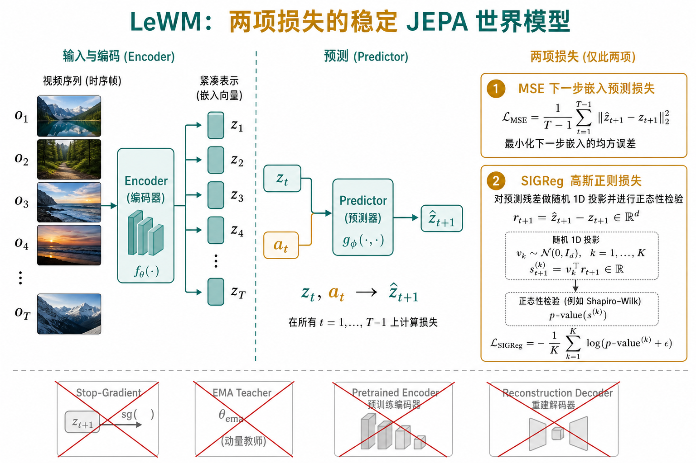
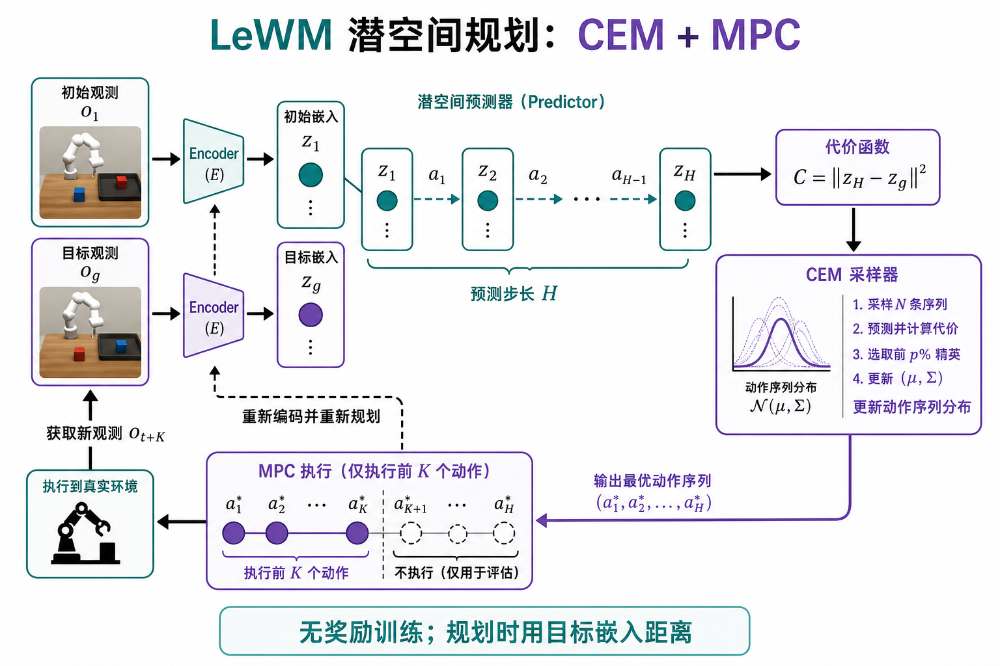
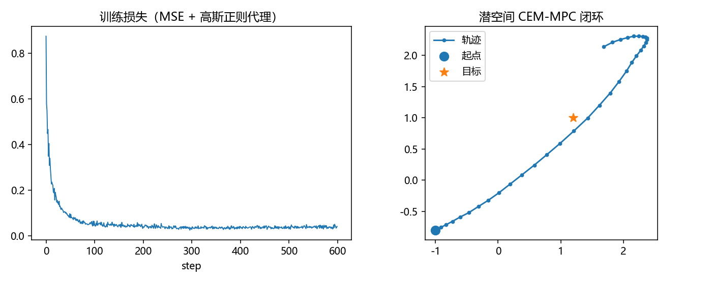

# LeWM：稳定、端到端、能规划的 JEPA

> [!WARNING]
> 🧪 Beta公测版本提示：教程主体已完成，正在优化细节，欢迎大家提Issue反馈问题或建议。

> [JEPA](/world-models/abstract/jepa/) 证明了「预测表征、不重建像素」可行，但工程上常靠 **EMA 教师、stop-gradient、预训练编码器、多项正则** 才能不坍缩。**LeWorldModel（LeWM）**（Maes et al., [arXiv:2603.19312](https://arxiv.org/abs/2603.19312)）把目标收成一句：从原始像素**端到端**学动作条件潜动力学，损失只留两项——下一步嵌入 MSE + SIGReg——然后在潜空间用 **CEM + MPC** 做目标条件规划。

它仍属路径三「抽象状态预测」，位置在 JEPA 与 PETS/PlaNet 之间：表示学习走 JEPA，决策用法回到 PETS 那套在线规划。



> **图解说明**：帧 → 编码器得 $z_t$，预测器以 $z_t,a_t$ 预测 $\hat z_{t+1}$。不需要 EMA、停梯度、预训练编码器或像素解码器；防坍缩交给 SIGReg。结构对应论文 Figure 1。

---

## 一、为什么还要再做一个 JEPA 世界模型？

把现有路线画成三类（论文 Figure 2 的精神）：

| 类型 | 代表 | 优点 | 痛点 |
|------|------|------|------|
| 端到端多损失 | PLDM（VICReg 等多项） | 不依赖大视觉骨干 | 超参多、训练抖 |
| 冻结基础模型编码器 | DINO-WM | 不易坍缩、视觉强 | 表示不可随任务 jointly 调；规划 token 多、慢 |
| 任务相关 / 有奖励 | Dreamer、TD-MPC | 控制强 | 需要奖励或特权状态，不是任务无关的「世界先验」 |

LeWM 的主张：

1. **像素进、端到端**：编码器与预测器一起训；
2. **无奖励、无重建**：离线 $(o,a)$ 轨迹即可；
3. **两项损失、一个有效超参 $\lambda$**：比「六七项正则」可搜；
4. **紧凑嵌入**：比基础模型特征少约两个数量级的 token，规划可快到近实时。

---

## 二、架构：Encoder + Predictor

$$
z_t = \mathrm{enc}_\theta(o_t),\qquad
\hat z_{t+1} = \mathrm{pred}_\phi(z_t, a_t).
$$

- **Encoder**：ViT-Tiny 量级（约 5M），取 `[CLS]` 后再经一层带 BatchNorm 的 MLP 投影。最后一层 LayerNorm 会破坏 SIGReg 需要的各向同性高斯几何，所以投影是必要的。
- **Predictor**：约 6 层 Transformer（约 10M），动作用 **AdaLN** 注入；对历史长度 $N$ 的嵌入做因果掩码自回归预测。预测器后再跟同结构的 projector。

全程**没有**解码回像素的支路。想可视化世界，只能探针或看规划是否成功——这和 Dreamer「训练时重建」刻意相反。

---

## 三、两项损失：MSE + SIGReg

### 3.1 预测损失

教师强制下一步嵌入回归：

$$
\mathcal{L}_{\mathrm{pred}}
=
\big\|
\hat z_{t+1}-z_{t+1}
\big\|_2^2,
\quad
\hat z_{t+1}=\mathrm{pred}_\phi(z_t,a_t).
$$

单靠这一项，最优解可以是「所有 $z$ 都等于同一个常数」——预测误差为零，世界模型却废了。这就是表征坍缩。

### 3.2 SIGReg：用随机投影逼各向同性高斯

**Sketched-Isotropic-Gaussian Regularizer（SIGReg）**（来自 LeJEPA 一脉）不直接在高维做正态性检验，而是：

1. 收集一批嵌入 $\mathbf{Z}$；
2. 抽 $M$ 个随机单位方向 $u^{(m)}$；
3. 对一维投影 $h^{(m)}=\mathbf{Z}u^{(m)}$ 算 Epps–Pulley 一类正态性统计量 $T(\cdot)$；
4. 平均：$
\mathrm{SIGReg}(\mathbf{Z})=\frac1M\sum_m T(h^{(m)}).
$

由 Cramér–Wold：所有一维边缘都像标准正态，联合分布就逼近各向同性高斯。嵌入被「撑开」到充满球面，常数解不再可行。

总目标：

$$
\mathcal{L}_{\mathrm{LeWM}}
=
\mathcal{L}_{\mathrm{pred}}
+
\lambda\,\mathrm{SIGReg}(\mathbf{Z}).
$$

论文默认 $M=1024$、$\lambda=0.1$。消融显示 $M$ 不敏感，**真正要调的几乎只有 $\lambda$**，可用对数复杂度的二分搜索。伪代码（论文 Algorithm 1）：

```python
emb = encoder(obs)                 # (B, T, D)
next_emb = predictor(emb, actions)
pred_loss = mse(emb[:, 1:], next_emb[:, :-1])
sigreg_loss = mean(SIGReg(emb.transpose(0, 1)))
return pred_loss + lambda_ * sigreg_loss
```

梯度打通编码器与预测器，**没有** `stop_grad` / EMA。

---

## 四、潜空间规划：又是 CEM + MPC

训练不含奖励。测试时给定初始观测 $o_1$ 与目标观测 $o_g$：

$$
\hat z_{1}=\mathrm{enc}(o_1),\quad
z_g=\mathrm{enc}(o_g),\quad
\hat z_{t+1}=\mathrm{pred}(\hat z_t,a_t),
$$

$$
a_{1:H}^\star
=
\arg\min_{a_{1:H}}
\big\|\hat z_H - z_g\big\|_2^2.
$$

用 **CEM** 采样动作序列、留下终端潜距离小的精英；用 **MPC** 只执行前 $K$ 步再重规划——和 [PETS](/world-models/abstract/pets/)、[PlaNet](/world-models/abstract/rssm/) 同构，打分空间换成「目标嵌入距离」。



> **图解说明**：对应论文 Figure 4。世界模型参数在规划时冻结；贵的是采样滚动，不是再训一遍策略。

相对 DINO-WM：LeWM 嵌入更短，论文报告规划可快约 **48×**，单次规划可压到约 1 秒量级（取决于 $H$ 与采样数）。相对 Dreamer：这里**没有**想象里学 Actor——更偏「任务无关动力学 + 在线规划」。

---

## 五、它学到了什么物理？

论文不止刷成功率，还做了两类「世界理解」检查：

1. **探针**：线性/非线性头从 $z$ 读出位置、角度等物理量——说明嵌入不是糊成一团；
2. **违背预期（surprise）**：给物理上不合理的轨迹，预测误差应尖峰——模型「吃惊」。

局限也写得很清楚：在极简、低内禀维度环境（如 Two-Room）上，硬逼高维各向同性高斯可能**过度正则**，反而不如 PLDM / DINO-WM。SIGReg 不是免费午餐。

---

## 六、和前后文怎么接

| | V-JEPA 2-AC | LeWM | Dreamer |
|--|-------------|------|---------|
| 编码器 | 大规模预训练后冻结 | 端到端从像素学 | RSSM / tokenizer |
| 防坍缩 | EMA + 停梯度 | SIGReg | 重建 + KL / free bits |
| 决策 | 潜空间 MPC | 潜空间 CEM-MPC | 想象 Actor-Critic |
| 奖励 | 规划用目标距离 | 同左 | 训练需要奖励信号 |

本章 `demo.py` 用低维玩具复现「MSE + 高斯正则 + 潜空间 CEM」，不是 15M ViT；手感对齐即可。



> 运行 `code/demo.py` 生成。左：两项损失下降；右：潜空间规划驱动质点靠近目标。

---

## 七、小结

| 概念 | 一句话 |
|------|--------|
| LeWM | 端到端 JEPA 世界模型：两项损失 + 潜空间规划 |
| $\mathcal{L}_{\mathrm{pred}}$ | 下一步嵌入 MSE，逼动力学可预测 |
| SIGReg | 随机投影上的正态性正则，替代 EMA/停梯度 |
| 潜空间 CEM | 最小化 $\|\hat z_H-z_g\|^2$，MPC 滚动执行 |
| 定位 | 路径三：比 JEPA 更「能控」，比 Dreamer 更「任务无关」 |

> 路径三其余节点：回到 [MuZero](/world-models/abstract/muzero/) 看搜索式隐式模型，或进入路径四 [因果阶梯](/world-models/causal/ladder/)。

## 📥 Code

| File | View | Download |
|------|------|----------|
| demo.py | [Open](./code-demo) | <a href="/notebook/code/world-models/abstract/lewm/demo.py" target="_blank" download>Download</a> |
| exercise.py | [Open](./code-exercise) | <a href="/notebook/code/world-models/abstract/lewm/exercise.py" target="_blank" download>Download</a> |

## 参考

1. Maes, L., Le Lidec, Q., Scieur, D., LeCun, Y., et al. (2026). LeWorldModel: Stable End-to-End Joint-Embedding Predictive Architecture from Pixels. [[arXiv:2603.19312](https://arxiv.org/abs/2603.19312)]
2. Assran, M., et al. (2025). V-JEPA 2. [[arXiv:2506.09985](https://arxiv.org/abs/2506.09985)]
3. LeCun, Y. (2022). A Path Towards Autonomous Machine Intelligence. (JEPA)
4. Chua, K., et al. (2018). PETS. [[arXiv:1805.12114](https://arxiv.org/abs/1805.12114)]（潜空间规划的祖先形态）
