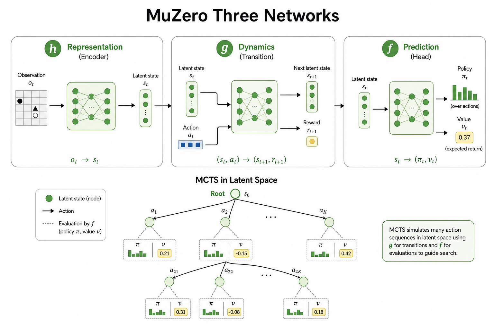

# MuZero：不显式建模观测的世界模型

> [!WARNING]
> 🧪 Beta公测版本提示：教程主体已完成，正在优化细节，欢迎大家提Issue反馈问题或建议。

## 1. 为什么叫「隐式」？

经典 model-based RL 常预测下一观测 $\hat o_{t+1}$。MuZero（Schrittwieser et al., 2020）发现：对规划而言，**不必重建像素**；只需潜状态足以预测奖励、策略与价值。

三个网络：

| 符号 | 作用 |
|------|------|
| $h$ | 表示：观测 → 潜状态 |
| $g$ | 动力学：潜状态 + 动作 → 下一潜状态 + 奖励 |
| $f$ | 预测：潜状态 → 策略与价值 |

搜索（MCTS）在潜空间展开，用 $f$ 提供先验与叶子价值。

> **图解说明**：$h$ 把观测压成潜状态；$g$ 在潜空间走一步并预测奖励；$f$ 给出策略先验与价值。MCTS 完全在潜空间展开——不必重建像素，只要对规划「够用」。

## 2. 训练目标（直觉）

沿真实轨迹展开 $K$ 步，对齐：

- 策略：搜索改进后的 $\pi$ vs $f$ 的策略头
- 价值：n-step / Bootstrap 回报
- 奖励：动力学头预测的即时奖励

## 3. 与 Dreamer 对比

| | Dreamer | MuZero |
|--|---------|--------|
| 世界模型 | 显式潜观测/重构倾向强 | 隐式，面向搜索 |
| 决策 | 想象轨迹上 actor-critic | MCTS + 学习模型 |
| 典型舞台 | 连续控制、视觉控制 | 棋类、Atari 规划 |

## 4. 代码

[demo.py](./code-demo.md) 用捕猎一维任务对比 greedy 与 search-like 策略。

## 5. 小结

MuZero 证明：**为决策服务的世界模型可以不重建观测**。下一章转向表示预测路线 [JEPA](/world-models/abstract/jepa/)。
