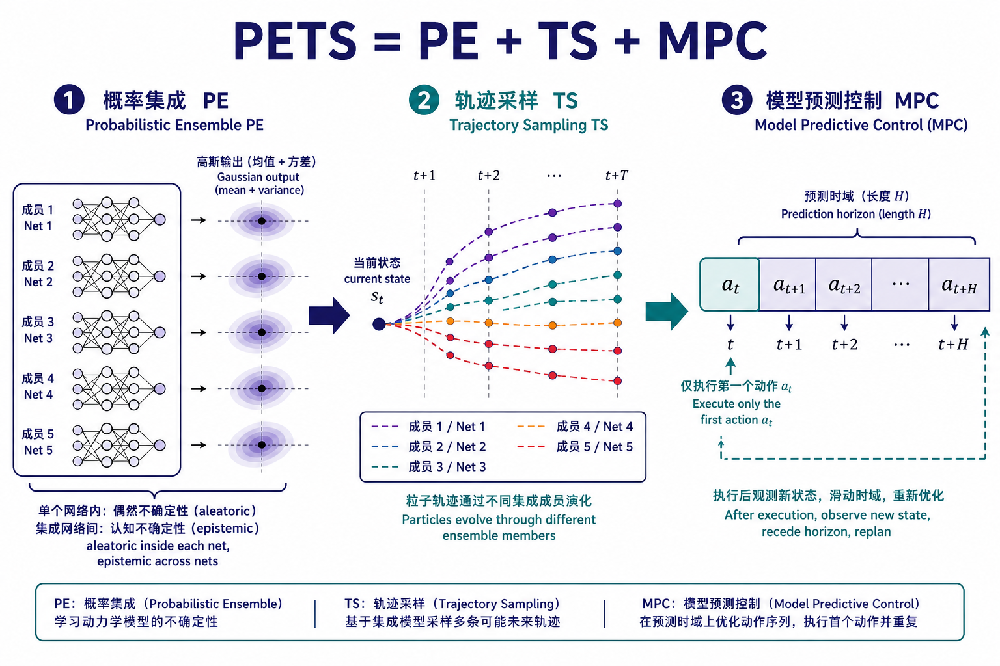
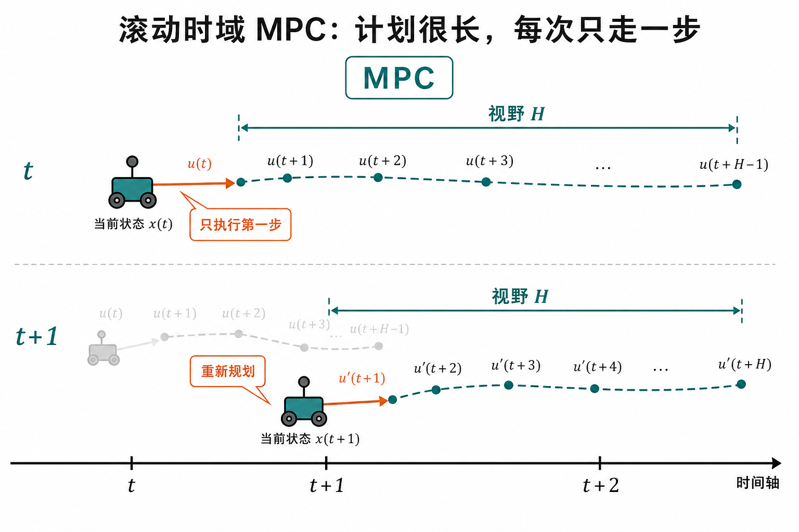
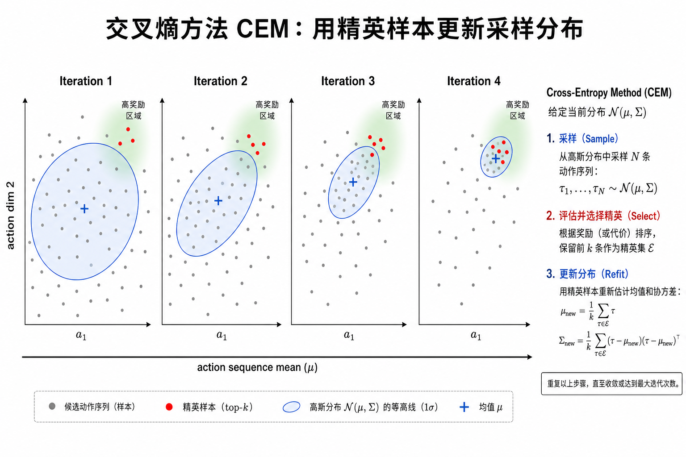
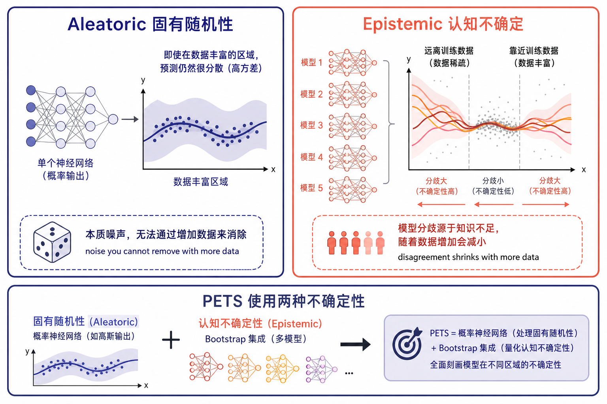
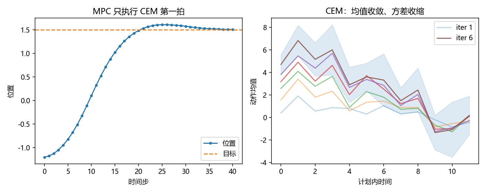

# PETS：在不确定的动力学上做规划

> [!WARNING]
> 🧪 Beta公测版本提示：教程主体已完成，正在优化细节，欢迎大家提Issue反馈问题或建议。

> 在像素世界模型（PlaNet / Dreamer）之前，先把一件更朴素的事情讲透：**如果你已经有（或正在学）一个状态空间里的动力学模型，怎么用它选动作？** 答案几乎总是 **MPC**；把候选动作搜好的常用工具是 **CEM**；让深度网络别在数据少时乱规划的，是 **PETS** 对两种不确定性的处理。

路径三「抽象状态预测」的入口不是 RSSM，而是 2018 年 Chua 等人的 [PETS](https://arxiv.org/abs/1805.12114)（*Probabilistic Ensembles with Trajectory Sampling*）。它假设你能观测到相对干净的状态向量 $s_t$（位置、速度、关节角……），用神经网络拟合 $s_{t+1}\mid s_t,a_t$，再在这个模型里做滚动规划。PlaNet 后来把「规划」搬进潜空间，Dreamer 再把「每步 CEM」蒸馏成策略网络——三条线共用同一套 **模型 → 想象轨迹 → 选动作** 骨架。

---

## 一、先分清三块积木：模型、MPC、CEM

很多人把 PETS、MPC、CEM 混成一个词。它们不在同一层：

| 积木 | 回答的问题 | PETS 里怎么用 |
|------|------------|----------------|
| **动力学模型** $f$ | 若现在是 $s$，做 $a$，下一步大概去哪？ | 概率神经网络的**集成**（PE） |
| **MPC** | 有了 $f$，这一拍该执行哪个 $a$？ | 优化一段有限视野的动作序列，**只执行第一步**，下一拍重做 |
| **CEM** | 动作序列是连续高维的，怎么搜？ | 用高斯采样 → 留精英 → 更新采样分布，迭代几次 |

直觉类比：

- 模型是「脑子里的物理引擎」；
- MPC 是「每走一步都重新看一眼地图再计划」；
- CEM 是「别穷举，围着上次表现好的动作序列附近再撒一批」。



> **图解说明**：PETS 把「学一个会说不确定度的动力学」和「用粒子把不确定度传到未来」以及「MPC 只执行第一拍」焊在一起。来源结构对应论文 Fig.1（Chua et al., 2018）。

---

## 二、MPC：计划可以很长，真正落地的只有一步

**模型预测控制（Model Predictive Control）** 不是强化学习专有名词，工业界用了几十年。给定当前状态 $s_t$、预测视野 $H$、阶段奖励 $r(s,a)$（或代价 $c$ 取负），求解

$$
a_{t:t+H-1}^\star
= \arg\max_{a_{t:t+H-1}}
\sum_{k=0}^{H-1}
\mathbb{E}\big[r(s_{t+k}, a_{t+k})\big]
\quad\text{s.t.}\quad
s_{t+k+1}\sim f(\cdot\mid s_{t+k}, a_{t+k}).
$$

关键操作只有一句：**只把 $a_t^\star$ 发给环境**，等到 $s_{t+1}$ 真的来了，把视野窗口往前滚一格，**从头再优化**。所以叫滚动时域（receding horizon）。

为什么不把整段 $a_{t:t+H}^\star$ 一次性播完？

1. **模型会错**。开环播 $H$ 步，误差按复合函数放大。
2. **观测会来**。新状态是对「真实世界」的一次免费校正，比继续相信旧计划更值钱。
3. **任务视野可以比 $H$ 长**。你不必在优化器里写死总时长 $T$。



> **图解说明**：虚线是脑子里的 $H$ 步计划，实线箭头才是真正执行的 $a_t$。下一拍从新状态重新画虚线。

PETS、PlaNet 都走这条路。区别在于 $f$ 是状态空间网络还是潜空间 RSSM，以及期望 $\mathbb{E}$ 怎么算（下一节的粒子）。

---

## 三、CEM：用精英样本搬动搜索分布

动作序列 $a_{t:t+H}$ 若每步 $d_a$ 维，搜索空间是 $\mathbb{R}^{H\cdot d_a}$。随机射击（random shooting）能用，但大量样本浪费在明显很差的序列上。

**交叉熵方法（Cross-Entropy Method, CEM）**（Botev et al., 2013）把「搜最优序列」改成「拟合一个越来越尖的采样分布」：

1. 维护一个对角高斯 $\mathcal{N}(\mu, \Sigma)$，一开始方差很大（探索）。
2. 从中采样 $N$ 条完整动作序列。
3. 用动力学模型（加粒子）给每条序列打分：想象轨迹的累计奖励。
4. 留下分数最高的 $K$ 条（**精英 elite**）。
5. 用精英的经验均值 / 方差更新 $\mu,\Sigma$（可加一点惯性，避免一步缩太死）。
6. 重复 $M$ 轮。最后一轮的 $\mu$ 或最优精英的第一步，作为 MPC 的 $a_t$。



> **图解说明**：前几轮分布很宽；精英把质量推到高回报区域后，采样自动集中。PlaNet 的规划器几乎就是这个循环，只是打分发生在 RSSM 潜空间。

和梯度优化的对比（这对理解 Dreamer 很重要）：

| | CEM（PETS / PlaNet） | 反传梯度（Dreamer Actor） |
|--|----------------------|---------------------------|
| 需要 $f$ 可微吗 | 不需要 | 需要（或用 REINFORCE） |
| 每步算力 | 在线采样很多条轨迹 | 训练时一次，部署时一次前向 |
| 短视 | 受 $H$ 限制，除非加价值函数 | 用 $V_\lambda$ 引导视野外回报 |
| 适合 | 模型在变、任务在变、想立刻规划 | 想把规划蒸馏成快策略 |

PETS 相对 Nagabandi et al. 2017 的一个工程改进，就是把 random shooting 换成 CEM。

---

## 四、两种不确定：固有噪声 vs 我还没看够数据

深度网络当动力学时，早期数据很少，点预测会**自信地错**，MPC 会顺着错模型冲向悬崖。PETS 的核心论点：必须把不确定传进规划。

论文区分两类（Lakshminarayanan 集成、Depeweg 等）：

**Aleatoric（偶然 / 固有）**：系统或观测本身有噪声。再采一万条数据，硬币仍有正反面。PETS 用**概率网络**：输出 $\mathcal{N}(\mu_\theta(s,a), \Sigma_\theta(s,a))$，损失是高斯负对数似然：

$$
\mathcal{L}_{\text{Gauss}}
= \sum_n
\big(\mu-\Delta s\big)^\top \Sigma^{-1}(\mu-\Delta s)
+ \log\det\Sigma.
$$

（实现里常预测状态增量 $\Delta s = s_{t+1}-s_t$。）

**Epistemic（认知）**：我的函数还没被数据钉死。数据变多，这类不确定应当缩小。PETS 用 **$B$ 个 bootstrap 集成**（文中 $B=5$ 就够）：每个成员在有放回重采样的数据集上训练。成员在训练数据附近意见一致，在没见过的 $(s,a)$ 上吵起来——争吵就是 epistemic。



> **图解说明**：单网的方差 ≠「我没学够」。集成的分歧才会随数据消失。PETS 的 PE（Probabilistic Ensemble）= 每个成员都是概率网 + 成员之间再集成。

对照表（论文 Table 1）：

| 模型 | Aleatoric | Epistemic |
|------|:---:|:---:|
| 确定性网络 D | 否 | 否 |
| 概率网络 P | 是 | 否 |
| 确定性集成 DE | 否 | 是 |
| **概率集成 PE（PETS）** | **是** | **是** |

只建模其中一种，规划都会在「数据少但任务难」的机器人接触动力学上翻车。

---

## 五、轨迹采样 TS：把不确定变成一束粒子

有了 $p(s_{t+1}\mid s_t,a_t)$，累计奖励的期望一般没有闭式解。PETS 用 **粒子（trajectory sampling）**：从当前 $s_t$ 复制 $P$ 个粒子，每步按某个集成成员的高斯再采样。

两个变体：

- **TS1**：每个时间步粒子可以重新抽一个 bootstrap 成员。相当于不断从「所有还算可信的动力学」里再抽一次，限制轨迹因为「绑死某一个错模型」而疯掉。
- **TS∞**：一条粒子终身绑定同一个成员。更接近「真实 $f$ 是固定未知函数」：成员间的差异是 epistemic，同一成员内部的抖动是 aleatoric。论文指出 TS∞ 更便于把两种方差分开，供以后做探索（PETS 正文没做定向探索，但把接口留好了）。

打分时，一条候选动作序列的回报 ≈ 所有粒子轨迹奖励的平均。CEM 看到的不是一条幻觉轨迹，而是**一束带不确定的未来**。

规划伪代码（与论文 Algorithm 一致，略去超参）：

```text
每拍 t:
  用当前 s_t 初始化粒子
  初始化 CEM 的 (μ, Σ)
  重复 M 轮:
    采样 N 条动作序列
    对每条序列用 PE+TS 滚 H 步，算平均回报
    用 top-K 精英更新 (μ, Σ)
  执行精英序列的第一个动作
  得到真实 s_{t+1}，把 (s_t, a_t, s_{t+1}) 写入数据集
  周期性用负对数似然重训集成
```

没有 Actor 网络。策略就是「此刻的 CEM」。这正是下一章 PlaNet 仍然采用、再下一章 Dreamer 决定放弃（太贵、难用价值函数看远）的方案。

---

## 六、和后文的接口：状态空间 → 潜空间 → 梦里学策略

| | PETS | PlaNet | Dreamer |
|--|------|--------|---------|
| 状态 | 给定 $s_t$（或低维特征） | 像素 → RSSM 潜状态 | 同左 |
| 规划 | CEM + MPC | 潜空间 CEM + MPC | 想象轨迹上的 Actor-Critic |
| 不确定 | PE + TS | 随机潜变量 $s_t$ | 离散/高斯潜变量 + 想象 |
| 部署成本 | 每步规划 | 每步规划 | 一次前向 |

PETS 在 HalfCheetah 等 MuJoCo 任务上用远少于 PPO / SAC 的交互达到接近 model-free 的渐近成绩——前提是**状态可观测**。像素控制要把 $s$ 自己学出来，那是 RSSM 的工作。

本章 `demo.py` 在一维质点上复现最小 CEM：集成给出下一步均值，粒子传播不确定，MPC 只执行第一拍去追目标。它不是论文的 MuJoCo 实验，但足够让你看见「分布收缩」和「滚动重规划」两件事。



> 运行 `code/demo.py` 后生成。左：位置追目标；右：CEM 迭代中动作均值收敛、方差收缩。

---

## 七、小结

| 概念 | 一句话 |
|------|--------|
| MPC | 优化 $H$ 步动作，只执行第 1 步，状态更新后再优化 |
| CEM | 对动作序列的高斯采样 + 精英更新，无需求导 |
| Aleatoric | 数据再多也在的噪声 → 网络输出方差 |
| Epistemic | 数据不足导致的函数不确定 → 集成分歧 |
| PE | 概率网络的 bootstrap 集成 |
| TS | 用粒子把 PE 的不确定滚到未来 |
| PETS | PE + TS + CEM-MPC，样本高效的状态空间 MBRL |

> 下一节 [RSSM 与 PlaNet](/world-models/abstract/rssm/)：当观测变成像素，规划改在潜空间里做同一套 CEM。

## 📥 Code

| File | View | Download |
|------|------|----------|
| demo.py | [Open](./code-demo) | <a href="/notebook/code/world-models/abstract/pets/demo.py" target="_blank" download>Download</a> |
| exercise.py | [Open](./code-exercise) | <a href="/notebook/code/world-models/abstract/pets/exercise.py" target="_blank" download>Download</a> |

## 参考

1. Chua, K., Calandra, R., McAllister, R., & Levine, S. (2018). Deep Reinforcement Learning in a Handful of Trials using Probabilistic Dynamics Models. *NeurIPS*. [[arXiv:1805.12114](https://arxiv.org/abs/1805.12114)]
2. Botev, Z. I., et al. (2013). The Cross-Entropy Method for Optimization. *Handbook of Statistics*.
3. Camacho, E. F., & Alba, C. B. (2013). *Model Predictive Control*. Springer.
4. Nagabandi, A., et al. (2017). Neural Network Dynamics for Model-Based Deep Reinforcement Learning with Model-Free Fine-Tuning. [[arXiv:1708.02596](https://arxiv.org/abs/1708.02596)]
5. Lakshminarayanan, B., Pritzel, A., & Blundell, C. (2017). Simple and Scalable Predictive Uncertainty Estimation using Deep Ensembles. *NeurIPS*.
