# wm02 RSSM 与 PlaNet：把 CEM 搬进潜空间

> [!WARNING]
> 🧪 Beta公测版本提示：教程主体已完成，正在优化细节，欢迎大家提Issue反馈问题或建议。

> 从"World Models"的 V-M-C 三件套，到 PlaNet 的 RSSM —— 如何让 Agent 在潜空间里学会做梦。先验 / 后验上的 KL 记号见 [信息论精简](/math/information/)；「压缩观测还要留下多少信息」的通信语言见 [信息论](/information/)（率失真一章尤其近）。

---

## 一、Ha & Schmidhuber 2018：World Models 的 V-M-C

上一章 [PETS](/world-models/abstract/pets/) 已在状态空间讲清 MPC / CEM。本节回到像素世界的**经典起源**——Ha & Schmidhuber 2018 的 *World Models*，以及随后 PlaNet 提出的 RSSM。

World Models 把一个能"做梦"的 Agent 拆成三个模块：

| 模块 | 名称 | 职责 | 典型实现 |
|------|------|------|---------|
| **V** | Vision | 把高维观测（游戏画面）压缩成低维潜向量 $z_t$ | VAE |
| **M** | Memory | 学习动力学 $p(z_{t+1} \mid z_{\le t}, a_{\le t})$，同时预测 done | MDN-RNN |
| **C** | Controller | 只看 $(z_t, h_t)$ 就决定动作 $a_t$ | 极小的线性策略（CMA-ES 训练） |

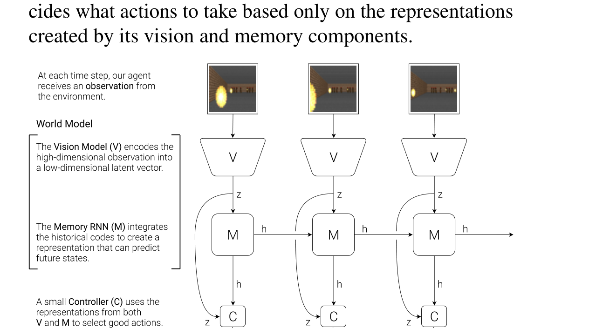

> 来源：Ha & Schmidhuber, *World Models*, Figure 4。V 压缩像素，M 在潜空间预测，C 只看紧凑特征决策。

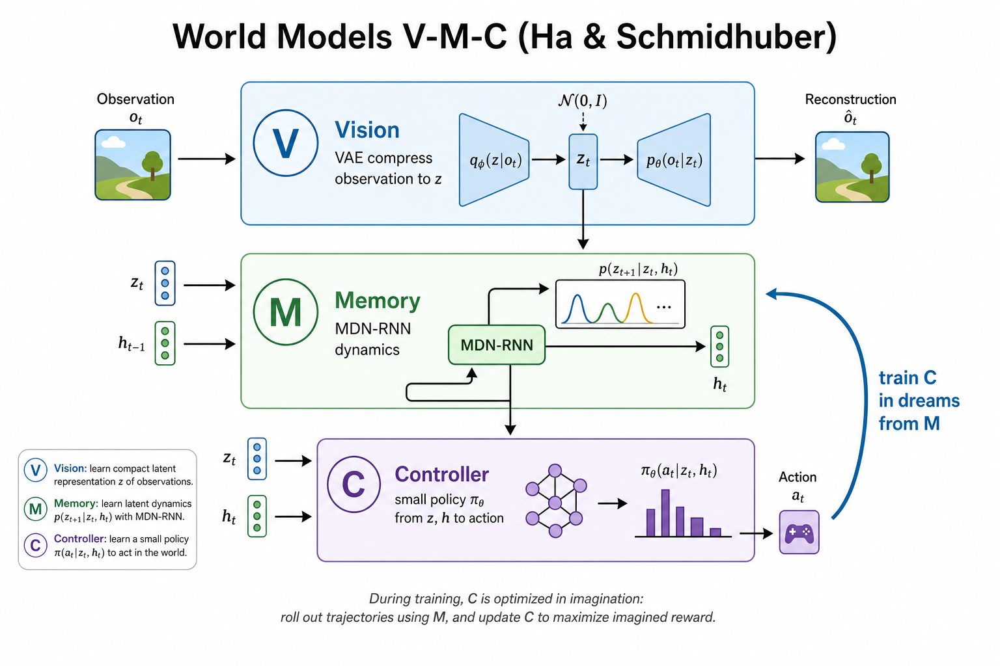

> **图解说明**：V 把像素压成潜向量，M 在潜空间里学动力学并生成「梦境」，C 只吃紧凑的 $(z,h)$ 做决策——策略可以几乎完全在梦里练。

最关键的实验结论是：**Controller 可以完全在 M 生成的"梦境"里训练**，事后迁移到真实 VizDoom 环境依然有效。这第一次在深度学习框架下证明了"脑内练习也能学会真实技能"。

但原始 MDN-RNN 有两个痛点：

1. **开环预测误差累积快**：RNN 直接预测下一帧的潜向量，多步后容易飘离真实分布
2. **缺少明确的"先验 / 后验"分工**：训练时看到观测、想象时不看观测，这两种用法混在同一个网络里，不够干净

PlaNet（Hafner et al., 2019）用 **RSSM（Recurrent State-Space Model）** 系统了这两个问题——这也是 Dreamer 系列的底座。

---

## 二、RSSM：确定性状态 + 随机状态

RSSM 把潜状态拆成两块，对应 PlaNet Figure 2(c) 里的方块 $h$ 和圆圈 $s$：

| 符号 | 角色 | 这一步从哪来 | 这一步送到哪 |
|------|------|--------------|--------------|
| $h_t$ | 确定性记忆（GRU 隐状态） | `GRUCell` 用 $s_{t-1},a_{t-1}$ 更新内部的 $h_{t-1}$ | 先验、后验、解码器 |
| $s_t$ | 随机状态（对角高斯采样） | 训练：后验；想象：先验 | 解码器；**下一拍**才作为 $s_{t-1}$ 进 GRU |

正确的一步顺序和 `demo.py` 的 `forward` / `imagine` 循环体一一对应（先有 $h_t$，才有两套 $(\mu,\sigma)$，才有 $s_t$，最后才解码）：

$$
\begin{aligned}
h_t &= \mathrm{GRUCell}\bigl([s_{t-1};\,a_{t-1}],\ h_{t-1}\bigr) \\
(\mu_p,\sigma_p) &= \mathrm{prior\_net}(h_t) && \text{先验：不看 } o_t \\
e_t &= \mathrm{enc}(o_t) && \text{仅训练；像素用 CNN，本章 demo 观测已是 }\mathbb{R}^2\text{，enc 为恒等} \\
(\mu_q,\sigma_q) &= \mathrm{posterior\_net}([h_t;\,e_t]) && \text{仅训练} \\
s_t &= \mu_q + \sigma_q\,\varepsilon,\quad \varepsilon\sim\mathcal{N}(0,I) && \text{训练采样} \\
s_t &= \mu_p + \sigma_p\,\varepsilon && \text{想象采样（本章评估用均值 }\mu_p\text{）} \\
\hat o_t &= \mathrm{dec}([h_t;\,s_t]) \\
&\quad D_{KL}\big(\mathcal{N}(\mu_q,\sigma_q)\,\|\,\mathcal{N}(\mu_p,\sigma_p)\big) && \text{只比两套参数，不经过采样节点}
\end{aligned}
$$

代码就是 `h = gru(cat(s, prev_action), h)`。先验 / 后验的 MLP **只输出** $(\mu,\sigma)$，**不是**直接输出 $s_t$。PlaNet 论文把后验写成 $q(s_t\mid h_t,o_t)$，实现上一定是先编码再和 $h_t$ 拼接——像素不能直接塞进高斯头。

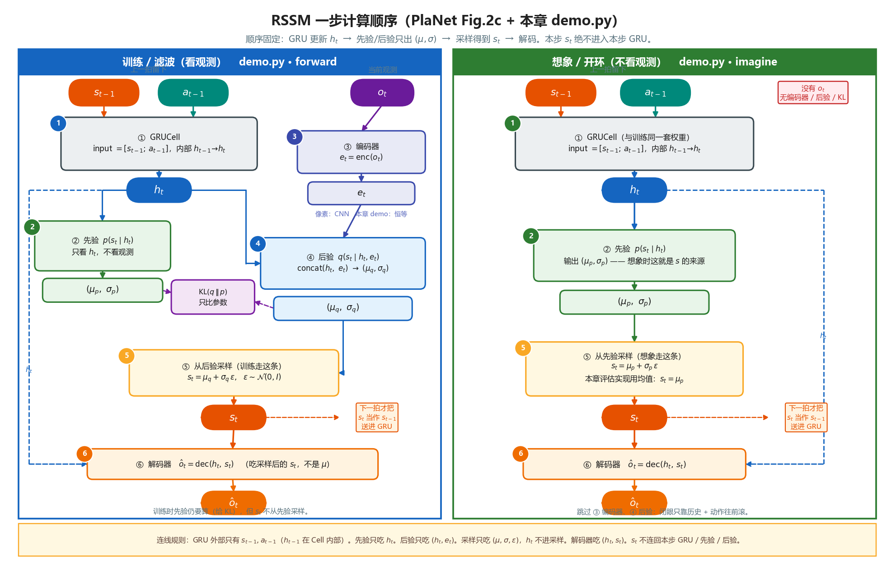

> **图解说明（请按编号读）**：左列是训练 `forward`，右列是想象 `imagine`。① GRU 的外部输入只有 $s_{t-1},a_{t-1}$，$h_{t-1}\to h_t$ 在 Cell 内部。② 先验只吃 $h_t$，吐 $(\mu_p,\sigma_p)$。③ 只有训练才有 $o_t\to\mathrm{enc}\to e_t$。④ 后验只吃 $(h_t,e_t)$，吐 $(\mu_q,\sigma_q)$。⑤ 训练从后验采样、想象从先验采样；$h_t$ **不进**采样节点。⑥ 解码器吃的是 $(h_t,$ 采样后的 $s_t)$。KL 连的是两套高斯参数。虚线橙色：$s_t$ 要等到**下一拍**才变成 GRU 的 $s_{t-1}$。

直觉分工：

- **$h_t$（确定性）**：记住「长期、确定性强」的信息——比如目标在转圈、角速度大致是多少
- **$s_t$（随机）**：表达不确定性——比如观测噪声让你暂时分不清精确位置
- **先验 $p(s_t\mid h_t)$**：部署 / 想象时用——**闭着眼睛**只凭历史猜下一步
- **后验 $q(s_t\mid h_t,e_t)$**：训练时用——先把 $o_t$ 编成 $e_t$，再睁眼修正

不要画进图里的边（也是上一版示意图最容易画错的地方）：

- $s_t \to$ **本步** GRU（环；$s_t$ 是在 $h_t$ **之后**才采样出来的）
- 把 $h_{t-1}$ 画成和 $s_{t-1},a_{t-1}$ 并列的第三路外部输入（它已经在 GRUCell 里）
- 先验 / 后验直接吐 $s_t$ 进解码器（中间必须有 $(\mu,\sigma)$ 和采样）
- $h_t$ 进入采样节点（采样只用 $\mu,\sigma,\varepsilon$；$h_t$ 去先验网、后验网、解码器）
- 想象路径还画编码器 / 后验 / KL（闭眼 rollout 没有 $o_t$）

::: details 逐步对照：`demo.py` 循环体在算什么（点击展开）

`forward` 每一步（训练，教师强制）：

1. `h = gru(cat(s, prev_action), h)` → 得到本步 $h_t$。此时的 `s` 仍是 **$s_{t-1}$**。
2. `prior_mean, prior_std = self.prior(h)` → $(\mu_p,\sigma_p)$，不看观测。
3. `post_mean, post_std = self.posterior(h, obs_seq[:, t])` → 本章观测是 2D，等价于 $e_t=o_t$，再 `cat(h, e_t)` 进后验头。
4. `s = reparameterize(post_mean, post_std)` → **现在**才得到 $s_t$。
5. `obs_pred = decode(h, s)` → $\hat o_t=\mathrm{dec}(h_t,s_t)$。
6. 重建损失用 $\hat o_t$ 对 $o_t$；KL 用两套 $(\mu,\sigma)$ 的解析式，不经过 $\varepsilon$。
7. `prev_action = act_seq[:, t]`，循环变量 `s` 带着 $s_t$ 进入下一拍。

`imagine` 热启动用后验（睁眼），之后每一步只有 ① GRU → ② 先验 → ⑤ 用 $\mu_p$（评估不去噪采样）→ ⑥ 解码。没有 ③④，也没有 KL。

所以必须写成 **`GRUCell` 逐步调用**，不能包成「一整段序列进 GRU」：中间还要插先验、后验、采样。PlaNet 在 $(h,s)$ 上跑 CEM，和 PETS 同一套规划，只是状态变成学出来的潜变量。

:::

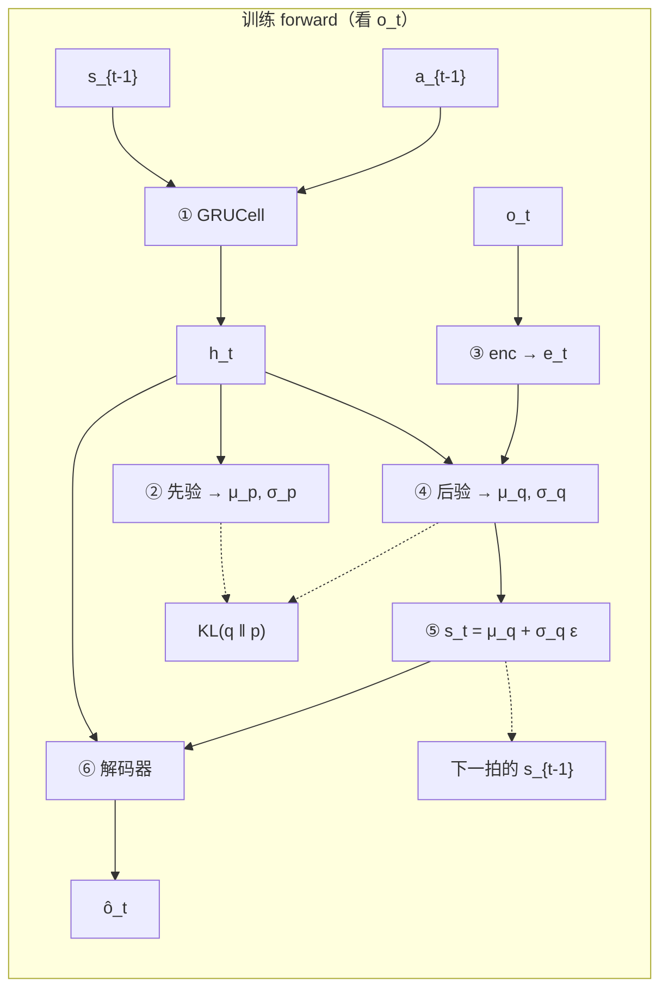

---

## 三、训练目标：序列版 ELBO

RSSM 的损失函数是变分下界（ELBO）的序列版本：

$$
\mathcal{L} = \mathbb{E}_{q}\left[\sum_{t=1}^{T}\underbrace{\log p(o_t \mid h_t, s_t)}_{\text{重建项}} - \underbrace{D_{KL}\big(q(s_t\mid h_t,o_t)\,\|\,p(s_t\mid h_t)\big)}_{\text{一致性惩罚}}\right]
$$

- **重建项**：让 $(h_t, s_t)$ 能还原出观测——逼迫表示学习"有用的"信息
- **KL 项**：让先验逼近后验——逼迫模型学会"不看观测也能猜准"

实践中还有两个重要技巧：

1. **Free-nats**：当 KL 低于某个阈值（如 0.5 nats）时不再惩罚，防止后验过早"躺平"变成先验（posterior collapse）
2. **训练用后验、想象用先验**：训练时每一步都用后验采样（更准确的监督信号）；真正"做梦"时只用先验做多步 rollout

对角高斯之间的 KL 有解析解：

$$
D_{KL}\big(\mathcal{N}(\mu_q,\sigma_q)\,\|\,\mathcal{N}(\mu_p,\sigma_p)\big)
= \sum_i\left[\log\frac{\sigma_{p,i}}{\sigma_{q,i}} + \frac{\sigma_{q,i}^2 + (\mu_{q,i}-\mu_{p,i})^2}{2\sigma_{p,i}^2} - \frac{1}{2}\right]
$$

---

## 四、玩具演示：在潜空间里想象圆周轨迹

本章的 `demo.py` 构造了一个极简 2D 环境：质点被 PD 控制器驱动着追踪一个旋转目标点。模型只能看到带噪声的位置观测，真实动力学参数（半径、角速度）不可见。

我们从零实现一个简化版 RSSM（GRU + 对角高斯先验/后验 + MLP 解码器），训练后做两件事：

1. **开环想象**：用前 10 步真实观测热启动，之后完全"闭眼"，只用先验 + 动作序列预测未来
2. **对比闭环滤波**：每一步都看真实观测（用后验），误差几乎不随步数增长

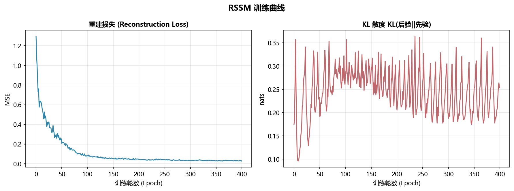

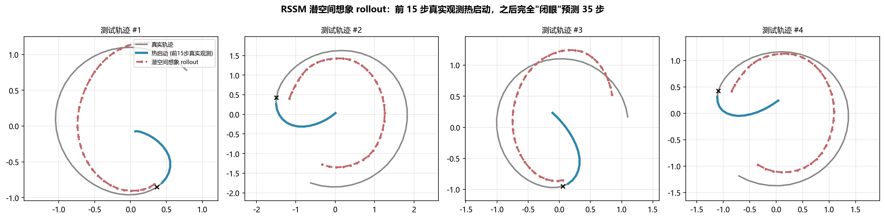

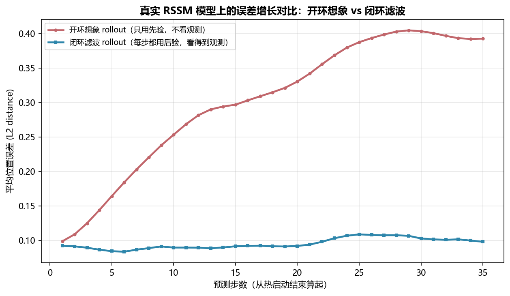

核心观察：

- 热启动后，模型能在潜空间里大致跟上真实轨迹的弯曲方向
- 开环想象的误差会随步数缓慢增长（没有观测纠错）
- 闭环滤波的误差几乎平坦——每一步观测都在"重置"状态估计
- 因为状态被压缩到低维潜空间（而非像素空间），误差增长速度远比 wm01 的像素 rollout 类比温和——这正是"在潜空间做梦"的价值

---

## 五、PlaNet：像素进、潜空间里做 PETS 那套规划

[PETS](/world-models/abstract/pets/) 假设 $s_t$ 已经是可用的状态向量。**PlaNet**（*Deep Planning Network*，Hafner et al., ICML 2019）要解决的是：观测只有像素时，仍然做 **无策略网络的在线规划**。

把上一章三件套对号入座：

| PETS | PlaNet |
|------|--------|
| 状态 $s_t$ 给定 | 像素 $o_t$ → 编码器 + RSSM 得到信念 $q(s_t\mid o_{\le t}, a_{<t})$ |
| PE 神经网络 | RSSM 的随机潜变量表达不确定（随机 $s_t$ + 确定性 $h_t$） |
| CEM + MPC | **完全相同**：潜空间采样动作序列、先验滚动、只执行第一拍 |

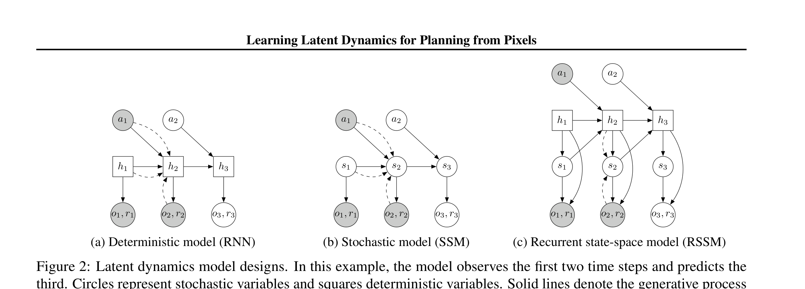

> 来源：PlaNet Figure 2。方块是确定性变量，圆是随机变量；实线生成、虚线推断。纯 RNN 缺随机性，纯 SSM 缺长期记忆，RSSM 两者都要——这是后面 Dreamer V1–V3 的心脏。

算法循环（论文 Algorithm 1，压缩写）：

1. 用少量随机回合种子填充数据集；
2. 重复：从回放抽片段，用序列 ELBO 更新 RSSM（编码器、转移、奖励头、解码器）；
3. 一回合内每步：用历史推断当前信念 → **CEM 规划器**（附录 Algorithm 2）给出 $a_t$ → 加探索噪声执行 → 把新 $(o,a,r)$ 写入数据集。

没有 Actor。部署成本 = 每步一次 CEM。这是样本可以很省、算力会很贵的组合。

### 5.1 Latent overshooting：多步预测不一定等于一步 KL 最优

标准 ELBO 主要对齐**一步**先验与后验。规划却要滚 $H$ 步。有限容量下，「一步损失最小」不必「多步预测最好」。

PlaNet 提出 **latent overshooting**：不额外解码图像，只在潜空间对多步先验再加 KL，强迫开环预测在更远处仍能对上后验。计算比多步像素重建便宜。

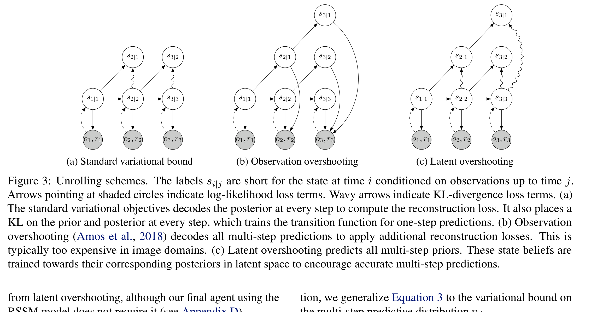

> 来源：PlaNet Figure 3。实验里 RSSM 本身已经很强，overshooting 不是必须开关；这个思想后来变成 Dreamer 里更系统的 $\mathcal{L}_{\mathrm{dyn}}$ / $\mathcal{L}_{\mathrm{rep}}$ 拆分。

### 5.2 开环视频预测：规划凭什么敢滚那么远？

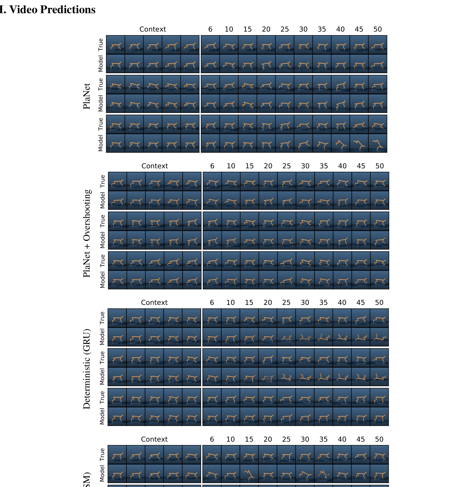

> 来源：PlaNet Figure 10。给定前几帧上下文和之后的动作，不再看中间帧。若开环画面在物体接触、出画（cartpole 镜头固定）上仍大致合理，CEM 的奖励估计才不是噪声。

### 5.3 PlaNet 的天花板（Dreamer 要补的洞）

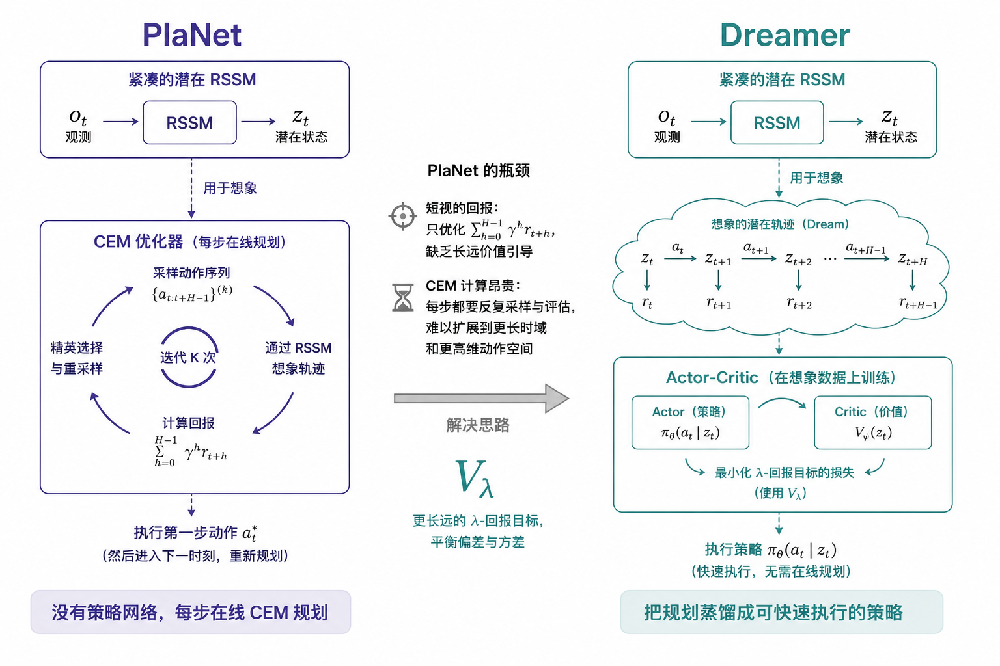

1. **短视**：目标几乎是有限 $H$ 的奖励和，没有 $V_\lambda$ 看视野外；
2. **无梯度**：CEM 用不上「神经网络可微」这个好处；
3. **每步都贵**：实时控制、尤其是更高维动作时，在线采样会顶满预算。

下一章 [Dreamer](/world-models/abstract/dreamer/) 的第一件事，就是把 CEM 换成想象轨迹上的 Actor-Critic，同时把 RSSM 原封留下。

---

## 六、本节小结

| 概念 | 一句话 |
|------|--------|
| World Models (2018) | V（VAE）+ M（MDN-RNN）+ C（线性控制器），首次证明可在梦境中训练 |
| RSSM | 确定性状态 $h_t$ + 随机状态 $s_t$，先验用于做梦、后验用于训练 |
| 先验 $p(s_t\mid h_t)$ | 不看观测的预测分布，想象/规划时使用 |
| 后验 $q(s_t\mid h_t,o_t)$ | 看到观测后的修正估计，训练时提供监督 |
| 序列 ELBO | 重建损失 + KL(后验‖先验) |
| Free-nats | KL 低于阈值时不惩罚，防止后验坍缩 |
| 开环 vs 闭环 | 开环只用先验（误差累积）；闭环每步用后验（误差受控） |
| PlaNet | 用 RSSM + CEM 在潜空间做规划 |

> 下一节 [Dreamer V1–V4](/world-models/abstract/dreamer/)：把「每次重新 CEM」变成「在梦里学一个可快速执行的策略」，并一路走到离线 Minecraft。

## 📥 Code

| File | View | Download |
|------|------|----------|
| demo.py | [Open](./code-demo) | <a href="/notebook/code/world-models/abstract/rssm/demo.py" target="_blank" download>Download</a> |
| exercise.py | [Open](./code-exercise) | <a href="/notebook/code/world-models/abstract/rssm/exercise.py" target="_blank" download>Download</a> |

## 参考

1. Ha, D., & Schmidhuber, J. (2018). World Models. [[arXiv:1803.10122](https://arxiv.org/abs/1803.10122)]
2. Hafner, D., et al. (2019). Learning Latent Dynamics for Planning from Pixels. *ICML 2019*. (PlaNet) [[arXiv:1811.04551](https://arxiv.org/abs/1811.04551)]
3. Hafner, D., et al. (2020). Dream to Control: Learning Behaviors by Latent Imagination. *ICLR 2020*. (Dreamer) [[arXiv:1912.01603](https://arxiv.org/abs/1912.01603)]
