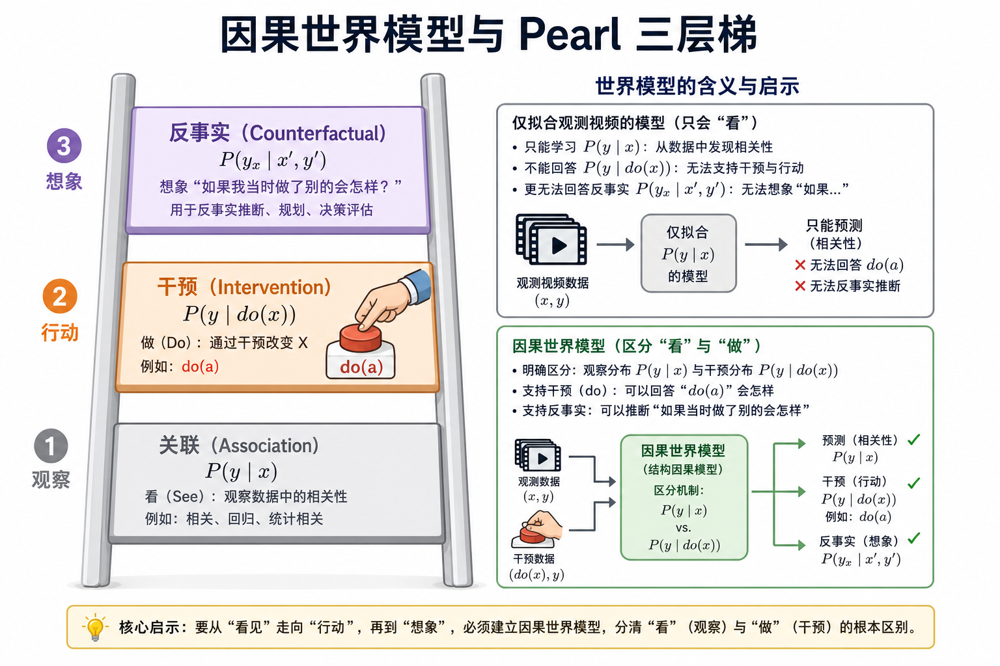
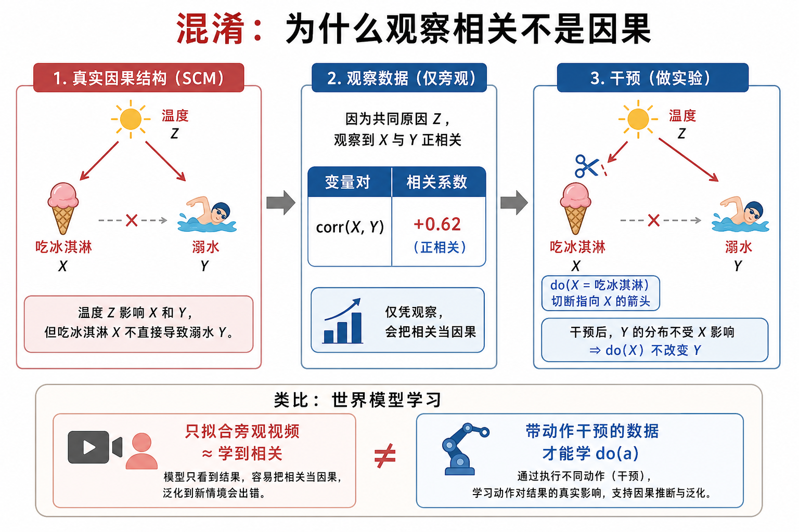
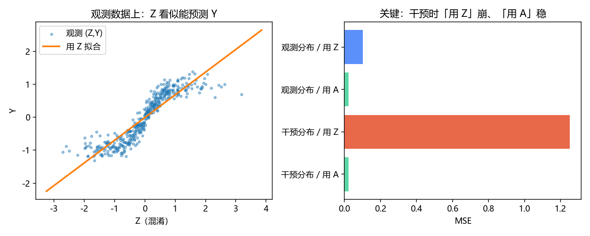

# 因果世界模型：从「看见」到「动手」再到「假如」

> [!WARNING]
> 🧪 Beta公测版本提示：教程主体已完成，正在优化细节，欢迎大家提Issue反馈问题或建议。

> 路径一到三大多在学 $P(\text{未来}\mid\text{过去})$。控制真正需要的是 $P(\text{未来}\mid do(\text{动作}),\text{过去})$——**干预分布**。路径四把 Pearl 的因果阶梯显式请进世界模型：关联、干预、反事实，分别对应旁观、动手、后悔/想象。

> **图解说明**：只拟合旁观视频，停在第 1 层；带动作的闭环数据与 $do(a)$ 语义，才爬到第 2 层；反事实还要在固定外生噪声下切换动作。

---

## 一、为什么「预测准」仍可能「控不了」？

冰淇淋销量与溺水人数正相关——因为都被气温驱动。若你学到 $P(\text{溺水}\mid\text{冰淇淋})$，就可能得出荒谬政策「禁售冰淇淋」。

世界模型里的同构陷阱：

- 演示数据里，人总是在红灯前刹车；
- 观测模型学到「画面出现红灯 ⇒ 车速下降」；
- 你在仿真里**强制**油门（$do(\text{油门})$），真实物理应加速，观测模型却仍按相关往下压速度。

$$
P(y\mid x)\;\neq\;P(y\mid do(x)).
$$

左边是关联（Association），右边是干预（Intervention）。视频生成式世界模型若只吃旁观互联网视频，默认优化的是左边。

> **图解说明**：经典 SCM。切断指向 $X$ 的箭（干预）后，$X$ 与 $Y$ 的相关可消失。世界模型要回答「我若做 $a$ 会怎样」，必须能处理这种切断。

---

## 二、Pearl 三层梯，映射到世界模型语言

| 层级 | 问题 | 概率对象 | 世界模型里长什么样 |
|------|------|----------|-------------------|
| L1 关联 | 看见 $x$ 时 $y$ 怎样？ | $P(y\mid x)$ | 下一帧预测、掩码补全、语言下一 token |
| L2 干预 | 若我**做** $do(a)$？ | $P(y\mid do(a),x)$ | 动作条件动力学、MPC、机器人试错 |
| L3 反事实 | 若当时做了别的？ | $P(y_x\mid x',y')$ | 固定外生噪声下换动作；「后悔」与反事实数据增强 |

形式化一点，结构因果模型（SCM）写

$$
Y := f_Y(X, U_Y),\quad X := f_X(Z, U_X),\ldots
$$

- **观测**：噪声 $U$ 与内生变量按图联合出现；
- **$do(X=x)$**：删掉 $X$ 的方程，把它钉成常数 $x$，再沿剩下的方程推 $Y$；
- **反事实**：先用观测反推 $U$，再在修改后的机制下重放。

Dreamer / PETS 若训练数据来自**智能体真实执行的动作**，已经在碰 L2；若世界模型只从电影学物理，则主要是 L1，L2 能力要另验。

---

## 三、文献里的几条因果世界模型线索

结合 survey 与 Awesome-World-Model 中的条目，路径四目前还不是「一个统一算法家族」，而是一组正在汇合的问题：

1. **LLM + 因果世界模型**  
   Gkountouras et al., *Language Agents Meet Causality – Bridging LLMs and Causal World Models*（ICLR 2025）：语言智能体的符号推理与显式因果世界模型对接，用因果模块约束「做什么会怎样」。

2. **下一 token 预测里的因果结构**  
   Rohekar et al., *A Causal World Model Underlying Next Token Prediction*（2024）：在受控环境中分析 GPT 类模型是否学到可用的因果世界结构，而不只是表面共现。

3. **迷宫 / 可控任务上的 Transformer 因果世界**  
   Spies et al., *Transformers use causal world models in maze-solving tasks*（ICLR Workshop 2025）：任务成功依赖内部是否形成可干预的状态机。

4. **Next Forcing：多块预测的因果世界建模**  
   Awesome 列表中的 *Next Forcing: Causal World Modeling with Multi-Chunk Prediction*：把「下一块」预测做成更强调因果滚动的训练范式（与普通下一帧/下一 token 强制区分）。

5. **评测**  
   世界模型 survey（Lyu / Dong et al.）显式提出因果推理指标：比较 $\pi_\theta(y\mid x)$ 与 $\pi_\theta(y\mid do(x=i))$ 的分歧——模型若对干预不敏感，就只是关联拟合器。

Agentic World Modeling survey 则把「干预敏感性」写成从 L1 Predictor 走向 L2 Simulator 的必要条件之一：能多步 rollout 还不够，还必须在 $do(a)$ 下遵守领域定律。

---

## 四、和前三条路径的关系（不是取代）

| 路径 | 默认学到什么 | 缺了什么时会在因果上翻车 |
|------|--------------|--------------------------|
| 视频生成 | $P(o_{t+1}\mid o_{\le t})$ 或弱动作条件 | 旁观数据里的伪相关；控不住 |
| 交互 / 3D | 可玩的 $P(o\mid a_{\text{latent}})$ | 潜动作未必等于可解释干预 |
| 抽象状态预测 | $P(z_{t+1}\mid z_t,a_t)$ + 规划 | 若 $a_t$ 与混淆同步采集，潜动力学仍可能是关联 |
| **因果 WM** | 显式区分 $P$ 与 $P(\cdot\mid do)$ | 需要干预数据、SCM 归纳偏置或可识别假设 |

实践上的组合拳常常是：路径三提供紧凑可滚的 $z$，路径四要求采集协议与损失尊重 $do(a)$，路径一/二提供丰富的观测接口。

---

## 五、玩具：观测相关 vs 干预

本章 `demo.py` 构造一个微型 SCM：

- 混淆变量 $Z$（「气温」）；
- 动作 $A$ 在**观测策略**下几乎由 $Z$ 决定；
- 下一状态 $Y$ 其实只由 $A$ 与噪声决定，与 $Z$ 无直接箭头。

然后对比：

1. **关联回归**：用 $(Z,A)$ 或只看 $Z$ 预测 $Y$——在观测分布上很准；
2. **干预测试**：强行设定 $do(A=a)$，关联模型崩，**动作条件因果模型**仍对。

这就是路径四要你养成的第一反应：上线规划前，先问「我的数据是旁观还是动手？」。

> 运行 `code/demo.py` 生成。干预时「用混淆 Z」MSE 飙升，「用动作 A」保持低误差。

---

## 六、小结

| 概念 | 一句话 |
|------|--------|
| $P(y\mid x)$ | 看见；相关；旁观视频 |
| $P(y\mid do(x))$ | 动手；切断箭头；控制需要的对象 |
| 反事实 | 固定 $U$，换动作重放 |
| 混淆 | 共同原因制造假相关 |
| 因果 WM | 显式追求干预（与反事实）能力的世界模型 |

> 附录向：若你关心语言层面的世界模拟，见 [LLM 世界模型](/world-models/llm/)。路径地图总览见 [导论](/world-models/intro/)。

## 📥 Code

| File | View | Download |
|------|------|----------|
| demo.py | [Open](./code-demo) | <a href="/notebook/code/world-models/causal/demo.py" target="_blank" download>Download</a> |
| exercise.py | [Open](./code-exercise) | <a href="/notebook/code/world-models/causal/exercise.py" target="_blank" download>Download</a> |

## 参考

1. Pearl, J. (2009). *Causality* (2nd ed.). Cambridge University Press.
2. Gkountouras, J., et al. (2025). Language Agents Meet Causality – Bridging LLMs and Causal World Models. *ICLR*.
3. Rohekar, R. Y., et al. (2024). A Causal World Model Underlying Next Token Prediction. *arXiv*.
4. Spies, A. F., et al. (2025). Transformers use causal world models in maze-solving tasks. *ICLR Workshop*.
5. Lyu, Q., Dong, J., et al. Learning to Model the World: A Survey of World Models in AI. (因果评测指标)
6. Chu, M., et al. (2026). Agentic World Modeling. [[arXiv:2604.22748](https://arxiv.org/abs/2604.22748)]
