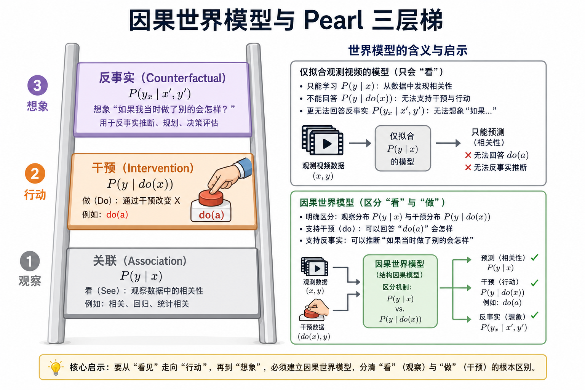
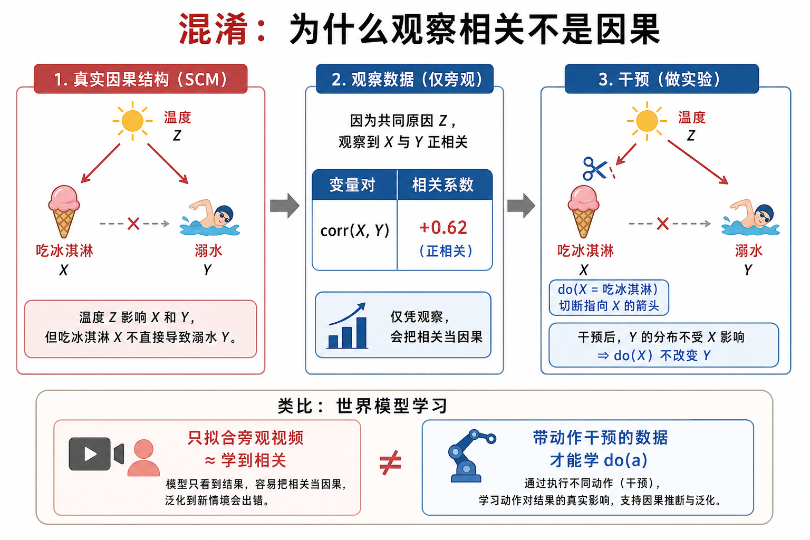
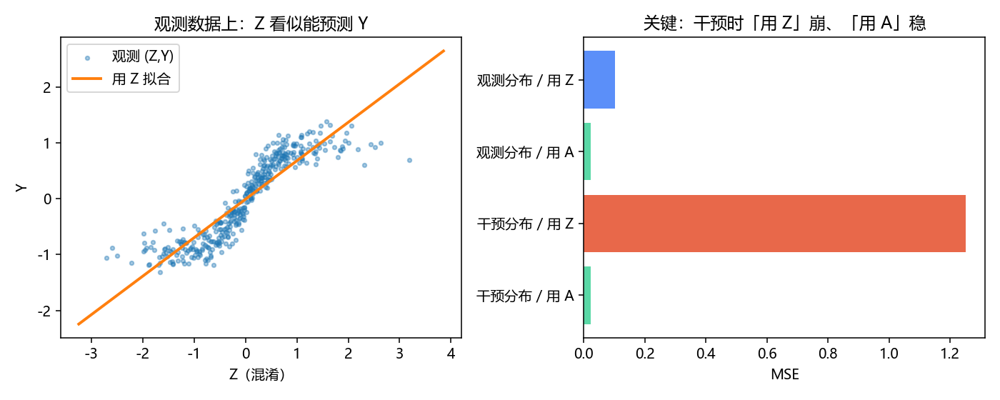

# 因果世界模型：从「看见」到「动手」再到「假如」

> [!WARNING]
> 🧪 Beta公测版本提示：教程主体已完成，正在优化细节，欢迎大家提Issue反馈问题或建议。

> 路径一到三大多在学 $P(\text{未来}\mid\text{过去})$。控制真正需要的是 $P(\text{未来}\mid do(\text{动作}),\text{过去})$——**干预分布**。路径四把 Pearl 的因果阶梯显式请进世界模型：关联、干预、反事实，分别对应旁观、动手、后悔/想象。文献线索放到下一章 [因果文献](/world-models/causal/literature/)。

> **图解说明**：只拟合旁观视频，停在第 1 层；带动作的闭环数据与 $do(a)$ 语义，才爬到第 2 层；反事实还要在固定外生噪声下切换动作。

---

## 一、为什么「预测准」仍可能「控不了」？

冰淇淋销量与溺水人数正相关——因为都被气温驱动。若你学到 $P(\text{溺水}\mid\text{冰淇淋})$，就可能得出荒谬政策「禁售冰淇淋」。

世界模型里的同构陷阱：

- 演示数据里，人总是在红灯前刹车；
- 观测模型学到「画面出现红灯 ⇒ 车速下降」；
- 你在仿真里**强制**油门（$do(\text{油门})$），真实物理应加速，观测模型却仍按相关往下压速度。

$$
P(y\mid x)\;\text{不必等于}\;P(y\mid do(x)).
$$

左边是关联（Association），右边是干预（Intervention）。视频生成式世界模型若只吃旁观互联网视频，默认优化的是左边。

> **图解说明**：经典 SCM。切断指向 $X$ 的箭（干预）后，$X$ 与 $Y$ 的相关可消失。世界模型要回答「我若做 $a$ 会怎样」，必须能处理这种切断。

---

## 二、Pearl 三层梯，映射到世界模型语言

| 层级 | 问题 | 概率对象 | 世界模型里长什么样 |
|------|------|----------|-------------------|
| L1 关联 | 看见 $x$ 时 $y$ 怎样？ | $P(y\mid x)$ | 下一帧预测、掩码补全、语言下一 token |
| L2 干预 | 若我**做** $do(a)$？ | $P(y\mid do(a),x)$ | 动作条件动力学、MPC、机器人试错 |
| L3 反事实 | 若当时做了别的？ | $P(y_x\mid x',y')$ | 固定外生噪声下换动作；「后悔」与反事实数据增强 |

形式化一点，结构因果模型（SCM）写

$$
Y := f_Y(X, U_Y),\quad X := f_X(Z, U_X),\ldots
$$

- **观测**：噪声 $U$ 与内生变量按图联合出现；
- **$do(X=x)$**：删掉 $X$ 的方程，把它钉成常数 $x$，再沿剩下的方程推 $Y$；
- **反事实**：先用观测反推 $U$，再在修改后的机制下重放。

::: details 完整推导：混淆图、因果链与反事实（点击展开）

下面假设外生噪声相互独立，条件分布在讨论的取值上有定义。观测与干预分布不必相等，也不是永远不等。

### 1. 混淆：$Z\to A$、$Z\to Y$、$A\to Y$

设 $Z=f_Z(U_Z),A=f_A(Z,U_A),Y=f_Y(A,Z,U_Y)$。存在后门路径 $A\leftarrow Z\to Y$。对离散背景变量，
$$
P(y\mid A=a)=\sum_zP(y\mid A=a,Z=z)P(Z=z\mid A=a).
$$
干预替换动作方程、删除进入 $A$ 的箭头，但保留 $Z\to Y$：
$$
P(y\mid do(A=a))=\sum_zP(y\mid A=a,Z=z)P(Z=z).
$$
连续情形用积分。区别是背景权重：观察动作会筛选背景，外部强制动作不会。调整式依赖因果图、无遗漏混淆等识别假设；估计还需支持重叠，不能从任意观测数据直接套用。

反例：$Z\sim\operatorname{Bernoulli}(1/2),A=Z,Y=Z$，没有动作的直接效应。于是
$$
P(Y=1\mid A=1)=1,\qquad P(Y=1\mid do(A=1))=\tfrac12.
$$
干预没有改变 $Z$。这个确定性例子展示分布差别，也说明观测中不存在的动作/背景组合不能仅靠数据识别其条件结果。

### 2. 本 demo 是 $Z\to A\to Y$，不是上述混淆图

实际方程为
$$
Z\sim\mathcal N(0,1),\quad A=\tanh(1.5Z)+\varepsilon_A,\quad
Y=A+\varepsilon_Y.
$$
噪声独立、均值为零。$Z$ 是 $Y$ 的间接原因，不是混淆 $A\to Y$ 的变量。在该结构下
$$
P(Y\mid A=a)=P(Y\mid do(A=a)),\qquad \mathbb E[Y\mid A=a]=a.
$$
正确使用 $A$ 的模型可以工作，不能说同时使用 $(Z,A)$ 的模型必然失效。

仅看背景时，观测数据上 $\mathbb E[Y\mid Z=z]=\tanh(1.5z)$。这沿真实因果链传递，并非“完全没有因果”。测试代码改为独立抽样 $A\sim\operatorname{Uniform}(-1.5,1.5)$：这是不同固定 $do(A=a)$ 的随机混合，不是所有样本执行同一个 $a$。切断策略依赖后，$\mathbb E[Y\mid Z=z]=0$，原来的背景预测器因而不再适用。

理想动作预测器 $\widehat Y=A$ 的总体误差为
$$
\operatorname{MSE}=\operatorname{Var}(\varepsilon_Y)=0.15^2=0.0225.
$$
任何固定的仅用背景的预测器 $g(Z)$ 在该随机干预下满足
$$
\mathbb E[(Y-g(Z))^2]
=\operatorname{Var}(A)+\operatorname{Var}(\varepsilon_Y)+\mathbb E[g(Z)^2]
=0.75+0.0225+\mathbb E[g(Z)^2].
$$
交叉项为零，因为动作和结果噪声与 $Z$ 独立且均值为零。这里是总体期望推导，不是声称有限样本脚本一定打印这些数值。线性拟合 $\tanh(1.5z)$ 还会有模型失配。

本实验展示“遗漏动作的预测器在策略干预后失效”，并不证明任意动作条件网络都具有因果能力。

### 3. 反事实还需要溯因

反事实计算分三步：由已发生的事实推断外生噪声后验；替换动作方程；保持同一噪声计算替代动作的结果。

在已知加性模型 $Y=A+U_Y$ 中，看到 $(A=a,Y=y)$ 后有 $U_Y=y-a$，因此 $Y_{a'}=a'+(y-a)$。机制不可逆或观测不足时，不能假装唯一恢复了噪声，必须对其后验不确定性积分。

图与后门路径依据：[Cinelli、Forney 与 Pearl](https://ftp.cs.ucla.edu/pub/stat_ser/r493-reprint.pdf)。本 demo 的期望和 MSE 由代码方程直接推导。

:::

Dreamer / PETS 若训练数据来自**智能体真实执行的动作**，已经在碰 L2；若世界模型只从电影学物理，则主要是 L1，L2 能力要另验。

---

## 三、和前三条路径的关系（不是取代）

| 路径 | 默认学到什么 | 缺了什么时会在因果上翻车 |
|------|--------------|--------------------------|
| 视频生成 | $P(o_{t+1}\mid o_{\le t})$ 或弱动作条件 | 旁观数据里的伪相关；控不住 |
| 交互 / 3D | 可玩的 $P(o\mid a_{\text{latent}})$ | 潜动作未必等于可解释干预 |
| 抽象状态预测 | $P(z_{t+1}\mid z_t,a_t)$ + 规划 | 若 $a_t$ 与混淆同步采集，潜动力学仍可能是关联 |
| **因果 WM** | 显式区分 $P$ 与 $P(\cdot\mid do)$ | 需要干预数据、SCM 归纳偏置或可识别假设 |

实践上的组合拳常常是：路径三提供紧凑可滚的 $z$，路径四要求采集协议与损失尊重 $do(a)$，路径一/二提供丰富的观测接口。路径五的符号规则（「用木镐挖钻石必失败」）则是另一种可检查的 $do$ 语义。

---

## 四、玩具：观测相关 vs 干预

本章 `demo.py` 构造一个微型 SCM：

- 上游变量 $Z$（影响观测策略的背景）；
- 动作 $A$ 在**观测策略**下几乎由 $Z$ 决定；
- 下一状态 $Y$ 其实只由 $A$ 与噪声决定，与 $Z$ 无直接箭头。

然后对比：

1. **仅用背景的回归**：只看 $Z$ 预测 $Y$——在观测分布上有预测力；
2. **干预测试**：随机选择 $a$ 后施加 $do(A=a)$，仅用 $Z$ 的模型失效，用 $A$ 的模型仍符合真实机制。

本例的图是 $Z\to A\to Y$，没有混淆 $A\to Y$ 的后门路径。$Z$ 是 $Y$ 的间接原因，不能称为混淆变量；本实验展示的是切断策略依赖后，遗漏动作的预测器失效。包含 $A$ 的正确模型（也包括同时用 $(Z,A)$ 的充分拟合模型）不必失效。

这就是路径四要你养成的第一反应：上线规划前，先问「我的数据是旁观还是动手？」。

> [!WARNING]
> 图像待更新：`causal_obs_vs_do.png` 的旧标签将上游变量 Z 称为混淆；源码已纠正，本次静态审查未重新生成图片。请以正文因果图与推导为准。

> 运行 `code/demo.py` 生成。干预时「只用上游变量 Z」MSE 飙升，「用动作 A」保持低误差。

---

## 五、小结

| 概念 | 一句话 |
|------|--------|
| $P(y\mid x)$ | 看见；相关；旁观视频 |
| $P(y\mid do(x))$ | 动手；切断箭头；控制需要的对象 |
| 反事实 | 固定 $U$，换动作重放 |
| 混淆 | 共同原因制造假相关 |
| 因果 WM | 显式追求干预（与反事实）能力的世界模型 |

> 下一章：[因果世界模型文献](/world-models/causal/literature/)。符号/语言接口见 [路径五](/world-models/symbolic/overview/)。总图见 [导论](/world-models/intro/)。

## 📥 Code

| File | View | Download |
|------|------|----------|
| demo.py | [Open](./code-demo) | <a href="/notebook/code/world-models/causal/ladder/demo.py" target="_blank" download>Download</a> |
| exercise.py | [Open](./code-exercise) | <a href="/notebook/code/world-models/causal/ladder/exercise.py" target="_blank" download>Download</a> |

## 参考

1. Pearl, J. (2009). *Causality* (2nd ed.). Cambridge University Press.
2. Pearl, J. (2000/2009). 干预演算与阶梯：Association / Intervention / Counterfactuals.
