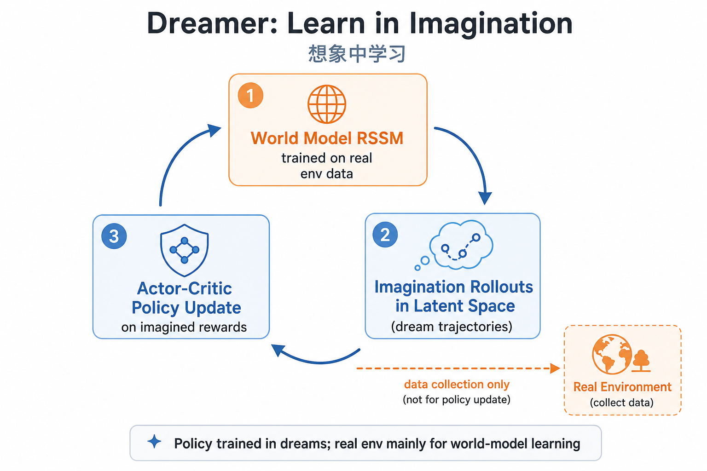

# Dreamer 家族：在梦里学会行动

> [!WARNING]
> 🧪 Beta公测版本提示：教程主体已完成，正在优化细节，欢迎大家提Issue反馈问题或建议。

> 上一节 [RSSM / PlaNet](/world-models/rssm/) 学会了在潜空间预测未来。Dreamer 更进一步：**策略也在想象轨迹上训练**，从而减少与真实环境交互的次数。

## 1. 核心思想

Dreamer（Hafner et al.）把学习拆成两段：

1. **世界模型**：用 RSSM 等结构学习 $p(z_{t+1}|z_t,a_t)$ 与奖励头。
2. **行为学习**：从当前潜状态出发，在模型内展开 $H$ 步「梦境」，用 actor-critic 最大化想象回报。

$$
\max_\pi\ \mathbb{E}_{z_{1:H}\sim \text{imagination}}\Big[\sum_{t=1}^{H}\gamma^{t-1} r_t\Big]
$$

> **图解说明**：真实环境主要用于更新世界模型；策略（Actor-Critic）主要在潜空间「梦境」轨迹上更新，从而大幅降低真实交互次数。

## 2. 版本演进（直觉）

| 版本 | 关键变化 |
|------|----------|
| DreamerV1 | 在潜空间想象中学 actor-critic |
| DreamerV2 | 离散潜变量，Atari 更强 |
| DreamerV3 | 超参更稳，跨域默认配置 |

## 3. 与 model-free RL 对比

- Model-free（DQN/PPO）：每一步都要真实环境交互。
- Dreamer：真实交互主要用于拟合世界模型；策略更新主要消耗「梦境」算力。

## 4. 代码

见 [demo.py 详解](./code-demo.md)。demo 用一维链世界展示「更偏右的想象策略 → 更高回报」。

## 5. 小结

Dreamer = **RSSM 世界模型 + 想象中的策略优化**。下一章 [MuZero](/world-models/muzero/) 则用隐式模型 + 搜索，而不是显式想象像素/潜观测。
