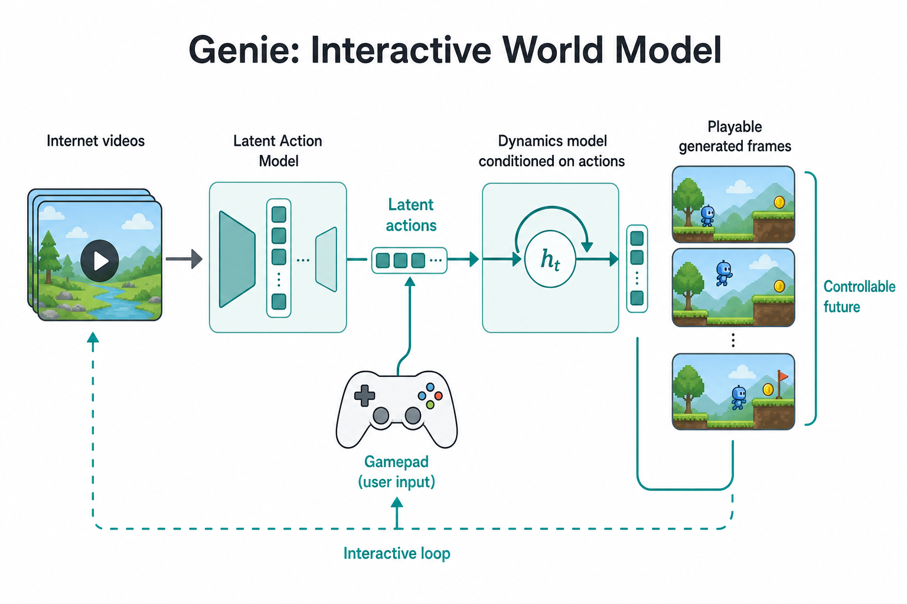

# Genie：交互式世界模型（路径二入口）

> [!WARNING]
> 🧪 Beta公测版本提示：教程主体已完成，正在优化细节，欢迎大家提Issue反馈问题或建议。

## 1. 交互式世界模型

Genie（Google DeepMind）从大规模**无动作标签**视频中学习：**潜动作接口 + 下一帧/下一状态生成**，使人或策略能用动作「玩」生成环境。它是路径二的经典入口——重点不是一次性好看的视频，而是**交互闭环**。

关键要素：

- **潜动作**：不一定等于键盘语义，而是数据里可复用的可控因子；
- **动态模型**：条件于动作的未来生成；
- **可玩性**：同一前缀、不同动作 ⇒ 不同未来。

> **图解说明**：从视频里发现潜动作，再以动作为条件生成下一帧——「可玩」优先于「单纯逼真」。

## 2. 版本直觉

Genie-1 → 2 → 3：从 2D 可控世界走向更高分辨率、更长时一致性的实时交互。训练上常见：视频 tokenizer + 潜动作模型 + 动态预测器。

## 3. 与路径一、路径二·3D

| | Sora/Cosmos（路径一） | **Genie** | 3D 场景 WM |
|--|----------------------|-----------|------------|
| 动作 | 弱/后置条件为主 | 自监督潜动作 | 相机/物体显式接口 |
| 输出 | 视频 | 可玩 2D（为主）世界 | 可漫游 3D |
| 强项 | 开放视觉 | 交互发现 | 几何持久 |

下一章 [交互式 3D](/world-models/interactive/scene-3d/) 把「可玩」推进到显式三维场景。

## 4. 代码

见 [demo](./code-demo.md) 的玩具潜动作对齐与 rollout。

## 5. 小结

Genie 证明：动作可以**从视频里长出来**。要键位级或几何级接口，继续看 3D 章；要便宜规划，转到路径三。

## 📥 Code

| File | View | Download |
|------|------|----------|
| demo.py | [Open](./code-demo) | <a href="/notebook/code/world-models/interactive/genie/demo.py" target="_blank" download>Download</a> |
| exercise.py | [Open](./code-exercise) | <a href="/notebook/code/world-models/interactive/genie/exercise.py" target="_blank" download>Download</a> |

## 参考

1. Bruce, J., et al. (2024). Genie: Generative Interactive Environments. [[arXiv:2402.15391](https://arxiv.org/abs/2402.15391)]
