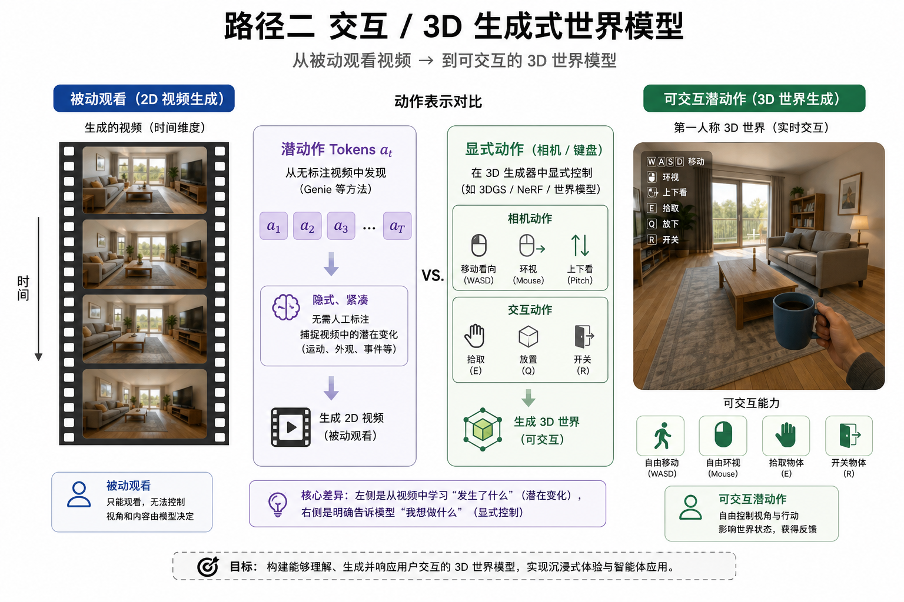

# 交互 / 3D 生成：让世界「可走进去」

> [!WARNING]
> 🧪 Beta公测版本提示：教程主体已完成，正在优化细节，欢迎大家提Issue反馈问题或建议。

> 路径二回答的问题不是「下一帧好不好看」，而是：**我能不能用动作改变世界，并在三维空间里持续待下去？** 上一章 [Genie](/world-models/interactive/genie/) 从无标签视频里长出**潜动作**；本章把镜头推到 **显式可交互的 3D/场景级世界模型**——HunyuanWorld、World Labs Marble、3DGS 系重建与可漫游生成等。

> **图解说明**：左侧潜动作驱动 2D 可玩视频；右侧相机/交互动作驱动 3D 场景。核心差异是控制接口是否语义清晰、状态是否有持久几何。

---

## 一、路径二在四路径里的位置

| | 路径一 视频生成 | **路径二 交互 / 3D** | 路径三 抽象状态 |
|--|-----------------|----------------------|-----------------|
| 输出 | 像素/视频 token | 可玩帧或 3D 资产/场景 | 紧凑 $z_t$ |
| 动作 | 常弱或后置条件 | **一等公民**（潜或显式） | 控制用 $a_t$ |
| 目标 | 开放视觉模拟 | 沉浸交互、具身数据引擎 | 样本高效决策 |
| 代表 | Sora、Cosmos | Genie、HunyuanWorld、Marble | PETS、Dreamer、JEPA、LeWM |

路径一与路径二正在合流：Cosmos 等基础模型加动作条件后可做机器人 MPC，但算力贵；Genie 强调从视频发现动作；3D 路线强调几何一致与持久场景记忆。

---

## 二、两条技术岔路

### 2.1 潜动作交互（Genie 系）

- 数据：大规模**无动作标签**视频；
- 学到：离散/连续潜动作 $a_t$，使「按 $a$ 生成下一帧」可玩；
- 优点：不靠人工键位标注，覆盖开放视觉；
- 代价：潜动作与真实机器人接口还要对齐；长期一致性与物理仍在攻坚。

详见 [Genie 专章](/world-models/interactive/genie/)。

### 2.2 显式 3D / 场景生成（HunyuanWorld、Marble、3DGS…）

- **几何载体**：NeRF、3D Gaussian Splatting、网格 + 纹理、分层场景图；
- **控制**：相机位姿（WASD + 鼠标）、物体级编辑、物理引擎耦合；
- **生成**：文本/图像 → 可漫游 3D 世界（腾讯混元 HunyuanWorld；World Labs 的 Marble 等多模态世界模型叙事）；
- **优点**：视点一致、可插入资产、易接游戏引擎与机器人 sim；
- **代价**：开放「电影级」动态与互联网尺度多样性仍不如纯视频扩散；实时交互与可编辑性要折中。

文献夹 `LeWM/` 下的 Genie PDF、3DGS、Marble、Sora Survey 正好覆盖这条「从 2D 生成到 3D 世界」的光谱。

---

## 三、评价一张「交互世界」好不好

不要只看 FID / 观感。路径二更关心：

1. **动作响应**：同样历史，换 $a$ 是否稳定改变下一状态；
2. **持久性**：离开房间再回来，桌子还在不在；
3. **几何/物理**：视点移动时结构是否崩、接触是否穿透；
4. **接口可迁移**：潜动作或相机动作能否接到策略 / 遥操作。

这与路径三的「想象里刷分」互补：路径二提供**可交互舞台**，路径三提供**便宜的脑子**。

---

## 四、玩具：显式动作 vs 潜动作对齐

本章 `demo.py` 不训练 NeRF，只做一个最小对比：

- **显式动作**：$(x,y)$ 格子世界，动作 = 上下左右，状态转移确定；
- **潜动作**：从演示轨迹里用离散编码聚类「状态变化」，再用潜码驱动转移——Genie 思想的一维影子。

看清「动作是被定义的」与「动作是被发现的」两种接口。

---

## 五、小结

| 概念 | 一句话 |
|------|--------|
| 路径二 | 以交互为中心的生成式世界，含 2D 可玩与 3D 可漫游 |
| 潜动作 | 从无标签视频发现的可控因子（Genie） |
| 显式 3D | 相机/物体接口 + 几何表征（HunyuanWorld / Marble / 3DGS） |
| 与路径一 | 共享生成技术，强调可控与持久 |
| 与路径三 | 提供舞台；决策仍常要紧凑潜动力学 |

> 下一站可去路径三入口 [PETS](/world-models/abstract/pets/)，或先读完路径一 [视频生成](/world-models/video/) 对照「好看」与「可玩」。

## 📥 Code

| File | View | Download |
|------|------|----------|
| demo.py | [Open](./code-demo) | <a href="/notebook/code/world-models/interactive/scene-3d/demo.py" target="_blank" download>Download</a> |
| exercise.py | [Open](./code-exercise) | <a href="/notebook/code/world-models/interactive/scene-3d/exercise.py" target="_blank" download>Download</a> |

## 参考

1. Bruce, J., et al. (2024). Genie: Generative Interactive Environments. *ICML*. [[arXiv:2402.15391](https://arxiv.org/abs/2402.15391)]
2. Kerbl, B., et al. (2023). 3D Gaussian Splatting for Real-Time Radiance Field Rendering. [[arXiv:2308.04079](https://arxiv.org/abs/2308.04079)]
3. World Labs. Marble: A Multimodal World Model.（产品/技术叙事，见文献夹）
4. HunyuanWorld 等可漫游 3D 生成系统（参见各团队技术报告）
5. Agarwal, N., et al. (2025). Cosmos World Foundation Model Platform for Physical AI. [[arXiv:2501.03575](https://arxiv.org/abs/2501.03575)]
