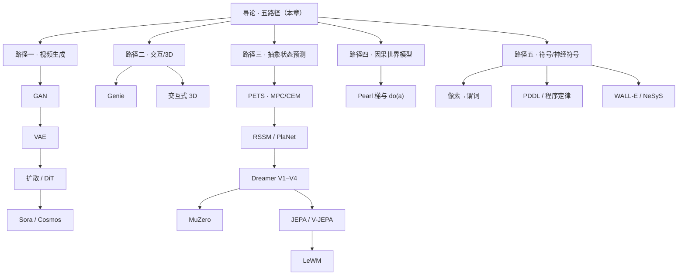

# 世界模型导论：五条路径

> [!WARNING]
> 🧪 Beta公测版本提示：教程主体已完成，正在优化细节，欢迎大家提Issue反馈问题或建议。

> 「如果一个系统能在脑海中模拟世界，它就不需要真的撞上南墙才知道疼。」

---

## 一、什么是世界模型？

**世界模型（World Model）** 是智能体内部关于环境动力学的预测模型：给定当前状态（或观测）与动作，预测接下来会发生什么，从而在不与真实环境逐步试错的情况下模拟、规划、学习。

$$
\underbrace{z_t = \mathrm{enc}(o_{\le t}, a_{<t})}_{\text{表示}}
\qquad
\underbrace{\hat z_{t+1}=f_\theta(z_t,a_t)}_{\text{动力学}}
\qquad
\underbrace{\hat o_t,\;\hat r_t=\ldots}_{\text{解码 / 奖励（可选）}}
$$

| 维度 | 模型无关 RL | 世界模型（Model-Based） |
|------|------------|------------------------|
| 学习对象 | $Q$ / $\pi$ | 先学 $f_\theta$，再规划或学策略 |
| 样本效率 | 低 | 高（一条真经验可想象多条） |
| 风险 | 必须真实试错 | 可先在模型里「撞墙」 |
| 代表 | DQN、PPO | PETS、PlaNet、Dreamer、Genie、Sora/Cosmos |

---

## 二、为什么用「五条路径」而不是一张杂货清单？

近年 survey（如 *Learning to Model the World*、*Agentic World Modeling*）与开源 Awesome 列表里，方法名爆炸。教学上我们按**你要世界模型干什么**收成五条主路径——它们互补，不是互斥排名：

> **图解说明**：本章 `demo.py` 生成的分类地图。路径一从 GAN/VAE/扩散讲到视频 WM；路径五是谓词、程序与 LLM 规则对齐。旧图 `wm01-02-four-paths.png` 仍可对照「补符号之前」的四路径版本。

| 路径 | 关键问题 | 预测对象 | 代表 |
|------|----------|----------|------|
| **一 · 视频生成** | 未来「长什么样」？ | 像素 / 视频潜空间 | GAN → VAE → 扩散 → Sora、Cosmos |
| **二 · 交互 / 3D** | 我能否「玩」这个世界？ | 动作条件帧或 3D 场景 | Genie、HunyuanWorld、Marble |
| **三 · 抽象状态预测** | 如何在便宜的 $z$ 里规划/学策略？ | 状态 / 嵌入 | PETS、RSSM/PlaNet、Dreamer、MuZero、JEPA、LeWM |
| **四 · 因果世界模型** | 相关还是可干预？ | $P(y\mid do(a))$、反事实 | LLM-CWM、NTP 因果分析 |
| **五 · 符号 / 神经符号** | 定律能否写成可执行符号？ | 谓词、规则、程序 | pix2pred、COSMOS（ICLR）、WALL-E、PoE-World、NeSyS |

旧版「六路径」把 RSSM、MuZero、JEPA、Genie、视频、LLM 并列。后来收成四条，并把 LLM 贬到附录。这一版把 **GAN/VAE/扩散**从计算机视觉挪进路径一（分章细讲），再把 LLM 与 neurosymbolic 升为**路径五**：语言模型不再假装自己是主路径里的「第六种神经网络动力学」，而是符号接口 + 规则/程序世界模型。

NVIDIA **Cosmos**（视频基础模型）属于路径一；ICLR 2024 的 **COSMOS**（神经符号组合世界模型）属于路径五——名字撞车，不是同一系统。

---

## 三、认知与工程简史（仍值得知道）

- **Craik（1943）**：大脑构建现实的「小尺度模型」。
- **Ha & Schmidhuber（2018）*World Models***：V-M-C；策略可在梦里练。
- **PETS（2018）**：概率集成 + CEM-MPC——路径三的规划原型。
- **PlaNet / Dreamer（2019–2025）**：像素 → RSSM → 想象 Actor-Critic → V4 离线开放世界。
- **LeCun JEPA（2022–）**：预测表征而非像素；**LeWM** 把它收成可规划的两项损失。
- **Genie / Sora / Cosmos（2024–）**：交互生成与视频基础模型把「世界模型」推进媒体与具身数据引擎。

---

## 四、通用数学：先验、后验与想象

许多潜空间方法共享序列 ELBO 骨架（POMDP）：

$$
\mathcal{L}
=
\mathbb{E}_{q}\Big[
\sum_t
\log p(o_t\mid z_t)
-
D_{\mathrm{KL}}\big(
q(z_t\mid z_{t-1},a_{t-1},o_t)\,\|\,
p(z_t\mid z_{t-1},a_{t-1})
\big)
\Big]
$$

- **后验** $q$：看见 $o_t$ 后的信念（训练）；
- **先验** $p$：不看 $o_t$ 的预测（想象 / 规划）；
- 部署时多步只滚先验，就是「做梦」。

路径一可能直接在像素/视频潜空间做生成；路径四追问你滚的到底是 $P$ 还是 $P(\cdot\mid do(a))$；路径五追问同一件事能不能写成谓词与规则。

---

## 五、为什么路径三坚持「在潜空间做梦」？

多步想象是复合函数，误差会累积。像素里充满与决策无关的纹理，递归预测时雪球更大；压到任务相关的 $z$，同样视野更安全。`demo.py` 用玩具曲线对比这一直觉（见下图）。

---

## 六、学习路线图

建议顺序：导论 → 路径一按 GAN → VAE → 扩散 → 视频 WM → 路径二 → 路径三按 PETS → PlaNet → Dreamer → JEPA → LeWM（MuZero 可穿插）→ 路径四 → 路径五。

---

## 七、本节小结

| 概念 | 一句话 |
|------|--------|
| 世界模型 | 内部动力学预测器，用于想象与决策 |
| 五路径 | 视频生成 / 交互·3D / 抽象状态 / 因果 / 符号 |
| 先验·后验 | 做梦用先验，训练常用后验 |
| 潜空间 | 降低多步误差，服务规划 |
| 互补 | 好看、可玩、可算、可干预——常常要组合 |

> 下一节建议：[路径一导论](/world-models/video/overview/)，从 GAN 讲起。若你更关心控制，也可直奔 [PETS](/world-models/abstract/pets/)；若关心谓词与 LLM 规则，可先看 [路径五](/world-models/symbolic/overview/)。

## 📥 Code

| File | View | Download |
|------|------|----------|
| demo.py | [Open](./code-demo) | <a href="/notebook/code/world-models/intro/demo.py" target="_blank" download>Download</a> |
| exercise.py | [Open](./code-exercise) | <a href="/notebook/code/world-models/intro/exercise.py" target="_blank" download>Download</a> |

## 参考

1. Craik, K. (1943). *The Nature of Explanation*.
2. Ha, D., & Schmidhuber, J. (2018). World Models. [[arXiv:1803.10122](https://arxiv.org/abs/1803.10122)]
3. Chua, K., et al. (2018). PETS. [[arXiv:1805.12114](https://arxiv.org/abs/1805.12114)]
4. Hafner, D., et al. PlaNet / Dreamer 系列.
5. LeCun, Y. (2022). A Path Towards Autonomous Machine Intelligence.
6. Lyu, Q., Dong, J., et al. Learning to Model the World（survey）.
7. Chu, M., et al. (2026). Agentic World Modeling. [[arXiv:2604.22748](https://arxiv.org/abs/2604.22748)]
8. Sehgal, A., et al. (2024). Neurosymbolic Grounding for Compositional World Models. *ICLR*. [[arXiv:2310.12690](https://arxiv.org/abs/2310.12690)]
9. Zhou, S., et al. WALL-E / WALL-E 2.0. [[arXiv:2410.07484](https://arxiv.org/abs/2410.07484)]
10. Hu, M., et al. (2025). Text2World. [[arXiv:2502.13092](https://arxiv.org/abs/2502.13092)]
