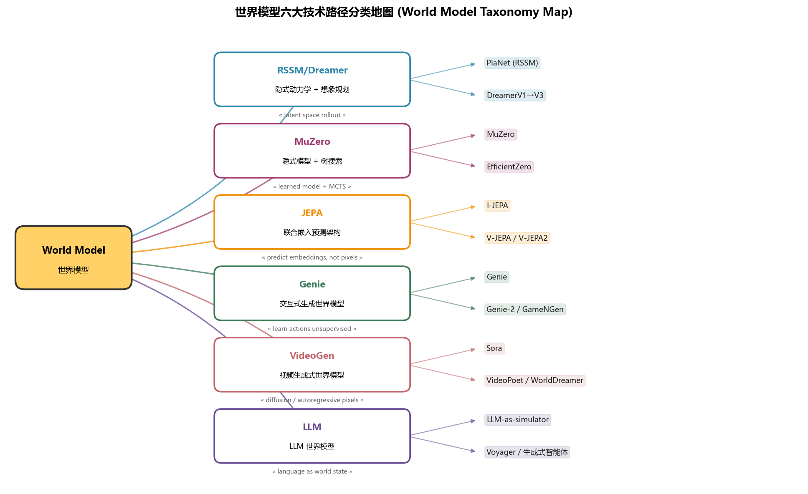
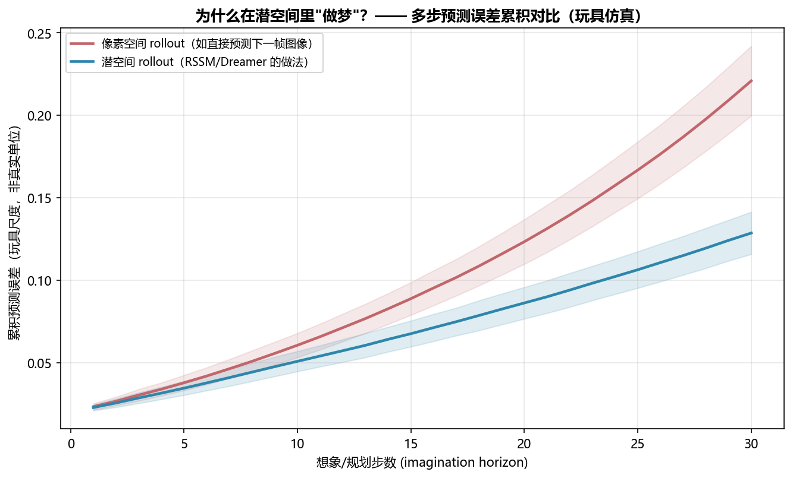
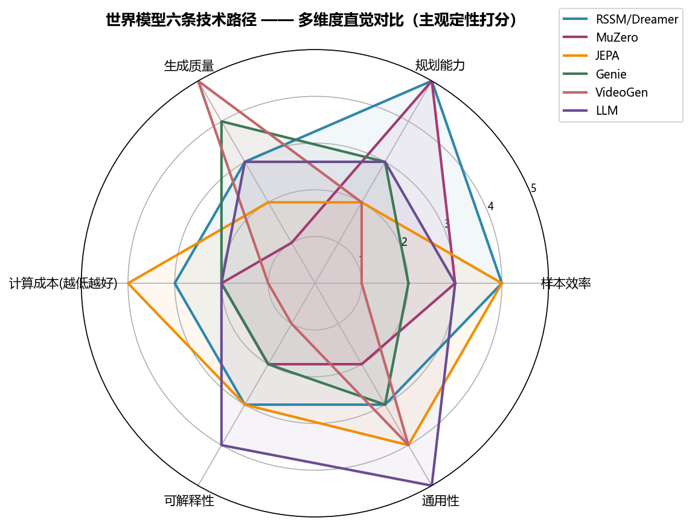

# wm01 世界模型导论与分类

> [!WARNING]
> 🧪 Beta公测版本提示：教程主体已完成，正在优化细节，欢迎大家提Issue反馈问题或建议。

> "如果一个系统能在脑海中模拟世界，它就不需要真的撞上南墙才知道疼。"

---

## 一、什么是"世界模型"？

**世界模型（World Model）** 是智能体（Agent）在内部构建的一个关于环境动力学的**预测模型**——给定当前状态和动作，它能预测环境接下来会发生什么，从而让 Agent 在不真正与环境交互的情况下，"在脑海中"模拟、规划、试错。

用一个通用的数学框架来表达：给定观测 $o_t$（可以是图像、文本、传感器读数）和动作 $a_t$，一个世界模型至少包含：

$$
\underbrace{z_t = \text{enc}(o_{\le t}, a_{<t})}_{\text{表示模型（编码）}} \qquad
\underbrace{\hat{z}_{t+1} = f_\theta(z_t, a_t)}_{\text{动力学模型（预测）}} \qquad
\underbrace{\hat{o}_t = d_\theta(z_t), \ \hat{r}_t = r_\theta(z_t)}_{\text{解码 / 奖励预测（可选）}}
$$

- **表示模型**：把高维观测压缩成一个（通常低维的）状态表征 $z_t$
- **动力学模型**：在状态空间里预测"如果执行动作 $a_t$，下一个状态会是什么"
- **解码/奖励模型**：把状态表征"翻译"回可用的信号——重建观测、预测奖励，用于评估和可视化

这与我们熟悉的**模型无关（model-free）强化学习**（如 s19-s20 的 Q-Learning、DQN）形成鲜明对比：

| 维度 | 模型无关 RL | 世界模型（Model-Based） |
|------|------------|------------------------|
| 学习对象 | 直接学 $Q(s,a)$ 或策略 $\pi(a\mid s)$ | 先学环境动力学 $f_\theta$，再学策略 |
| 样本效率 | 低——每条经验只用于更新价值/策略 | 高——一条真实经验可以生成无限条"想象"经验 |
| 规划能力 | 无法提前"预演"多步后果 | 可以在模型里 rollout 多步，评估长期后果 |
| 风险 | 必须真实试错才能学到"撞墙很痛" | 可以在"梦里"先撞一次墙 |
| 典型代表 | DQN、REINFORCE、PPO | World Models、PlaNet、Dreamer、MuZero |

> 直觉类比：模型无关 RL 像是"闭眼摸黑走路，撞到才知道有墙"；世界模型则像是"脑子里先画一张地图，走之前先在地图上试几条路"。

> **图解说明**：六条主路径按「学什么 / 怎么用」分叉——RSSM/Dreamer 在潜空间做梦练策略，MuZero 为搜索服务的隐式模型，JEPA 预测表征而非像素，Genie 学可交互潜动作，视频 WM 做开放视觉模拟，LLM 走符号/文本世界。后续各章按此地图展开。

---

## 二、认知起源：从心理模型到机器世界模型

"世界模型"并不是深度学习凭空发明的概念，它的根源可以追溯到认知科学：

- **Craik（1943）《The Nature of Explanation》**：提出人类大脑会构建外部现实的"小规模模型"（small-scale model），用来预测事件、进行推理，而不必真正经历它们。这被认为是"心理模型（Mental Model）"理论的开端。
- **Jay Forrester / 系统动力学（1960s-70s）**：把"世界模型"概念系统化为可计算的动力学模拟——这也是"World Model"一词最早的工程化用法之一（如 MIT 的 World3 模型，用于模拟全球资源与人口动态）。
- **Ha & Schmidhuber（2018）《World Models》**：现代深度学习意义上的"世界模型"开山之作。他们用三个模块重新实现了这个古老的想法：
  - **V（Vision）**：一个 VAE，把游戏画面压缩成低维潜向量 $z_t$
  - **M（Memory）**：一个 MDN-RNN（混合密度网络 + RNN），学习 $z_t, a_t \to \hat{z}_{t+1}$ 的动力学，同时预测游戏是否结束
  - **C（Controller）**：一个极小的线性策略，只看 $(z_t, h_t)$ 就决定动作，用进化策略（CMA-ES）训练

最惊艳的结果是：**Controller 可以完全在 M 生成的"梦境"里训练**，事后再迁移到真实的游戏环境（VizDoom）中，依然能达到不错的表现。这第一次在深度学习框架下证明了"在脑海中练习也能学会真实技能"。

> 这正是 wm02 要深入讲解的核心——如何让这个"梦境"的动力学模型学得更准、更稳定，这就是 RSSM 要解决的问题。

- **Yann LeCun（2022）《A Path Towards Autonomous Machine Intelligence》**：从认知架构的高度重新提出，通用智能系统需要一个可微的世界模型模块，用于预测、规划和推理，并进一步提出应该在**表征空间**里预测而非在像素空间里重建（这正是 JEPA 路线的理论基础，我们会在 wm05 展开）。

---

## 三、世界模型的通用数学框架

不管具体实现路径如何，几乎所有世界模型都可以归纳为下面这个通用变分框架（以 POMDP —— 部分可观测马尔可夫决策过程为背景）：

$$
\mathcal{L}(\theta) = \mathbb{E}_{q_\theta}\left[\sum_{t=1}^{T} \underbrace{\log p_\theta(o_t \mid z_t)}_{\text{重建/预测项}} - \underbrace{D_{KL}\big(q_\theta(z_t \mid z_{t-1}, a_{t-1}, o_t) \,\|\, p_\theta(z_t \mid z_{t-1}, a_{t-1})\big)}_{\text{一致性惯罚项}}\right]
$$

这其实就是一个序列版本的 **ELBO（变分下界）**：

- **后验（posterior）** $q_\theta(z_t \mid \cdot, o_t)$：看到真实观测 $o_t$ 之后，对当前状态的最佳估计
- **先验（prior）** $p_\theta(z_t \mid z_{t-1}, a_{t-1})$：**不看**真实观测，只凭上一步状态和动作，对当前状态的预测
- 训练时最小化两者的 KL 散度，就是在强迫"预测"尽量逼近"事后看到真相"的估计——这正是"学会预测未来"的数学本质
- 一旦训练好，**在部署/规划时只用先验 $p_\theta$ 做多步 rollout**，就是所谓的"在脑海中做梦"（imagination）

各个技术路径的差异，本质上就是在"用什么表示 $z_t$""重建到什么程度""怎么训练这个先验"这几个选择上分道扬镳。

---

## 四、六条技术路径分类

我们把当前世界模型研究划分为六条主要技术路径（这也是"进阶二：世界模型"后续七章的主线）：

| 路径 | 关键思想 | 表示空间 | 是否重建像素 | 是否用搜索 | 代表方法 |
|------|---------|---------|:---:|:---:|---------|
| **RSSM/Dreamer** | 学习潜空间动力学模型，在"想象"中训练策略 | 潜空间（随机+确定性） | 是（训练时） | 否 | PlaNet、DreamerV1-V3 |
| **MuZero** | 隐式模型：不要求预测真实状态，只要预测能被用于规划的量 | 隐式潜空间 | 否 | 是（MCTS） | MuZero、EfficientZero、Gumbel MuZero |
| **JEPA** | 只在嵌入空间预测，放弃像素级重建 | 嵌入空间 | 否 | 否 | I-JEPA、V-JEPA / V-JEPA2 |
| **Genie** | 从无标签视频中自监督学出"隐动作"，实现可交互仿真 | 潜空间 + 隐动作 | 是（生成） | 否 | Genie、Genie-2、GameNGen |
| **视频生成式世界模型** | 直接在像素空间用扩散/自回归模型生成未来帧 | 像素空间 | 是 | 否 | Sora、VideoPoet、WorldDreamer |
| **LLM 世界模型** | 用语言模型的隐状态和 token 序列作为"世界状态" | 语言 token 空间 | 否（生成文本） | 部分（搜索式 Agent） | LLM-as-simulator、Voyager 等生成式智能体 |

几个关键的分类维度解读：

1. **表示空间**：是在原始像素空间预测，还是压缩到一个更抽象的潜空间/嵌入空间？——这直接决定了模型要不要"操心"预测画面里无关的纹理细节。
2. **是否重建像素**：RSSM/Dreamer 训练时需要重建像素（用于学习有效表示），但推理/想象时只在潜空间里滚动；JEPA 则从头到尾都不做像素级重建，直接预测嵌入。
3. **是否结合搜索**：MuZero 把"学到的模型"和"树搜索规划"结合，用于离散、可枚举的决策场景（棋类游戏）；连续控制任务通常直接用想象 rollout 训练策略。

---

## 五、为什么在"潜空间"里做梦？

一个直觉但重要的问题：既然要预测未来，为什么不直接在像素空间里预测"下一帧长什么样"？

答案与**多步预测误差累积**有关。规划/想象需要连续预测 $H$ 步（horizon），每一步的预测都会有误差；如果这一步的输出直接作为下一步的输入（自回归式 rollout），误差会像滚雪球一样越滚越大：

$$
\hat{z}_{t+k} = f_\theta(f_\theta(\cdots f_\theta(z_t, a_t) \cdots, a_{t+k-2}), a_{t+k-1})
$$

像素空间的预测需要建模大量与决策无关的高频视觉细节（阴影、纹理、光照），这些细节的预测误差很容易在递归调用中被放大；而压缩到低维潜空间后，只需要保留"对决策有用"的信息，每一步的误差本身更小，累积速度也明显更慢。下面是一个玩具仿真，用简化的复合误差模型直观展示这个现象：

> 这正是 RSSM（wm02）选择"确定性状态 + 随机状态"的潜空间建模方式，以及 Dreamer（wm03）坚持"完全在潜空间里做想象训练"的根本原因——**误差累积得越慢，就能安全地想象越多步，规划的视野就能拉得越长**。

---

## 六、六条路径的多维度直觉对比

没有一条技术路径是"全面最优"的——每条路径都是在样本效率、规划能力、生成质量、计算成本、可解释性、通用性等维度上做取舍。下面是一个主观的定性对比（1-5 分，用于建立直觉，非严格评测结果）：

- **RSSM/Dreamer**：规划能力和样本效率突出，是"用学到的模型做想象式策略学习"的标杆
- **MuZero**：规划能力最强（结合树搜索），但通用性和生成质量较弱，主要适合离散决策的棋类/游戏场景
- **JEPA**：计算成本低、通用性强，是当前"表征学习优先"路线的代表，但直接用于规划的能力较弱
- **Genie**：生成质量和可交互性突出，代表了"从视频里自监督学出可控世界"的新方向
- **视频生成式世界模型**：生成质量最高（媲美真实视频），但计算成本高、可解释性和规划能力较弱
- **LLM 世界模型**：通用性最强（几乎可以模拟任何用语言描述的场景），可解释性也较好，但精确的物理规划能力有限

---

## 七、进阶二：世界模型 —— 学习路线图

后续每一章都会深入一条技术路径的核心方法、数学推导，并配一个可以在 CPU 上运行的玩具实现，帮你把"直觉"落地成"能跑的代码"。

---

## 八、本节小结

| 概念 | 一句话 |
|------|--------|
| 世界模型 | Agent 内部关于环境动力学的预测模型，用于"脑内模拟"未来 |
| 表示模型 | 把观测压缩为状态表征 $z_t$ 的编码器 |
| 动力学模型 | 预测 $z_t, a_t \to z_{t+1}$ 的转移函数，是"做梦"的核心 |
| 先验 / 后验 | 先验只凭历史预测未来；后验借助当前观测修正估计；训练目标是让先验逼近后验 |
| RSSM/Dreamer | 潜空间动力学 + 想象规划，样本效率与规划能力突出 |
| MuZero | 隐式模型 + 树搜索，规划能力最强，适合离散决策 |
| JEPA | 只预测嵌入不重建像素，通用性强、计算成本低 |
| Genie | 从无标签视频自监督学出隐动作，实现可交互仿真 |
| 视频生成式世界模型 | 像素空间生成，画质最高但成本高、难规划 |
| LLM 世界模型 | 用语言 token 作为世界状态，通用性最强 |
| 潜空间做梦的原因 | 多步预测误差累积更慢，能安全规划更长的视野 |

> 下一节 [wm02 经典起源与 RSSM](/world-models/rssm/) 将深入 Ha & Schmidhuber 的 World Models 与 PlaNet 的 RSSM，看看"确定性状态 + 随机状态"的组合是如何解决"做梦"中的误差累积问题的。

## 📥 Code

| File | View | Download |
|------|------|----------|
| demo.py | [Open](./code-demo) | <a href="/notebook/code/world-models/intro/demo.py" target="_blank" download>Download</a> |
| exercise.py | [Open](./code-exercise) | <a href="/notebook/code/world-models/intro/exercise.py" target="_blank" download>Download</a> |

## 参考

1. Craik, K. J. W. (1943). *The Nature of Explanation*. Cambridge University Press.
2. Ha, D., & Schmidhuber, J. (2018). World Models. [[arXiv:1803.10122](https://arxiv.org/abs/1803.10122)]
3. Hafner, D., et al. (2019). Learning Latent Dynamics for Planning from Pixels. *ICML 2019*. (PlaNet) [[arXiv:1811.04551](https://arxiv.org/abs/1811.04551)]
4. LeCun, Y. (2022). A Path Towards Autonomous Machine Intelligence. *OpenReview*. [[link](https://openreview.net/forum?id=BZ5a1r-kVsf)]
5. Schrittwieser, J., et al. (2020). Mastering Atari, Go, Chess and Shogi by Planning with a Learned Model. *Nature*. (MuZero) [[doi:10.1038/s41586-020-03051-4](https://doi.org/10.1038/s41586-020-03051-4)]
6. Bruce, J., et al. (2024). Genie: Generative Interactive Environments. [[arXiv:2402.15391](https://arxiv.org/abs/2402.15391)]
