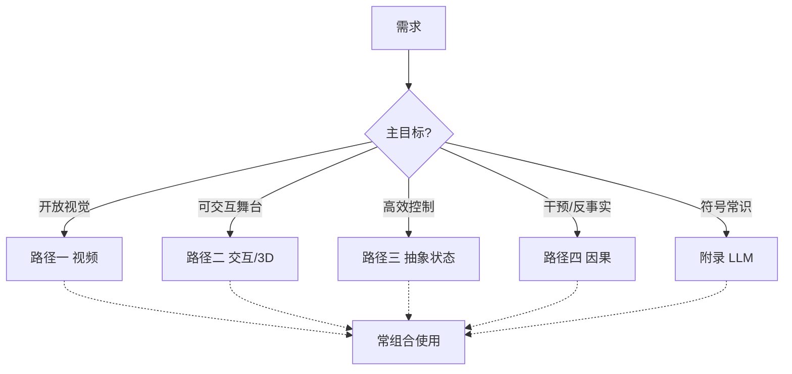

# 附录：LLM 世界模型与四路径对照

> [!WARNING]
> 🧪 Beta公测版本提示：教程主体已完成，正在优化细节，欢迎大家提Issue反馈问题或建议。

> 主线已收成[四条路径](/world-models/intro/)。语言模型模拟器不占主路径名额，但在符号推理、工具编排、与[因果模块](/world-models/causal/)对接上仍然重要——故作附录。

---

## 一、LLM 能不能当世界模型？

把状态与动作写成文本，让模型学

$$
P_\theta\big(s_{t+1}^{\text{text}}\mid s_t^{\text{text}}, a_t^{\text{text}}\big)
$$

与下一 token 预测同构。优势是可解释、常识强、组合泛化；劣势是连续物理弱、易幻觉、长程实体易漂、传感器接地难。

与路径四的接点：*Language Agents Meet Causality* 一类工作试图把 LLM 智能体接到**显式因果世界模型**，用 $do(a)$ 约束语言规划，而不是只靠语感。

---

## 二、四路径 + 语言接口（总表）

| 路径 | 核心思想 | 预测什么 | 决策 | 代表 |
|------|----------|----------|------|------|
| 一 视频生成 | 观测级生成 | 像素/视频潜空间 | 弱–中（贵） | Sora、Cosmos |
| 二 交互/3D | 可玩/可漫游 | 动作条件帧或 3D | 中（交互强） | Genie、HunyuanWorld |
| 三 抽象状态 | 紧凑动力学 | $z$/嵌入 | 高 | PETS、Dreamer、JEPA、LeWM、MuZero |
| 四 因果 | 干预与反事实 | $P(\cdot\mid do)$ | 取决于识别 | LLM-CWM、NTP 因果分析 |
| 附录 语言 | 文本状态转移 | token | 中（符号） | LLM simulators |

**经验法则：**

- 刷视觉先验 / 数据 → 路径一；
- 要可玩舞台 → 路径二；
- 要样本高效控制 → 路径三；
- 要区分「看见」与「动手」→ 路径四；
- 要常识与工具编排 → 语言附录，并最好接到因果或具身模块。

---

## 三、玩具

本章 demo 仍是钥匙与门的微缩文本世界：字符嵌入 + MLP 学转移，展示语言状态可学、也会局部幻觉。

## 四、小结

四路径是骨干；LLM 是接口与常识层。建议回到 [导论](/world-models/intro/) 按应用选题深入。

## 📥 Code

| File | View | Download |
|------|------|----------|
| demo.py | [Open](./code-demo) | <a href="/notebook/code/world-models/llm/demo.py" target="_blank" download>Download</a> |
| exercise.py | [Open](./code-exercise) | <a href="/notebook/code/world-models/llm/exercise.py" target="_blank" download>Download</a> |

## 参考

1. Hao, S., et al. (2023). Reasoning with Language Model is Planning with World Model. [[arXiv:2305.14992](https://arxiv.org/abs/2305.14992)]
2. Gkountouras, J., et al. (2025). Language Agents Meet Causality. *ICLR*.
3. Wong, L., et al. (2023). From Word Models to World Models. [[arXiv:2306.12672](https://arxiv.org/abs/2306.12672)]
