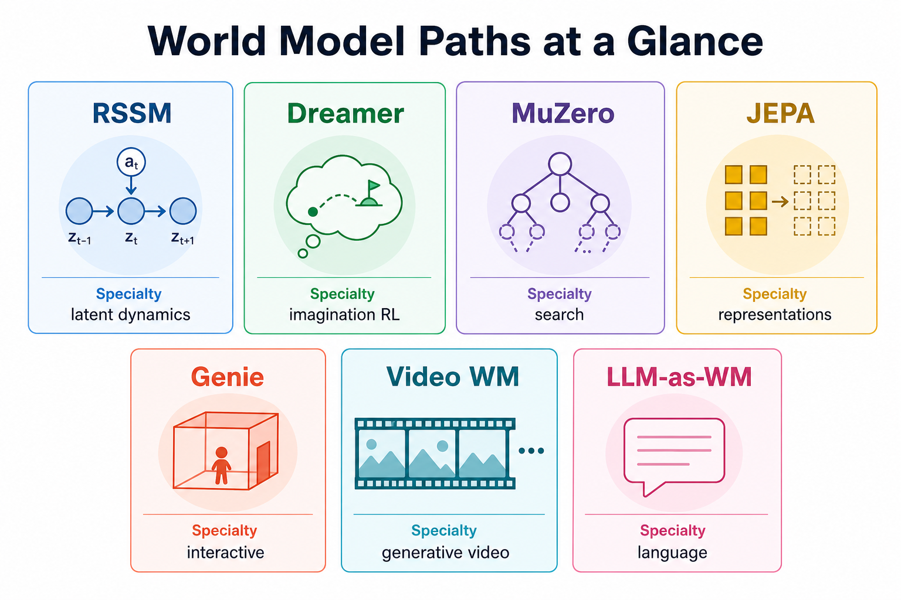
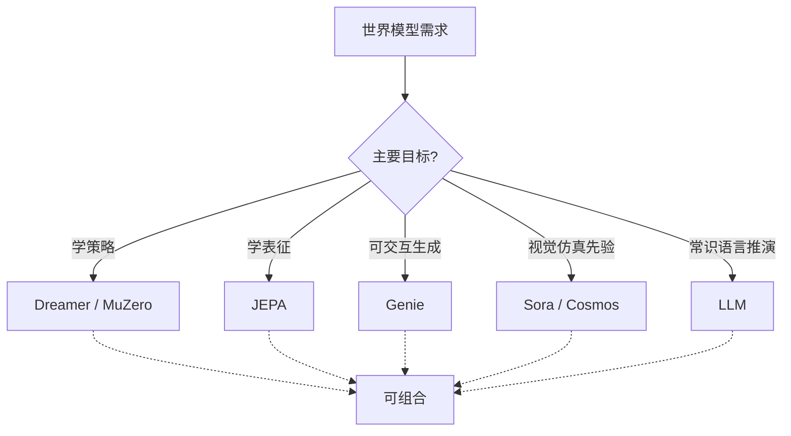

# wm08 LLM 世界模型与八路径对比

> [!WARNING]
> 🧪 Beta公测版本提示：教程主体已完成，正在优化细节，欢迎大家提Issue反馈问题或建议。

> 用语言模拟世界，并用一张表收束全部八条路径

---

## 一、LLM 能不能当世界模型？

大语言模型在对话中常表现出"常识物理"和"情景推演"能力：你描述一个房间状态，问"如果拿起钥匙再开门会怎样"，它往往能给出合理的下一状态描述。这启发了一条新路径——

> **把世界状态编码为文本，把动作编码为自然语言，让语言模型学习 $P(s_{t+1} \mid s_t, a_t)$。**

这条路径的代表工作包括：用 LLM 做文本游戏 agent、用语言模型做规划的世界模型（如部分 LLM-as-agent / world model 研究）、以及把环境观测字幕化后再做语言层面的转移预测。

> **图解说明**：语言世界模型强在语义与可解释性，弱在连续物理精度；像素/潜空间世界模型则相反。二者常需组合使用。

> **图解说明**：七条路径各有专长——RSSM/Dreamer 偏样本高效控制，MuZero 偏搜索规划，JEPA 偏表征预测，Genie 偏可交互生成，视频 WM 偏开放视觉模拟，LLM 偏符号与工具编排。

---

## 二、语言作为状态的双刃剑

**优势：**

- **极高的可解释性**：状态和转移都是人能读懂的句子
- **常识与语义推理强**：门锁、容器、社会规范等符号知识天然适配语言
- **组合泛化**：没见过的状态描述，也可能靠语言组合能力外推

**劣势：**

- **物理精度差**：连续动力学、接触力学、精确几何很难用短文本刻画
- **幻觉与不可验证**：模型可能生成看起来通顺但违反规则的下一状态
- **长程一致性脆弱**：多步推演后实体身份、约束条件容易漂移
- **观测接地困难**：真实传感器信号 → 文本的瓶颈往往比文本推理本身更大

形式化地，文本世界模型优化：

$$
\mathcal{L} = -\sum_t \log P_\theta\big(s_{t+1}^{\text{text}} \,\big|\, s_t^{\text{text}},\, a_t^{\text{text}}\big)
$$

这与标准 LM 的下一 token 预测同构——差别只在于数据是"状态-动作-下一状态"三元组，而非任意网页文本。

---

## 三、玩具实验：钥匙与门的文本世界

本章 demo 构造一个 5 状态 × 5 动作的微缩文本世界（客厅/门外、是否持钥匙、门开关）。我们训练一个**字符级嵌入 + MLP** 的极简转移预测器（刻意不是真正的大模型，而是让你看清"语言状态转移学习"的最小形式），然后按动作序列做多步推演，对比真实规则表与模型预测。

它展示两件事：

1. 语言状态转移**可以被学习**
2. 即便在玩具规模，一旦编码/解码或训练不足，推演也会出现**局部错误**——这是 LLM 世界模型幻觉问题的缩影

---

## 四、八路径总对比

下表是进阶二（wm01–wm08）的收束视图。评分是**教学向的相对尺度**，不是绝对基准。

| 路径 | 核心思想 | 预测什么 | 决策能力 | 视觉/交互 | 典型代表 |
|------|----------|----------|----------|-----------|----------|
| wm01 导论 | 分类框架 | — | — | — | 本系列地图 |
| wm02 RSSM | 随机潜状态 + 滤波 | 潜状态/观测 | 中高 | 中 | PlaNet |
| wm03 Dreamer | 在想象中做 RL | 潜状态+奖励 | **很高** | 中 | DreamerV3 |
| wm04 MuZero | 隐式模型 + MCTS | 策略/价值/奖励 | **极高** | 低（不重建） | MuZero |
| wm05 JEPA | 预测表征非像素 | 表征 | 高（MPC） | 低–中 | I/V-JEPA |
| wm06 Genie | 无监督潜在动作 | 下一帧 token | 中 | **交互极强** | Genie 1/2/3 |
| wm07 视频生成 | 生成逼真视频 | 像素/潜视频 | 低–中 | **视觉极强** | Sora, Cosmos |
| wm08 LLM | 语言状态转移 | 文本下一状态 | 中 | 可解释极强 | LLM world models |

**如何选择（经验法则）：**

- 要**打游戏/控机器人策略** → Dreamer / MuZero
- 要**鲁棒语义表征 + 规划** → JEPA
- 要**可玩的生成世界** → Genie
- 要**视觉先验/数据引擎** → Sora / Cosmos
- 要**常识推理与可解释推演** → LLM
- 真实系统往往是**组合拳**，而非单选

---

## 五、本节小结

| 概念 | 一句话 |
|------|--------|
| LLM 世界模型 | 用自然语言编码状态与动作，学习文本层面的转移 |
| 语言状态的优势 | 可解释、常识强、组合泛化 |
| 语言状态的劣势 | 物理弱、易幻觉、长程易漂、接地难 |
| 八路径对比 | 决策 / 表征 / 交互 / 视觉 / 语言 五条主轴上的不同权衡 |
| 组合视角 | 前沿系统常融合多条路径，而非互斥二选一 |

> 至此，进阶二「世界模型」八章完成。建议回到 [wm01 世界模型导论与分类](/world-models/intro/) 对照分类图，按自己的应用场景选择深入方向。

## 📥 Code

| File | View | Download |
|------|------|----------|
| demo.py | [Open](./code-demo) | <a href="/notebook/code/world-models/llm/demo.py" target="_blank" download>Download</a> |
| exercise.py | [Open](./code-exercise) | <a href="/notebook/code/world-models/llm/exercise.py" target="_blank" download>Download</a> |

## 参考

1. Hao, S., et al. (2023). Reasoning with Language Model is Planning with World Model. *EMNLP 2023*. [[arXiv:2305.14992](https://arxiv.org/abs/2305.14992)]
2. Wong, L., et al. (2023). From Word Models to World Models: Translating from Natural Language to the Probabilistic Language of Thought. [[arXiv:2306.12672](https://arxiv.org/abs/2306.12672)]
3. Xiang, J., et al. (2024). Language Models Meet World Models: Embodied Experiences Enhance Language Models. (survey / related lines)
4. LeCun, Y. (2022). A Path Towards Autonomous Machine Intelligence. (JEPA vs generative / language routes)
5. 本系列 wm01–wm07 各章参考文献
