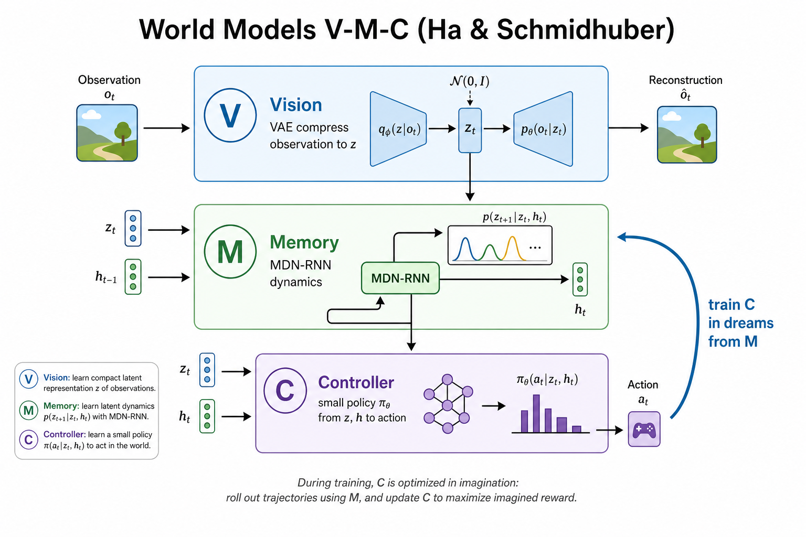
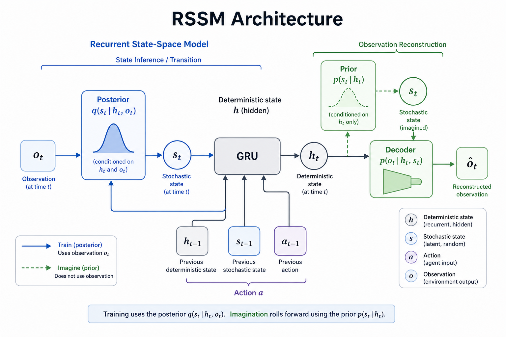
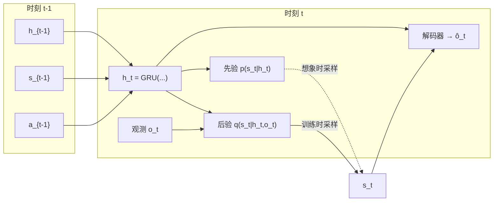
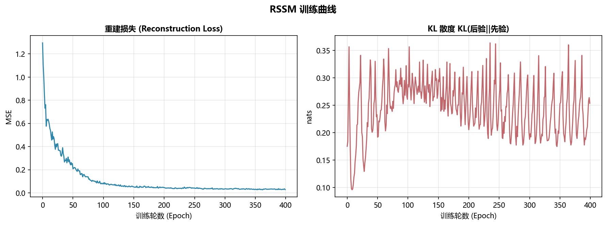
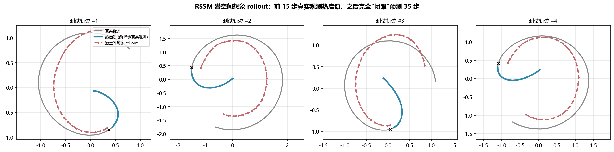
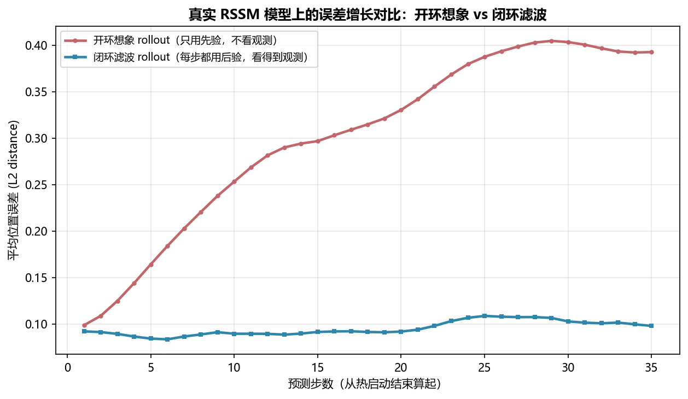

# wm02 经典起源与 RSSM

> [!WARNING]
> 🧪 Beta公测版本提示：教程主体已完成，正在优化细节，欢迎大家提Issue反馈问题或建议。

> 从"World Models"的 V-M-C 三件套，到 PlaNet 的 RSSM —— 如何让 Agent 在潜空间里学会做梦。

---

## 一、Ha & Schmidhuber 2018：World Models 的 V-M-C

上一节我们建立了"世界模型"的统一框架。本节回到它在深度学习里的**经典起源**——Ha & Schmidhuber 2018 的 *World Models*，以及随后 PlaNet 提出的 RSSM。

World Models 把一个能"做梦"的 Agent 拆成三个模块：

| 模块 | 名称 | 职责 | 典型实现 |
|------|------|------|---------|
| **V** | Vision | 把高维观测（游戏画面）压缩成低维潜向量 $z_t$ | VAE |
| **M** | Memory | 学习动力学 $p(z_{t+1} \mid z_{\le t}, a_{\le t})$，同时预测 done | MDN-RNN |
| **C** | Controller | 只看 $(z_t, h_t)$ 就决定动作 $a_t$ | 极小的线性策略（CMA-ES 训练） |

> **图解说明**：V 把像素压成潜向量，M 在潜空间里学动力学并生成「梦境」，C 只吃紧凑的 $(z,h)$ 做决策——策略可以几乎完全在梦里练。

最关键的实验结论是：**Controller 可以完全在 M 生成的"梦境"里训练**，事后迁移到真实 VizDoom 环境依然有效。这第一次在深度学习框架下证明了"脑内练习也能学会真实技能"。

但原始 MDN-RNN 有两个痛点：

1. **开环预测误差累积快**：RNN 直接预测下一帧的潜向量，多步后容易飘离真实分布
2. **缺少明确的"先验 / 后验"分工**：训练时看到观测、想象时不看观测，这两种用法混在同一个网络里，不够干净

PlaNet（Hafner et al., 2019）用 **RSSM（Recurrent State-Space Model）** 系统了这两个问题——这也是 Dreamer 系列的底座。

---

## 二、RSSM：确定性状态 + 随机状态

RSSM 的核心设计是把潜状态拆成两部分：

$$
\begin{aligned}
h_t &= f_\theta(h_{t-1}, s_{t-1}, a_{t-1}) && \text{（确定性状态，通常用 GRU）} \\
s_t &\sim p_\theta(s_t \mid h_t) && \text{（随机先验：不看观测，纯预测）} \\
s_t &\sim q_\theta(s_t \mid h_t, o_t) && \text{（随机后验：看到观测后的修正）} \\
\hat{o}_t &\sim p_\theta(o_t \mid h_t, s_t) && \text{（解码器：重建观测）}
\end{aligned}
$$

> **图解说明**：训练时用后验 $q(s_t\mid h_t,o_t)$ 吃观测；想象（做梦）时只用先验 $p(s_t\mid h_t)$，不再看真实 $o_t$。确定性状态 $h_t$ 用 GRU 传递长期结构。

直觉分工：

- **$h_t$（确定性）**：记住"长期、确定性强"的信息——比如目标在转圈、角速度大致是多少
- **$s_t$（随机）**：表达"不确定性"——比如观测噪声让你暂时分不清精确位置
- **先验 $p(s_t\mid h_t)$**：部署 / 想象时用——**闭着眼睛**只凭历史猜下一步
- **后验 $q(s_t\mid h_t, o_t)$**：训练时用——**睁开眼睛**用真实观测修正估计

---

## 三、训练目标：序列版 ELBO

RSSM 的损失函数是变分下界（ELBO）的序列版本：

$$
\mathcal{L} = \mathbb{E}_{q}\left[\sum_{t=1}^{T}\underbrace{\log p(o_t \mid h_t, s_t)}_{\text{重建项}} - \underbrace{D_{KL}\big(q(s_t\mid h_t,o_t)\,\|\,p(s_t\mid h_t)\big)}_{\text{一致性惩罚}}\right]
$$

- **重建项**：让 $(h_t, s_t)$ 能还原出观测——逼迫表示学习"有用的"信息
- **KL 项**：让先验逼近后验——逼迫模型学会"不看观测也能猜准"

实践中还有两个重要技巧：

1. **Free-nats**：当 KL 低于某个阈值（如 0.5 nats）时不再惩罚，防止后验过早"躺平"变成先验（posterior collapse）
2. **训练用后验、想象用先验**：训练时每一步都用后验采样（更准确的监督信号）；真正"做梦"时只用先验做多步 rollout

对角高斯之间的 KL 有解析解：

$$
D_{KL}\big(\mathcal{N}(\mu_q,\sigma_q)\,\|\,\mathcal{N}(\mu_p,\sigma_p)\big)
= \sum_i\left[\log\frac{\sigma_{p,i}}{\sigma_{q,i}} + \frac{\sigma_{q,i}^2 + (\mu_{q,i}-\mu_{p,i})^2}{2\sigma_{p,i}^2} - \frac{1}{2}\right]
$$

---

## 四、玩具演示：在潜空间里想象圆周轨迹

本章的 `demo.py` 构造了一个极简 2D 环境：质点被 PD 控制器驱动着追踪一个旋转目标点。模型只能看到带噪声的位置观测，真实动力学参数（半径、角速度）不可见。

我们从零实现一个简化版 RSSM（GRU + 对角高斯先验/后验 + MLP 解码器），训练后做两件事：

1. **开环想象**：用前 10 步真实观测热启动，之后完全"闭眼"，只用先验 + 动作序列预测未来
2. **对比闭环滤波**：每一步都看真实观测（用后验），误差几乎不随步数增长

核心观察：

- 热启动后，模型能在潜空间里大致跟上真实轨迹的弯曲方向
- 开环想象的误差会随步数缓慢增长（没有观测纠错）
- 闭环滤波的误差几乎平坦——每一步观测都在"重置"状态估计
- 因为状态被压缩到低维潜空间（而非像素空间），误差增长速度远比 wm01 的像素 rollout 类比温和——这正是"在潜空间做梦"的价值

---

## 五、从 RSSM 到 PlaNet：在想象里做规划

PlaNet 不只是学了一个 RSSM，还用它做**基于模型的规划**：

1. 用真实观测热启动得到当前 $(h_t, s_t)$
2. 在潜空间里采样多条候选动作序列
3. 用 RSSM 先验对每条动作序列做多步想象，预测累计奖励
4. 用 CEM（Cross-Entropy Method）迭代优化动作序列，选最好的执行

这已经是"用学到的模型做规划"了，但策略本身还不是一个可学习的神经网络——每一步都要重新跑 CEM，计算开销大。下一节的 **Dreamer** 会解决这个问题：直接在想象轨迹上训练一个 Actor-Critic，把"规划"蒸馏成一个快速策略。

---

## 六、本节小结

| 概念 | 一句话 |
|------|--------|
| World Models (2018) | V（VAE）+ M（MDN-RNN）+ C（线性控制器），首次证明可在梦境中训练 |
| RSSM | 确定性状态 $h_t$ + 随机状态 $s_t$，先验用于做梦、后验用于训练 |
| 先验 $p(s_t\mid h_t)$ | 不看观测的预测分布，想象/规划时使用 |
| 后验 $q(s_t\mid h_t,o_t)$ | 看到观测后的修正估计，训练时提供监督 |
| 序列 ELBO | 重建损失 + KL(后验‖先验) |
| Free-nats | KL 低于阈值时不惩罚，防止后验坍缩 |
| 开环 vs 闭环 | 开环只用先验（误差累积）；闭环每步用后验（误差受控） |
| PlaNet | 用 RSSM + CEM 在潜空间做规划 |

> 下一节 [wm03 Dreamer 家族](/world-models/dreamer/) 将展示如何在 RSSM 的想象轨迹上直接训练 Actor-Critic，把"每次重新规划"变成"学到一个可快速执行的策略"。

## 📥 Code

| File | View | Download |
|------|------|----------|
| demo.py | [Open](./code-demo) | <a href="/notebook/code/world-models/rssm/demo.py" target="_blank" download>Download</a> |
| exercise.py | [Open](./code-exercise) | <a href="/notebook/code/world-models/rssm/exercise.py" target="_blank" download>Download</a> |

## 参考

1. Ha, D., & Schmidhuber, J. (2018). World Models. [[arXiv:1803.10122](https://arxiv.org/abs/1803.10122)]
2. Hafner, D., et al. (2019). Learning Latent Dynamics for Planning from Pixels. *ICML 2019*. (PlaNet) [[arXiv:1811.04551](https://arxiv.org/abs/1811.04551)]
3. Hafner, D., et al. (2020). Dream to Control: Learning Behaviors by Latent Imagination. *ICLR 2020*. (Dreamer) [[arXiv:1912.01603](https://arxiv.org/abs/1912.01603)]
