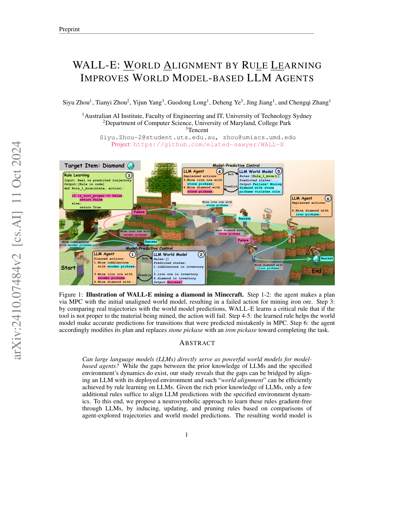
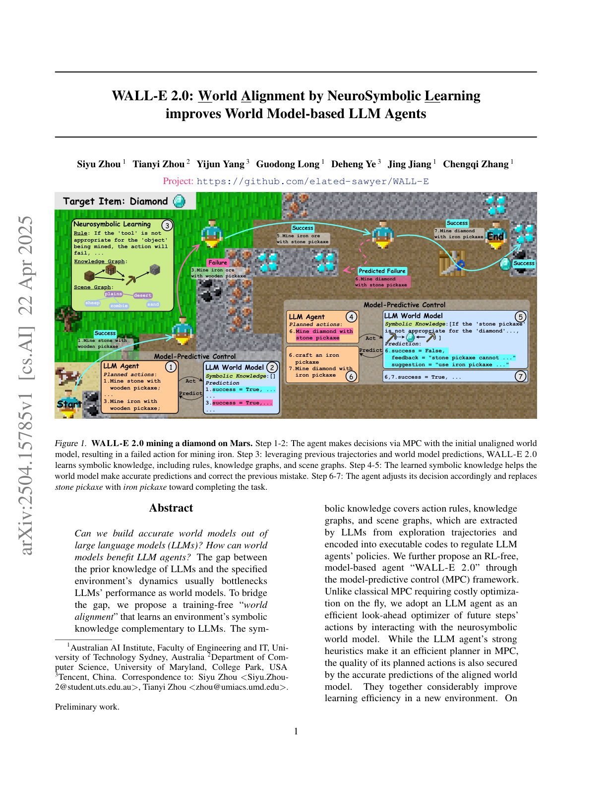
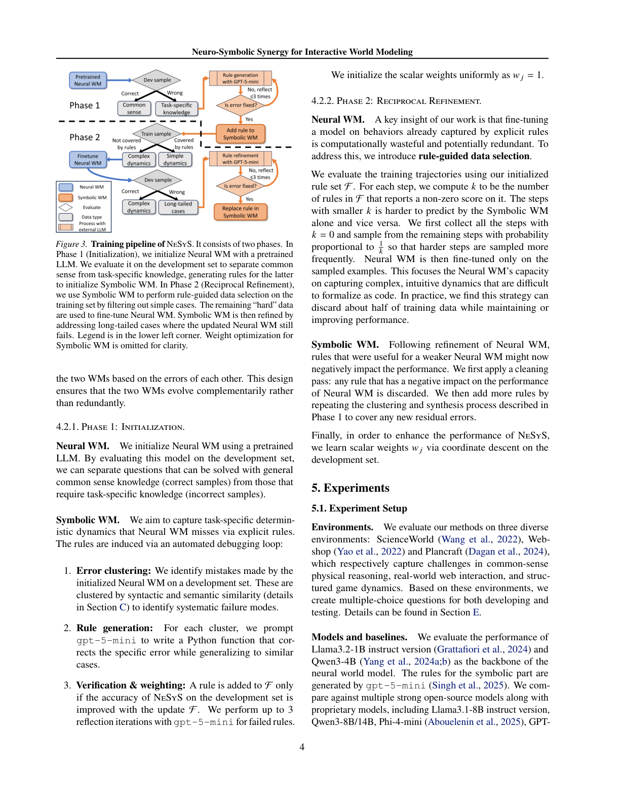
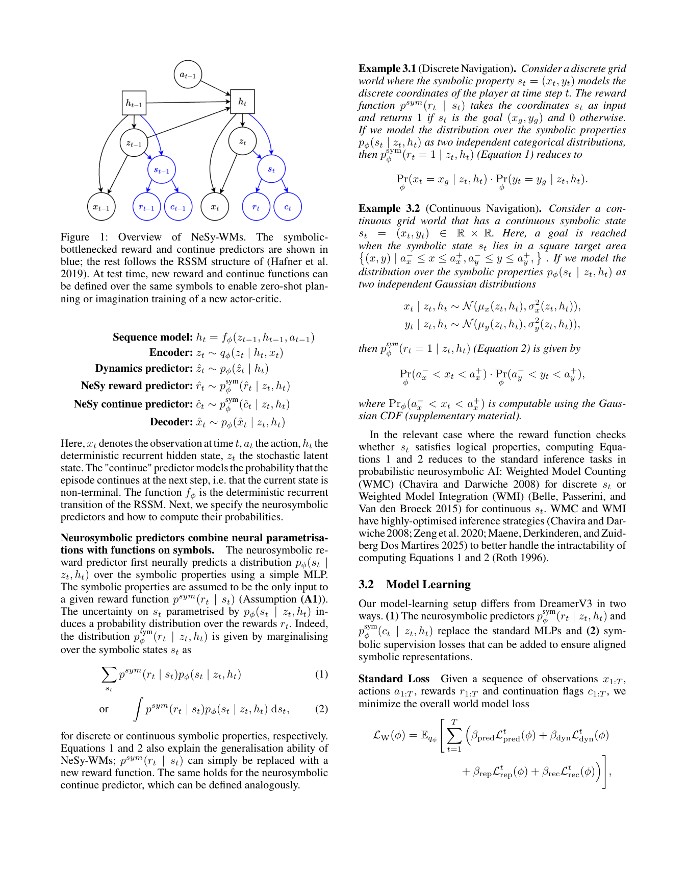

# 世界对齐：LLM 会幻觉，就把定律写成符号

> [!WARNING]
> 🧪 Beta公测版本提示：教程主体已完成，正在优化细节，欢迎大家提Issue反馈问题或建议。

> 把 LLM 直接当 $P(s_{t+1}^{\text{text}}\mid s_t,a_t)$ 用，常识强、接地弱、边角案例爱编。路径五的第三条线不抛弃 LLM 先验，而是 **world alignment**：用规则、知识图谱或符号能量去改写 LLM 的预测，让模拟器服从当前环境的定律。

---

## 一、WALL-E 1.0：从轨迹差异里归纳规则

Zhou 等（2024）*WALL-E: World Alignment by Rule Learning* 问：LLM 能不能直接当世界模型，并让基于模型的智能体变强？瓶颈是 **LLM 的先验 ≠ 当前环境的转移**。他们用无梯度的规则学习（归纳 / 更新 / 剪枝）：对比真实轨迹与世界模型预测，得到可执行规则（例如「工具与矿物不匹配则挖掘失败」），再把规则嵌进 MPC。

> 图出自 Zhou et al., arXiv:2410.07484, Figure 1。步骤 1–2：未对齐的 LLM 世界模型以为木镐能挖铁矿，MPC 失败。步骤 3：对比真实/预测轨迹，学到 `Rule_1_mine`。步骤 4–6：规则修正预测，计划改成石镐挖铁、铁镐挖钻。引用仅用于教学。项目页：https://github.com/elated-sawyer/WALL-E

这和路径四完全同构：未对齐模型拟合的是「语感上的相关」，对齐后的规则逼近 $P(\text{成功}\mid do(\text{用这把镐挖这种矿}))$。

---

## 二、WALL-E 2.0：神经符号世界对齐

Zhou 等（2025）*WALL-E 2.0* 把「一条 Python 规则」升级成更丰富的符号知识：规则 + 知识图谱 + 场景图，用神经符号学习对齐 LLM 世界模型。故事仍是挖钻石，但环境设定更强调迁移（文中示意图甚至放到「火星」场景），说明对齐的是**当前世界的机制**，不是地球 Minecraft 的台词记忆。

> 图出自 Zhou et al., arXiv:2504.15785, Figure 1。初始化的 LLM 世界模型仍会错判挖掘成功；对齐后符号知识把「石镐挖钻石」判为失败并建议铁镐。引用仅用于教学。

读 2.0 时抓住三件事：符号不只是 if-else；场景图把「这里有什么」从语言模型的隐状态里拽出来；MPC 仍然是外环——世界模型变准，计划才变对。

---

## 三、NeSyS：符号能量去推 LLM 的输出分布

Zhao, Zhou 等（2026）*Neuro-Symbolic Synergy for Interactive World Modeling*（NeSyS）把分工说得更硬：

- LLM 世界模型：语义表达力强，边角案例幻觉；
- 符号世界模型：逻辑一致，语义穷。

NeSyS **交替**用「对方解释不了的轨迹」训练两边。关键工程点：符号 WM **不是**只写在提示词里，而是作为能量项去 **修改 LLM 的输出概率**；神经网络只在符号规则覆盖不到的轨迹上微调，论文报告训练数据可减半而不掉点。环境包括 ScienceWorld、Webshop、Plancraft。

> 图出自 Zhao et al., arXiv:2602.10480, Figure 3。Phase 1 用预训练 LLM 初始化神经 WM，在开发集上分开常识与任务特定知识并生成规则；随后两边用互补轨迹交替更新。引用仅用于教学。代码：https://github.com/tianyi-lab/NeSyS

和 WALL-E 的差别：WALL-E 更偏「学规则然后约束规划」；NeSyS 更偏「规则在 token 分布上动手」，所以它能宣称不是 prompt 技巧。

---

## 四、零样本任务迁移：符号瓶颈住奖励

Tamassia, De Smet, Marra（2026）*Towards Zero-Shot Task Transfer with Neurosymbolic World Models* 从路径三的 RSSM 出发：普通神经世界模型的潜状态绑死在训练任务上，换奖励函数就要重新交互。他们让 **奖励（与 continue）只依赖潜状态里一组结构化的符号分量**；观测重建仍走神经槽。测试时，只要新奖励能定义在**同一符号状态**上，就可以零样本改规划 / 想象，不必再进环境。

> 图出自 Tamassia et al., arXiv:2608.17959, Figure 1。蓝头：符号瓶颈的 reward / continue；其余跟随 Hafner RSSM。新任务 = 同一符号上的新奖励。引用仅用于教学。

这是路径三与路径五最干净的焊接点：动力学可以仍是神经的，**任务接口必须是符号的**，否则世界模型无法复用。

---

## 五、对齐路线的检查清单

读「LLM 世界模型」论文时问：

1. 失败时，是改权重、改提示，还是改**可执行规则**？
2. 符号约束有没有碰到概率（NeSyS），还是只写在自然语言里？
3. 新任务是换像素动力学，还是只换符号上的奖励（零样本迁移）？
4. 有没有和环境真轨迹对拍（WALL-E 的 alignment），还是只在合成文本里自洽？

纯文本模拟器的下限与幻觉玩具，见下一章 [LLM 作为世界模型](/world-models/symbolic/llm-sim/)。

## 参考

1. Zhou, S., et al. (2024). WALL-E: World Alignment by Rule Learning Improves World Model-based LLM Agents. [[arXiv:2410.07484](https://arxiv.org/abs/2410.07484)]
2. Zhou, S., et al. (2025). WALL-E 2.0: World Alignment by NeuroSymbolic Learning. [[arXiv:2504.15785](https://arxiv.org/abs/2504.15785)]
3. Zhao, H., Zhou, S., et al. (2026). Neuro-Symbolic Synergy for Interactive World Modeling (NeSyS). [[arXiv:2602.10480](https://arxiv.org/abs/2602.10480)]
4. Tamassia, I., De Smet, L., & Marra, G. (2026). Towards Zero-Shot Task Transfer with Neurosymbolic World Models. [[arXiv:2608.17959](https://arxiv.org/abs/2608.17959)]
