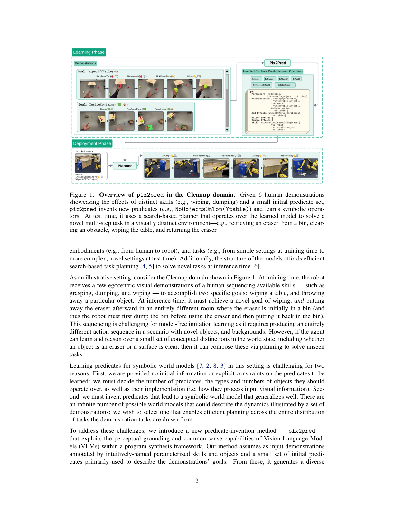
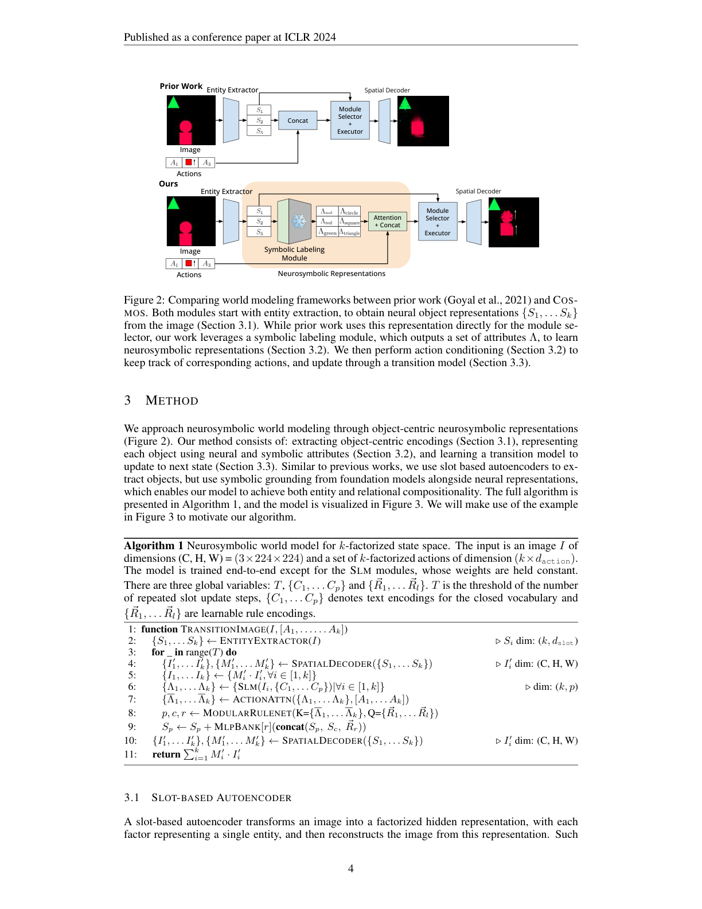
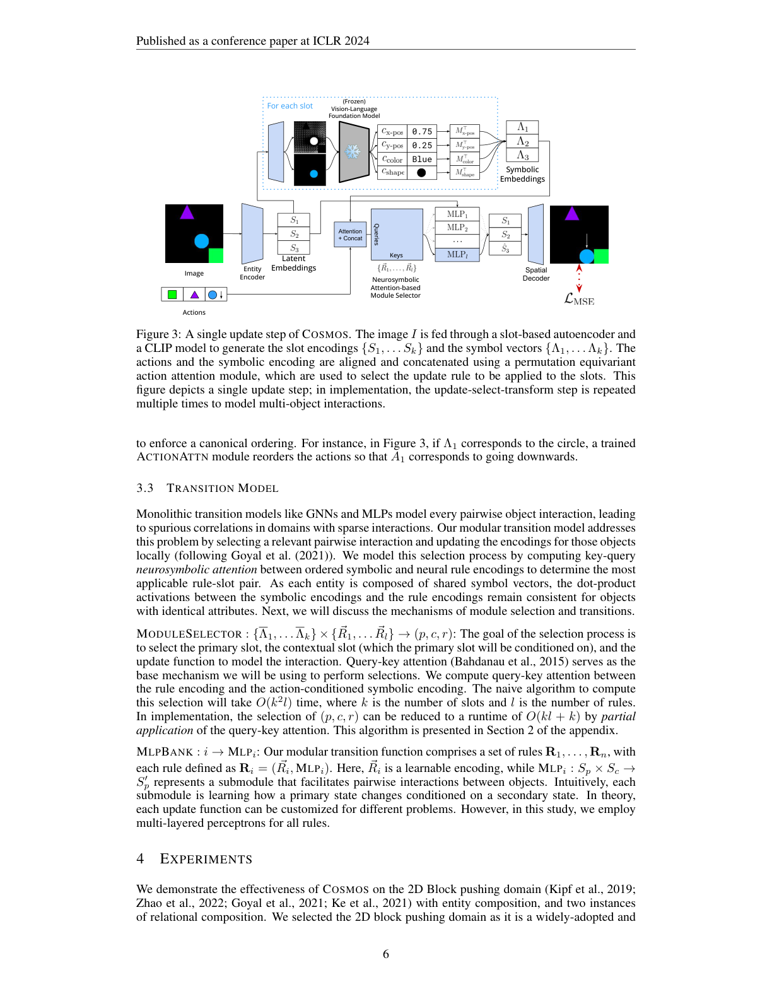
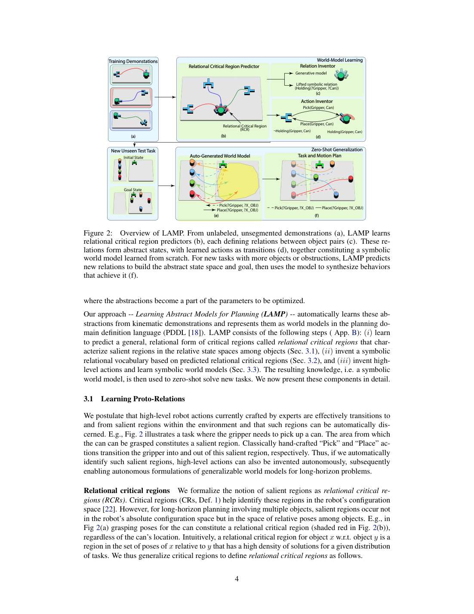

# 视觉接地：符号世界模型从哪来？

> [!WARNING]
> 🧪 Beta公测版本提示：教程主体已完成，正在优化细节，欢迎大家提Issue反馈问题或建议。

> 手写 PDDL 在积木世界能用，到厨房、桌面操作就写爆。路径五的第一硬问题是 **grounding**：像素里的物体如何变成可规划的谓词。本章三条线——VLM 提谓词（pix2pred）、可微神经符号槽（COSMOS，注意不是 NVIDIA Cosmos）、从原始演示发明关系概念（R2L-LAMP）。

---

## 一、pix2pred：用预训练 VLM 发明谓词

Athalye, Kumar 等（2025）*From Pixels to Predicates* 的设定很「机器人」：给少量**短时程、图像序列演示**和一批底层技能（擦、倒、抓），要在新目标、新摆放、更长时程上**零样本规划**。关键组件不是再训一个像素动力学，而是符号世界模型里的 **谓词集**——描述物体属性与关系的那一批 $P(o_1,\ldots)$。

方法分两段：

1. **提议**：预训练 VLM 根据演示提出大量「也许有用」的视觉谓词，并直接在相机图像上判定真假；
2. **选择 + 算子**：把谓词与演示送进基于优化的模型学习，得到**紧凑谓词子集**和符号 operator；测试时 VLM 把当前图像编成符号状态，搜索技能序列。

> 图出自 Athalye et al., *From Pixels to Predicates*, arXiv:2501.00296, Figure 1（Cleanup 域）。六条人类演示展示不同技能效果；系统发明如 `NoObjectsOnTop(?table)` 的谓词并学习符号算子，测试时用搜索把底层技能串起来。引用仅用于教学。

教学要点：

- 符号世界模型的「状态」可以是 $\texttt{图像特征}\,\|\,\texttt{对象特征}$，但**规划发生在谓词赋值上**；
- VLM 负责 grounding 与提议，不负责可靠长程搜索——搜索仍是经典规划；
- 泛化来自谓词的组合，而不是记忆像素轨迹。这和路径一「再生成一段更长的视频」是不同的归纳偏置。

---

## 二、COSMOS：神经符号槽 + 可组合规则（ICLR 2024）

Sehgal, Grayeli, Sun, Chaudhuri 的 *Neurosymbolic Grounding for Compositional World Models*（ICLR 2024）针对 **组合泛化（CompGen）**：训练时见过的视觉「原子」在测试时以未见过的方式拼起来。框架也叫 COSMOS，**与 NVIDIA 的 Cosmos 视频基础模型不是同一件事**。

两个新工具：

1. **神经符号场景编码**：每个实体 = 神经网络出的实向量 **加上** 一组可组合的符号属性（颜色、形状…）；
2. **神经符号注意力**：把实体绑定到学到的交互规则上。

符号属性不是人手贴标签，而是用视觉-语言基础模型从图像里算出来；整条管线可微。

> 图出自 Sehgal et al., ICLR 2024, 方法节对比图（原文 Figure 2 附近）。上：先前工作把槽向量直接送进模块选择器。下：插入 Symbolic Labeling Module，得到属性 $\Lambda$，再 Attention+Concat 形成神经符号表示。引用仅用于教学。

> 同上论文后续架构图：每个槽的潜向量与符号嵌入共同作为 Query/Key，选择规则模块再更新实体。CompGen 的赌注是：规则按**属性**触发，而不是按「这个槽在训练集里总跟那个槽一起出现」。

在积木推动域上，作者报告对「物体组合泛化」和「属性组合泛化」相对 ALIGNEDNPS / GNN 等基线更强。局限也清楚：领域仍是受控的 2D 积木，MSE 重建会随物体变密而变吵——符号绑定解决的是组合，不是开放世界视频。

---

## 三、R2L-LAMP：从原始演示发明关系概念

Shah, Nagpal, Srivastava（CoRL 2025, PMLR v305）*From Real World to Logic and Back*：机器人从**少量未分割、未标注**的演示里**自己发明**符号关系概念，再学逻辑世界模型，从而在物体数量远超训练（文中至多约 $18\times$）、时程远长于演示的任务上零样本规划。早期 arXiv / ICAPS 版本标题曾是 *Learning Symbolic World Models for Long Horizon Planning*，与正式发表为同一工作。

> 图出自 Shah et al., CoRL 2025。训练演示里学 Relational Critical Region，得到如 `Pick(?Gripper, ?X_OBJ)` 的抬升算子；测试时物体数量与桌面布局可以远复杂于训练。引用仅用于教学。

和 pix2pred 的差别：pix2pred **借助已经很强的 VLM 提议谓词**；LAMP 强调从几何/轨迹统计里**发明**关系，少依赖「问 GPT 这张图里有什么」。两者都指向同一教学结论——长时程泛化靠的是**可抬升的符号**，不是更长的像素 rollout。

---

## 四、三条线怎么选

| 方法 | 符号从哪来 | 规划 | 适合想什么 |
|------|------------|------|------------|
| pix2pred | VLM 提议 + 子集选择 | 技能序列搜索 | 有相机、有技能库、演示很少 |
| COSMOS | VLM 属性 + 可微规则绑定 | 下一帧/下一状态（对象中心） | 组合泛化、仍要像素预测 |
| R2L-LAMP | 从演示发明关系 | 逻辑规划 / TAMP | 真机、要可解释算子 |

下一章不再从图像抽符号，而是假设你已经能用语言或代码**写出**动力学：[程序化世界模型](/world-models/symbolic/programs/)。

## 参考

1. Athalye, A., Kumar, N., et al. (2025). From Pixels to Predicates: Learning Symbolic World Models via Pretrained Vision-Language Models. [[arXiv:2501.00296](https://arxiv.org/abs/2501.00296)]
2. Sehgal, A., Grayeli, A., Sun, J. J., & Chaudhuri, S. (2024). Neurosymbolic Grounding for Compositional World Models. *ICLR*. [[arXiv:2310.12690](https://arxiv.org/abs/2310.12690)]（COSMOS，非 NVIDIA Cosmos）
3. Shah, N., Nagpal, J., & Srivastava, S. (2025). From Real World to Logic and Back. *CoRL*, PMLR 305. [proceedings.mlr.press/v305/shah25a.html](https://proceedings.mlr.press/v305/shah25a.html)
