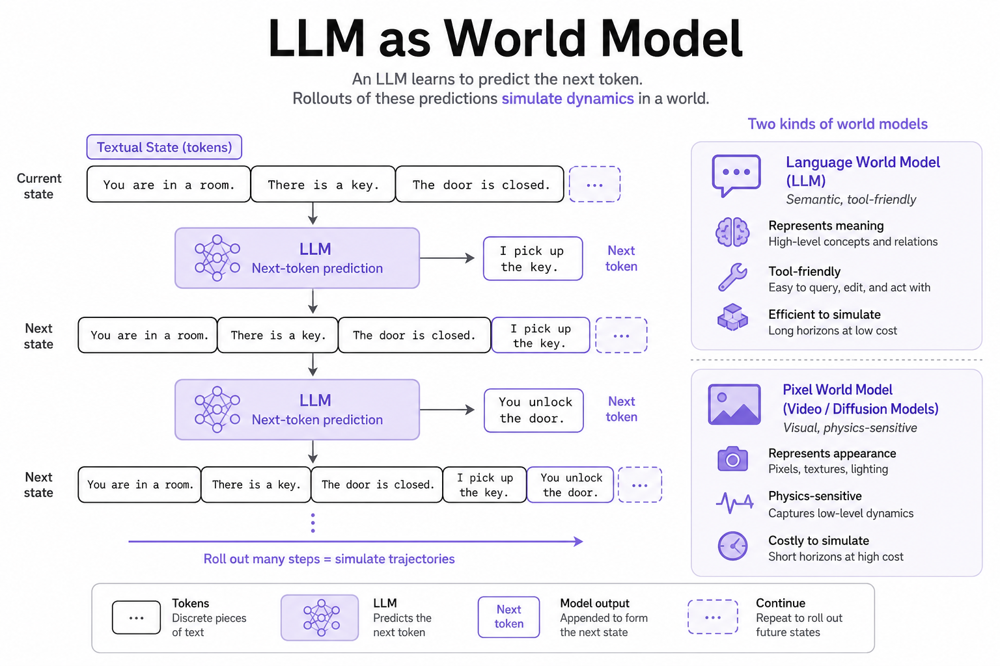
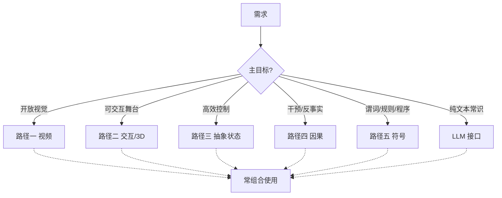

# LLM 作为世界模型：接口层，不是整条路径

> [!WARNING]
> 🧪 Beta公测版本提示：教程主体已完成，正在优化细节，欢迎大家提Issue反馈问题或建议。

> 把状态与动作写成文本，下一 token 预测就变成世界模型。这是路径五最容易上手、也最容易被高估的一层。主线见 [路径五导论](/world-models/symbolic/overview/)；规则对齐见 [WALL-E / NeSyS](/world-models/symbolic/alignment/)。

---

## 一、LLM 能不能当世界模型？

$$
P_\theta\big(s_{t+1}^{\text{text}}\mid s_t^{\text{text}}, a_t^{\text{text}}\big)
$$

与下一 token 预测同构。优势是可解释、常识强、组合泛化；劣势是连续物理弱、易幻觉、长程实体易漂、传感器接地难。

和路径四的接点：*Language Agents Meet Causality* 一类工作把 LLM 智能体接到**显式因果世界模型**。和路径五其余章的接点：Text2World 要 LLM **写 PDDL**，WALL-E 要 LLM **服从学来的规则**——都比「让模型自由续写下一状态」更可验证。

经典文献还包括 Hao et al.（2023）*Reasoning with Language Model is Planning with World Model*（RAP：用 LM 当推演器做 MCTS 式推理）以及 Wong et al.（2023）*From Word Models to World Models*。

---

## 二、五路径 + 语言接口（总表）

| 路径 | 核心思想 | 预测什么 | 决策 | 代表 |
|------|----------|----------|------|------|
| 一 视频生成 | 观测级生成 | 像素/视频潜空间 | 弱–中（贵） | GAN→VAE→扩散→Sora/Cosmos |
| 二 交互/3D | 可玩/可漫游 | 动作条件帧或 3D | 中（交互强） | Genie、HunyuanWorld |
| 三 抽象状态 | 紧凑动力学 | $z$/嵌入 | 高 | PETS、Dreamer、JEPA、LeWM、MuZero |
| 四 因果 | 干预与反事实 | $P(\cdot\mid do)$ | 取决于识别 | LLM-CWM、NTP 因果分析 |
| 五 符号/神经符号 | 谓词、规则、程序 | 可执行符号状态 | 高（可搜索） | pix2pred、PoE-World、WALL-E、NeSyS |
| 本章 语言接口 | 文本状态转移 | token | 中（易幻） | LLM simulators、RAP |

**经验法则：**

- 刷视觉先验 / 数据 → 路径一；
- 要可玩舞台 → 路径二；
- 要样本高效控制 → 路径三；
- 要区分「看见」与「动手」→ 路径四；
- 要可检查定律 / 少样本组合 → 路径五；
- 只要常识与工具编排 → 语言接口，并最好接到因果模块或符号规则。

---

## 三、玩具

本章 demo 仍是钥匙与门的微缩文本世界：字符嵌入 + MLP 学转移，展示语言状态可学、也会局部幻觉。对照 [路径五导论](/world-models/symbolic/overview/) 的规则执行器：一边是「记住训练句子」，一边是「执行定律」。

## 四、小结

五路径是骨干；LLM 是接口与常识层。建议回到 [导论](/world-models/intro/) 按应用选题，或把规则对齐读完 [WALL-E](/world-models/symbolic/alignment/)。

## 📥 Code

| File | View | Download |
|------|------|----------|
| demo.py | [Open](./code-demo) | <a href="/notebook/code/world-models/symbolic/llm-sim/demo.py" target="_blank" download>Download</a> |
| exercise.py | [Open](./code-exercise) | <a href="/notebook/code/world-models/symbolic/llm-sim/exercise.py" target="_blank" download>Download</a> |

## 参考

1. Hao, S., et al. (2023). Reasoning with Language Model is Planning with World Model. [[arXiv:2305.14992](https://arxiv.org/abs/2305.14992)]
2. Wong, L., et al. (2023). From Word Models to World Models. [[arXiv:2306.12672](https://arxiv.org/abs/2306.12672)]
3. Gkountouras, J., et al. (2025). Language Agents Meet Causality. *ICLR*.
4. Zhou, S., et al. WALL-E / WALL-E 2.0（规则与神经符号对齐）。
