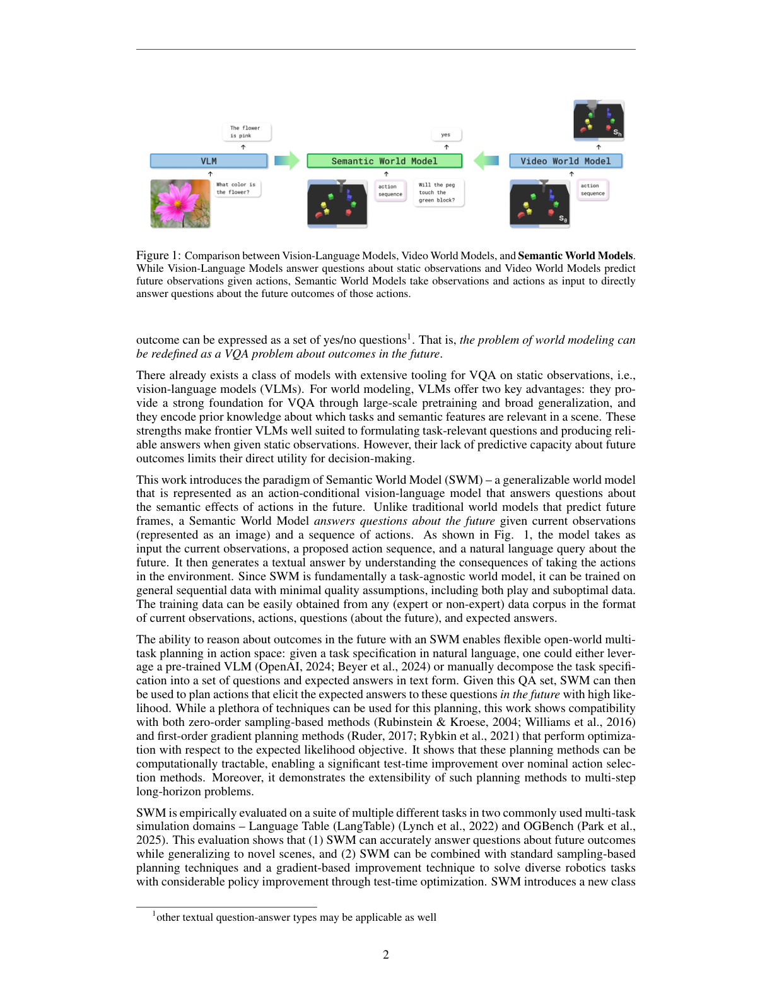
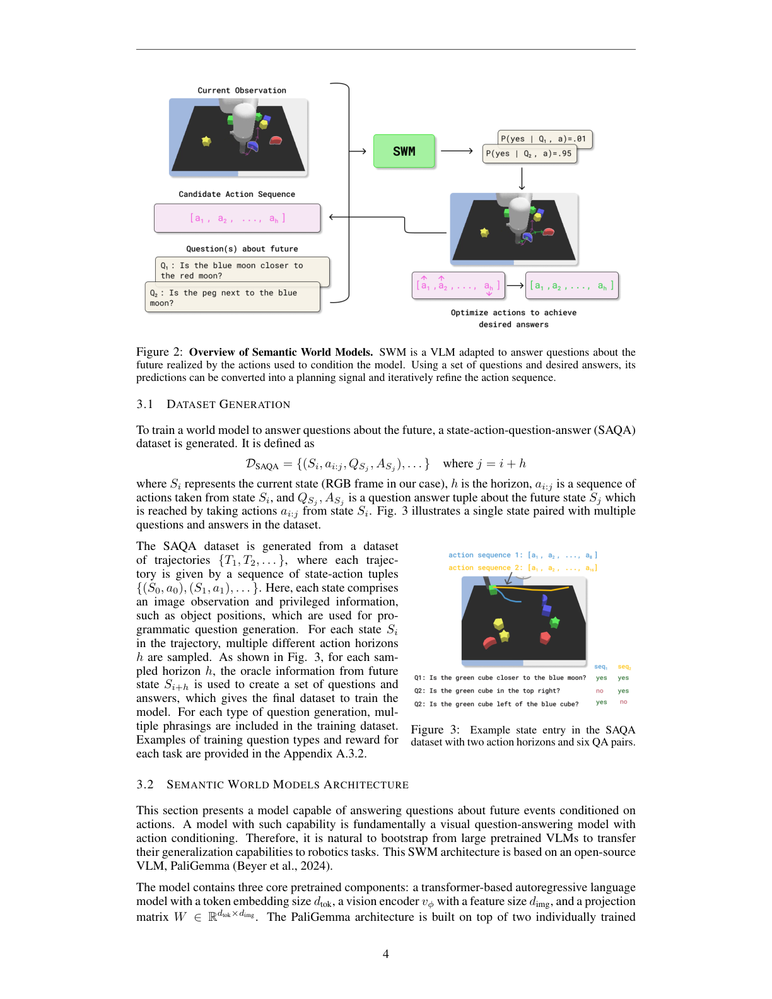
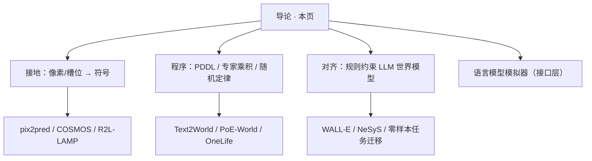

# 路径五导论：把世界写成可执行的符号

> [!WARNING]
> 🧪 Beta公测版本提示：教程主体已完成，正在优化细节，欢迎大家提Issue反馈问题或建议。

> 前四条路径主要用神经网络拟合 $p(o_{t+1}\mid \ldots)$ 或 $p(z_{t+1}\mid z_t,a_t)$。路径五换一种表示：**状态是谓词，动力学是规则 / PDDL / 程序**，神经网络（含 LLM）负责提出符号、接地像素、或补全规则覆盖不到的角落。这是 neurosymbolic AI 与 LLM 规划在世界模型上的汇合，不是「再用一次 ChatGPT 当模拟器」那么简单。

---

## 一、为什么还要符号？

神经网络世界模型灵活，但有三笔账经常还不清：

1. **数据**：Dreamer / 视频扩散要海量交互或互联网视频；人从几次演示就能抽出「杯子在桌上」。
2. **组合泛化**：训练时见过红方块、蓝圆，测试时要推从未见过的红圆——纯向量槽位很容易绑死在共现上。
3. **可检查的定律**：Minecraft 里「木镐挖钻石必失败」是一条规则，不是 FVD 分数。幻觉的 LLM 模拟器会在这里翻车。

符号世界模型把动力学写成

$$
s_{t+1} = \mathrm{Exec}(\mathrm{Rules}, s_t, a_t)
\quad\text{或}\quad
\mathrm{PDDL: }\ \texttt{precondition} \Rightarrow \texttt{effect}
$$

规划变成搜索（或 MPC 套在符号状态上），而不是在像素里滚一千步。代价是：符号从哪来？谁保证接地正确？随机性、连续物理怎么写进规则？

---

## 二、一张光谱，而不是一个算法名

| 端点 | 状态 | 动力学 | 代表 |
|------|------|--------|------|
| 纯符号 | 谓词 / 对象 | 手写或学习的算子 | 经典规划、PDDL |
| LLM → 符号 | 文本描述 | 模型生成 PDDL / Python | [Text2World](/world-models/symbolic/programs/)、WALL-E 规则 |
| 像素 → 谓词 | 图像 | VLM 提谓词 + 符号算子学习 | [pix2pred](/world-models/symbolic/grounding/)、R2L-LAMP |
| 神经符号混合 | 向量槽 + 属性符号 | 可微规则绑定 / 能量约束 | [COSMOS](/world-models/symbolic/grounding/)、[NeSyS](/world-models/symbolic/alignment/) |
| 语义提问 | 像素 | 不问下一帧，问未来的语义 QA | Semantic World Models（下图） |

Berg et al.（2025）把「世界模型」改写成**关于未来的视觉问答**：不必重建像素，只要能回答「动作之后杯子还在桌上吗」。这和路径三 JEPA「别预测像素」同方向，但接口是语言问题而不是嵌入。

> 图出自 Berg et al., *Semantic World Models*, arXiv:2510.19818, Figure 1。请对照原文：VLM 回答当前观察，视频 WM 预测未来像素，语义 WM 回答**未来**的语义问题并据此规划。引用仅用于教学说明。

> 同上，Figure 2。条件于动作的 VLM 回答被转成规划目标；不必先训练一个像素级前向模型。

---

## 三、本路径四章怎么读

1. **[视觉接地](/world-models/symbolic/grounding/)**：符号从图像里长出来（VLM 谓词、神经符号槽、从演示发明关系）。
2. **[程序化动力学](/world-models/symbolic/programs/)**：世界模型 = 可执行代码或 PDDL；评测用执行而不是 BLEU。
3. **[世界对齐](/world-models/symbolic/alignment/)**：LLM 当先验，规则/符号能量当约束，解决幻觉。
4. **[LLM 模拟器](/world-models/symbolic/llm-sim/)**：纯文本状态转移的下限与玩具——以及它为什么不够当主路径。

旧版把 LLM 章放在附录。现在它是路径五的**接口层**，不再假装自己能替代前三条视觉路径。

---

## 四、和路径三、四的边界

- 与 [路径三](/world-models/abstract/overview/)：都可以规划。路径三的 $z$ 不可读；路径五的 $s$ 可打印、可验证、常更省数据，但开放视觉弱。
- 与 [路径四](/world-models/causal/ladder/)：符号规则很容易表达 $do$（删一条 effect）；但规则学错了，干预语义也一起错。因果阶梯问的是「你的数据能不能支撑这句话」。
- AgentOWL（Piriyakulkij et al., 2026）在 Atari 上**联合学层级 option 与抽象世界模型**，夹在路径三（抽象状态）与路径五（可组合技能的符号图）之间，下一章程序化部分会点到。

---

## 五、代码

本章 `demo.py` 用一个「钥匙—门」微缩世界对比：**显式规则执行器** vs **只记训练转移的查找表**。后者在训练分布上完美，换一把没见过的钥匙就崩——这就是「神经记忆 ≠ 符号定律」的最小演示。

> 下一章从像素接地开始：[从像素到谓词](/world-models/symbolic/grounding/)。

## 📥 Code

| File | View | Download |
|------|------|----------|
| demo.py | [Open](./code-demo) | <a href="/notebook/code/world-models/symbolic/overview/demo.py" target="_blank" download>Download</a> |
| exercise.py | [Open](./code-exercise) | <a href="/notebook/code/world-models/symbolic/overview/exercise.py" target="_blank" download>Download</a> |

## 参考

1. LeCun, Y. (2022). A Path Towards Autonomous Machine Intelligence.（世界模型作为自主智能核心模块）
2. Berg, J., et al. (2025). Semantic World Models. [[arXiv:2510.19818](https://arxiv.org/abs/2510.19818)]
3. Craik, K. (1943). *The Nature of Explanation*.（内部小尺度模型）
4. 本路径其余引用见随后三章。
