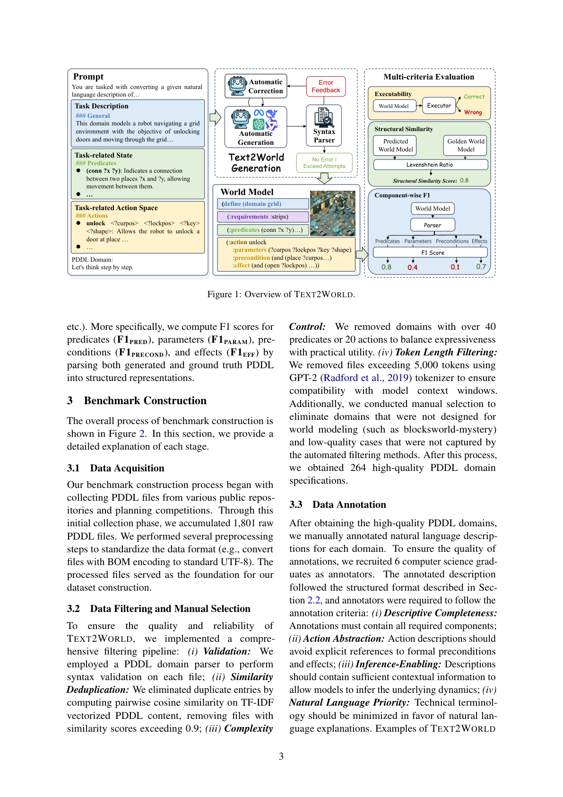
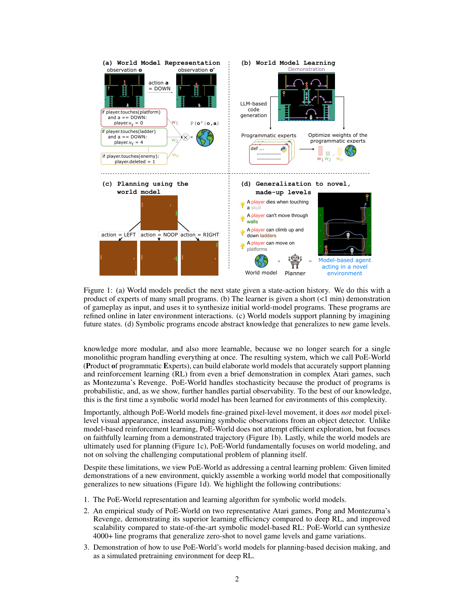
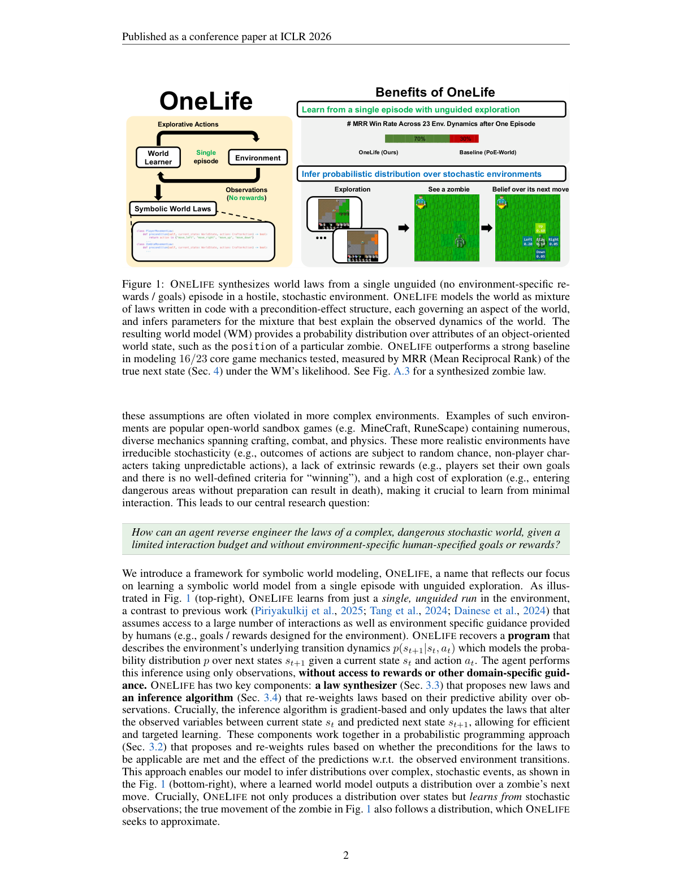
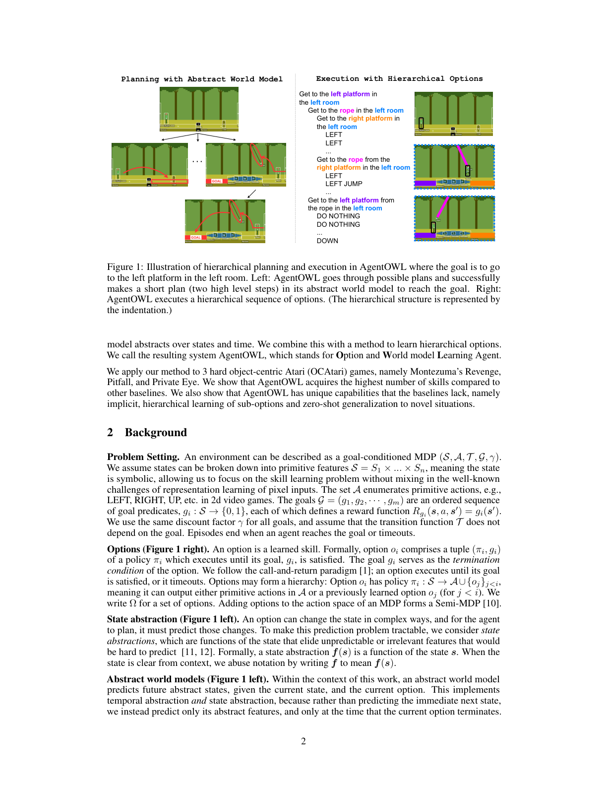

# 程序化世界模型：动力学写成能跑的代码

> [!WARNING]
> 🧪 Beta公测版本提示：教程主体已完成，正在优化细节，欢迎大家提Issue反馈问题或建议。

> 接地解决「状态怎么符号化」。下一步是 **动力学本身也是程序**：PDDL 域、Python 规则、概率程序里的定律。LLM 在这里不是「嘴上模拟下一步」，而是**写世界模型**；对错要用解释器执行来量，而不是看句子像不像。

---

## 一、Text2World：测的是「LLM 会不会写 PDDL」

Hu, Chen 等（2025）*Text2World* 针对先前工作的三个毛病：评测随机、只用间接指标、领域太窄。基准建立在 **PDDL** 上，含数百个多样域，指标是**多标准 + 可执行**：语法能否 parse、谓词/参数/前置/效果的 F1、以及执行是否跑得通。

> 图出自 Hu et al., *Text2World*, arXiv:2502.13092。自然语言域描述经提示变成 PDDL，再经语法解析与成分级 F1 / 执行指标评估。引用仅用于教学。

作者发现：经过大规模强化学习的推理模型整体更强，但**即使最好的模型，世界建模能力仍然有限**。后续他们试了测试时扩展、agent 训练等。教学结论：

- 「LLM 是世界模型」要拆开：有的是用 LLM **滚动文本状态**（下一章），有的是用 LLM **生成符号世界模型**（本章）。后者可验证，前者容易幻觉。
- 规划语言（PDDL）把路径五接到经典 AI 规划课：谓词、动作图式、STRIPS。

---

## 二、PoE-World：程序专家的乘积

Piriyakulkij, Liang 等（2025）*PoE-World*：神经网络世界模型要海量数据；WorldCoder 一类「LLM 写一个 Python 世界」又很难超出网格世界。他们把世界模型写成 **程序化专家的指数加权乘积（Product of Experts）**：

$$
p(o'\mid o,a)
\ \propto\
\prod_i p_i(o'\mid o,a)^{w_i}
$$

每个 $p_i$ 是 LLM 合成的一小段规则（「若碰到敌人则玩家消失」「若向右走且站在平台上则 $v_x=2$」），权重 $w_i$ 从少量轨迹里学。随机性用专家的软组合表达，而不是硬 if-else 一条道。

> 图出自 Piriyakulkij et al., arXiv:2505.10819。左：世界模型是许多程序片段；右：从观察合成规则并拟合权重。评测嵌在基于模型的规划智能体里，Atari 的 Pong 与 Montezuma's Revenge 上用很少观察就能迁移到未见关卡。引用仅用于教学。

对照路径三：Dreamer 用一个大网络吃所有随机性；PoE-World 用**可加的局部定律**。数据效率来自程序归纳，表达随机性来自乘积而不是「再把网络加大」。

---

## 三、OneLife：只有一条命时学随机符号定律

Khan, Prasad 等（ICLR 2026）*One Life to Learn*：先前符号世界建模多半是确定性环境、数据充足、还有人类给的奖励/目标。他们逼到更狠的约束——**复杂随机环境、交互预算极紧（one life）、无环境特定奖励或目标**。

OneLife 把动力学写成概率程序里**按条件激活的定律**：每条定律是前置–效果结构，对无关属性保持沉默，只预测它管辖的字段。于是每一步的计算图只经过相关定律，避免「所有规则对整个层级状态发言」的缩放灾难。

评测协议也换成世界模型该有的两问：**(a) state ranking**（能否把真实下一状态从干扰项里排出来）；**(b) state fidelity**（生成的下一状态像不像真的）。环境是 Crafter 的面向对象重写 Crafter-OO。

> 图出自 Khan et al., ICLR 2026 / arXiv:2510.12088。探索策略没有奖励塑造；学习器推断随机环境上的程序化定律。引用仅用于教学。

---

## 四、AgentOWL：抽象世界模型遇上技能层级

Piriyakulkij, Lehrach, Ellis, Murphy（2026）*AgentOWL* 的主问题是路径三熟悉的：学一串越来越难的 **option**，动作空间会膨胀。他们**联合**学习（1）跨状态与时间的抽象世界模型，（2）层级神经 option，在对象中心 Atari 子集上用更少数据学更多技能。

> 图出自 Piriyakulkij et al., arXiv:2602.02799。高层在抽象世界模型里规划子目标，底层 option 执行。引用仅用于教学。它提醒：路径五的「符号/抽象状态」不必是 PDDL，也可以是 option 图上的离散模态。

---

## 五、程序路线的共同教训

1. **执行是真理**：Text2World 不用 BLEU 当主指标；PoE / OneLife 把模型塞进规划环或 ranking。
2. **局部定律 + 组合** 比「一个巨大程序」好维护（PoE 的专家、OneLife 的静默定律）。
3. **随机性要显式**：硬规则装随机环境会装死；乘积或概率程序是两条活路。
4. LLM 的正确岗位常常是 **提议规则**，不是闭着眼睛 rollout。

下一章把规则嵌回 LLM 智能体，解决「语言模型世界模型与环境不对齐」：[WALL-E 与 NeSyS](/world-models/symbolic/alignment/)。

## 参考

1. Hu, M., Chen, T., et al. (2025). Text2World: Benchmarking Large Language Models for Symbolic World Model Generation. [[arXiv:2502.13092](https://arxiv.org/abs/2502.13092)]
2. Piriyakulkij, W. T., Liang, Y., et al. (2025). PoE-World: Compositional World Modeling with Products of Programmatic Experts. [[arXiv:2505.10819](https://arxiv.org/abs/2505.10819)]
3. Khan, Z., Prasad, A., et al. (2026). One Life to Learn. *ICLR*. [[arXiv:2510.12088](https://arxiv.org/abs/2510.12088)]
4. Piriyakulkij, W. T., Lehrach, W., Ellis, K., & Murphy, K. (2026). Joint Learning of Hierarchical Neural Options and Abstract World Model (AgentOWL). [[arXiv:2602.02799](https://arxiv.org/abs/2602.02799)]
