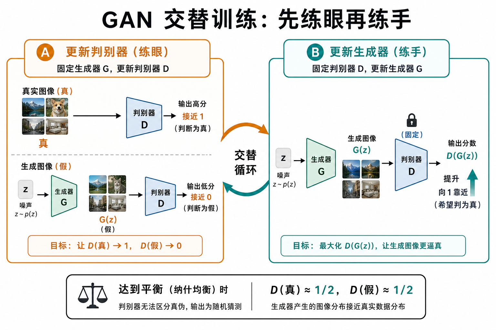
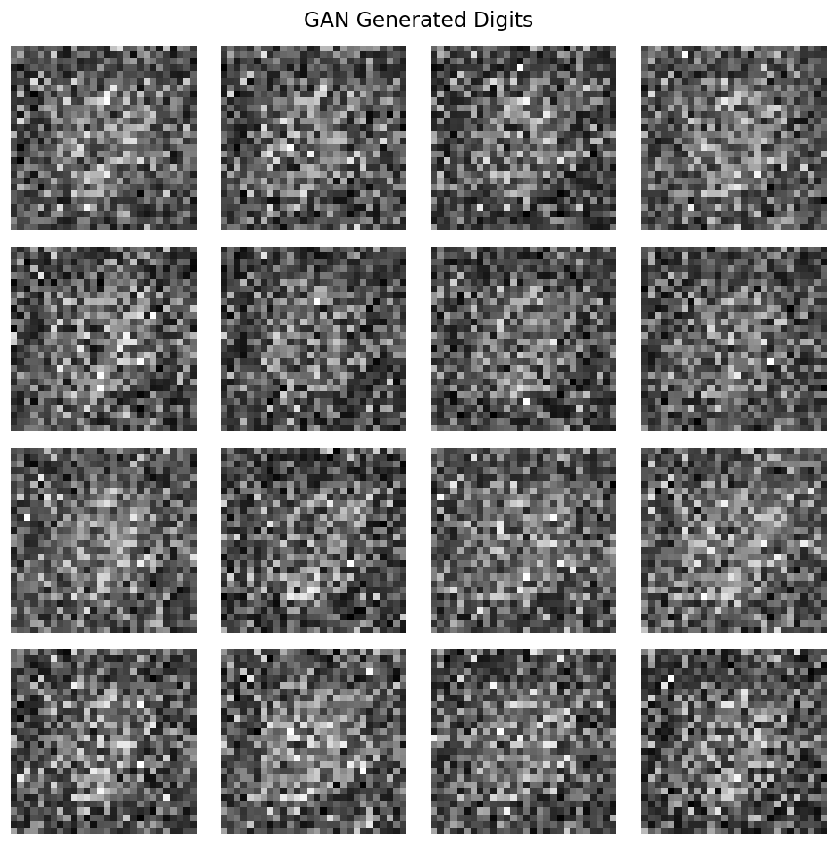

# GAN：不写 $p(x)$，也能学会画画

> [!WARNING]
> 🧪 Beta公测版本提示：教程主体已完成，正在优化细节，欢迎大家提Issue反馈问题或建议。

> 路径一的第一块积木。2014 年 Goodfellow 等人的生成对抗网络不给数据写显式密度，而是让两个网络互相抬杠。后面的视频 GAN、以及「一次前向出图」的工程习惯，都从这里来。

---

## 一、生成模型在问什么

给定样本 $\{x_i\}$，学 $p_\theta(x)\approx p_{\mathrm{data}}(x)$，再从中采样。GAN 的立场是：**不写 $p_\theta(x)$ 的公式**，只训练一个能把噪声映射到图像的生成器 $G$。

这和后面 [VAE](/world-models/video/vae/)（写 ELBO）、[扩散](/world-models/video/diffusion/)（写去噪误差）是三条不同的逼近路线。对照总表见 [路径一导论](/world-models/video/overview/)。

---

## 二、两个网络互相抬杠

| 角色 | 输入 | 输出 | 目标 |
|------|------|------|------|
| **生成器 $G$** | 噪声 $z\sim p_z$（常为高斯） | 假图 $G(z)$ | 让 $D$ 认不出假 |
| **判别器 $D$** | 真图或假图 | $D(\cdot)\in(0,1)$ | 真图靠近 1，假图靠近 0 |

直觉：造假钞的人 vs 验钞员。验钞员越强，造假的人越得进步；造假的人进步了，验钞员又得再练眼。二者交替变强，最后假钞可以乱真。

> **图解说明**：噪声进 $G$ 成假图；$D$ 同时看真图与假图。箭头方向相反：一个想骗过，一个想拆穿。

---

## 三、Minimax 目标

$$
\min_G \max_D V(D, G)
=
\mathbb{E}_{x \sim p_{\mathrm{data}}}[\log D(x)]
+
\mathbb{E}_{z \sim p_z}[\log(1 - D(G(z)))]
$$

拆开看：

- 第一项：真图上 $D$ 要大 → $\log D(x)$ 大；
- 第二项：假图上 $D$ 要小 → $D(G(z))\to 0$ 时 $\log(1-D)$ 大；
- **$G$ 的立场相反**：希望 $D(G(z))\to 1$，从而压小第二项。

实践中常把生成器损失改成最大化 $\log D(G(z))$（**非饱和损失**），避免早期 $D$ 太强时 $\log(1-D)$ 梯度几乎为零。

理论均衡：若容量足够且到达纳什均衡，则 $G_\# p_z = p_{\mathrm{data}}$，且对任意 $x$ 有 $D^*(x)=\tfrac12$——验钞员只好瞎猜。

---

## 四、交替训练（实现时真正在做的事）

不能同时对 $G,D$ 乱更新。标准循环是：

1. **固定 $G$，更新 $D$ 若干步**（先练眼）：真假样本上的二元交叉熵；
2. **固定 $D$，更新 $G$ 一步**（再练手）：只回传「如何让 $D(G(z))$ 变大」；
3. 重复。

> **图解说明**：A 步只动判别器，B 步只动生成器。二者必须节奏匹配——$D$ 永远碾压或永远太弱，都会训崩。

超参直觉：$D$ 更新太狠 → $G$ 梯度消失；$G$ 更新太狠、$D$ 跟不上 → 假图「糊弄」过去但质量差。学习率、更新次数比（如 $D:G=1:1$ 或 $5:1$）都是调参旋钮。`demo.py` 采用经典 DCGAN 风格的 Adam（`lr=2e-4`, `betas=(0.5, 0.999)`）。

---

## 五、三大典型失败

1. **模式坍塌（Mode Collapse）**  
   真实数据有多种「样子」（多个 mode）。$G$ 发现只画其中一种就能骗过当前的 $D$，于是不管 $z$ 怎么变，输出都挤在少数模式上——**锐利但不多样**。

> **图解说明**：左边真实分布有多个簇；右边生成样本全堆在一个簇。观感可以「很像真的」，统计覆盖却塌了。

2. **梯度消失**  
   $D$ 过强时 $D(G(z))\approx 0$，原始 $\log(1-D)$ 对 $G$ 几乎没坡。非饱和损失 / WGAN-GP 等变体正是冲着这个问题来的。

3. **振荡不收敛**  
   $G$ 与 $D$ 互相追逐，损失来回抖，没有「越训越好」的单调曲线。看样张比只看 loss 数字更重要。

---

## 六、变体，以及它如何接到视频 / 世界模型

骨架不变，改的是距离与网络：

- **DCGAN**：卷积生成器/判别器，图像 GAN 的默认起点；
- **WGAN / WGAN-GP**：用 Wasserstein 距离缓解梯度消失与振荡；
- **StyleGAN**：可控潜空间，人脸编辑常用；
- **视频方向（历史）**：VGAN、MoCoGAN、DVD-GAN 等把 $G$ 从「一张图」换成「一段 clip」——已经是路径一的雏形，只是稳定性和长程一致性远不如后来的扩散视频。

对世界模型的启示：

- GAN **一次前向**出观测，推理快，适合实时特效；但训练难，多样性差，很少再当「可滚动的物理引擎」。
- 现代视频世界模型更常把对抗损失当**辅助**（判别器管锐度），主干换成扩散或自回归 token。

本章 `demo.py` 在 MNIST（下载失败则回退合成数据）上训一个全连接小 GAN，观察样张与 $G$/$D$ 曲线。

> CPU 上只跑极短 epoch，样张会糊；图示意「能采样」，不代表收敛质量。

---

## 七、小结

| 概念 | 一句话 |
|------|--------|
| GAN | 生成器与判别器对抗，$\min_G \max_D V(D,G)$；隐式建模 $p(x)$ |
| 交替训练 | 先更新 $D$ 再更新 $G$；节奏失衡会梯度消失或假赢 |
| 非饱和损失 | 实践中 $G$ 最大化 $\log D(G(z))$，避免早期无梯度 |
| 模式坍塌 | $G$ 只覆盖少数模式：锐利但不多样 |
| 与路径一 | 早期视频生成的主干；今日多为锐度辅助，主干让位给扩散 |

> 下一章换一条完全不同的路：[VAE](/world-models/video/vae/) 显式写似然下界，并长出可采样的潜空间——这正是后来 Latent Diffusion 还在用的那只「压缩瓶」。

## 📥 Code

| File | View | Download |
|------|------|----------|
| demo.py | [Open](./code-demo) | <a href="/notebook/code/world-models/video/gan/demo.py" target="_blank" download>Download</a> |
| exercise.py | [Open](./code-exercise) | <a href="/notebook/code/world-models/video/gan/exercise.py" target="_blank" download>Download</a> |

## 参考

1. Goodfellow, I. J., et al. (2014). Generative Adversarial Nets. *NeurIPS*. [[arXiv:1406.2661](https://arxiv.org/abs/1406.2661)]
2. Radford, A., et al. (2016). Unsupervised Representation Learning with Deep Convolutional Generative Adversarial Networks. *ICLR*. (DCGAN)
3. Arjovsky, M., et al. (2017). Wasserstein GAN. [[arXiv:1701.07875](https://arxiv.org/abs/1701.07875)]
4. Karras, T., et al. StyleGAN 系列.
