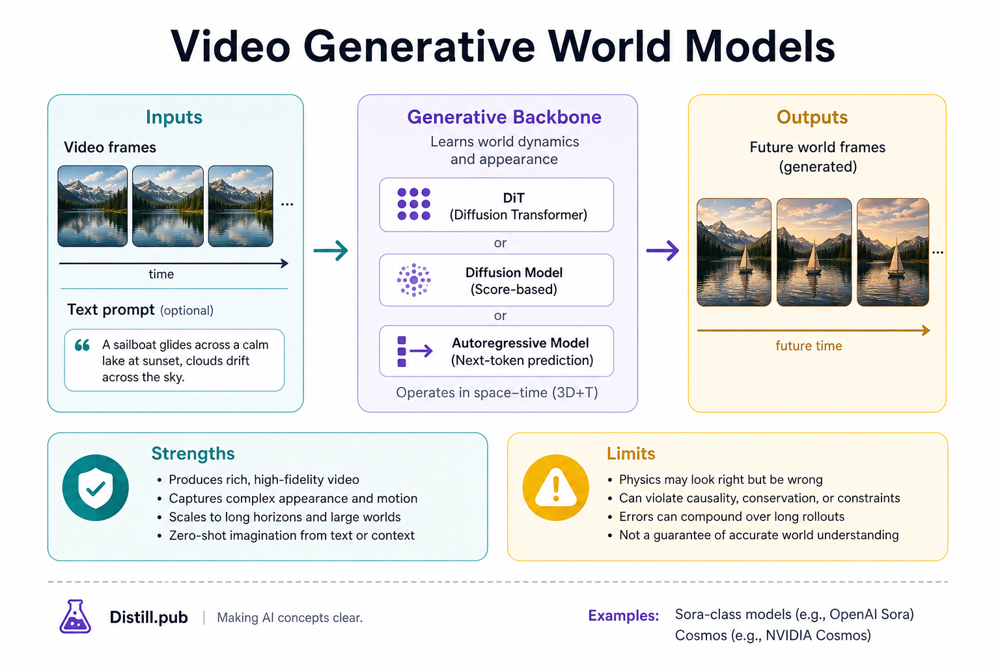
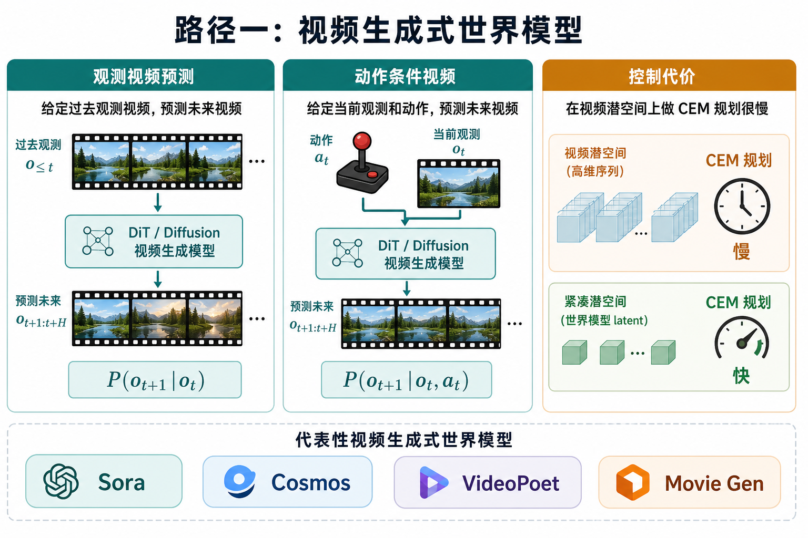

# 路径一：视频生成式世界模型

> [!WARNING]
> 🧪 Beta公测版本提示：教程主体已完成，正在优化细节，欢迎大家提Issue反馈问题或建议。

> 当视频模型能在较长时间内保持物体身份、大致遵守物理、并接受文本或动作条件时，人们开始把它当作**世界模拟器**：在生成的未来里做想象、评测策略，甚至闭环控制。这是四路径里最「好看」、也往往最「贵」的一条。

---

## 一、这条路径在解决什么？

路径一优化的核心对象是高维观测本身：

$$
p_\theta(o_{t+1:t+H}\mid o_{\le t}, c)
$$

条件 $c$ 可以是文本、上一帧、相机轨迹，或后置的动作。与路径三（只滚紧凑 $z$）相比，它保留纹理、光照、语义开放性；与路径二相比，**交互接口可以很弱**——很多系统首先是「能生成一段合理视频」，然后才谈可控。

| 能力 | 典型上限 |
|------|----------|
| 开放世界语义与视觉细节 | 强（互联网视频先验） |
| 长程外观一致性 | 中–强，仍在快速进步 |
| 精细动作可控 / 实时 MPC | 弱–中，算力瓶颈明显 |
| 可验证物理 | 「看起来像」≠ 定律成立 |

> **图解说明**：从 $P(o_{t+1}\mid o_t)$ 走到 $P(o_{t+1}\mid o_t,a_t)$ 才接近可规划；即便如此，在视频潜空间里做 CEM 往往比 LeWM/Dreamer 的紧凑 $z$ 慢几个数量级（V-JEPA 2 文中 Cosmos 规划对照是直观例子）。

---

## 二、代表系统（怎么读文献）

- **Sora 类（DiT 视频）**：大规模扩散/Transformer，强调长时间一致性与复杂场景组合。教学上把它看成「观测级生成式世界模型」的上限展示，而不是机器人控制器。
- **NVIDIA Cosmos**：面向 Physical AI 的世界基础模型平台（自回归 / 扩散变体），明确把视频 WM 接到具身数据与策略评测。动作条件微调后可进 MPC，但单步规划可到分钟级（见 V-JEPA 2 实验叙述）。
- **Movie Gen 等**：多模态条件视频生成，偏创作与模拟内容流水线。
- **与 Dreamer V4 的交界**：V4 用可扩展 Transformer 动力学拟合开放世界机制，目标仍是**想象中的 RL**，不是电影生成——技术组件在向路径一靠拢，损失与用途仍在路径三。

文献夹中的 Sora Survey、Cosmos 引用、Movie Gen PDF 可作延伸阅读。

---

## 三、训练与推理的直觉骨架

常见两段式：

1. **Tokenizer / VAE**：帧 → 视频潜空间（降维，仍远高于 Dreamer 的 $z$）；
2. **先验网络**：在潜空间做扩散去噪或自回归 next-token，条件于文本/动作/历史。

推理时自回归滚 $H$ 步即「想象」。误差同样会累积；只是人们更常用视觉指标（FVD、主观观感）而不是控制回报来汇报。

路径四的警告在这里最响：**纯旁观视频学到的是关联**。若数据里「人手出现 ⇒ 杯子移动」，模型可能在你强制人手不动时仍把杯子挪开。要干预能力，需要动作对齐数据或显式因果归纳偏置。

---

## 四、和路径二、三怎么选？

- 要**数据引擎 / 开放视觉先验** → 路径一；
- 要**可玩、可漫游、显式相机接口** → [路径二](/world-models/interactive/genie/)；
- 要**样本高效控制、实时规划** → [路径三](/world-models/abstract/pets/)。

工业系统往往是：路径一/二产想象数据，路径三在紧凑模型里学策略或做快规划。

---

## 五、代码

[demo](./code-demo.md) 用运动斑点展示最朴素的下一帧预测与开环误差——工业系统远复杂于此，但「开环会漂」同一件事。

## 六、小结

视频世界模型把模拟推到媒体生成尺度；好看不等于可控，可控不等于可干预。下一章进入 [路径二 · Genie](/world-models/interactive/genie/)。

## 📥 Code

| File | View | Download |
|------|------|----------|
| demo.py | [Open](./code-demo) | <a href="/notebook/code/world-models/video/demo.py" target="_blank" download>Download</a> |
| exercise.py | [Open](./code-exercise) | <a href="/notebook/code/world-models/video/exercise.py" target="_blank" download>Download</a> |

## 参考

1. Brooks, T., et al. (2024). Video generation models as world simulators.（Sora 技术报告叙事）
2. Agarwal, N., et al. (2025). Cosmos World Foundation Model Platform for Physical AI. [[arXiv:2501.03575](https://arxiv.org/abs/2501.03575)]
3. Assran, M., et al. (2025). V-JEPA 2.（含 Cosmos 规划对照）[[arXiv:2506.09985](https://arxiv.org/abs/2506.09985)]
4. Hafner, D., et al. (2025). Dreamer 4. [[arXiv:2509.24527](https://arxiv.org/abs/2509.24527)]
