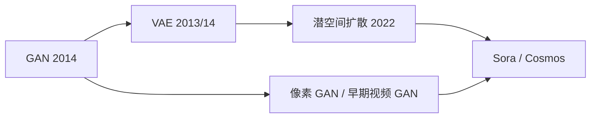

# 路径一导论：从学 $p(x)$ 到滚一段未来

> [!WARNING]
> 🧪 Beta公测版本提示：教程主体已完成，正在优化细节，欢迎大家提Issue反馈问题或建议。

> 旧版「s13 图像生成」不放在计算机视觉里了：GAN、VAE、扩散是路径一的**共同底座**。先学会如何采样一张图，再把同一套生成器沿时间轴拉开，才谈得上 Sora / Cosmos 那种视频世界模型。

路径一优化的对象始终是高维观测本身：

$$
p_\theta(x)
\quad\longrightarrow\quad
p_\theta(o_{t+1:t+H}\mid o_{\le t}, c)
$$

左边是「会画画」，右边是「会在脑子里放一段未来」。条件 $c$ 可以是文本、相机轨迹或动作。没有左边的生成直觉，右边只是一堆产品名词。

> **图解说明**：GAN 隐式对抗、VAE 显式下界、扩散逐步去噪。视频世界模型几乎都是这三者的时间展开（再加 tokenizer / 潜空间）。

---

## 一、为什么生成模型算「世界模型」？

世界模型要回答：给定现在，下一步会怎样。像素级答案就是生成下一帧（或下一段视频）。它和路径三的差别不是「算不算世界模型」，而是**你预测的状态有多贵、多可规划**：

| | 路径一 | 路径三 |
|--|--------|--------|
| 预测对象 | 像素 / 视频潜空间 | 紧凑 $z$ |
| 观感 | 强 | 弱（常不重建） |
| 规划 | 贵，常开环或后置动作 | 为 MPC / 想象 RL 设计 |
| 风险 | 学到旁观相关，不一定可干预 | 压缩掉开放视觉 |

路径四会再补一句：你学的是 $P(o_{t+1}\mid o_t)$ 还是 $P(o_{t+1}\mid do(a), o_t)$。路径五则问：要不要把「下一步」写成谓词、规则或程序，而不是像素。

---

## 二、本路径怎么读（四章，不要跳）

按历史与依赖往下走，不要一上来就看 Sora：

| 顺序 | 章 | 你要带走的一句话 |
|------|----|------------------|
| 1 | [GAN](/world-models/video/gan/) | 不写显式 $p(x)$，用对抗把生成器抬到数据流形上 |
| 2 | [VAE](/world-models/video/vae/) | 编码器出分布 + 重参数 + ELBO；后来变成几乎所有潜空间扩散的前置压缩器 |
| 3 | [扩散](/world-models/video/diffusion/) | 去噪回归；Latent Diffusion / DiT 是当前视频 WM 的主干 |
| 4 | [视频世界模型](/world-models/video/sora/) | 把生成器当模拟器：一致性、动作条件、算力与因果陷阱 |

VAE 画在 GAN 后面，是教学顺序（先对抗直觉，再概率图模型），不是发表年先后。工程上 **Stable Diffusion 把 VAE 嵌进扩散**，不是谁淘汰谁。

---

## 三、三种范式对照（后三章会逐项展开）

| 特性 | GAN | VAE | Diffusion |
|------|-----|-----|-----------|
| 建模 | 隐式 | 显式下界（ELBO） | 显式（去噪 / 得分） |
| 采样 | 一次前向 | 一次前向 | 多步去噪 |
| 训练 | 易崩、易模式坍塌 | 稳，图偏糊 | 稳，质量高 |
| 在路径一里的下落 | 早期视频生成、部分 tokenizer | 视频 VAE / 潜空间 | DiT 视频、世界基础模型 |

---

## 四、和其余四条路径

- 要**可玩、可发现动作** → [路径二](/world-models/interactive/overview/)
- 要**便宜的 $z$ 上规划** → [路径三](/world-models/abstract/overview/)
- 要**$do(a)$ 而不是旁观相关** → [路径四](/world-models/causal/ladder/)
- 要**谓词、规则、程序、LLM 符号接口** → [路径五](/world-models/symbolic/overview/)

> 下一章从对抗博弈开始：[GAN](/world-models/video/gan/)。
