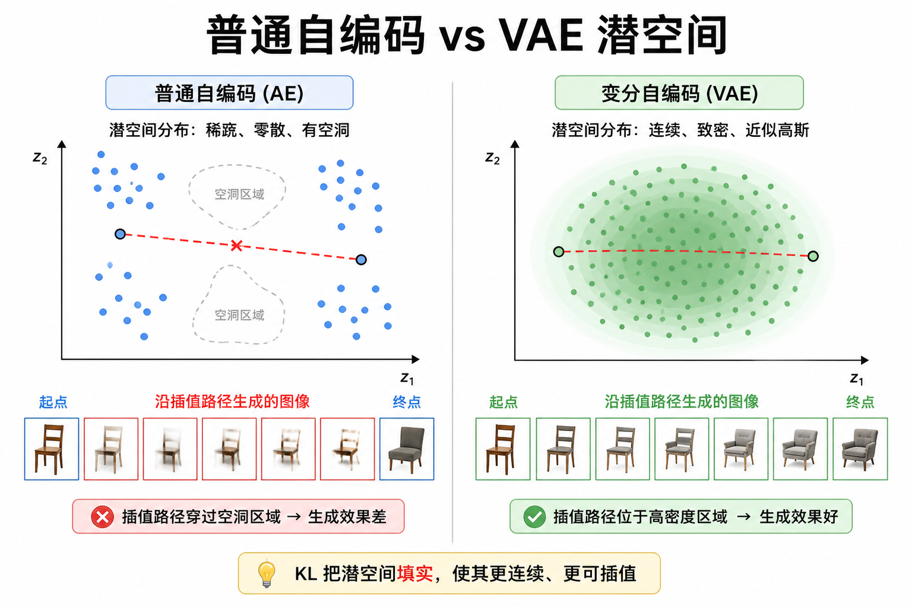
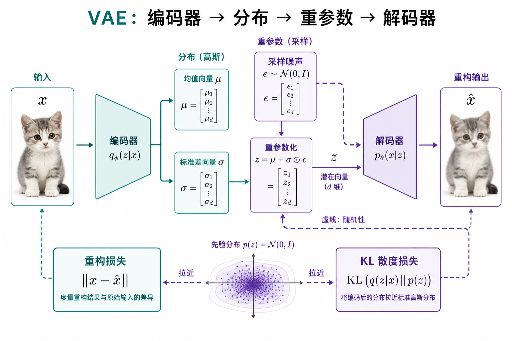
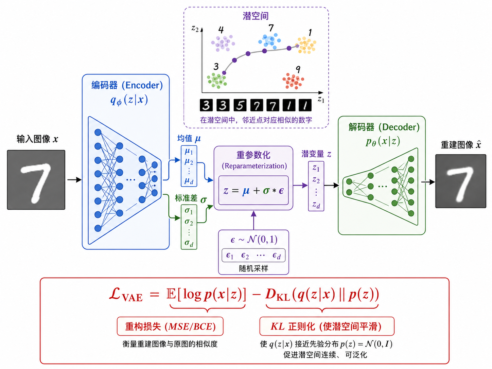
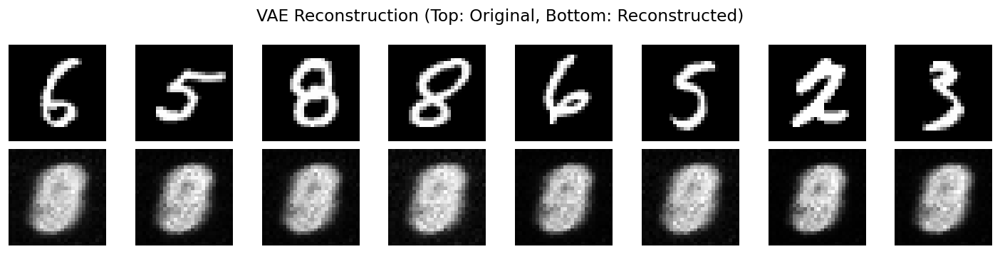

# VAE：潜空间必须「填实」，才能当生成器

> [!WARNING]
> 🧪 Beta公测版本提示：教程主体已完成，正在优化细节，欢迎大家提Issue反馈问题或建议。

> 路径一的第二块积木。VAE 写的是**显式下界**（ELBO），不是对抗。更重要的工程后果：它逼潜空间变成可以随便采样、随便插值的瓶子——[扩散](/world-models/video/diffusion/) 里的 Latent Diffusion、视频 tokenizer，以及路径三 [RSSM](/world-models/abstract/rssm/) 的先验/后验，说的都是同一门语言。

ELBO 里的 KL 与 [信息论精简](/math/information/) 同一套记号。

---

## 一、从「压缩」到「能采样的压缩」

普通自编码器（AE）：$x \xrightarrow{\mathrm{enc}} z \xrightarrow{\mathrm{dec}} \hat x$，只优化重构，**潜空间常有空洞**——在两个编码点之间插值，解码结果可能完全不像真实图像。

VAE 多要求一件事：每个 $x$ 对应的不是一个点 $z$，而是一个分布 $q_\phi(z\mid x)$，并且整体要靠近简单先验 $p(z)=\mathcal{N}(0,I)$。这样从先验直接采样 $z\sim p(z)$ 再解码，才像「生成」。

> **图解说明**：左图 AE 潜空间不规则、有洞；右图 KL 把质量「按」进高斯球，插值路径不容易走到荒漠。

---

## 二、潜变量生成模型与 ELBO

假设数据由潜变量生成：

$$
p(x)=\int p_\theta(x\mid z)\,p(z)\,dz
$$

这个积分一般算不出。引入编码器近似后验 $q_\phi(z\mid x)$，可以证明对数似然有变分下界（**ELBO**）：

$$
\log p_\theta(x)
\ge
\underbrace{\mathbb{E}_{q_\phi(z\mid x)}[\log p_\theta(x\mid z)]}_{\text{重构项：解码要像原图}}
-
\underbrace{D_{\mathrm{KL}}\big(q_\phi(z\mid x)\,\|\,p(z)\big)}_{\text{正则项：后验别离开先验太远}}
$$

训练最大化 ELBO（或最小化其相反数）：

$$
\mathcal{L}_{\mathrm{VAE}}
=
-\mathbb{E}_{q}[\log p_\theta(x\mid z)]
+
D_{\mathrm{KL}}(q_\phi(z\mid x)\|p(z))
$$

- **Encoder $q_\phi$**：输出 $(\mu(x),\sigma(x))$（对角高斯最常见）；
- **Decoder $p_\theta$**：从 $z$ 还原 $\hat x$（像素上常用伯努利/高斯似然，实现里常写成 MSE 或 BCE）。

两个对角高斯之间的 KL 有闭式：

$$
D_{\mathrm{KL}}\big(\mathcal{N}(\mu,\sigma^2)\,\|\,\mathcal{N}(0,I)\big)
=
-\frac12\sum_j\big(1+\log\sigma_j^2-\mu_j^2-\sigma_j^2\big)
$$

> **图解说明**：编码出 $\mu,\sigma$ → 重参数得到 $z$ → 解码重构；同时 KL 把 $q(z\mid x)$ 拉向标准正态。

---

## 三、重参数化：让「采样」能反传

若写 `z = Normal(μ, σ).sample()`，采样节点切断梯度，encoder 收不到 decoder 的重构信号。

重参数化把随机性挪到与参数无关的噪声 $\varepsilon$：

$$
z = \mu(x) + \sigma(x)\odot\varepsilon,
\quad
\varepsilon\sim\mathcal{N}(0,I)
$$

对 $\mu,\sigma$ 可微；$\varepsilon$ 每步重新抽。这是 VAE 能端到端训练的关键工程点，也是后面许多「随机节点 + 反传」技巧的原型（含 RSSM 里对离散/连续状态的采样）。

---

## 四、$\beta$-VAE、模糊，以及和 Dreamer 的亲缘

- **模糊**：逐像素重构损失会奖励「平均脸」——多种合理解被平均，边缘发糊。GAN 不走像素似然，往往更锐，但潜空间不如 VAE 规整。
- **$\beta$-VAE**：把 KL 前乘系数 $\beta$。$\beta>1$ 更强调解耦/规整的潜空间，常以重构变差为代价；$\beta<1$ 更贴数据、正则更松。
- Dreamer 的 **KL balancing / free bits**，和「别让 KL 项把表示掐死」是同一家族的忧虑：后验若被先验掐成一个点，动力学网络就没有状态可用。

序列世界模型只是把单步 ELBO 写成对时间求和，并区分：

- 训练用的 **后验** $q(z_t\mid z_{t-1},a_{t-1},o_t)$（看见了这一帧）；
- 想象用的 **先验** $p(z_t\mid z_{t-1},a_{t-1})$（没看见，纯预测）。

细节见 [RSSM](/world-models/abstract/rssm/) 与 [导论](/world-models/intro/) 第四节。

---

## 五、采样、插值，以及它在路径一流水线里的位置

- **生成**：$\varepsilon\sim\mathcal{N}(0,I)$（或直接 $z\sim p(z)$）→ decoder；
- **插值**：取两张图的 $\mu_1,\mu_2$，在其间线性插值再解码，观察语义是否平滑过渡。

在 2022 年以后的路径一里，VAE 很少单独当「最终画家」，而是：

1. **图像/视频 tokenizer**：把 $256^2$ 像素压到 $32^2$ 潜空间（Stable Diffusion 的第一段）；
2. **视频 VAE**：3D 或因果卷积，把 clip 压成时空潜变量，再交给 DiT / 自回归先验。

所以读完 VAE 再读扩散，会看到同一只瓶子被嵌进更大的机器，而不是被扔掉。

本章 demo 会画出 VAE 重构、随机采样与二维潜空间（若用 2D latent）可视化，便于和 [GAN 样张](/world-models/video/gan/) 对比。

---

## 六、小结

| 概念 | 一句话 |
|------|--------|
| VAE | 编码器→分布→重参数→解码器；最大化 ELBO |
| ELBO | 重构项 − KL$(q(z\mid x)\|p(z))$；似然的可算下界 |
| 重参数化 | $z=\mu+\sigma\odot\varepsilon$，让采样可反传 |
| $\beta$-VAE | KL 前乘 $\beta$，在「规整潜空间」与「贴数据」之间权衡 |
| 与路径一 | 今日几乎所有潜空间扩散 / 视频 tokenizer 的前置压缩器 |
| 与路径三 | RSSM 的先验/后验就是序列版同一套 KL |

> 下一章：[扩散模型](/world-models/video/diffusion/)——把「一步生成」换成「几百步去噪」，再在 VAE 潜空间里跑，成为当前视频世界模型的默认主干。

## 📥 Code

| File | View | Download |
|------|------|----------|
| demo.py | [Open](./code-demo) | <a href="/notebook/code/world-models/video/vae/demo.py" target="_blank" download>Download</a> |
| exercise.py | [Open](./code-exercise) | <a href="/notebook/code/world-models/video/vae/exercise.py" target="_blank" download>Download</a> |

## 参考

1. Kingma, D. P. & Welling, M. (2014). Auto-Encoding Variational Bayes. *ICLR*. [[arXiv:1312.6114](https://arxiv.org/abs/1312.6114)]
2. Higgins, I., et al. (2017). $\beta$-VAE: Learning Basic Visual Concepts with a Constrained Variational Framework. *ICLR*.
3. Hafner, D., et al. PlaNet / Dreamer 系列（序列 ELBO 与 KL balancing）。
