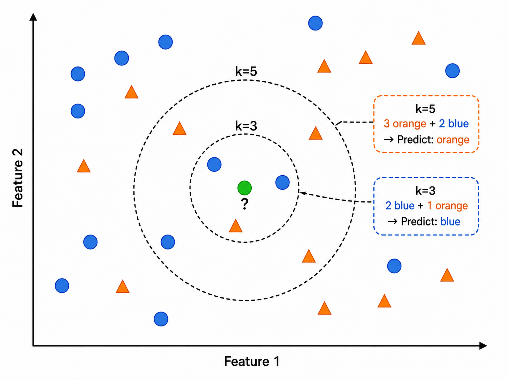
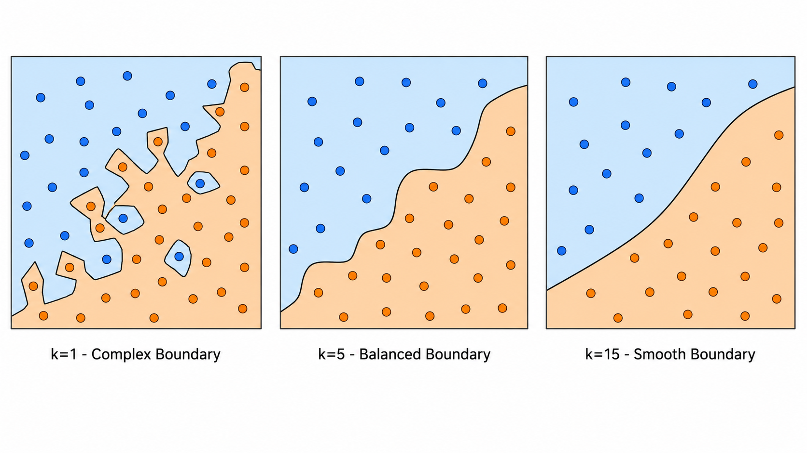
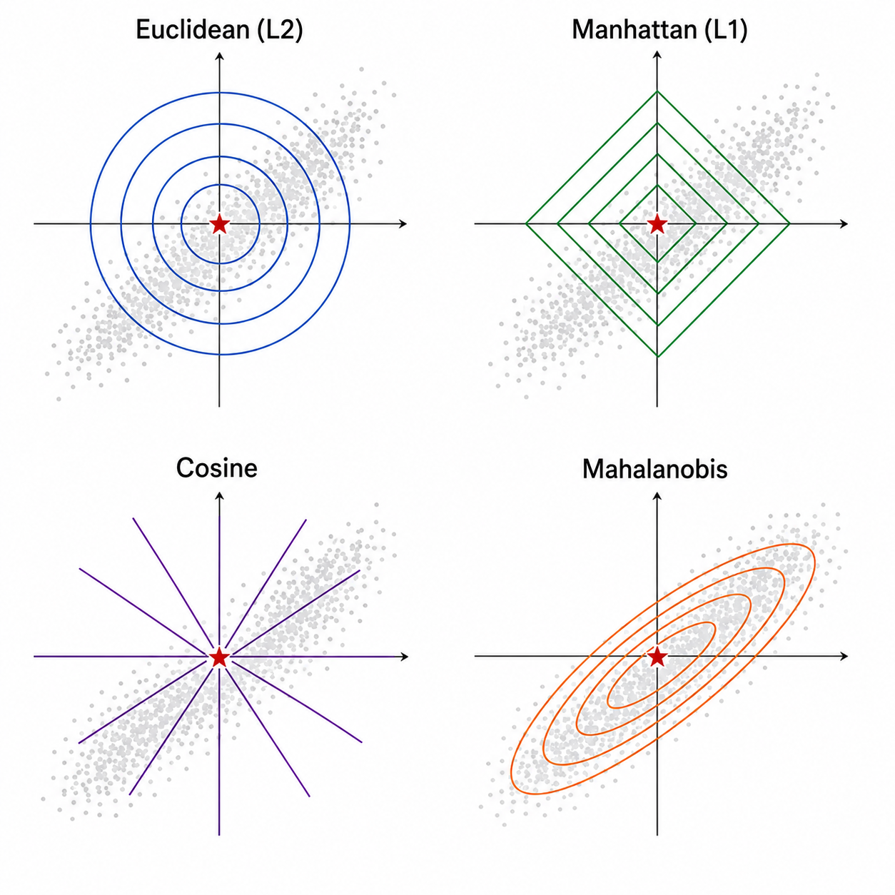
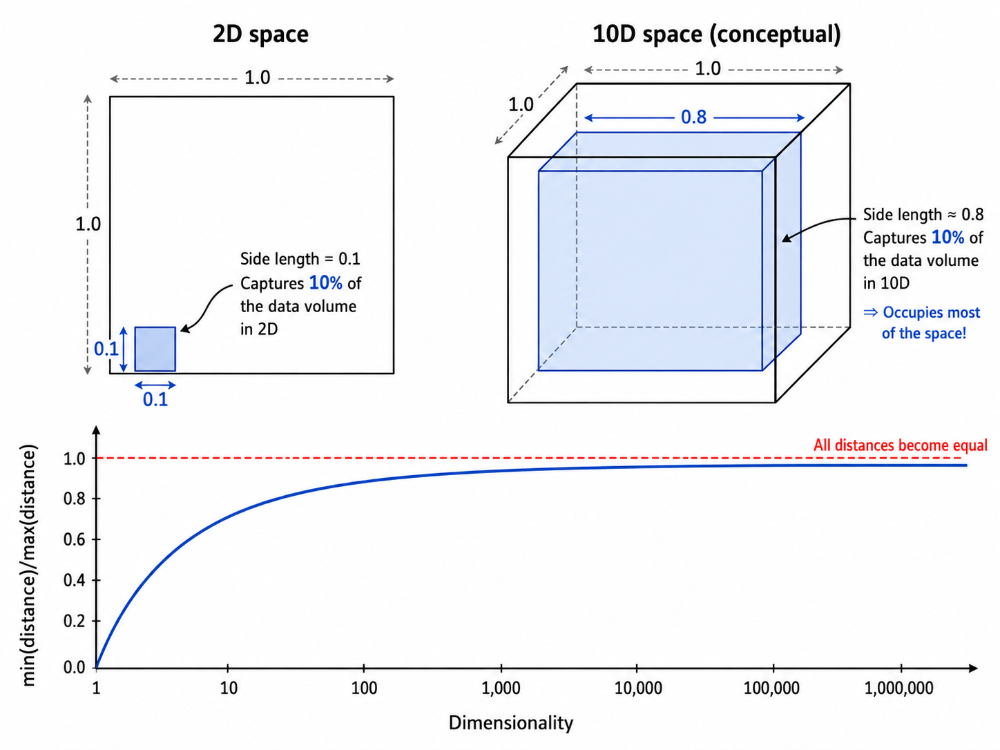
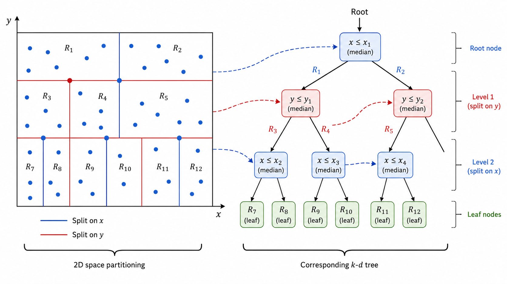

# k-近邻与距离度量

## 1. k-NN：最简单也最深刻的分类器

k-近邻（k-Nearest Neighbors, k-NN）是一种**非参数、基于实例**的学习算法。它没有显式的训练过程——所有计算都在预测时发生，因此也被称为**惰性学习（Lazy Learning）**。

k-NN 的核心思想极其朴素：**"近朱者赤，近墨者黑"**。一个样本的类别，由离它最近的 $k$ 个邻居的类别通过投票决定。

### 1.1 算法流程

给定训练集 $\mathcal{D} = \{(\mathbf{x}_1, y_1), (\mathbf{x}_2, y_2), \dots, (\mathbf{x}_n, y_n)\}$ 和一个测试样本 $\mathbf{x}_{\text{test}}$：

1. 计算 $\mathbf{x}_{\text{test}}$ 与所有训练样本的距离 $d(\mathbf{x}_{\text{test}}, \mathbf{x}_i)$
2. 选出距离最近的 $k$ 个训练样本 $\mathcal{N}_k(\mathbf{x}_{\text{test}})$
3. **分类**：多数投票（Majority Voting）

$$
\hat{y} = \arg\max_{c \in \mathcal{C}} \sum_{(\mathbf{x}_i, y_i) \in \mathcal{N}_k(\mathbf{x}_{\text{test}})} \mathbb{I}(y_i = c)
$$

4. **回归**：取 $k$ 个邻居目标值的平均

$$
\hat{y} = \frac{1}{k} \sum_{(\mathbf{x}_i, y_i) \in \mathcal{N}_k(\mathbf{x}_{\text{test}})} y_i
$$

其中 $\mathbb{I}(\cdot)$ 是指示函数，$\mathcal{C}$ 是所有可能的类别。



### 1.2 距离加权 k-NN

基础投票中，每个邻居的权重相等。但在实际应用中，**距离更近的邻居应该拥有更大的话语权**。距离加权 k-NN（Distance-Weighted k-NN）给每个邻居一个与距离反比的权重：

$$
\hat{y} = \arg\max_{c} \sum_{(\mathbf{x}_i, y_i) \in \mathcal{N}_k} w_i \cdot \mathbb{I}(y_i = c)
$$

最常见的权重函数是**反距离权重**：

$$
w_i = \frac{1}{d(\mathbf{x}_{\text{test}}, \mathbf{x}_i) + \varepsilon}
$$

其中 $\varepsilon$ 是一个极小的正数（如 $10^{-6}$），防止除零。另一个常用选择是**高斯权重**：

$$
w_i = \exp\left(-\frac{d(\mathbf{x}_{\text{test}}, \mathbf{x}_i)^2}{2\sigma^2}\right)
$$

当 $k$ 选得足够大时，距离加权 k-NN 等价于一个**局部加权核密度估计**。

### 1.3 k 值的影响

$k$ 是 k-NN 最重要的超参数：

- **$k$ 太小**（如 $k=1$）：决策边界极度曲折，对噪声敏感，**低偏差高方差**（过拟合）
- **$k$ 太大**（如 $k=n$）：决策边界过于平滑，把所有样本都预测为多数类，**高偏差低方差**（欠拟合）
- **实践经验**：通常取 $k = \sqrt{n}$ 或通过交叉验证选择



---

## 2. 距离度量：如何定义"近邻"

选择不同的距离度量会得到不同的近邻集合，从而影响最终的分类/回归结果。以下是四种最常用的距离。

### 2.1 欧氏距离（Euclidean Distance）

最直观的距离——两点之间的直线距离：

$$
d_{\text{Euc}}(\mathbf{x}, \mathbf{y}) = \sqrt{\sum_{i=1}^{m} (x_i - y_i)^2} = \|\mathbf{x} - \mathbf{y}\|_2
$$

欧氏距离假设所有特征同等重要，且各维度之间**各向同性（isotropic）**。当特征之间的尺度差异很大时，大尺度特征会主导距离计算，因此通常需要**先做标准化（Standardization）**。

### 2.2 曼哈顿距离（Manhattan Distance）

也称为 $L_1$ 距离或城市街区距离——在只能沿坐标轴方向移动的空间中测量：

$$
d_{\text{Man}}(\mathbf{x}, \mathbf{y}) = \sum_{i=1}^{m} |x_i - y_i| = \|\mathbf{x} - \mathbf{y}\|_1
$$

曼哈顿距离比欧氏距离对异常值**更鲁棒**（不平方放大差异），在高维空间中有时能提供比欧氏距离更好的近邻关系。

### 2.3 余弦距离（Cosine Distance）

度量两个向量**方向**的差异，忽略它们的**长度**：

$$
d_{\text{Cos}}(\mathbf{x}, \mathbf{y}) = 1 - \cos(\theta) = 1 - \frac{\mathbf{x} \cdot \mathbf{y}}{\|\mathbf{x}\|_2 \|\mathbf{y}\|_2}
$$

余弦距离广泛用于文本分析、推荐系统等信息检索领域。因为文本向量通常用 TF-IDF 或词袋模型表示，两个文档的方向相似比长度相似更有意义——长文档和短文档讨论同一主题时，方向一致但长度可能差很多。

### 2.4 马氏距离（Mahalanobis Distance）

马氏距离考虑了**特征之间的相关性**和**各维度的方差**，通过数据协方差矩阵来"校正"尺度：

$$
d_{\text{Mah}}(\mathbf{x}, \mathbf{y}) = \sqrt{(\mathbf{x} - \mathbf{y})^T \mathbf{\Sigma}^{-1} (\mathbf{x} - \mathbf{y})}
$$

其中 $\mathbf{\Sigma}$ 是数据的协方差矩阵。马氏距离等价于：先将数据变换到一个各向同性的空间（白化），再在该空间中计算欧氏距离。

马氏距离的核心优点：**尺度不变性和相关性修正**。如果两个特征高度相关，欧氏距离会在该方向上重复计算，而马氏距离通过 $\mathbf{\Sigma}^{-1}$ 消去了这种冗余。



---

## 3. 维数灾难（Curse of Dimensionality）

### 3.1 直觉：高维空间中的距离失效

k-NN 严重依赖"距离"的概念，但在高维空间中，距离的概念会**逐渐失效**。

假设数据均匀分布在一个 $d$ 维单位超立方体 $[0,1]^d$ 中。要覆盖总体积的 $f$ 比例（如 10%），需要的超立方体边长 $e_d(f)$ 为：

$$
e_d(f) = f^{1/d}
$$

当 $d=1$ 时，$e_1(0.1) = 0.1$（10% 长度覆盖 10% 体积）
当 $d=10$ 时，$e_{10}(0.1) = 0.1^{0.1} \approx 0.80$

在 10 维空间中，要覆盖 10% 的数据，需要每条边取 80% 的长度！换句话说，**几乎所有点都彼此远离**——"近邻"的概念失去了意义。

### 3.2 最小/最大距离之比趋近 1

在高维空间中，任意两点之间的最大距离和最小距离之间的差异会急剧缩小：

$$
\lim_{d\to\infty} \frac{\max_{i,j} d(\mathbf{x}_i, \mathbf{x}_j) - \min_{i,j} d(\mathbf{x}_i, \mathbf{x}_j)}{\min_{i,j} d(\mathbf{x}_i, \mathbf{x}_j)} = 0
$$

这意味着所有点之间的距离**几乎相等**。当所有距离都一样时，k-NN 的分类效果退化到随机猜测。

### 3.3 降维与特征选择

应对维数灾难的主要策略：

- **PCA / t-SNE / UMAP**：将高维数据投影到低维流形，尽量保留近邻关系
- **特征选择**：通过互信息、卡方检验等方法剔除不相关特征
- **稀疏正则化**：L1 正则化使部分特征权重为零，实现嵌入式特征选择



---

## 4. 加速搜索：k-d 树与 Ball 树

暴力搜索的复杂度为 $O(nd)$（$n$ 个样本，$d$ 维特征），当 $n$ 很大时效率低下。两种主流的空间索引结构可以加速近邻搜索。

### 4.1 k-d 树（k-dimensional Tree）

k-d 树是一种**二叉树结构**，每个节点对应 $k$ 维空间中的一个超矩形区域。

**构建过程**：
1. 选择方差最大的维度作为分割维度
2. 在该维度上取中位数点作为分割点
3. 左子树包含小于中位数的点，右子树包含大于中位数的点
4. 递归直到区域中点数少于阈值

**查询过程**（平均 $O(\log n)$，最坏 $O(n)$）：
1. 从根节点沿树向下走，根据分割维度确定目标点所属的子树
2. 到达叶节点后，计算当前最近距离
3. **回溯**：检查兄弟节点对应的区域是否可能与当前最近距离相交
4. 如果有交集，递归搜索兄弟子树；否则剪枝



**局限性**：当维度 $d > 20$ 时，k-d 树的性能急剧下降，因为"超矩形相交"的情况频繁出现，导致大量回溯，最终退化到 $O(n)$。

### 4.2 Ball 树

Ball 树使用**超球体（ball）**而不是超矩形来划分空间，在高维场景下表现更好。

**构建过程**：
1. 找到距离最远的两个点作为"锚点"
2. 将数据按离两个锚点的远近分为两个簇
3. 对每个簇，计算最小包络球（圆心 + 半径）
4. 递归直到球内点数少于阈值

**查询优势**：Ball 树使用**三角不等式**来判断是否需要搜索一个球。判断条件为 $d_{\text{center}} - r_{\text{ball}} > d_{\text{current\_best}}$，如果成立则可安全跳过此球中的所有点。

Ball 树在高维空间中的剪枝效率高于 k-d 树，是 sklearn 中 `BallTree` 的实现基础。

**算法** | **空间划分** | **复杂度（查询）** | **适用维度** | **优点**
--- | --- | --- | --- | ---
暴力搜索 | 无 | $O(nd)$ | 不限 | 实现简单，精确
k-d 树 | 超矩形 | 平均 $O(\log n)$ | $d \lesssim 20$ | 低维时效率极高
Ball 树 | 超球体 | 平均 $O(\log n)$ | $d \lesssim 100$ | 比 k-d 树更适应高维
LSH | 哈希桶 | 近似 $O(1)$ | 可极高维 | 牺牲精度换速度

---

## 5. 从零实现 k-NN

### 5.1 核心实现思路

```python
class KNNClassifier:
    def __init__(self, k=3, metric='euclidean', weights='uniform'):
        self.k = k
        self.metric = metric
        self.weights = weights
    
    def fit(self, X, y):
        self.X_train = X
        self.y_train = y
    
    def predict(self, X_test):
        # 对每个测试样本：
        # 1. 计算到所有训练样本的距离矩阵
        # 2. 找出最近的 k 个训练样本索引
        # 3. 投票或取平均
        # 4. 如果 weights='distance'，用反距离权重加权
```

k-NN 的 "training"（`fit`）只需存储数据——这就是惰性学习的本质。

### 5.2 距离度量的 NumPy 实现

**欧氏距离**（向量化）：

```python
# X_test: (m, d), X_train: (n, d)
# distances: (m, n)
distances = np.sqrt(
    np.sum(X_test**2, axis=1, keepdims=True) +   # (m, 1)
    np.sum(X_train**2, axis=1) -                  # (n,)
    2 * X_test @ X_train.T                        # (m, n)
)
```

这个展开公式来自 $(a - b)^2 = a^2 + b^2 - 2ab$，避免了显式广播，内存效率更高。

**曼哈顿距离**：

```python
distances = np.sum(np.abs(X_test[:, np.newaxis, :] - X_train), axis=2)
```

**余弦距离**：

```python
norm_test = np.linalg.norm(X_test, axis=1, keepdims=True)
norm_train = np.linalg.norm(X_train, axis=1)
cos_sim = (X_test @ X_train.T) / (norm_test @ norm_train[np.newaxis, :])
distances = 1 - cos_sim
```

### 5.3 决策边界可视化

二维数据上，k-NN 的决策边界由 **Voronoi 图**决定。对于均匀权重，决策边界是分段线性的；对于 $k > 1$ 的投票机制，边界变得更加平滑。

通过在不同 $k$ 值下绘制决策边界，可以直观理解 k 值的正则化效果：$k=1$ 时边界紧贴每个训练样本（过拟合），$k$ 增大后边界逐渐平滑。

---

## 本章总结

| 概念 | 公式/描述 | 关键点 |
|------|-----------|--------|
| k-NN 分类 | $\hat{y} = \arg\max_c \sum_{\mathcal{N}_k} \mathbb{I}(y_i = c)$ | 多数投票，惰性学习 |
| k-NN 回归 | $\hat{y} = \frac{1}{k}\sum_{\mathcal{N}_k} y_i$ | 近邻均值 |
| 距离加权 | $w_i = 1/(d_i + \varepsilon)$ | 近邻权重大，远邻权重小 |
| 欧氏距离 | $d = \sqrt{\sum (x_i - y_i)^2}$ | $L_2$ 范数，各向同性 |
| 曼哈顿距离 | $d = \sum \|x_i - y_i\|$ | $L_1$ 范数，对异常值鲁棒 |
| 余弦距离 | $d = 1 - \frac{\mathbf{x} \cdot \mathbf{y}}{\|\mathbf{x}\| \|\mathbf{y}\|}$ | 度量方向差异，忽略大小 |
| 马氏距离 | $d = \sqrt{(\mathbf{x}-\mathbf{y})^T\Sigma^{-1}(\mathbf{x}-\mathbf{y})}$ | 考虑特征相关性 |
| 维数灾难 | $e_d(f) = f^{1/d}$ | 高维空间中所有点都远离 |
| k-d 树 | 二叉树 + 超矩形剖分 | 低维高效，$d \lesssim 20$ |
| Ball 树 | 聚类 + 超球体剖分 | 中高维优于 k-d 树 |
| k 值选择 | $\sqrt{n}$ 或交叉验证 | 小 k：过拟合；大 k：欠拟合 |

---

## 参考

1. Cover, T., & Hart, P. (1967). Nearest neighbor pattern classification. *IEEE Transactions on Information Theory*, 13(1), 21-27.
2. Fix, E., & Hodges, J. L. (1951). Discriminatory analysis, nonparametric discrimination: Consistency properties. *USAF School of Aviation Medicine*, Report No. 4.
3. Friedman, J. H., Baskett, F., & Shustek, L. J. (1975). An algorithm for finding nearest neighbors. *IEEE Transactions on Computers*, C-24(10), 1000-1006.
4. Hastie, T., Tibshirani, R., & Friedman, J. (2009). *The Elements of Statistical Learning* (2nd ed.). Springer. DOI: [10.1007/978-0-387-84858-7](https://doi.org/10.1007/978-0-387-84858-7)
5. Bishop, C. M. (2006). *Pattern Recognition and Machine Learning*. Springer. DOI: [10.1007/978-0-387-45528-0](https://doi.org/10.1007/978-0-387-45528-0)
6. Omohundro, S. M. (1989). Five balltree construction algorithms. *ICSI Technical Report*.
7. Mahalanobis, P. C. (1936). On the generalized distance in statistics. *Proceedings of the National Institute of Sciences of India*, 2(1), 49-55.
8. Bellman, R. E. (1961). *Adaptive Control Processes*. Princeton University Press. DOI: [10.1515/9781400874668](https://doi.org/10.1515/9781400874668)（维数灾难概念的起源）
9. Duda, R. O., Hart, P. E., & Stork, D. G. (2001). *Pattern Classification* (2nd ed.). Wiley.
10. Liu, T., Moore, A. W., & Gray, A. (2006). New algorithms for efficient high-dimensional nonparametric classification. *Journal of Machine Learning Research*, 7, 1135-1158. arXiv: [cs/0605089](https://arxiv.org/abs/cs/0605089)

---

## 📥 Code

- [demo.py 下载](https://github.com/DeconBear/learn-ai/blob/master/ml01_knn/code/demo.py) — 完整可运行演示代码
- [exercise.py 下载](https://github.com/DeconBear/learn-ai/blob/master/ml01_knn/code/exercise.py) — 动手练习题
- [代码详解（保姆级教学）](./code-demo) — 逐行中文注释和公式推导
- [练习指南](./code-exercise) — 带提示的 TODO 任务

### 下一章： [ml02 贝叶斯决策理论](../ml02_bayesian_decision/)

---

**小贴士**：运行前请确保已安装依赖：
```bash
pip install numpy matplotlib scikit-learn
```
