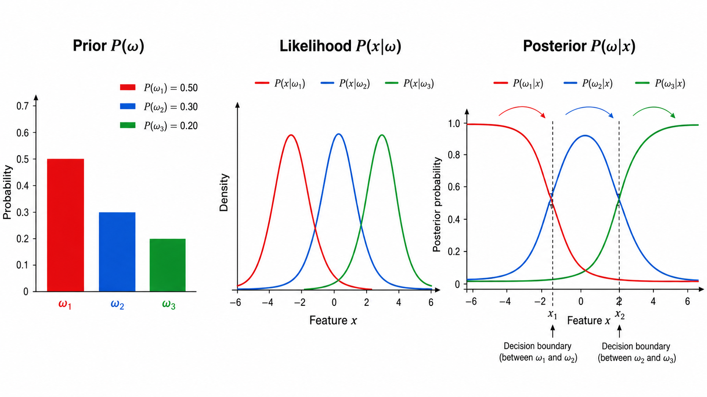
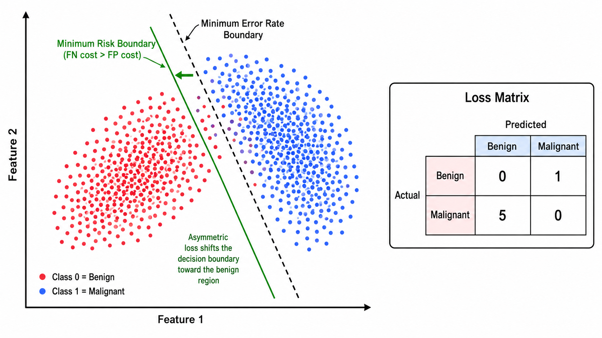
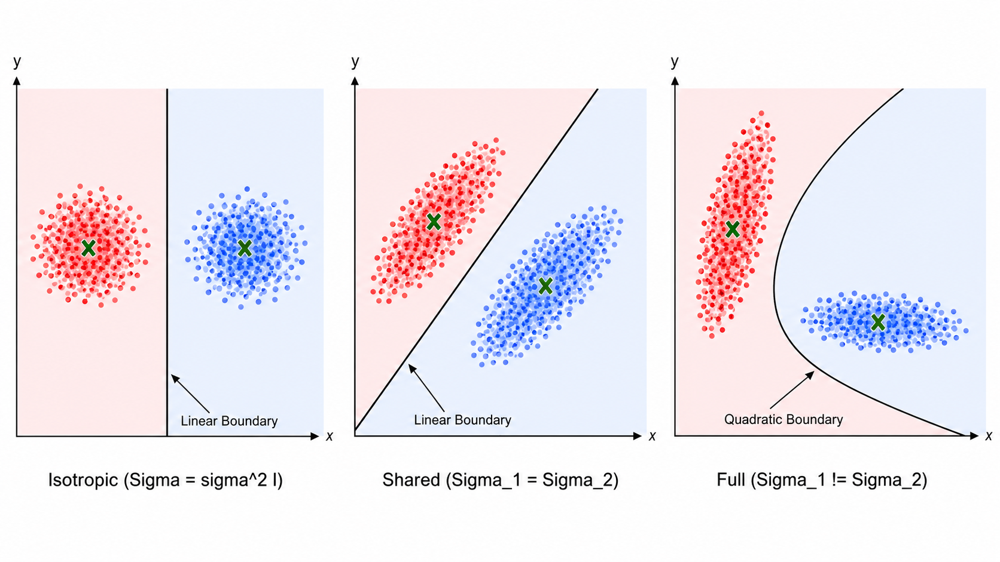
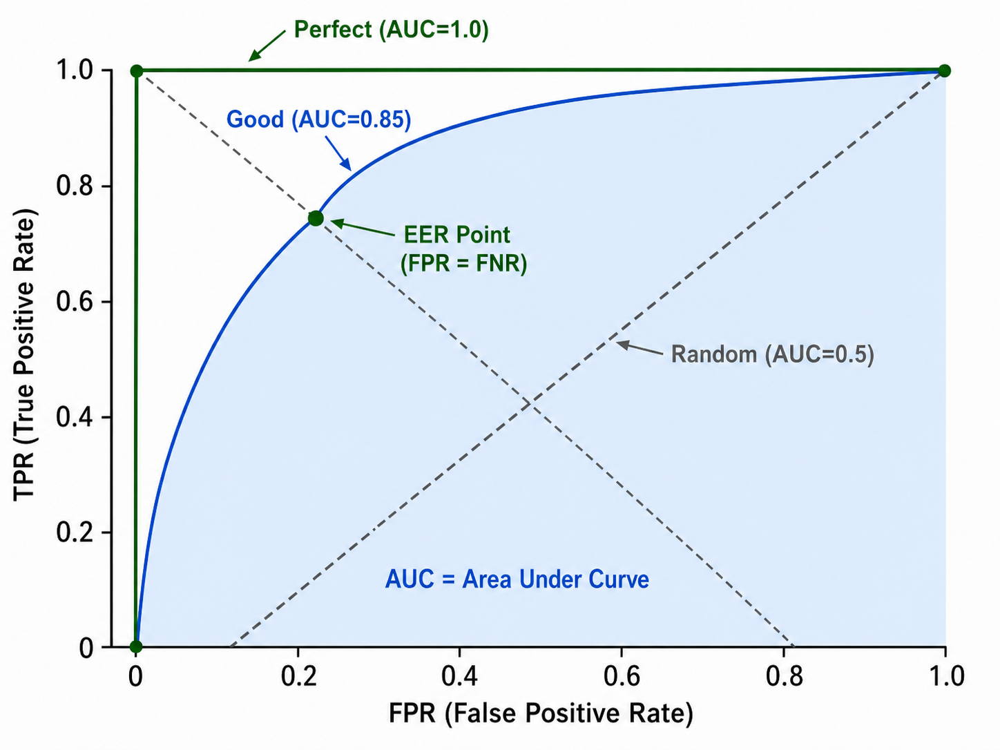

# 贝叶斯决策理论

> [!WARNING]
> 🧪 Beta公测版本提示：教程主体已完成，正在优化细节，欢迎大家提Issue反馈问题或建议。


## 1. 从条件概率到贝叶斯定理

### 1.1 回顾贝叶斯公式

贝叶斯决策理论是整个统计模式识别的数学基石。它以**贝叶斯定理**为基础，将分类问题转化为概率推理问题：

$$
P(\omega_j | \mathbf{x}) = \frac{P(\mathbf{x} | \omega_j) \cdot P(\omega_j)}{P(\mathbf{x})}
$$

四项的含义：

- **先验概率（Prior）** $P(\omega_j)$：在观察到任何特征之前，我们对类别 $\omega_j$ 发生概率的先验信念。例如，一封邮件有 80% 的概率是正常邮件（$\omega_0$），20% 的概率是垃圾邮件（$\omega_1$）

- **类条件概率密度（Likelihood / Class-conditional Density）** $P(\mathbf{x} | \omega_j)$：在已知类别为 $\omega_j$ 的条件下，观察到特征向量 $\mathbf{x}$ 的概率。例如，已知是垃圾邮件的前提下，邮件中出现"免费"一词的概率

- **证据（Evidence）** $P(\mathbf{x})$：归一化因子。计算为全概率：
  $$
  P(\mathbf{x}) = \sum_{j=1}^{C} P(\mathbf{x} | \omega_j) P(\omega_j)
  $$
  它保证了后验概率之和为 1

- **后验概率（Posterior）** $P(\omega_j | \mathbf{x})$：观察到特征 $\mathbf{x}$ 后，该样本属于类别 $\omega_j$ 的概率。这是分类决策的真正依据——**我们想知道的是：在看到了证据 $\mathbf{x}$ 之后，各种可能类别的概率各是多少**



### 1.2 贝叶斯决策的核心思想

在分类问题中，给定特征 $\mathbf{x}$，我们需要决定它属于哪个类别。贝叶斯决策理论的答案是：

**选择使后验概率 $P(\omega_j | \mathbf{x})$ 最大的类别。**

因为贝叶斯公式中的分母 $P(\mathbf{x})$ 对所有类别都相同，所以最大化后验等价于最大化分子：

$$
\hat{\omega} = \arg\max_{\omega_j} P(\omega_j | \mathbf{x}) = \arg\max_{\omega_j} P(\mathbf{x} | \omega_j) P(\omega_j)
$$

这就是**最大后验概率准则**（Maximum A Posteriori, MAP）。

---

## 2. 两种决策准则

### 2.1 最小错误率决策

**目标**：使分类错误率 $P(\text{error})$ 最小。

给定 $\mathbf{x}$，若我们预测类别为 $\omega_i$，则分类正确的概率为 $P(\omega_i | \mathbf{x})$，错误的概率为 $1 - P(\omega_i | \mathbf{x})$。因此，最小化错误率等价于：

$$
\text{决策规则：选择 } \omega_i \text{ 若 } P(\omega_i | \mathbf{x}) > P(\omega_j | \mathbf{x}) \quad \forall j \neq i
$$

这就是直觉上最自然的分类规则：**就选后验概率最大的类别**。

在两分类问题中，决策边界由 $P(\omega_1 | \mathbf{x}) = P(\omega_2 | \mathbf{x})$ 定义，等价于：

$$
\frac{P(\mathbf{x} | \omega_1)}{P(\mathbf{x} | \omega_2)} = \frac{P(\omega_2)}{P(\omega_1)}
$$

当似然比超过阈值 `先验比的反比` 时，决策为 $\omega_1$。这是似然比检验（Likelihood Ratio Test）的基本形式。

### 2.2 最小风险决策

最小错误率决策默认**每种错误代价相同**，但在实际应用中，不同错误的代价可能天差地别。例如：

- 将恶性肿瘤误判为良性 的后果远严重于 将良性肿瘤误判为恶性
- 将合法交易误判为欺诈（导致客户投诉）vs 将欺诈交易误判为合法（导致资金损失）

**最小风险决策**（Minimum Risk Decision）引入了**损失函数**（Loss Function）$\lambda(\alpha_i | \omega_j)$，表示当真实类别为 $\omega_j$ 时采取行动 $\alpha_i$ 所付出的代价。

给定 $\mathbf{x}$，采取行动 $\alpha_i$ 的**条件风险**（Conditional Risk）为：

$$
R(\alpha_i | \mathbf{x}) = \sum_{j=1}^{C} \lambda(\alpha_i | \omega_j) \cdot P(\omega_j | \mathbf{x})
$$

决策规则：**选择使条件风险最小的行动**：

$$
\alpha^* = \arg\min_{\alpha_i} R(\alpha_i | \mathbf{x})
$$

**零一损失**（0-1 Loss）是最简单的损失函数：$\lambda(\alpha_i | \omega_j) = 0$ 若 $i = j$；否则 $= 1$。在这种情况下，条件风险退化为错误概率，最小风险决策退化为最小错误率决策。



---

## 3. 判别函数与决策面

### 3.1 判别函数

为了做决策，我们不需要直接计算后验概率——只需**比较不同类别的后验概率大小**。因此可以定义一组**判别函数** $g_i(\mathbf{x})$，满足：

$$
\text{选择 } \omega_i \text{ 若 } g_i(\mathbf{x}) > g_j(\mathbf{x}) \quad \forall j \neq i
$$

如果 $g_i(\mathbf{x}) = P(\omega_i | \mathbf{x})$，则是最小错误率分类器。但判别函数 $g_i(\mathbf{x})$ 可以是后验概率的任意单调递增函数，常用的选择有：

$$
\begin{aligned}
g_i(\mathbf{x}) &= P(\mathbf{x} | \omega_i) P(\omega_i) \quad &\text{（MAP 准则）}\\
g_i(\mathbf{x}) &= \ln P(\mathbf{x} | \omega_i) + \ln P(\omega_i) \quad &\text{（对数形式，数值更稳定）}
\end{aligned}
$$

对数形式将乘法转换为加法，避免了浮点下溢（因为似然可能非常小）。

### 3.2 决策面

两个类别 $\omega_i$ 和 $\omega_j$ 之间的**决策面**（Decision Surface）定义为：

$$
\{\mathbf{x} \in \mathbb{R}^d \mid g_i(\mathbf{x}) = g_j(\mathbf{x})\}
$$

这是一个 $d-1$ 维的超曲面。在决策面上，两个类别的后验概率相等——分类器对这两个类别的偏好完全相同。

### 3.3 多元高斯分布下的判别函数

假设每个类别的类条件密度是多元高斯分布：

$$
P(\mathbf{x} | \omega_i) = \frac{1}{(2\pi)^{d/2} |\Sigma_i|^{1/2}} \exp\left(-\frac{1}{2}(\mathbf{x} - \boldsymbol{\mu}_i)^T \Sigma_i^{-1} (\mathbf{x} - \boldsymbol{\mu}_i)\right)
$$

取对数，去掉与类别无关的常数项，得到判别函数：

$$
g_i(\mathbf{x}) = -\frac{1}{2} \ln |\Sigma_i| - \frac{1}{2} (\mathbf{x} - \boldsymbol{\mu}_i)^T \Sigma_i^{-1} (\mathbf{x} - \boldsymbol{\mu}_i) + \ln P(\omega_i)
$$

这个判别函数的几何形式取决于协方差矩阵的假设：

**情况 1：$\Sigma_i = \sigma^2 \mathbf{I}$（各向同性、各类别相同）**
判别函数退化为：

$$
g_i(\mathbf{x}) = -\frac{\|\mathbf{x} - \boldsymbol{\mu}_i\|^2}{2\sigma^2} + \ln P(\omega_i)
$$

这等价于**最近均值分类器**（欧氏距离 + 先验偏置），决策边界是 $\boldsymbol{\mu}_i$ 和 $\boldsymbol{\mu}_j$ 连线的**垂直平分线**（线性）。

**情况 2：$\Sigma_i = \Sigma$（各类别协方差矩阵相同但不一定各向同性）**
判别函数变为：

$$
g_i(\mathbf{x}) = \mathbf{w}_i^T \mathbf{x} + w_{i0}
$$

其中 $\mathbf{w}_i = \Sigma^{-1} \boldsymbol{\mu}_i$，$w_{i0} = -\frac{1}{2} \boldsymbol{\mu}_i^T \Sigma^{-1} \boldsymbol{\mu}_i + \ln P(\omega_i)$。决策边界是**线性超平面**——也是线性判别分析（LDA）的理论基础。

**情况 3：$\Sigma_i$ 任意（各类别不同、无约束）**
判别函数包含二次项 $\mathbf{x}^T \Sigma_i^{-1} \mathbf{x}$，决策边界是**二次曲面**（椭圆、抛物线或双曲线）。这是二次判别分析（QDA）的理论基础。



---

## 4. ROC 曲线、AUC 与 EER

### 4.1 混淆矩阵回顾

对于二分类问题，任何分类器（通过阈值调节）都会产生四种结果：

|  | 预测为正类 | 预测为负类 |
|---|---|---|
| **真实正类** | TP (True Positive) | FN (False Negative) |
| **真实负类** | FP (False Positive) | TN (True Negative) |

由此定义两个关键指标：

- **TPR（True Positive Rate / Recall / Sensitivity）**：
  $$
  \text{TPR} = \frac{TP}{TP + FN}
  $$
  也被称为真正率、召回率、灵敏度。衡量分类器对正类的"覆盖率"。

- **FPR（False Positive Rate）**：
  $$
  \text{FPR} = \frac{FP}{FP + TN}
  $$
  假正率。衡量分类器将负类错误判断为正类的比例。

### 4.2 ROC 曲线

ROC（Receiver Operating Characteristic）曲线以 **FPR 为横轴**，**TPR 为纵轴**，通过变化分类器的决策阈值得到一系列 (FPR, TPR) 点，连线即得 ROC 曲线。

**曲线解读**：

- 曲线越靠近**左上角**（即 (0,1)），分类器性能越好
- 对角线（从 (0,0) 到 (1,1)）代表**随机猜测**（AUC=0.5）
- 曲线在对角线以下表示分类器比随机猜测更差（需要反转决策）

**关键点**：ROC 曲线对**类别不平衡不敏感**——因为 TPR 和 FPR 分别只关注正类和负类各自的内部比例，与各类别的绝对样本数无关。

### 4.3 AUC

AUC（Area Under the ROC Curve）是 ROC 曲线下的面积，取值范围 $[0, 1]$：

- AUC = 1.0：完美分类器
- AUC = 0.5：随机猜测
- AUC = 0.0：完全反向（取反后完美）

AUC 有一个优美的概率解释：**随机抽取一个正样本和一个负样本，分类器给正样本的打分高于负样本的概率**。

### 4.4 EER

**等错误率**（Equal Error Rate, EER）是当 FPR = FNR（假负率 = $1 - \text{TPR}$）时的错误率。EER 越低，分类器性能越好。

EER 在ROC 曲线上的位置：对角线与 ROC 曲线的交点（或 FPR = 1 - TPR 处）。在身份验证系统中常用，因为它给出了"安全"和"便利"之间的平衡点。



---

## 5. 从零实现贝叶斯分类器

### 5.1 核心思路

```python
class GaussianBayesClassifier:
    def fit(self, X, y):
        # 1. 对每个类别，估计 class_prior = P(omega_j)
        # 2. 对每个类别，估计均值 mu_j 和协方差 Sigma_j
        # 3. 存储这些参数（这就是训练！）
    
    def predict(self, X):
        # 1. 对每个测试样本和每个类别，计算 ln P(x|omega_j) + ln P(omega_j)
        # 2. 选 log-后验最大的类别
```

与 k-NN 的非参数特性不同，贝叶斯分类器是**参数化方法**——它假设数据服从特定分布（这里为高斯），并估计分布的参数。

### 5.2 协方差矩阵的三种假设

```python
if cov_type == 'isotropic':
    # Sigma_j = sigma^2 * I  (shared spherical)
    sigma2 = np.mean([np.var(X[class_j]) for each class])
elif cov_type == 'shared':
    # Sigma_j = Sigma  (shared full covariance)
    Sigma = pooled covariance
elif cov_type == 'full':
    # Sigma_j each class has its own
    Sigma_j = np.cov(X[class_j].T)
```

三种假设对应三种决策边界形态，从简单到复杂——越简单的假设需要估计的参数越少，但偏差越大。

### 5.3 log-sum-exp 数值技巧

计算后验概率时，由于指数运算极易导致数值溢出，我们使用 **log-sum-exp 技巧**：

$$
\ln P(\omega_j | \mathbf{x}) = \ln P(\mathbf{x} | \omega_j) + \ln P(\omega_j) - \ln \sum_k e^{\ln P(\mathbf{x} | \omega_k) + \ln P(\omega_k)}
$$

后一项用 `scipy.special.logsumexp` 或手动实现（先减最大值再 exp）：

```python
log_joint = log_likelihoods + np.log(priors)
log_evidence = logsumexp(log_joint, axis=1, keepdims=True)
log_posteriors = log_joint - log_evidence
```

---

## 本章总结

| 概念 | 公式/描述 | 关键点 |
|------|-----------|--------|
| 贝叶斯定理 | $P(\omega\|\mathbf{x}) = \frac{P(\mathbf{x}\|\omega)P(\omega)}{P(\mathbf{x})}$ | 先验 + 似然 → 后验 |
| MAP 准则 | $\hat{\omega} = \arg\max P(\mathbf{x}\|\omega)P(\omega)$ | 等价于最小错误率 |
| 条件风险 | $R(\alpha_i\|\mathbf{x}) = \sum_j \lambda_{ij} P(\omega_j\|\mathbf{x})$ | 考虑不同错误的代价 |
| 判别函数 | $g_i(\mathbf{x}) = \ln P(\mathbf{x}\|\omega_i) + \ln P(\omega_i)$ | 对数形式数值稳定 |
| 高斯判别 | $g_i = -\frac{1}{2}(\mathbf{x}-\mu_i)^T\Sigma_i^{-1}(\mathbf{x}-\mu_i) + \ln P(\omega_i)$ | 三种协方差假设 |
| TPR | $TP/(TP+FN)$ | 真正率 / Recall |
| FPR | $FP/(FP+TN)$ | 假正率 |
| ROC 曲线 | FPR vs TPR（变阈值） | 对类别不平衡不敏感 |
| AUC | ROC 曲线下面积 | 正样本得分 > 负样本得分的概率 |
| EER | FPR = FNR 时的错误率 | 安全与便利的平衡点 |
| Log-Sum-Exp | $\ln\sum e^{x_i} = m + \ln\sum e^{x_i - m}$ | 数值稳定的 log-和-exp |

---

## 参考

1. Duda, R. O., Hart, P. E., & Stork, D. G. (2001). *Pattern Classification* (2nd ed.). Wiley.
2. Bishop, C. M. (2006). *Pattern Recognition and Machine Learning*. Springer. DOI: [10.1007/978-0-387-45528-0](https://doi.org/10.1007/978-0-387-45528-0) 第 1.2 节（概率论）, 第 4.2 节（判别函数）
3. Hastie, T., Tibshirani, R., & Friedman, J. (2009). *The Elements of Statistical Learning* (2nd ed.). Springer. DOI: [10.1007/978-0-387-84858-7](https://doi.org/10.1007/978-0-387-84858-7) 第 4.3 节（LDA）
4. Murphy, K. P. (2012). *Machine Learning: A Probabilistic Perspective*. MIT Press. DOI: [10.7551/mitpress/8551.001.0001](https://doi.org/10.7551/mitpress/8551.001.0001)
5. Fawcett, T. (2006). An introduction to ROC analysis. *Pattern Recognition Letters*, 27(8), 861-874. DOI: [10.1016/j.patrec.2005.10.010](https://doi.org/10.1016/j.patrec.2005.10.010)
6. Bradley, A. P. (1997). The use of the area under the ROC curve in the evaluation of machine learning algorithms. *Pattern Recognition*, 30(7), 1145-1159. DOI: [10.1016/S0031-3203(96)00142-2](https://doi.org/10.1016/S0031-3203(96)00142-2)
7. Berger, J. O. (1985). *Statistical Decision Theory and Bayesian Analysis* (2nd ed.). Springer. DOI: [10.1007/978-1-4757-4286-2](https://doi.org/10.1007/978-1-4757-4286-2)

---

## 📥 Code

- [demo.py 下载](https://github.com/DeconBear/learn-ai/blob/master/ml02_bayesian_decision/code/demo.py) — 完整可运行演示代码
- [exercise.py 下载](https://github.com/DeconBear/learn-ai/blob/master/ml02_bayesian_decision/code/exercise.py) — 动手练习题
- [代码详解（保姆级教学）](./code-demo) — 逐行中文注释和公式推导
- [练习指南](./code-exercise) — 带提示的 TODO 任务

### 上一章： [ml01 k-近邻](../ml01_knn/)
### 下一章： [ml03 朴素贝叶斯](../ml03_naive_bayes/)

---

**小贴士**：运行前请确保已安装依赖：
```bash
pip install numpy matplotlib scikit-learn scipy
```
