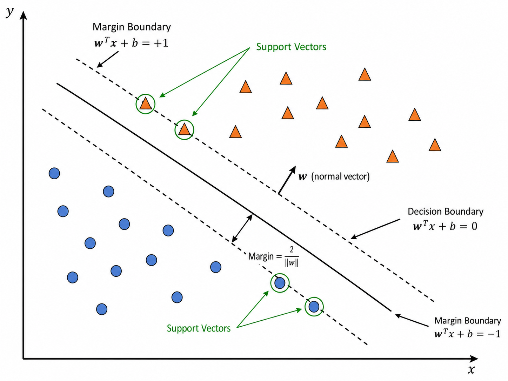
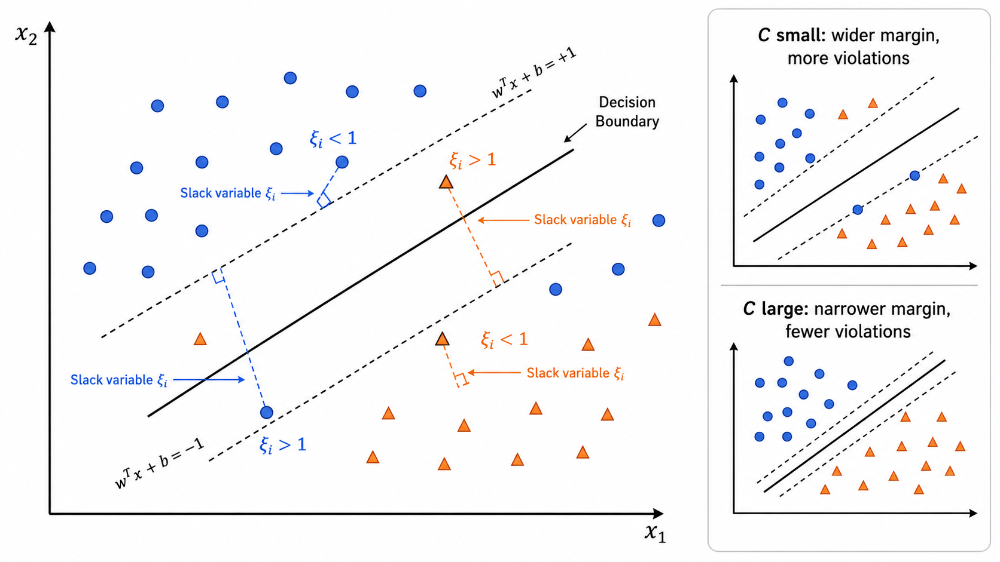
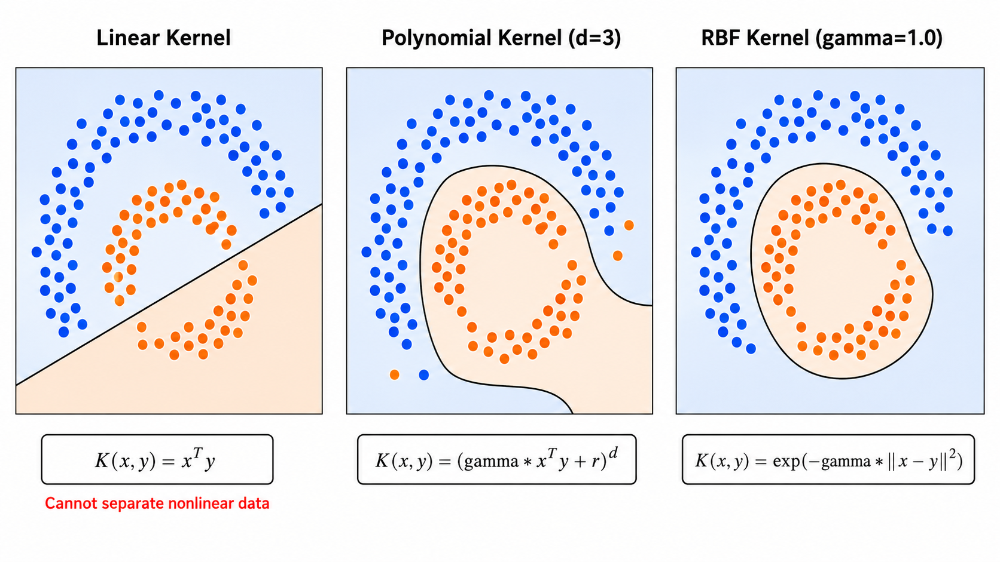

# 支持向量机 (SVM)

> [!WARNING]
> 🧪 Beta公测版本提示：教程主体已完成，正在优化细节，欢迎大家提Issue反馈问题或建议。


## 1. 最大间隔分类器

### 1.1 线性可分情况下的直觉

支持向量机（Support Vector Machine, SVM）的核心思想是：**在能正确分类的所有超平面中，找一个离两类数据都"最远"的超平面**。

对于线性可分数据集，存在无穷多个分类超平面。但哪个是最好的？SVM 的答案是：最大化**间隔（margin）**的那个。

数学上，分类超平面定义为：

$$
\mathbf{w}^T \mathbf{x} + b = 0
$$

其中 $\mathbf{w}$ 是法向量（垂直于超平面），$b$ 是偏置。点到超平面的距离为：

$$
\frac{|\mathbf{w}^T \mathbf{x} + b|}{\|\mathbf{w}\|_2}
$$

将正类标签设为 $y_i = +1$，负类标签设为 $y_i = -1$，则分类正确意味着 $y_i(\mathbf{w}^T \mathbf{x}_i + b) > 0$。

### 1.2 硬间隔 SVM 的优化问题

**几何间隔**（Geometric Margin）定义为所有样本点到超平面的最小距离：

$$
\gamma = \min_i \frac{y_i(\mathbf{w}^T \mathbf{x}_i + b)}{\|\mathbf{w}\|}
$$

SVM 的目标是最大化这个最小间隔：

$$
\begin{aligned}
\max_{\mathbf{w}, b} &\quad \frac{1}{\|\mathbf{w}\|} \\
\text{s.t.} &\quad y_i(\mathbf{w}^T \mathbf{x}_i + b) \geq 1, \quad \forall i
\end{aligned}
$$

约束条件 $y_i(\mathbf{w}^T \mathbf{x}_i + b) \geq 1$ 保证了所有样本被正确分类且距离超平面至少为 $1/\|\mathbf{w}\|$。落在等号上的样本点就是**支持向量（Support Vectors）**——它们是距离超平面最近的样本，也是唯一影响 $\mathbf{w}$ 和 $b$ 的点。

等价地，可以写成更常见的凸二次规划形式：

$$
\begin{aligned}
\min_{\mathbf{w}, b} &\quad \frac{1}{2} \|\mathbf{w}\|^2 \\
\text{s.t.} &\quad y_i(\mathbf{w}^T \mathbf{x}_i + b) \geq 1, \quad \forall i
\end{aligned}
$$



### 1.3 对偶问题与 KKT 条件（几何直觉）

通过拉格朗日乘子法，原始问题可以转换为**对偶问题**。引入拉格朗日乘子 $\alpha_i \geq 0$：

$$
\mathcal{L}(\mathbf{w}, b, \boldsymbol{\alpha}) = \frac{1}{2}\|\mathbf{w}\|^2 - \sum_{i=1}^{n} \alpha_i [y_i(\mathbf{w}^T \mathbf{x}_i + b) - 1]
$$

对 $\mathbf{w}$ 和 $b$ 求导并令其为零，得到：

$$
\mathbf{w} = \sum_{i=1}^{n} \alpha_i y_i \mathbf{x}_i, \quad \sum_{i=1}^{n} \alpha_i y_i = 0
$$

代入拉格朗日函数，得到**对偶问题**：

$$
\begin{aligned}
\max_{\boldsymbol{\alpha}} &\quad \sum_{i=1}^{n} \alpha_i - \frac{1}{2} \sum_{i=1}^{n} \sum_{j=1}^{n} \alpha_i \alpha_j y_i y_j \mathbf{x}_i^T \mathbf{x}_j \\
\text{s.t.} &\quad \alpha_i \geq 0, \quad \sum_{i=1}^{n} \alpha_i y_i = 0
\end{aligned}
$$

**KKT 互补松弛条件**告诉我们：
- 若 $\alpha_i = 0$：样本 $i$ 不是支持向量，不影响决策
- 若 $\alpha_i > 0$：样本 $i$ 是支持向量，满足 $y_i(\mathbf{w}^T \mathbf{x}_i + b) = 1$

这就是"支持向量机"名字的由来——决策只由少数支持向量决定，与其他样本无关。

**为什么使用对偶形式？**
1. 对偶问题中样本仅以内积 $\mathbf{x}_i^T \mathbf{x}_j$ 的形式出现——这为核技巧（Kernel Trick）打开了大门
2. 对偶问题的变量数 = $n$（样本数），原始问题的变量数 = $d$（特征维数）。当 $d \gg n$ 时，对偶问题更高效

---

## 2. 软间隔 SVM

### 2.1 松弛变量与惩罚参数 C

现实数据很少完全线性可分。**软间隔 SVM**（Soft Margin SVM）允许一些样本违反间隔约束，但对此施加惩罚。

引入**松弛变量**（Slack Variables）$\xi_i \geq 0$，表示样本 $i$ 违反间隔的程度：

$$
\begin{aligned}
\min_{\mathbf{w}, b, \boldsymbol{\xi}} &\quad \frac{1}{2} \|\mathbf{w}\|^2 + C \sum_{i=1}^{n} \xi_i \\
\text{s.t.} &\quad y_i(\mathbf{w}^T \mathbf{x}_i + b) \geq 1 - \xi_i, \quad \xi_i \geq 0, \quad \forall i
\end{aligned}
$$

其中 $C > 0$ 是**惩罚参数**（Regularization Parameter），控制间隔最大化与分类错误容忍度之间的权衡：

- **$C$ 很大**（如 $10^6$）：对错误的惩罚很重，模型近似硬间隔 SVM，容易过拟合
- **$C$ 很小**（如 $0.01$）：允许更多错误，间隔更大，模型更简单

$C$ 是 SVM 最重要的超参数，通常通过交叉验证选择。它的角色类似于正则化中的 $\lambda^{-1}$——$C$ 越大正则化越弱。



### 2.2 从 Hinge Loss 角度理解

SVM 的原始问题等价于以下无约束优化问题：

$$
\min_{\mathbf{w}, b} \quad \frac{1}{2} \|\mathbf{w}\|^2 + C \sum_{i=1}^{n} \max(0, 1 - y_i(\mathbf{w}^T \mathbf{x}_i + b))
$$

其中 $\max(0, 1 - y_i(\mathbf{w}^T \mathbf{x}_i + b))$ 就是 **Hinge Loss**（合页损失）。

Hinge Loss 的特点：
- 当 $y_i(\mathbf{w}^T \mathbf{x}_i + b) \geq 1$（正确分类且超出间隔），损失为 0
- 当 $0 < y_i(\mathbf{w}^T \mathbf{x}_i + b) < 1$（正确分类但在间隔内），损失为 $1 - y_i(\mathbf{w}^T \mathbf{x}_i + b)$
- 当 $y_i(\mathbf{w}^T \mathbf{x}_i + b) \leq 0$（错误分类），损失为 $1 + |\mathbf{w}^T \mathbf{x}_i + b|$（线性增长）

与 logistic regression 的交叉熵损失相比，Hinge Loss 对"有把握的"正确分类不产生损失，更加稀疏。

这个视角对于使用 SGD 优化 SVM 非常有用——可以直接对 Hinge Loss + L2 正则化做梯度下降，避免了二次规划的复杂性。

---

## 3. 核技巧（Kernel Trick）

### 3.1 动机：线性不可分问题

现实中的很多分类问题是非线性可分的（如 XOR 问题、同心圆数据）。一种思路是**将数据映射到高维空间**，使数据在新空间中线性可分。

例如，原始二维空间中的 XOR 问题在线性 SVM 下无法解决，但映射到 $\phi(x_1, x_2) = (x_1, x_2, x_1 x_2)$ 三维空间后就是线性可分的。

### 3.2 核函数的定义

核函数 $K(\mathbf{x}_i, \mathbf{x}_j)$ 直接计算高维空间中两个样本的内积，而不需要显式地做特征映射：

$$
K(\mathbf{x}_i, \mathbf{x}_j) = \langle \phi(\mathbf{x}_i), \phi(\mathbf{x}_j) \rangle
$$

注意 SVM 的对偶形式中，样本仅以 $\mathbf{x}_i^T \mathbf{x}_j$ 形式出现。将 $\mathbf{x}_i^T \mathbf{x}_j$ 替换为 $K(\mathbf{x}_i, \mathbf{x}_j)$，SVM 就自动在高维隐空间中学习，而不需要显式计算 $\phi(\mathbf{x})$。

### 3.3 常用核函数

**线性核（Linear Kernel）**：
$$
K(\mathbf{x}_i, \mathbf{x}_j) = \mathbf{x}_i^T \mathbf{x}_j
$$
不做任何变换，等价于原始的线性 SVM。适用于特征维度高、样本量大的情况（如文本分类）。

**多项式核（Polynomial Kernel）**：
$$
K(\mathbf{x}_i, \mathbf{x}_j) = (\gamma \mathbf{x}_i^T \mathbf{x}_j + r)^d
$$
参数 $d$ 为多项式的次数，控制特征交互的阶数。$d=1$ 退化为线性核，$d=2$ 产生所有二阶交互特征。

**RBF / 高斯核（Radial Basis Function）**：
$$
K(\mathbf{x}_i, \mathbf{x}_j) = \exp\left(-\gamma \|\mathbf{x}_i - \mathbf{x}_j\|^2\right)
$$
最常用的非线性核。参数 $\gamma$ 控制每个训练样本的"影响半径"：
- $\gamma$ 大：每个支持向量的影响范围小，决策边界复杂（容易过拟合）
- $\gamma$ 小：影响范围大，决策边界平滑（容易欠拟合）

RBF 核将数据映射到**无限维**空间（泰勒展开可知），但它极其灵活，几乎可以拟合任何决策边界——前提是选好 $C$ 和 $\gamma$。

**核的选择**：

| 核函数 | 公式 | 适用场景 | 关键参数 |
|--------|------|----------|----------|
| 线性 | $\mathbf{x}_i^T \mathbf{x}_j$ | 高维稀疏数据（文本）| — |
| 多项式 | $(\gamma \mathbf{x}_i^T \mathbf{x}_j + r)^d$ | 已知特征交互阶数 | $d$ |
| RBF | $\exp(-\gamma \|\mathbf{x}_i - \mathbf{x}_j\|^2)$ | 一般非线性问题（首选） | $\gamma$ |
| Sigmoid | $\tanh(\gamma \mathbf{x}_i^T \mathbf{x}_j + r)$ | 神经网络类比 | $\gamma, r$ |



### 3.4 Mercer 条件

不是任意二元函数都可以作为核函数。**Mercer 定理**指出：一个函数 $K(\mathbf{x}, \mathbf{y})$ 是合法核函数，当且仅当对于任意有限样本集，其 Gram 矩阵 $\mathbf{K}_{ij} = K(\mathbf{x}_i, \mathbf{x}_j)$ 是**半正定**的。

在实践中，常用的核函数（线性、多项式、RBF、Sigmoid）都满足 Mercer 条件，可以放心使用。

---

## 4. 从零实现线性 SVM（Hinge Loss + SGD）

### 4.1 核心思路

使用 Hinge Loss + L2 正则化的形式，通过 SGD 优化：

```python
class LinearSVM:
    def fit(self, X, y):
        for epoch in range(n_epochs):
            for each sample (x_i, y_i):
                if y_i * (w^T x_i + b) < 1:  # 违反间隔
                    grad_w = 2 * lambda_ * w - y_i * x_i
                    grad_b = -y_i
                else:  # 在间隔外
                    grad_w = 2 * lambda_ * w
                    grad_b = 0
                w -= lr * grad_w
                b -= lr * grad_b
```

### 4.2 梯度推导

Hinge Loss 对 $\mathbf{w}$ 的子梯度：

$$
\frac{\partial \max(0, 1 - y(f(\mathbf{x})))}{\partial \mathbf{w}} =
\begin{cases}
-y \mathbf{x} & \text{if } y \cdot f(\mathbf{x}) < 1 \\
0 & \text{otherwise}
\end{cases}
$$

加上 L2 正则化项：总梯度 = $2\lambda \mathbf{w}$ + Hinge Loss 梯度。

### 4.3 支持向量的识别

训练完成后，支持向量可以通过以下条件识别：

```python
margin = y_i * (w^T x_i + b)
sv_mask = (margin >= 0.99) & (margin <= 1.01)
# 或使用对偶变量: alpha_i > 0 的样本
```

在 SGD 方法中，所有满足 $y_i(\mathbf{w}^T \mathbf{x}_i + b) \leq 1$ 的样本都会贡献梯度，使它们"被推向"决策边界。最终落在间隔边界上的就是支持向量。

---

## 本章总结

| 概念 | 公式/描述 | 关键点 |
|------|-----------|--------|
| 最大间隔 | $\max 1/\|\mathbf{w}\|$ s.t. $y_i(\mathbf{w}^T\mathbf{x}_i+b) \geq 1$ | 选择离数据最远的超平面 |
| 支持向量 | $\alpha_i > 0$ 的样本 | 唯一影响决策的训练样本 |
| 对偶问题 | $\max_\alpha \sum\alpha_i - \frac{1}{2}\sum\alpha_i\alpha_j y_i y_j \mathbf{x}_i^T\mathbf{x}_j$ | 仅以内积形式出现 |
| KKT 条件 | $\alpha_i (y_i(\mathbf{w}^T\mathbf{x}_i+b) - 1) = 0$ | 支持向量的判定 |
| 松弛变量 | $\xi_i \geq 0$ | 允许违反间隔 |
| 惩罚参数 $C$ | $C\sum\xi_i$ | $C$ 大 → 硬间隔；$C$ 小 → 软间隔 |
| Hinge Loss | $\max(0, 1 - y f(\mathbf{x}))$ | SGD 可优化形式 |
| 核函数 | $K(\mathbf{x}_i, \mathbf{x}_j) = \langle\phi(\mathbf{x}_i), \phi(\mathbf{x}_j)\rangle$ | 隐式高维映射 |
| RBF 核 | $\exp(-\gamma\|\mathbf{x}_i-\mathbf{x}_j\|^2)$ | 最常用非线性核，无限维 |
| Mercer 条件 | Gram 矩阵半正定 | 核函数的合法性判定 |

---

## 参考

1. Cortes, C., & Vapnik, V. (1995). Support-vector networks. *Machine Learning*, 20(3), 273-297. DOI: [10.1007/BF00994018](https://doi.org/10.1007/BF00994018)
2. Boser, B. E., Guyon, I. M., & Vapnik, V. N. (1992). A training algorithm for optimal margin classifiers. *COLT '92*, 144-152. DOI: [10.1145/130385.130401](https://doi.org/10.1145/130385.130401)
3. Scholkopf, B., & Smola, A. J. (2002). *Learning with Kernels*. MIT Press. ISBN: 9780262194754
4. Burges, C. J. C. (1998). A tutorial on support vector machines for pattern recognition. *Data Mining and Knowledge Discovery*, 2(2), 121-167. DOI: [10.1023/A:1009715923555](https://doi.org/10.1023/A:1009715923555)
5. Cristianini, N., & Shawe-Taylor, J. (2000). *An Introduction to Support Vector Machines*. Cambridge University Press. DOI: [10.1017/CBO9780511801389](https://doi.org/10.1017/CBO9780511801389)
6. Hsu, C. W., Chang, C. C., & Lin, C. J. (2003). A practical guide to support vector classification. *Technical Report*, National Taiwan University. [Link](https://www.csie.ntu.edu.tw/~cjlin/papers/guide/guide.pdf)
7. Bishop, C. M. (2006). *Pattern Recognition and Machine Learning*. Springer. DOI: [10.1007/978-0-387-45528-0](https://doi.org/10.1007/978-0-387-45528-0) 第 7 章
8. Hastie, T., Tibshirani, R., & Friedman, J. (2009). *The Elements of Statistical Learning* (2nd ed.). Springer. DOI: [10.1007/978-0-387-84858-7](https://doi.org/10.1007/978-0-387-84858-7) 第 12 章

---

## 📥 Code

- [demo.py 下载](https://github.com/DeconBear/learn-ai/blob/master/ml04_svm/code/demo.py)
- [exercise.py 下载](https://github.com/DeconBear/learn-ai/blob/master/ml04_svm/code/exercise.py)
- [代码详解（保姆级教学）](./code-demo)
- [练习指南](./code-exercise)

### 上一章： [ml03 朴素贝叶斯](../ml03_naive_bayes/)
### 下一章： [ml05 决策树](../ml05_decision_tree/)
