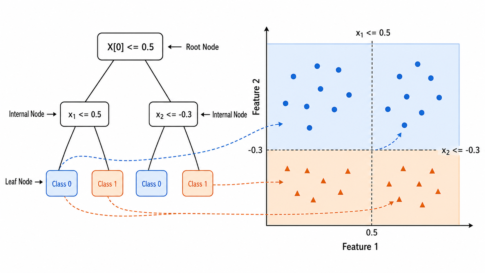
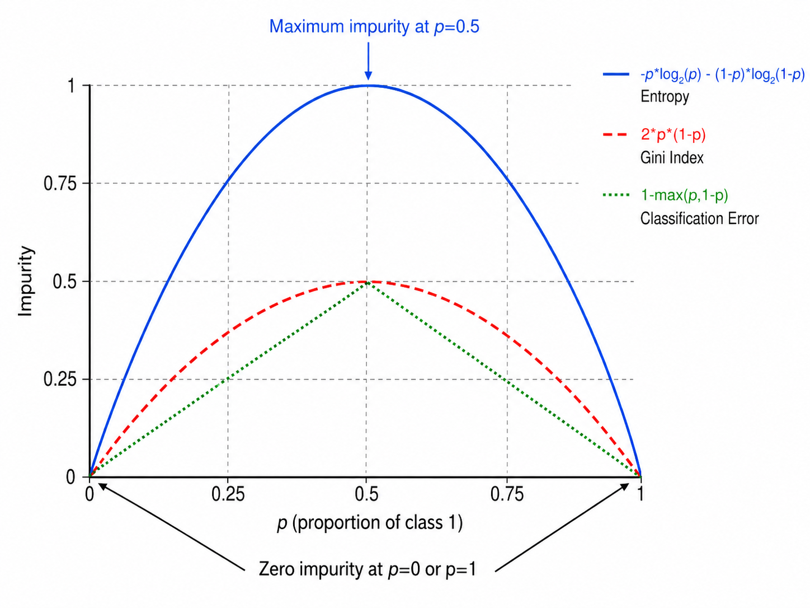

# 决策树

> [!WARNING]
> 🧪 Beta公测版本提示：教程主体已完成，正在优化细节，欢迎大家提Issue反馈问题或建议。


## 1. 决策树的基本概念

### 1.1 决策树是什么

决策树（Decision Tree）是一种**树形结构**的预测模型，由一系列"如果...则..."规则组成。它通过递归地将数据空间划分为更小的矩形区域，直到每个区域内的样本足够"纯"。

一棵决策树包含三种节点：
- **根节点（Root Node）**：包含全部数据，选择最优特征进行首次划分
- **内部节点（Internal Node）**：每个节点选择一个特征和一个阈值，将数据分为左右两个子集
- **叶节点（Leaf Node）**：终止划分的节点，存储预测值（分类：多数类标签；回归：均值）

决策树的核心优势：**可解释性**。一棵决策树可以直接翻译成人类可读的规则列表（"如果年龄 < 30 且收入 > 5 万，则批准贷款"），这是深度学习模型难以做到的。



### 1.2 决策树的学习过程

决策树的构建是一个**贪心递归**过程：

1. 从根节点开始，选择最优特征和分割点，将数据分为两部分
2. 对每个子节点递归执行步骤 1
3. 直到满足停止条件（达到最大深度、节点样本数过少、纯度足够高）

核心问题：**如何定义"最优"分割？** 这由不纯度度量（Impurity Measure）来回答。

---

## 2. 三种分裂准则

设当前节点有 $n$ 个样本，第 $j$ 类有 $n_j$ 个样本。用特征 $A$ 和分割点 $t$ 将数据分为左子集 $\mathcal{D}_L$（$n_L$ 个样本）和右子集 $\mathcal{D}_R$（$n_R$ 个样本）。分裂的**增益**如下评估。

### 2.1 ID3：信息增益（Information Gain）

基于**熵（Entropy）**的不纯度定义：

$$
H(\mathcal{D}) = -\sum_{j=1}^{C} p_j \log_2 p_j
$$

其中 $p_j = n_j / n$ 是类别 $j$ 在数据集中的比例。

**熵的直觉**：
- 二分类，$p=0.5$：$H = 1$（最混乱，两个类别各半）
- 二分类，$p=0$ 或 $p=1$：$H = 0$（最纯净，全属于同一类）

熵度量的是不确定性：熵越高，数据越混乱；熵越低，数据越纯净。物理中，熵代表系统的无序程度——决策树借用了这个概念。

**信息增益**定义为分裂前后熵的减少：

$$
\text{IG}(\mathcal{D}, A, t) = H(\mathcal{D}) - \left[ \frac{n_L}{n} H(\mathcal{D}_L) + \frac{n_R}{n} H(\mathcal{D}_R) \right]
$$

选择使信息增益**最大**的特征和分割点进行分裂。ID3 只支持离散特征（因计算熵时需要每个取值的统计）。

**ID3 的问题**：天然偏好取值较多的特征。例如"身份证号"作为特征时，每个样本独自分到一个节点，信息增益极大但毫无泛化能力。

### 2.2 C4.5：增益率（Gain Ratio）

C4.5 改进了 ID3，使用**增益率（Gain Ratio）**来惩罚取值过多的特征：

$$
\text{GainRatio}(\mathcal{D}, A, t) = \frac{\text{IG}(\mathcal{D}, A, t)}{\text{SplitInfo}(\mathcal{D}, A)}
$$

其中 $\text{SplitInfo}$ 是特征的"内在信息"（特征本身的熵）：

$$
\text{SplitInfo}(\mathcal{D}, A) = -\sum_{v \in \text{Values}(A)} \frac{|\mathcal{D}_v|}{|\mathcal{D}|} \log_2 \frac{|\mathcal{D}_v|}{|\mathcal{D}|}
$$

- 取值多的特征（如身份证号）→ SplitInfo 大 → 增益率小 → 不会被过度偏好
- C4.5 还改进了连续值的处理（多路划分）和缺失值处理

### 2.3 CART：基尼指数（Gini Index）

**分类与回归树**（Classification and Regression Tree, CART）使用**基尼指数**：

$$
\text{Gini}(\mathcal{D}) = 1 - \sum_{j=1}^{C} p_j^2
$$

基尼指数衡量的是：从数据集中**随机抽取两个样本，它们属于不同类别的概率**。基尼指数越小，数据越纯净。

对于二分类，$p_1 = p$，$p_2 = 1-p$：

$$
\text{Gini} = 1 - p^2 - (1-p)^2 = 2p(1-p)
$$

这是一个关于 $p$ 的二次函数，当 $p=0.5$ 时最大（$0.5$），当 $p=0$ 或 $p=1$ 时最小（$0$）。

CART 的**分裂收益**：

$$
\Delta \text{Gini} = \text{Gini}(\mathcal{D}) - \left[ \frac{n_L}{n} \text{Gini}(\mathcal{D}_L) + \frac{n_R}{n} \text{Gini}(\mathcal{D}_R) \right]
$$

选择使 $\Delta \text{Gini}$ 最大的分割。CART 只做**二叉树拆分**（binary split），计算效率高于多路划分。



### 2.4 三种准则的比较

| 准则 | 公式 | 算法 | 特点 |
|------|------|------|------|
| 信息增益 | $H(\mathcal{D}) - \sum\frac{n_k}{n}H(\mathcal{D}_k)$ | ID3 | 偏好多值特征 |
| 增益率 | IG / SplitInfo | C4.5 | 矫正 ID3 的偏好 |
| 基尼指数 | $\sum p_j(1-p_j)$ | CART | 二分类；计算更简单 |

在实际使用中，CART 是最广泛使用的决策树算法（scikit-learn 的 `DecisionTreeClassifier` 默认使用基尼指数或熵）。

---

## 3. 剪枝：防止过拟合

### 3.1 为什么决策树容易过拟合

不加限制的决策树可以一直生长到每个叶节点只包含一个样本——这棵树的训练误差为 0，但泛化能力接近于零。决策树是典型的高方差模型。

### 3.2 预剪枝（Pre-pruning）

在树生长过程中提前停止。常见的预剪枝条件：

- **最大深度**（`max_depth`）：限制树的层数
- **最小样本数**（`min_samples_split`）：节点样本数小于阈值时不继续分裂
- **最小叶节点样本数**（`min_samples_leaf`）：分裂后任一子节点样本数小于阈值时不分裂
- **最小不纯度减少**（`min_impurity_decrease`）：分裂收益小于阈值时不分裂

预剪枝的优点是效率高（不需要先生成一棵完整的大树再裁减），但可能会过于保守——一个看似"当前收益不大"的分裂可能引出后续更好的分裂（视野短浅效应）。

### 3.3 后剪枝（Post-pruning）

先让树充分生长，再从底向上评估是否要剪掉某个子树。

**错误率降低剪枝（Reduced-Error Pruning）**：
1. 将数据分为训练集和验证集
2. 用训练集生成完整决策树
3. 自底向上：对每个内部节点，尝试将其替换为叶节点（用多数类标签），若验证集准确率不降低则执行剪枝

**代价复杂度剪枝（Cost-Complexity Pruning）**：CART 使用的剪枝方法。定义代价函数：

$$
R_\alpha(T) = R(T) + \alpha \cdot |T|
$$

其中 $R(T)$ 是训练误差，$|T|$ 是叶节点数量（衡量模型复杂度）。$\alpha$ 是复杂度惩罚参数。通过变化 $\alpha$ 得到一组嵌套子树序列，然后用交叉验证选出最优的 $\alpha$。

---

## 4. 连续值与缺失值处理

### 4.1 连续特征的分割

对于连续特征，CART 的做法是：

1. 对特征 $A$ 的所有取值排序
2. 在每两个相邻取值的中点处设置候选分割点 $t$
3. 评估每个候选分割点的分裂收益（Gini 减少或 IG）
4. 选收益最大的 $(A, t)$ 对

无需做等距离散化或 binning——这是 CART 的一大优势。

### 4.2 缺失值处理

C4.5 和 CART 有不同的缺失值处理策略：

**C4.5 的概率权重法**：在训练时，当特征值缺失的样本到达某节点，将其按各分支的样本比例分配权重（分数传播）；在预测时，同时探索所有分支，取加权结果。

**CART 的代理分裂（Surrogate Split）**：为每个最优分裂找一个"代理"分裂——使用另一个特征，其分裂结果与最优分裂最相似（相关性最高）。当最优特征值缺失时，用代理特征代替。

在实际工具中（如 sklearn），缺失值由预处理阶段处理（填充均值/中位数/众数），或在训练时忽略缺失样本。

---

## 5. 从零实现 CART 决策树

### 5.1 核心数据结构

```python
class DecisionTree:
    class Node:
        def __init__(self):
            self.feature_idx = None  # 分裂特征索引
            self.threshold = None    # 分裂阈值
            self.left = None         # 左子树
            self.right = None        # 右子树
            self.value = None        # 叶节点的预测值（多数类标签）
            self.is_leaf = True
    
    def fit(self, X, y):
        self.root = self._build_tree(X, y, depth=0)
    
    def _build_tree(self, X, y, depth):
        # 停止条件
        if 所有样本同一类别 or 深度达上限 or 样本数太少:
            return Node(value=多数类标签)
        # 选最佳分割
        best_feat, best_thresh = self._best_split(X, y)
        # 递归构建子树
        left = self._build_tree(X_left, y_left, depth+1)
        right = self._build_tree(X_right, y_right, depth+1)
        return Node(feature_idx, threshold, left, right)
```

### 5.2 最佳分割的搜索

```python
def _best_split(self, X, y):
    best_gain = -inf
    for each feature j:
        for each unique value as candidate threshold t:
            左子集 = X[:, j] <= t
            右子集 = X[:, j] > t
            gain = Gini(parent) - w_L * Gini(left) - w_R * Gini(right)
            if gain > best_gain:
                记录 (j, t)
    return best_feature, best_threshold
```

查找最优分割的复杂度为 $O(d \cdot n \log n)$（对每个特征排序后扫描）。这是决策树训练的计算瓶颈——当 $n$ 很大时需要采样技巧。

---

## 本章总结

| 概念 | 公式/描述 | 关键点 |
|------|-----------|--------|
| 熵 | $H = -\sum p_j \log_2 p_j$ | $p=0.5$ 时最大(1), $p=0/1$ 时最小(0) |
| 信息增益 | $H(\mathcal{D}) - \sum\frac{n_k}{n}H(\mathcal{D}_k)$ | ID3 的分裂准则 |
| 增益率 | IG / SplitInfo | C4.5；惩罚多值特征 |
| 基尼指数 | $1 - \sum p_j^2$ | CART 的分裂准则；计算效率高 |
| 预剪枝 | max_depth, min_samples_* | 提前停止生长 |
| 代价复杂度剪枝 | $R_\alpha(T) = R(T) + \alpha\|T\|$ | 后剪枝；CART 标准方法 |
| 连续值分割 | 相邻取值的 M=n/2 处 | 排序后逐个扫描 |
| CART 特性 | 二叉树拆分 | sklearn 默认实现 |

---

## 参考

1. Quinlan, J. R. (1986). Induction of decision trees. *Machine Learning*, 1(1), 81-106. DOI: [10.1007/BF00116251](https://doi.org/10.1007/BF00116251) (ID3)
2. Quinlan, J. R. (1993). *C4.5: Programs for Machine Learning*. Morgan Kaufmann. ISBN: 9781558602380
3. Breiman, L., Friedman, J., Olshen, R. A., & Stone, C. J. (1984). *Classification and Regression Trees*. Wadsworth. ISBN: 9780412048418 (CART 的原始著作)
4. Hastie, T., Tibshirani, R., & Friedman, J. (2009). *The Elements of Statistical Learning* (2nd ed.). Springer. DOI: [10.1007/978-0-387-84858-7](https://doi.org/10.1007/978-0-387-84858-7) 第 9.2 节
5. Bishop, C. M. (2006). *Pattern Recognition and Machine Learning*. Springer. DOI: [10.1007/978-0-387-45528-0](https://doi.org/10.1007/978-0-387-45528-0) 第 14.4 节
6. Loh, W. Y. (2011). Classification and regression trees. *WIREs Data Mining and Knowledge Discovery*, 1(1), 14-23. DOI: [10.1002/widm.8](https://doi.org/10.1002/widm.8) (CART 综述)

---

## 📥 Code

- [demo.py 下载](https://github.com/DeconBear/learn-ai/blob/master/ml05_decision_tree/code/demo.py)
- [exercise.py 下载](https://github.com/DeconBear/learn-ai/blob/master/ml05_decision_tree/code/exercise.py)
- [代码详解（保姆级教学）](./code-demo)
- [练习指南](./code-exercise)

### 上一章： [ml04 SVM](../ml04_svm/)
### 下一章： [ml06 集成学习：Bagging](../ml06_random_forest/)
