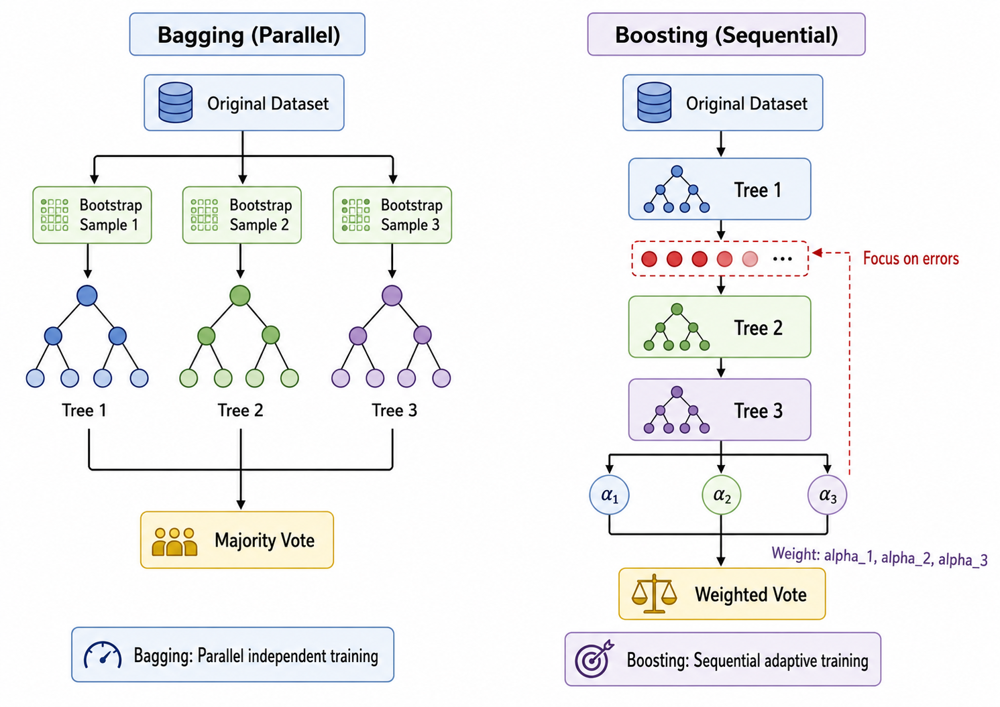
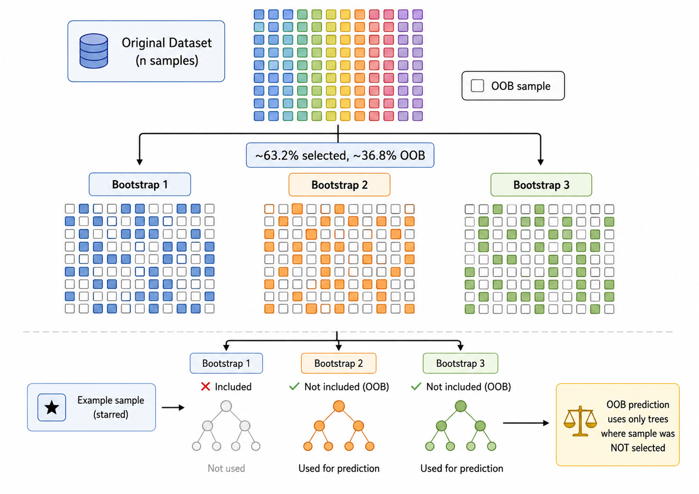
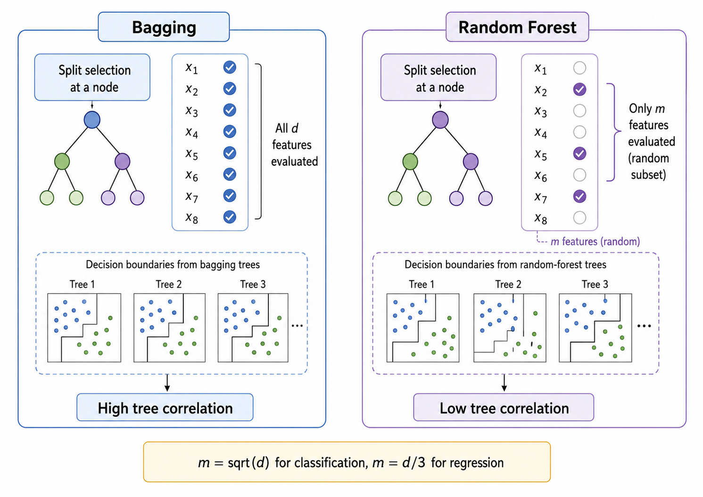

# 集成学习：Bagging 与随机森林

## 1. 集成学习的基本思想

### 1.1 三个臭皮匠，顶个诸葛亮

**集成学习**（Ensemble Learning）的核心思想：**结合多个弱学习器的预测，得到一个比任何单个学习器都更好的强学习器**。

直觉来自日常经验：让一群人分别独立地做判断，然后投票，通常比单个人的判断更准确——只要每个人的判断比随机猜测好一些（错误率 < 50%），并且他们的错误是**不相关**的。

数学上，假设有 $M$ 个独立的二分类器，每个的错误率为 $\epsilon < 0.5$。使用多数投票，集成分类器的错误率为：

$$
P(\text{ensemble wrong}) = \sum_{k=\lfloor M/2 \rfloor + 1}^{M} \binom{M}{k} \epsilon^k (1-\epsilon)^{M-k}
$$

由于这是二项分布的右尾概率，随着 $M$ 增大，集成错误率指数级下降趋近于 0（Condorcet 陪审团定理）。

### 1.2 两类集成方法

集成学习主要分为两大类：

- **Bagging（Bootstrap Aggregating）**：并行训练多个模型（各模型独立），通过投票/均值结合。代表：随机森林
- **Boosting**：串行训练多个模型（后一个模型关注前一个模型的错误），通过加权投票结合。代表：AdaBoost, GBDT, XGBoost

本章聚焦于 Bagging 和随机森林；ml07 将深入 Boosting。



---

## 2. Bootstrap 采样与 Bagging

### 2.1 Bootstrap 采样

Bagging 的核心技术是 **Bootstrap Sampling**：

从原始训练集 $\mathcal{D}$（$n$ 个样本）中**有放回**地随机抽取 $n$ 个样本，形成一个 Bootstrap 样本 $\mathcal{D}_b$。

由于有放回，一个样本在一次采样中可能被多次选中，也可能不被选中。某样本不被选中的概率为：

$$
P(\text{样本不在 Bootstrap 中}) = \left(1 - \frac{1}{n}\right)^n \approx e^{-1} \approx 36.8\%
$$

大约有 **36.8%** 的原始样本不会出现在某个 Bootstrap 样本中——这些样本称为 **Out-of-Bag (OOB) 样本**，它们是"免费"的验证集。

### 2.2 Bagging 算法流程

1. 对 $b = 1, 2, \dots, B$（$B$ 个基学习器）：
   - 从原始训练集中 Bootstrap 采样得到 $\mathcal{D}_b$
   - 在 $\mathcal{D}_b$ 上训练基学习器 $h_b(\mathbf{x})$
2. 分类：多数投票 $\hat{y} = \arg\max_y \sum_b \mathbb{I}(h_b(\mathbf{x}) = y)$
3. 回归：取均值 $\hat{y} = \frac{1}{B} \sum_b h_b(\mathbf{x})$

伪代码：
```python
for i in range(n_estimators):
    bootstrap_idx = random_choice(n, n, replace=True)
    X_boot, y_boot = X[bootstrap_idx], y[bootstrap_idx]
    tree = DecisionTree(max_depth=None)  # 不加限制地生长
    tree.fit(X_boot, y_boot)
    trees.append(tree)
```

**关键点**：Bagging 中的每棵树都是**不加限制地完全生长**（不剪枝），每棵树本身是高方差低偏差的。Bagging 通过平均来降低方差。

### 2.3 OOB 误差估计

OOB（Out-of-Bag）误差是 Bagging 的内置交叉验证：

- 对于每个样本 $(\mathbf{x}_i, y_i)$，找出所有未使用该样本的树（平均约 36.8% 的树）
- 仅用这些树对该样本做预测
- 计算所有样本的平均 OOB 误差

OOB 误差是泛化误差的**无偏估计**，不需要额外的验证集。



---

## 3. 随机森林

### 3.1 与 Bagging 的关键区别

随机森林（Random Forest）是 Bagging 的一个变体，但有一个关键创新：**随机特征子空间**（Random Feature Subspace）。

在普通 Bagging 中，每棵树在分裂时考虑**所有特征**。而在随机森林中，每棵树在每个节点分裂时只考虑 **$m$ 个随机选择的特征**（$m = \sqrt{d}$ 用于分类，$m = d/3$ 用于回归）。

```python
# 普通决策树: 考虑所有 d 个特征
for feat in range(d):
    evaluate_split(feat)

# 随机森林: 只考虑 m 个随机选的特征
selected_feats = random.sample(range(d), m)
for feat in selected_feats:
    evaluate_split(feat)
```

### 3.2 为什么需要随机特征子空间？

如果所有树都考虑全部特征，最强的几个特征会在几乎所有树中被选中——这会导致各树之间高度相关（即使数据被 Bootstrap 了）。相关性削弱了集成的方差降低效果。

随机特征子空间**迫使各树探索不同的特征组合**，降低树之间的相关性。这进一步降低了集成模型的方差——这是随机森林通常优于普通 Bagging 的核心原因。

### 3.3 Bias-Variance 分解视角

设单个决策树的方差为 $\sigma^2$，树之间的相关系数为 $\rho$。则 $B$ 棵树的集成方差为：

$$
\text{Var}\left(\frac{1}{B} \sum_{b=1}^{B} h_b\right) = \rho \sigma^2 + \frac{1 - \rho}{B} \sigma^2
$$

当 $B \to \infty$：
$$
\text{Var} \to \rho \sigma^2
$$

这意味着：
- 当树完全相关（$\rho = 1$）：集成方差 = $\sigma^2$（无改善）
- 当树完全独立（$\rho = 0$）：集成方差 $\to 0$（完全消除方差）

随机森林通过两种机制降低 $\rho$：
1. **Bootstrap 采样**：每棵树用不同数据训练
2. **随机特征子空间**：每棵树考虑不同特征

### 3.4 特征重要性（MDI）

随机森林提供了一种自然的特征重要性度量——**平均不纯度减少**（Mean Decrease in Impurity, MDI）：

$$
\text{Imp}(X_j) = \frac{1}{B} \sum_{b=1}^{B} \sum_{t \in \text{Nodes split on } X_j} \frac{n_t}{n} \cdot \Delta \text{Impurity}(t)
$$

其中 $\Delta \text{Impurity}(t)$ 是节点 $t$ 处分裂后的不纯度减少量（Gini 减少或信息增益），$n_t / n$ 是到达该节点的样本比例。

特征重要性越高，说明该特征在森林中被用来做决策的频率和对纯度的贡献越大。



---

## 4. 从零实现随机森林

### 4.1 核心架构

随机森林 = Bagging（Bootstrap 采样 + 多个基学习器） + 随机特征子空间。

可以基于 ml05 的 `CARTDecisionTree` 构建：

```python
class RandomForest:
    def __init__(self, n_estimators=100, max_features='sqrt'):
        self.n_estimators = n_estimators
        self.max_features = max_features
        self.trees = []
        self.oob_indices = []  # 记录每棵树的 OOB 索引
    
    def fit(self, X, y):
        for i in range(self.n_estimators):
            # Bootstrap 采样
            boot_idx = np.random.choice(n, n, replace=True)
            oob_idx = np.setdiff1d(range(n), np.unique(boot_idx))
            
            # 训练单个决策树（带随机特征子空间）
            tree = RandomSplitTree(max_features=self.max_features)
            tree.fit(X[boot_idx], y[boot_idx])
            
            self.trees.append(tree)
            self.oob_indices.append(oob_idx)
    
    def predict(self, X):
        predictions = np.array([tree.predict(X) for tree in self.trees])
        return mode(predictions, axis=0)
```

### 4.2 OOB 误差计算

```python
def oob_score(self, X, y):
    oob_predictions = np.zeros(len(y))
    for i in range(len(y)):
        # 找出所有未使用样本 i 的树
        trees_using_i = [t for t_idx, t in enumerate(self.trees)
                         if i not in self.bootstrap_indices[t_idx]]
        if len(trees_using_i) == 0:
            continue
        # 只用这些树做预测
        votes = [t.predict(X[i:i+1])[0] for t in trees_using_i]
        oob_predictions[i] = mode(votes)
    return accuracy_score(y, oob_predictions)
```

---

## 本章总结

| 概念 | 公式/描述 | 关键点 |
|------|-----------|--------|
| Bootstrap | 有放回随机采样 $n$ 个样本 | ~63.2% 样本被选中 |
| OOB 样本 | $(1 - 1/n)^n \approx 36.8\%$ 未被选中 | 免费验证集 |
| Bagging | $B$ 个模型并行训练 + 投票/均值 | 降低方差，适合高方差基学习器 |
| 随机特征子空间 | 每个节点只考虑 $m$ 个随机特征 | $m = \sqrt{d}$（分类） |
| 随机森林 | Bagging + 随机特征子空间 | 进一步降低树间相关性 |
| 集成方差 | $\rho\sigma^2 + (1-\rho)\sigma^2/B$ | $\rho$ 越低，方差降低越多 |
| MDI 特征重要性 | $\frac{1}{B}\sum_{b}\sum_{t}\frac{n_t}{n}\Delta\text{Imp}(t)$ | 不纯度减少的加权平均 |
| $B \to \infty$ 方差 | $\to \rho\sigma^2$ | 树越多越好（但边际收益递减） |

---

## 参考

1. Breiman, L. (1996). Bagging predictors. *Machine Learning*, 24(2), 123-140. DOI: [10.1007/BF00058655](https://doi.org/10.1007/BF00058655)
2. Breiman, L. (2001). Random forests. *Machine Learning*, 45(1), 5-32. DOI: [10.1023/A:1010933404324](https://doi.org/10.1023/A:1010933404324)
3. Ho, T. K. (1998). The random subspace method for constructing decision forests. *IEEE TPAMI*, 20(8), 832-844. DOI: [10.1109/34.709601](https://doi.org/10.1109/34.709601)
4. Dietterich, T. G. (2000). An experimental comparison of three methods for constructing ensembles of decision trees: Bagging, boosting, and randomization. *Machine Learning*, 40(2), 139-157. DOI: [10.1023/A:1007607513941](https://doi.org/10.1023/A:1007607513941)
5. Hastie, T., Tibshirani, R., & Friedman, J. (2009). *The Elements of Statistical Learning* (2nd ed.). Springer. DOI: [10.1007/978-0-387-84858-7](https://doi.org/10.1007/978-0-387-84858-7) 第 15 章
6. Louppe, G., Wehenkel, L., Sutera, A., & Geurts, P. (2013). Understanding variable importances in forests of randomized trees. *NIPS 2013*, 431-439. arXiv: [1407.7502](https://arxiv.org/abs/1407.7502)

---

## 📥 Code

- [demo.py 下载](https://github.com/DeconBear/learn-ai/blob/master/ml06_random_forest/code/demo.py)
- [exercise.py 下载](https://github.com/DeconBear/learn-ai/blob/master/ml06_random_forest/code/exercise.py)
- [代码详解（保姆级教学）](./code-demo)
- [练习指南](./code-exercise)

### 上一章： [ml05 决策树](../ml05_decision_tree/)
### 下一章： [ml07 集成学习：Boosting](../ml07_boosting/)
