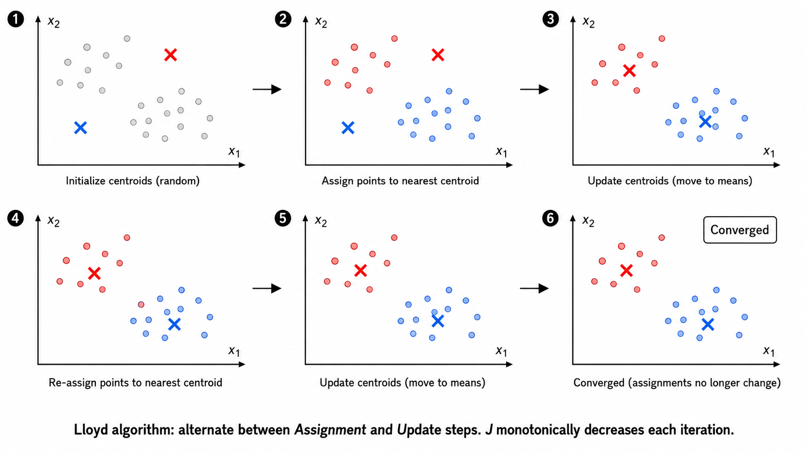
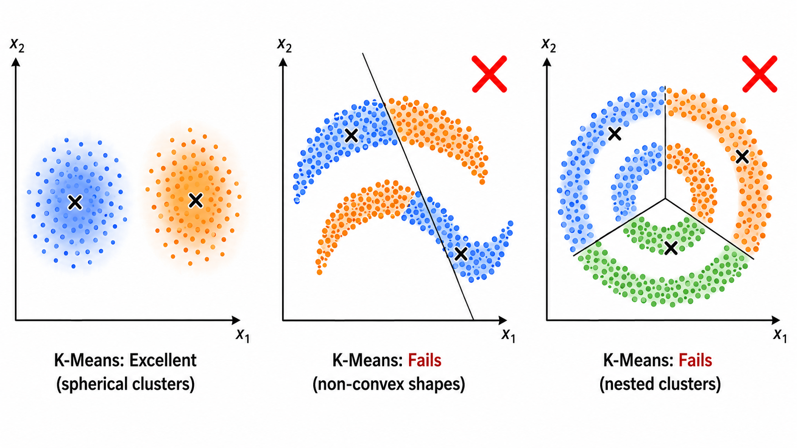
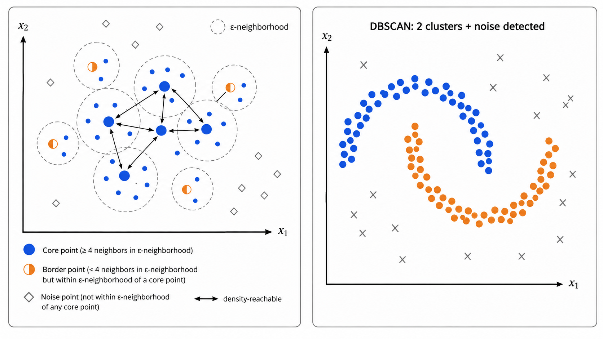
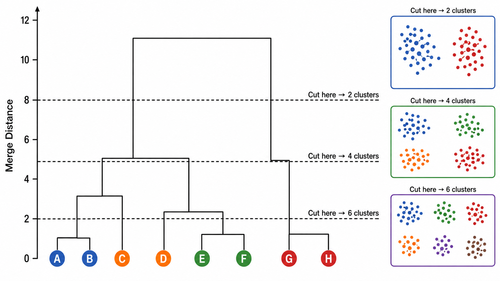

# ml08 聚类：无监督学习的核心

> 当数据没有标签时，如何发现其中的隐藏结构？K-Means、DBSCAN、层次聚类——三种思维，三种哲学。

---

## 一、什么是聚类？

**聚类（Clustering）** 是无监督学习的核心任务之一。与分类不同，聚类不需要标签——它直接在数据空间中寻找"物以类聚"的天然结构，将相似的数据点归入同一簇（cluster），将不相似的点分开。

形式化地说，给定数据集 $\mathcal{D} = \{x_1, x_2, \dots, x_N\}$，$x_i \in \mathbb{R}^d$，聚类的目标是找到一个划分函数 $C: \{1, \dots, N\} \to \{1, \dots, K\}$，使得同一簇内的样本**相似度最大化**，不同簇间的样本**相似度最小化**。

聚类问题的两个核心问题：
1. **如何度量相似性？**——距离度量（欧氏距离、余弦相似度、马氏距离等）
2. **如何定义"簇"？**——不同的算法对"什么是簇"有不同的定义

> **直觉类比**：想象你在一个漆黑的房间里，地上散落着很多硬币、纽扣和弹珠。你看不到它们的标签，但你可以通过触摸（计算距离）把它们分成三堆——大小相似的放一起。聚类就是让计算机自动做这件事。

---

## 二、K-Means：最经典的划分方法

### 2.1 核心思想

K-Means 假设簇是**球形的、大小相近的**，并将每个簇表示为一个**质心（centroid）**——簇内所有点的均值向量。

K-Means 试图最小化**簇内平方误差（Within-Cluster Sum of Squares, WCSS）**：

$$
J = \sum_{k=1}^{K} \sum_{x_i \in C_k} \|x_i - \mu_k\|^2
$$

其中 $C_k$ 是第 $k$ 个簇，$\mu_k$ 是其质心：

$$
\mu_k = \frac{1}{|C_k|} \sum_{x_i \in C_k} x_i
$$



### 2.2 Lloyd 算法

K-Means 的标准求解算法由 Stuart Lloyd 于 1957 年提出（比 K-Means 这个名字的出现还早！）。它是一个交替优化的过程：

**步骤 1：分配（Assignment）——固定质心，分配样本**

$$
C_k^{(t)} = \left\{ x_i : \|x_i - \mu_k^{(t)}\|^2 \le \|x_i - \mu_j^{(t)}\|^2, \; \forall j = 1, \dots, K \right\}
$$

每个样本被分配给距离最近的质心所属的簇。

**步骤 2：更新（Update）——固定分配，更新质心**

$$
\mu_k^{(t+1)} = \frac{1}{|C_k^{(t)}|} \sum_{x_i \in C_k^{(t)}} x_i
$$

每个簇的质心被更新为该簇所有样本的均值。

**收敛性**：每轮迭代中，分配步骤和更新步骤都能保证 $J$ 单调不增（分配步骤通过将每个点移到最近的质心降低了 $J$；更新步骤通过将质心移到簇均值位置进一步降低了 $J$）。因为 $J$ 有下界（$\ge 0$）且迭代中单调递减，算法必在有限步内收敛到局部最优。

> **Lloyd 算法的本质**：它其实是 **EM 算法** 在硬分配（hard assignment）下的特例——分配步骤对应 E 步（推断隐变量），更新步骤对应 M 步（最大化似然）。

### 2.3 K-Means++ 初始化

标准 K-Means 对初始质心非常敏感——不好的初始化可能导致收敛到很差的局部最优。**K-Means++** 通过一种巧妙的概率采样策略大大改善了初始化：

1. 从数据集中**均匀随机**选择第一个质心 $\mu_1$
2. 对于每个点 $x_i$，计算它到**最近已选质心**的距离 $D(x_i)$
3. 以概率 $\frac{D(x_i)^2}{\sum_j D(x_j)^2}$ 选择下一个质心——距离越远的点越可能被选中
4. 重复步骤 2-3，直到选出 $K$ 个质心

K-Means++ 保证了初始质心尽可能"分散"，使得算法更可能收敛到好的局部最优。数学上可以证明，K-Means++ 给出的初始目标函数值的期望不超过最优解的 $O(\log K)$ 倍。

### 2.4 K-Means 的局限性

| 局限 | 说明 |
|------|------|
| K 必须预先指定 | 不知道 K 时需要用肘部法则或轮廓系数等辅助选择 |
| 假设簇是球形的 | 对细长形、环形、月牙形的簇无能为力 |
| 对初始值敏感 | 不同初始化可能收敛到不同的局部最优 |
| 对异常值敏感 | 异常值会显著拉偏质心位置 |
| 只能处理凸形簇 | 无法处理嵌套结构（如同心圆） |



---

## 三、DBSCAN：基于密度的聚类

### 3.1 核心思想

DBSCAN（Density-Based Spatial Clustering of Applications with Noise）用完全不同的哲学定义簇：**簇是密度相连的点的最大集合**。它可以在噪声中发现任意形状的簇，且不需要预先指定簇的数量。

DBSCAN 的两个核心参数：
- **$\varepsilon$（eps）**：邻域半径——定义"附近"的范围
- **minPts**：最小邻居数——定义一个点是否在"密集区域"的阈值

### 3.2 三种点的定义

对于数据集中的任意点 $p$，定义其 $\varepsilon$-邻域为：

$$
N_\varepsilon(p) = \{ q \in \mathcal{D} : \|p - q\| \le \varepsilon \}
$$

根据 $|N_\varepsilon(p)|$ 与 minPts 的关系，点被分为三类：

| 类型 | 条件 | 含义 |
|------|------|------|
| **核心点（Core Point）** | $\|N_\varepsilon(p)\| \ge \text{minPts}$ | 点在密集区域内部 |
| **边界点（Border Point）** | $\|N_\varepsilon(p)\| < \text{minPts}$ 但存在核心点 $q$ 使 $p \in N_\varepsilon(q)$ | 点在簇的边缘 |
| **噪声点（Noise Point）** | 既非核心点也非边界点 | 离群点，不属于任何簇 |

### 3.3 密度相连与簇的定义

几个递进的概念：

- **直接密度可达（Directly Density-Reachable）**：$q$ 是核心点，且 $p \in N_\varepsilon(q)$，则 $p$ 从 $q$ 直接密度可达
- **密度可达（Density-Reachable）**：存在核心点链 $p_1, p_2, \dots, p_n$，使得 $p_{i+1}$ 从 $p_i$ 直接密度可达
- **密度相连（Density-Connected）**：存在点 $o$，使得 $p$ 和 $q$ 都从 $o$ 密度可达

**DBSCAN 对簇的定义**：一个簇是满足以下两个条件的非空子集 $C \subseteq \mathcal{D}$：
1. **极大性**：对所有 $p \in C$ 和所有从 $p$ 密度可达的 $q$，有 $q \in C$
2. **连接性**：对所有 $p, q \in C$，$p$ 和 $q$ 是密度相连的



### 3.4 $\varepsilon$ 和 minPts 的选择

**minPts 的经验法则**：$\text{minPts} \ge d + 1$（$d$ 为数据维度）。实践中，2D 数据常用 $\text{minPts} = 4$。

**$\varepsilon$ 的选择**：最常用的方法是 **k-距离图**：
1. 对每个点，计算它到第 $k = \text{minPts}$ 近邻的距离
2. 将这些距离从小到大排序后绘图
3. 选择曲线"拐点"处的距离作为 $\varepsilon$

> 拐点的直觉：拐点之前的距离对应簇内点（距离小），拐点之后对应噪声点（距离大）。

### 3.5 DBSCAN 的优势与局限

| 优势 | 局限 |
|------|------|
| 不需要预先指定 K | 对参数 $\varepsilon$ 和 minPts 敏感 |
| 可以发现任意形状的簇 | 密度差异大时难以选择全局 $\varepsilon$ |
| 天然具备异常检测能力 | 高维数据中距离度量失效（维度灾难） |
| 对噪声鲁棒 | 时间复杂度 $O(N^2)$（可用空间索引优化至 $O(N \log N)$） |

---

## 四、层次聚类

### 4.1 两种范式

层次聚类不产生"扁平"的划分，而是构建一棵**层次树（dendrogram，谱系图）**，展示数据从每个点自成一簇到所有点合为一簇的完整合并/分裂过程。

**AGNES（AGglomerative NESting）——自底向上（凝聚）**：
1. 初始：每个点是一个独立的簇
2. 重复：找到最相似的两个簇，合并它们
3. 终止：只剩一个簇（或达到指定簇数）

**DIANA（DIvisive ANAlysis）——自顶向下（分裂）**：
1. 初始：所有点在一个簇中
2. 重复：选择一个簇，将其分裂为两个子簇
3. 终止：每个点是一个独立的簇（或达到指定簇数）

AGNES 比 DIANA 常用得多，因为分裂策略的计算复杂度更高。

### 4.2 簇间距离的四种定义（Linkage Criterion）

在 AGNES 中，决定"合并哪两个簇"的关键是**簇间距离（linkage）**的定义：

| 方法 | 定义 | 效果 |
|------|------|------|
| **Single Linkage（最小距离）** | $d(C_i, C_j) = \min_{x \in C_i, y \in C_j} \|x - y\|$ | 倾向产生细长、链状的簇（链式效应） |
| **Complete Linkage（最大距离）** | $d(C_i, C_j) = \max_{x \in C_i, y \in C_j} \|x - y\|$ | 倾向产生紧凑、球形的簇 |
| **Average Linkage（平均距离）** | $d(C_i, C_j) = \frac{1}{\|C_i\|\|C_j\|}\sum_{x \in C_i}\sum_{y \in C_j}\|x - y\|$ | 折中，对噪声更鲁棒 |
| **Ward's Method** | 最小化合并后的方差增量 $\Delta J = J_{\text{merged}} - J_i - J_j$ | 倾向产生大小相近的簇，与 K-Means 目标函数一致 |

**Single vs Complete Linkage 几何直觉**：Single linkage 只关心两个簇最近的两个点——只要簇的"触角"碰到了一起就合并，导致它可能把两个明显分离的簇通过中间的噪声点"桥接"起来。Complete linkage 要求两个簇的**所有点**都彼此靠近——这要求簇的"最远两端"也足够近，产生更紧凑的结果但可能过度分割。

### 4.3 谱系图（Dendrogram）

谱系图是层次聚类最重要的可视化工具。它是一棵二叉树：
- **横轴**：数据点（叶子节点）
- **纵轴**：合并/分裂时的距离
- **水平线**：连接两个被合并的子簇

通过在不同高度"切一刀"，可以得到不同数量的簇。这是层次聚类不需预先指定 K 的关键优势。



---

## 五、聚类评估指标

聚类是无监督任务，没有"正确答案"。但我们可以用内部指标（不依赖标签）来衡量聚类的质量。

### 5.1 轮廓系数（Silhouette Coefficient）

对每个样本 $i$，定义：
- $a(i)$：样本 $i$ 到**同簇**其他样本的平均距离（簇内紧致度）
- $b(i)$：样本 $i$ 到**最近的其他簇**所有样本的平均距离（簇间分离度）

轮廓系数为：

$$
s(i) = \frac{b(i) - a(i)}{\max\{a(i), b(i)\}}, \quad s(i) \in [-1, 1]
$$

- $s(i)$ 接近 $+1$：样本被很好聚类（$a \ll b$）
- $s(i)$ 接近 $0$：样本处于两个簇的边界上
- $s(i)$ 接近 $-1$：样本可能被分配到错误的簇

整个聚类结果的轮廓系数是所有样本 $s(i)$ 的平均值。

**轮廓系数分析图（Silhouette Analysis）** 是选择最佳 K 的常用工具：画出不同 K 值下每个簇的轮廓系数分布和平均值，选平均轮廓系数最高的 K。

### 5.2 Calinski-Harabasz 指数（方差比准则）

CH 指数定义为簇间离散度与簇内离散度的比值：

$$
CH = \frac{\text{tr}(B_k)}{\text{tr}(W_k)} \cdot \frac{N - K}{K - 1}
$$

其中：
- $B_k$ 是**簇间散布矩阵**：$B_k = \sum_{k=1}^{K} |C_k| (\mu_k - \mu)(\mu_k - \mu)^T$
- $W_k$ 是**簇内散布矩阵**：$W_k = \sum_{k=1}^{K} \sum_{x \in C_k} (x - \mu_k)(x - \mu_k)^T$
- $\text{tr}(\cdot)$ 表示矩阵的迹（trace）
- $N$ 是总样本数

CH 指数越高，说明簇间分散、簇内紧凑，聚类效果越好。

### 5.3 Davies-Bouldin 指数

DB 指数度量的是簇之间的**平均相似度**（越低越好）：

$$
DB = \frac{1}{K} \sum_{i=1}^{K} \max_{j \neq i} \frac{\sigma_i + \sigma_j}{d(\mu_i, \mu_j)}
$$

其中 $\sigma_i$ 是簇 $i$ 内样本到质心的平均距离（簇内散度），$d(\mu_i, \mu_j)$ 是两簇质心间距离（簇间分离度）。DB 指数越小，聚类效果越好。

### 5.4 指标对比

| 指标 | 范围 | 最优方向 | 适用场景 |
|------|------|---------|---------|
| 轮廓系数 | $[-1, 1]$ | 越高越好 | 通用的 K 选择 |
| CH 指数 | $[0, +\infty)$ | 越高越好 | 簇为凸形时效果好 |
| DB 指数 | $[0, +\infty)$ | 越低越好 | 对任意形状的簇 |

---

## 六、聚类算法选择指南

```
数据有没有明显的球形结构？
├── 是 → K-Means（简单高效，先试）
└── 否 → 数据中有噪声和任意形状的簇？
    ├── 是 → DBSCAN（密度聚类，自动发现簇数）
    └── 否 → 需要了解数据的层次结构？
        ├── 是 → 层次聚类（谱系图提供丰富信息）
        └── 否 → 尝试 GMM（概率软分配，见 ml12）
```

> **实战建议**：先用 DBSCAN 探索数据结构（看看有没有噪声和有趣的形状），再用 K-Means 做快速划分，必要时用层次聚类理解数据的多层次组织关系。

---

## 本章总结

| 概念 | 一句话 |
|------|--------|
| K-Means | 交替执行分配和更新，最小化簇内平方误差 |
| Lloyd 算法 | 分配+更新的交替迭代，单调降低目标函数 |
| K-Means++ | 用概率采样选择分散的初始质心 |
| DBSCAN | 基于密度连通性发现任意形状的簇，天然抗噪声 |
| 核心点/边界点/噪声点 | DBSCAN 的三种角色分类 |
| $\varepsilon$ 和 minPts | DBSCAN 的两个核心参数，用 k-距离图选择 |
| AGNES | 自底向上层次聚类，每次合并最相似的两个簇 |
| DIANA | 自顶向下层次聚类，每次分裂一个簇 |
| Single Linkage | 最小簇间距离，倾向链式效应 |
| Complete Linkage | 最大簇间距离，倾向紧凑簇 |
| 谱系图（Dendrogram） | 层次聚类的树状可视化，可灵活选择簇数 |
| 轮廓系数 | $s = (b-a)/\max(a,b)$，衡量簇内紧致 vs 簇间分离 |
| CH 指数 | 方差比：簇间离散度 / 簇内离散度 |
| DB 指数 | 平均相似度，越低越好 |

## 📥 Code

| File | View | Download |
|------|------|----------|
| demo.py | [Open](./code-demo) | <a href="../code/ml08_clustering/demo.py" target="_blank" download>Download</a> |
| exercise.py | [Open](./code-exercise) | <a href="../code/ml08_clustering/exercise.py" target="_blank" download>Download</a> |

## 参考

1. Lloyd, S. (1982). Least squares quantization in PCM. *IEEE Transactions on Information Theory*, 28(2), 129-137. [[doi:10.1109/TIT.1982.1056489](https://doi.org/10.1109/TIT.1982.1056489)]
2. Arthur, D. & Vassilvitskii, S. (2007). K-means++: The Advantages of Careful Seeding. *SODA 2007*. [[doi:10.1145/1283383.1283494](https://doi.org/10.1145/1283383.1283494)]
3. Ester, M., Kriegel, H. P., Sander, J., & Xu, X. (1996). A Density-Based Algorithm for Discovering Clusters in Large Spatial Databases with Noise. *KDD 1996*. [[AAAI](https://aaai.org/papers/kdd96-037-a-density-based-algorithm-for-discovering-clusters/)]
4. Rousseeuw, P. J. (1987). Silhouettes: A graphical aid to the interpretation and validation of cluster analysis. *Journal of Computational and Applied Mathematics*, 20, 53-65. [[doi:10.1016/0377-0427(87)90125-7](https://doi.org/10.1016/0377-0427(87)90125-7)]
5. Calinski, T. & Harabasz, J. (1974). A dendrite method for cluster analysis. *Communications in Statistics*, 3(1), 1-27. [[doi:10.1080/03610927408827101](https://doi.org/10.1080/03610927408827101)]
6. Davies, D. L. & Bouldin, D. W. (1979). A Cluster Separation Measure. *IEEE Transactions on Pattern Analysis and Machine Intelligence*, PAMI-1(2), 224-227. [[doi:10.1109/TPAMI.1979.4766909](https://doi.org/10.1109/TPAMI.1979.4766909)]
