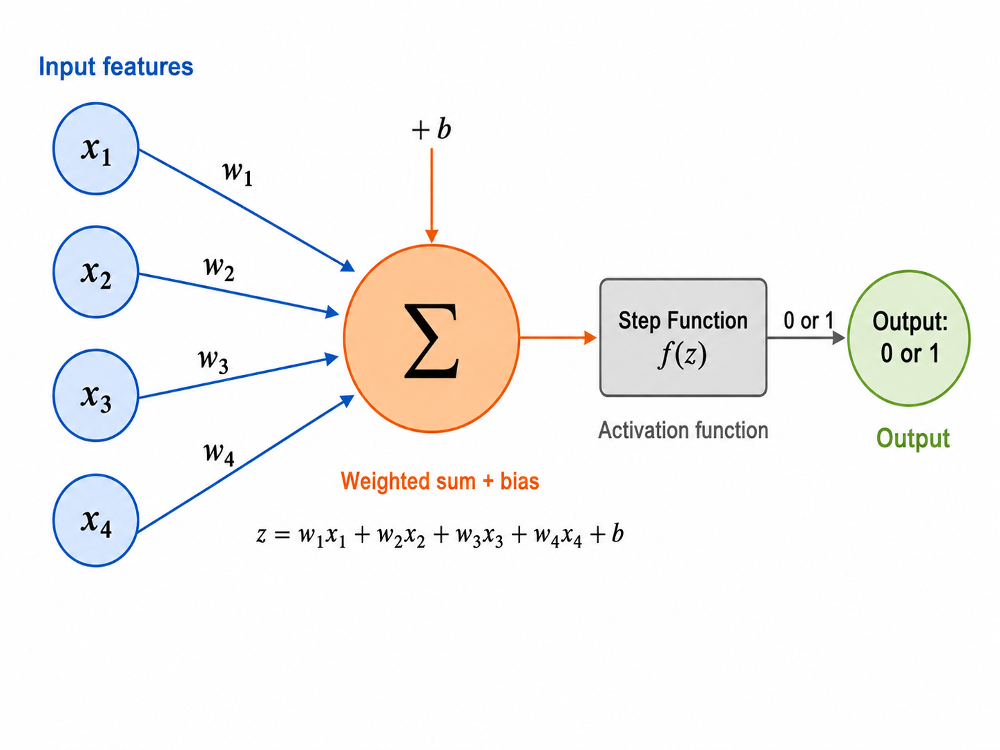
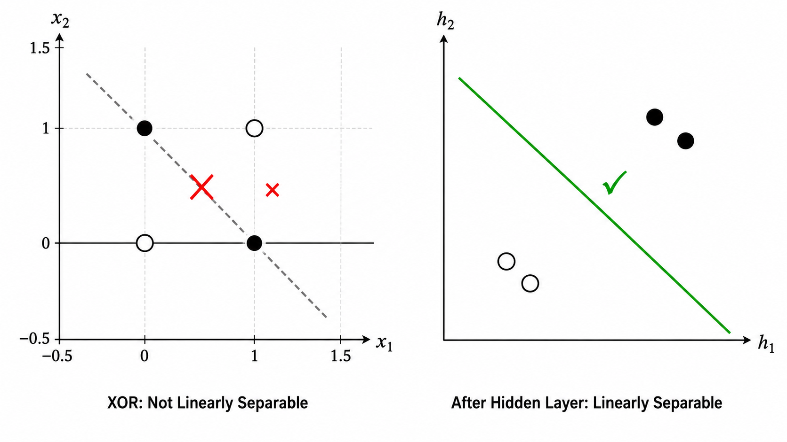
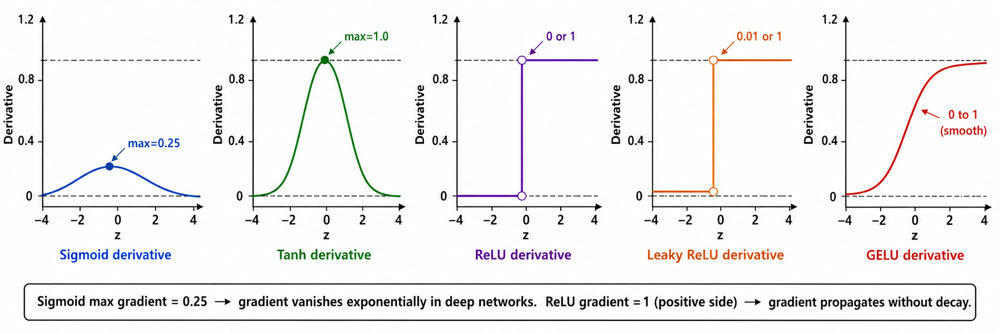

# s05 计算图与前向传播

> [!WARNING]
> 🧪 Beta公测版本提示：教程主体已完成，正在优化细节，欢迎大家提Issue反馈问题或建议。


> 从一个神经元开始，理解神经网络如何从输入走到输出 —— 感知机、计算图、激活函数与完整的前向传播流程

---

## 一、感知机：神经网络的最小单元

1958 年，Frank Rosenblatt 发明了**感知机（Perceptron）**——第一个可学习的人工神经元模型。它是所有现代神经网络的鼻祖，理解它就是理解深度学习的"原子"。

### 1.1 数学模型

一个感知机做的事情非常简单：**接收多个输入信号，加权求和，经过一个激活函数，输出结果**。

$$
y = f\left(\sum_{i=1}^{n} w_i x_i + b\right)
$$

逐项拆解：
- $x_1, x_2, \dots, x_n$：**输入特征**（例如：花瓣长度、花瓣宽度、花萼长度……）
- $w_1, w_2, \dots, w_n$：**权重（weights）**——每个输入特征的重要性。$w_i$ 越大，说明第 $i$ 个特征对最终决策的影响越大
- $b$：**偏置（bias）**——相当于一个"门槛"，控制神经元被激活的容易程度
- $\sum w_i x_i + b$：**净输入（net input）**，通常记为 $z$
- $f(z)$：**激活函数（activation function）**——将 $z$ 映射为最终输出

Rosenblatt 的原始感知机使用**阶跃函数（Step Function）**作为激活函数：

$$
f(z) = \begin{cases} 1 & \text{if } z \geq 0 \\ 0 & \text{if } z < 0 \end{cases}
$$

> **直觉类比**：感知机就像一个"投票加权的决策者"。每个输入 $x_i$ 投一票，权重 $w_i$ 代表这一票的分量。所有票加权求和后，如果总分超过门槛 $-b$（即 $z \geq 0$），就输出 1（同意）；否则输出 0（否决）。



> **生图提示词（图 05-05）**：A clean educational diagram of a single perceptron (artificial neuron). Left side: 4 input nodes labeled x₁, x₂, x₃, x₄ in blue circles. Each has an arrow pointing to a central circular node. The arrows are labeled with weights w₁, w₂, w₃, w₄. The central node shows "Σ" (summation symbol) with a separate small "+ b" (bias) input entering from the top. Below the summation, show the formula "z = w₁x₁ + w₂x₂ + w₃x₃ + w₄x₄ + b". An arrow leads from the summation node to a small rectangular block labeled "Step Function f(z)". The block outputs either 0 or 1. Right side: a single output node in green labeled "Output: 0 or 1". The entire diagram should have clear color-coded sections: input features (blue), weighted sum + bias (orange), activation function (gray), output (green). Use a clean flat design style suitable for a textbook. White background, no grid, no title text on the image itself. English labels only. Professional, minimal, easy to understand at a glance.

### 1.2 几何直觉：一条直线划分空间

感知机有一个非常直观的几何解释。方程 $w_1 x_1 + w_2 x_2 + b = 0$（以二维为例）定义的是一条直线，这条直线将空间划分为两半：

- 直线上方的点：$z > 0$，感知机输出 1（正类）
- 直线下方的点：$z < 0$，感知机输出 0（负类）

权重向量 $\mathbf{w} = (w_1, w_2)$ 指向正类方向，且垂直于这条决策边界。偏置 $b$ 控制直线与原点的距离。

对于更高维的特征空间，这条"直线"推广为**超平面（Hyperplane）**——原理完全相同。

### 1.3 感知机的致命局限：XOR 问题

1969 年，Minsky 和 Papert 在《感知机》一书中证明了一个致命结论：**单层感知机无法解决 XOR（异或）问题**。

XOR 的真值表：

| $x_1$ | $x_2$ | XOR 输出 |
|-------|-------|----------|
| 0 | 0 | 0 |
| 0 | 1 | 1 |
| 1 | 0 | 1 |
| 1 | 1 | 0 |

在二维平面上标出这四个点，你会发现：**没有任何一条直线能将输出为 1 的点（(0,1) 和 (1,0)）与输出为 0 的点（(0,0) 和 (1,1)）分开**。XOR 是线性不可分的。

这个证明直接导致了 1970 年代 AI 的第一次寒冬——如果最简单的 XOR 都解决不了，神经网络还有什么前途？

**出路在哪？** 把多个感知机堆叠起来，构成多层网络。中间层（隐藏层）可以将原始输入空间映射到一个新的特征空间，在新的空间中，XOR 变得线性可分。



> **生图提示词（图 05-06）**：A two-panel educational diagram explaining the XOR problem. LEFT PANEL: A clean 2D coordinate grid (x₁ horizontal, x₂ vertical, range -0.5 to 1.5). Four data points: (0,0) as hollow circle, (1,1) as hollow circle, (0,1) as solid filled circle, (1,0) as solid filled circle. A dashed diagonal line is drawn attempting to separate them. A red X or strike-through symbol over the line indicates failure. Label bottom: "XOR: Not Linearly Separable". RIGHT PANEL: Same four points but now in a transformed space (axes labeled h₁ and h₂ instead of x₁ and x₂). The hollow points are clustered together (bottom-left), solid points clustered together (top-right). A clean separating line divides them successfully with a green checkmark. Label bottom: "After Hidden Layer: Linearly Separable". The dividing line from the left panel can be gray and marked with ✗, while the right panel's line should be green with ✓. Clean flat design, white background, no grid on the transformed space, English labels only.

---

## 二、从感知机到多层网络

### 2.1 为什么堆叠能解决问题？

一个感知机 = 一个线性分类器 = 一条直线。它能解决的问题是有限的。

**多层感知机（MLP）** 的解决方案是：用第一层（隐藏层）的多个感知机分别学习不同的线性分界，然后将它们的输出作为第二层的输入。第二层在这些"中间特征"的基础上再做一次线性分类——这个"线性"是在隐藏层学到的**新特征空间**中的线性，而这个新空间已经是原始输入空间的非线性变换。

> **类比**：一个感知机就像是只能看到 2D 投影的人——在他眼里 XOR 不可分。两个堆叠的感知机就像是先由两个人分别从不同角度观察数据（每人画一条线），第三个人综合前两人的判断结果来做最终决策（再画一条线）——三人协作，XOR 迎刃而解。

### 2.2 数学形式：从一层到多层

一个有 $L$ 层的神经网络就是一个高度复合的函数：

$$
\hat{y} = f_\theta(x) = f_L \left( f_{L-1} \left( \cdots f_2 \left( f_1 (x) \right) \cdots \right) \right)
$$

其中 $\theta$ 代表模型中所有可学习的参数（权重 $W$ 和偏置 $b$），$x$ 是输入，$\hat{y}$ 是预测输出。

每一层 $f_l$ 由两部分组成：一个**线性变换**和一个**非线性激活**：

$$
z^{[l]} = W^{[l]} a^{[l-1]} + b^{[l]}
$$

$$
a^{[l]} = \phi^{[l]}(z^{[l]})
$$

这里 $a^{[0]} = x$ 是网络的输入，$a^{[l]}$ 是第 $l$ 层的激活输出。$W^{[l]}$ 是权重矩阵，$b^{[l]}$ 是偏置向量，$\phi^{[l]}$ 是激活函数。

> **核心直觉**：神经网络就是把简单函数（线性变换 + 非线性激活）一层层嵌套起来。通过足够多的层和神经元，理论上可以逼近任意复杂的函数——这就是**万能逼近定理**（Universal Approximation Theorem）。

---

## 三、什么是计算图？

**计算图**（Computational Graph）是一种有向无环图（DAG），用于描述数学计算的结构：

- **节点**（Node）：代表一个操作（operation），比如加法、乘法、矩阵乘法、激活函数等。
- **边**（Edge）：代表数据（张量）在操作之间的流动方向。

计算图的核心思想是**分解**：把复杂的函数拆成一系列基本操作，每个操作只做一件简单的事。比如 $f(x) = \text{ReLU}(Wx + b)$ 可以拆成：

```
x ──→ [MatMul: W·x] ──→ [Add: +b] ──→ [ReLU] ──→ a
```

为什么计算图如此重要？三个原因：

1. **前向传播**清晰可追踪：输入数据沿着图的边一步步流动，最终得到输出。
2. **反向传播**变得简单：从输出端往回走，每个节点只需要知道自己的"局部导数规则"，就能把梯度传回去。这叫做**自动微分**（Automatic Differentiation）。
3. **框架实现**的基础：PyTorch、TensorFlow、JAX 的底层都是动态或静态地构建计算图，然后自动求导。

> 可以把计算图想象成工厂的流水线：每个工人（节点）只负责一道工序，原材料（数据）在传送带（边）上流动，最终组装成产品（输出）。


---

## 四、前向传播的完整流程

让我们跟踪一个输入样本 $x$ 经过 $L$ 层网络的前向传播过程：

### 第 0 步：输入

$$
a^{[0]} = x \quad (\text{shape: } n^{[0]} \times 1)
$$

其中 $n^{[0]}$ 是输入特征数。

### 第 $l$ 层（$l = 1, 2, \dots, L$）

**子步骤 1：线性变换**

$$
z^{[l]} = W^{[l]} a^{[l-1]} + b^{[l]}
$$

- $W^{[l]}$ 的形状为 $n^{[l]} \times n^{[l-1]}$（输出维度 × 输入维度）
- $b^{[l]}$ 的形状为 $n^{[l]} \times 1$
- $z^{[l]}$ 的形状为 $n^{[l]} \times 1$（该层的"预激活"值）

**子步骤 2：非线性激活**

$$
a^{[l]} = \phi^{[l]} \left( z^{[l]} \right)
$$

- $\phi^{[l]}$ 是逐元素（element-wise）的非线性函数
- $a^{[l]}$ 是该层的最终输出，也是下一层的输入

### 第 L+1 步：损失计算

最后一层的输出 $a^{[L]}$ 就是模型的预测 $\hat{y}$。然后计算损失：

$$
L = \ell(a^{[L]}, y)
$$

其中 $\ell$ 是损失函数（如均方误差 MSE、交叉熵 Cross-Entropy）。


---

## 五、激活函数深度解析

激活函数是神经网络**非线性能力**的来源。理解它们的特性和演进逻辑，是理解深度学习为什么有效的关键。

### 5.1 为什么必须是非线性的？

假设我们去掉激活函数（或使用恒等函数 $\phi(z) = z$），两层网络的前向传播变为：

$$
\begin{aligned}
a^{[1]} &= W^{[1]} x + b^{[1]} \\
a^{[2]} &= W^{[2]} a^{[1]} + b^{[2]} \\
       &= W^{[2]}(W^{[1]} x + b^{[1]}) + b^{[2]} \\
       &= \underbrace{(W^{[2]} W^{[1]})}_{W'} x + \underbrace{(W^{[2]} b^{[1]} + b^{[2]})}_{b'}
\end{aligned}
$$

**两层线性变换的复合 = 一层线性变换。** 再加多少层都没用——网络永远等价于一个单层线性模型，表达能力不会提升。

激活函数在每个线性变换之后引入了**非线性扭曲**，破坏了这种"可合并性"。这就是为什么没有激活函数的深度网络和浅层网络没有本质区别。

> **一句话**：线性变换负责"投影"（改变视角），激活函数负责"弯曲"（创造非线性）。投影 + 弯曲，层层叠加，才能拟合任意复杂的函数。

### 5.2 五种主流激活函数


#### Sigmoid

$$
\sigma(z) = \frac{1}{1 + e^{-z}}, \quad \sigma'(z) = \sigma(z)(1 - \sigma(z))
$$

- **输出范围**：$(0, 1)$，天然适合做概率解释
- **导数特性**：最大值为 $0.25$（在 $z=0$ 处），两侧迅速衰减到接近 $0$
- **致命问题**：当 $|z| > 5$ 时，导数 $\approx 0$，梯度无法传回浅层——**梯度消失**的元凶
- **当前用途**：仅用于二分类输出层（配合 BCE 损失）或 LSTM 遗忘门

#### Tanh

$$
\tanh(z) = \frac{e^z - e^{-z}}{e^z + e^{-z}} = 2\sigma(2z) - 1, \quad \tanh'(z) = 1 - \tanh^2(z)
$$

- **输出范围**：$(-1, 1)$，零中心 → 比 sigmoid 更适合隐藏层
- **导数特性**：最大值为 $1$（在 $z=0$ 处），比 sigmoid 的 $0.25$ 大 4 倍，但仍会在 $|z| > 3$ 时饱和
- **当前用途**：RNN/LSTM 的隐藏状态（零中心有助于序列建模）

#### ReLU（Rectified Linear Unit）

$$
\text{ReLU}(z) = \max(0, z), \quad \text{ReLU}'(z) = \begin{cases} 0 & z < 0 \\ 1 & z > 0 \end{cases}
$$

- **输出范围**：$[0, +\infty)$
- **导数特性**：正区间恒为 $1$——**彻底解决了正区间的梯度消失问题**
- **核心优势**：计算极简（只需一次 `max` 操作），导数恒为 1 使得深层网络的梯度可以无损传播
- **死亡 ReLU 问题**：一旦某个神经元对所有输入都输出 $\leq 0$，梯度永远为 0，该神经元"死亡"且不可恢复
- **当前用途**：CNN 和大多数 MLP 隐藏层的默认选择（2012-2018 年间的主导）

#### Leaky ReLU

$$
\text{LeakyReLU}(z) = \begin{cases} z & z \ge 0 \\ \alpha z & z < 0 \end{cases}, \quad \alpha = 0.01
$$

- **改进点**：负区间给一个很小的斜率（$\alpha = 0.01$），使得梯度在负区间也能微弱传播
- **解决什么**：ReLU 的"死亡神经元"——即使 $z < 0$，梯度也不为 0
- **当前用途**：对梯度敏感的架构（如 GAN），或当观察到明显的死亡 ReLU 问题时

#### GELU（Gaussian Error Linear Unit）

$$
\text{GELU}(z) = z \cdot \Phi(z) \approx z \cdot \sigma(1.702z)
$$

其中 $\Phi(z)$ 是标准正态分布的累积分布函数。

- **核心思想**：不是"一刀切"地决定 pass/discard，而是根据 $z$ 的大小**概率性地**让信息通过。$z$ 越大，通过的概率越接近 1；$z$ 接近 0 时，"是否通过"是不确定的
- **为什么有效**：引入了类似 Dropout 的随机正则化效果，但这是**确定性的**（由 $\Phi(z)$ 计算，无需采样）
- **当前用途**：Transformer 架构的**标准激活函数**（BERT、GPT、ViT 等全部使用 GELU）

### 5.3 梯度特性对比：为什么 ReLU 赢了 Sigmoid？

理解激活函数的关键不在于它们的形状，而在于**它们的导数值域**。对于深度网络（10+ 层），反向传播的梯度需要连乘 10 个导数因子：

| 激活函数 | 导数最大值 | 导数最小值 | 远端饱和 | 深层梯度 |
|----------|-----------|-----------|---------|---------|
| Sigmoid | 0.25 | ~0 | $z \to \pm\infty$ 时导数 → 0 | 指数衰减 |
| Tanh | 1.0 | ~0 | $z \to \pm\infty$ 时导数 → 0 | 指数衰减 |
| ReLU | 1 | 0 (负区间) | 正区间不饱和 | 正区间无损 |
| Leaky ReLU | 1 | 0.01 (负区间) | 正区间不饱和 | 正区间无损，负区间微弱 |
| GELU | ~1 | ~0 | 两端渐近 | 类似 ReLU 但更平滑 |

**Sigmoid 的灾难**：假设网络有 20 层，每层都用 sigmoid。在最好的情况下（每层 $z=0$，导数 $=0.25$），梯度传到第一层只剩 $0.25^{20} \approx 9 \times 10^{-13}$——几乎为零。这就是**梯度消失**的数学根源，也是 2012 年之前深度网络训练失败的主要原因。

**ReLU 的胜利**：正区间的导数为 1，20 层连乘后…仍然是 1。这就是为什么 AlexNet（2012）用 ReLU 替代 sigmoid 后，训练速度快了 6 倍。



> **生图提示词（图 05-07）**：A clean educational figure showing the derivatives of 5 activation functions side by side in a row. Five small panels, each showing one derivative curve: (1) Sigmoid derivative - bell-shaped curve peaking at 0.25 at z=0, approaching 0 at z=±5, label "max=0.25". (2) Tanh derivative - bell-shaped curve peaking at 1.0 at z=0, approaching 0 at z=±3, label "max=1.0". (3) ReLU derivative - step function: 0 for z<0, 1 for z>0, label "0 or 1". (4) Leaky ReLU derivative - step function: 0.01 for z<0, 1 for z>0, label "0.01 or 1". (5) GELU derivative - smooth S-shaped curve approaching 0 for z<<0 and 1 for z>>0, label "0 to 1 (smooth)". Each panel has z on x-axis (range -4 to 4), derivative value on y-axis (range 0 to 1.2). Dashed horizontal reference lines at y=0 and y=1 in each panel. A bottom text annotation reads: "Sigmoid max gradient = 0.25 → gradient vanishes exponentially in deep networks. ReLU gradient = 1 (positive side) → gradient propagates without decay." Clean white background, flat design, English labels only. No title on the image.

### 5.4 演进逻辑

激活函数的演进不是随机的，每一步都为了解决前一步的明确问题：

```
Sigmoid → Tanh → ReLU → Leaky ReLU → GELU
  │         │       │          │          │
  │         │       │          │          └─ 随机正则化 + 平滑性 (Transformer)
  │         │       │          └─ 解决死亡神经元 (GAN)
  │         │       └─ 解决梯度消失 (CNN/MLP)
  │         └─ 解决非零中心 (RNN)
  └─ 最早使用，但存在梯度消失 + 非零中心两大缺陷
```

> **选择建议**：CNN/MLP 隐藏层用 ReLU（先试）；Transformer 用 GELU（标配）；二分类输出层用 Sigmoid；多分类输出层用 Softmax；发现死亡 ReLU 现象时换 Leaky ReLU。

---

## 六、为什么必须存储中间值？

在前向传播过程中，我们需要把每一层的中间结果存储下来——$z^{[l]}$ 和 $a^{[l]}$（以及输入 $a^{[l-1]}$）。这不是为了调试，而是为了**反向传播**。

具体来说，反向传播需要用到：

| 存储的值 | 用途 |
|---------|------|
| $z^{[l]}$ | 计算激活函数的导数 $\phi'(z^{[l]})$ |
| $a^{[l-1]}$ | 计算权重梯度 $\partial L / \partial W^{[l]} = \delta^{[l]} (a^{[l-1]})^T$ |
| $\delta^{[l+1]}$ | 递推计算 $\delta^{[l]}$（前一层误差信号） |

这就是为什么训练神经网络需要比推理时更多的显存——前向传播的中间结果必须保留到反向传播完成。

> 这叫做**计算换内存**还是**内存换计算**的经典权衡。如果你不想存中间值，可以在反向传播时重新计算（Re-materialization / Checkpointing），这样可以节省显存但增加计算量——大模型训练常用的技巧。

---

## 七、训练目标与参数更新

### 学习的数学定义

前面说过，神经网络就是一个带参数的函数 $f_\theta$。**训练**就是在寻找最优参数 $\theta^*$，使得模型在所有训练数据上的表现最好：

$$
\theta^* = \arg\min_\theta L(\theta) = \arg\min_\theta \frac{1}{N} \sum_{i=1}^{N} \ell(f_\theta(x_i), y_i)
$$

其中 $N$ 是训练样本数，$\ell$ 是单个样本的损失。

### 梯度下降的基本思想

我们无法直接解出 $\theta^*$ 的闭式解（只有在极少数简单模型中可以）。所以采用迭代优化的方式——**梯度下降**：

$$
\theta_{t+1} = \theta_t - \alpha \nabla_\theta L(\theta_t)
$$

拆解这行公式：

- $\nabla_\theta L(\theta_t)$：损失函数在当前位置 $\theta_t$ 的**梯度**。梯度是一个向量，指向函数值**上升最快**的方向。
- $\alpha$：**学习率**（Learning Rate），控制每一步走多远。
- 前面有个负号：因为我们想**下降**（找最小值），所以沿梯度的反方向走。

### 高维地形中的"下山"

如果把 $L(\theta)$ 想象成一个高维地形（$\theta$ 的每个分量对应一个维度），训练过程就像一个人在雾中下山：

- 他只能感知脚底的地面坡度（局部梯度）。
- 他不知道山的全局形状（非凸函数）。
- 他每一步沿最陡的下坡方向走一小段（梯度下降）。
- 学习率 $\alpha$ 就是他的步长——步长太大可能摔下悬崖（发散），步长太小下山太慢。

虽然真实神经网络的损失面是极度非凸的高维流形，但实践中梯度下降及其变体通常能找到很好的局部最优解（甚至全局最优）。这是深度学习"反直觉地有效"的核心秘密之一。


> **关键认识**：反向传播的职责是回答"每个参数对当前损失有多少责任"（即高效计算 $\nabla_\theta L$）。而优化器（SGD、Adam 等）的职责是回答"知道责任之后，这一步该怎么改参数"。这两件事分工明确，但都依赖于对计算图的理解。

---

## 八、前向传播的代码实现要点

在 `code/demo.py` 中，我们用纯 NumPy 实现了一个 3 层 MLP 的前向传播。关键实现细节：

### 1. 参数初始化

权重不能初始化为全 0——那样所有神经元会学到相同的特征。通常使用：
- **He 初始化**（配合 ReLU）：$W \sim \mathcal{N}(0, \sqrt{2/n_{\text{in}}})$
- **Xavier 初始化**（配合 tanh/sigmoid）：$W \sim \mathcal{N}(0, \sqrt{1/n_{\text{in}}})$

### 2. 中间值存储

前向传播时，每一层的 $(z^{[l]}, a^{[l]})$ 必须存入 cache（以一个字典或列表的形式），供后续反向传播使用。

### 3. Batch 处理

实际训练时，数据以 mini-batch 形式传入。此时前面的公式需要微调：输入 $X$ 的形状变为 $(n^{[0]}, m)$，其中 $m$ 是 batch size。每一层的输出也从列向量变为矩阵，但计算逻辑完全一致。

---

## 九、本节小结

| 概念 | 一句话 |
|------|--------|
| 感知机 | 加权求和 + 激活函数，神经网络的"原子" |
| XOR 问题 | 单层感知机的致命局限——线性不可分 |
| 多层网络 | 多个感知机堆叠，隐藏层做非线性特征变换 |
| 计算图 | 用节点和边描述数学运算的有向无环图 |
| 前向传播 | 数据沿着计算图从输入流向输出 |
| 激活函数 | 引入非线性，破坏线性变换的可合并性 |
| 梯度消失 | sigmoid 导数 ≤0.25，深层连乘后梯度指数衰减 |
| ReLU 的胜利 | 正区间导数恒为 1，梯度可以无损传播到浅层 |
| GELU | Transformer 标配：概率性通过 + 平滑性 |
| 中间值存储 | 为反向传播保留 $z^{[l]}$ 和 $a^{[l]}$ |
| 训练目标 | $\theta^* = \arg\min_\theta L(\theta)$，通过梯度下降迭代求解 |

> 下一节 [s06 反向传播与链式法则](../s06_backprop_chain_rule/) 将详细拆解：梯度如何从损失出发，沿着计算图一层层传回到每一个参数。前向传播存储的中间值，将在那里被一一"消费"。

## 📥 Code

| File | View | Download |
|------|------|----------|
| demo.py | [Open](./code-demo) | <a href="../code/s05_forward_computation_graph/demo.py" target="_blank" download>Download</a> |
| exercise.py | [Open](./code-exercise) | <a href="../code/s05_forward_computation_graph/exercise.py" target="_blank" download>Download</a> |

## 参考

1. Rosenblatt, F. (1958). The Perceptron: A Probabilistic Model for Information Storage and Organization in the Brain. *Psychological Review*.
2. Minsky, M. & Papert, S. (1969). Perceptrons: An Introduction to Computational Geometry. *MIT Press*.
3. He, K., Zhang, X., Ren, S., & Sun, J. (2015). Delving Deep into Rectifiers: Surpassing Human-Level Performance on ImageNet Classification. *ICCV 2015*. (He 初始化) [[arXiv:1502.01852](https://arxiv.org/abs/1502.01852)]
4. Glorot, X. & Bengio, Y. (2010). Understanding the difficulty of training deep feedforward neural networks. *AISTATS 2010*. (Xavier 初始化) [[PMLR](http://proceedings.mlr.press/v9/glorot10a.html)]
5. Hornik, K., Stinchcombe, M., & White, H. (1989). Multilayer feedforward networks are universal approximators. *Neural Networks*. (Universal Approximation Theorem) [[doi:10.1016/0893-6080(89)90020-8](https://doi.org/10.1016/0893-6080(89)90020-8)]
